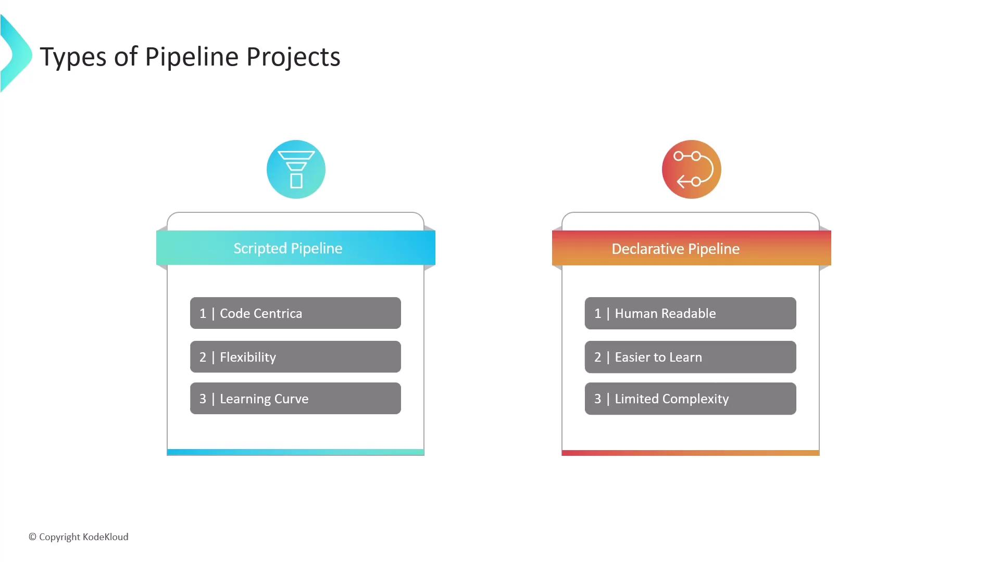

# Declarative vs Scripted Pipeline

Source: https://notes.kodekloud.com/docs/Certified-Jenkins-Engineer/Pipeline-Structure-and-Scripted-vs-Declarative/Declarative-vs-Scripted-Pipeline/page

This article explores the two primary approaches to defining Jenkins pipelines  Declarative and Scripted, highlighting their differences in syntax, flexibility, and ease of use.

In this article, we’ll explore the two primary approaches to defining Jenkins pipelines—**Declarative** and **Scripted**. Both rely on a shared `Jenkinsfile` and the Jenkins Pipeline subsystem under the hood. They use Apache Groovy and support Shared Libraries, but differ in syntax, flexibility, and ease of use.

<Callout icon="lightbulb">
  For complete syntax details, check out the [Jenkins Pipeline Syntax Reference](https://www.jenkins.io/doc/book/pipeline/syntax/).
</Callout>

## Scripted Pipeline

Scripted Pipelines give you maximum control by allowing a full Groovy script inside your `Jenkinsfile`. You can implement complex logic, conditional branched execution, and custom steps—ideal for highly dynamic or nonstandard workflows. However, this flexibility comes with a steeper learning curve, especially if you’re not familiar with Groovy or general programming concepts.

Key benefits:

* Full access to Groovy language features
* Fine-grained flow control and error handling
* Ideal for advanced, dynamic CI/CD workflows

Prerequisites:

* Solid programming skills in Groovy or Java
* Comfort with scripting and manual pipeline management

## Declarative Pipeline

Declarative Pipelines provide an opinionated, block-structured syntax. With clearly defined sections (`pipeline`, `agent`, `stages`, `steps`), you write less boilerplate and enforce consistency across your team. This makes it easier to onboard new users and maintain pipelines over time.

Key benefits:

* Cleaner, human-readable syntax
* Enforced structure reduces configuration drift
* Great for standard CI/CD patterns and teams new to Jenkins

Limitations:

* Less flexible for very complex scripting needs
* Certain advanced Groovy constructs require switching to a `script` block

<Frame>
  
</Frame>

## Feature Comparison

| Aspect         | Scripted Pipeline               | Declarative Pipeline           |
| -------------- | ------------------------------- | ------------------------------ |
| Syntax         | Pure Groovy                     | Opinionated DSL                |
| Readability    | Lower (programmatic)            | Higher (block structure)       |
| Flexibility    | Maximum—use any Groovy feature  | Limited—focused on CI/CD steps |
| Error Handling | Custom try/catch/finally blocks | Built-in `post` conditions     |
| Learning Curve | Steep                           | Gentle                         |
| Maintenance    | Manual consistency enforcement  | Enforced by structure          |

## Choosing the Right Approach

Consider the following when selecting your pipeline style:

* **Workflow Complexity**\
  For intricate conditional logic, dynamic stages, or advanced Groovy usage, go with **Scripted**.

* **Team Experience**\
  If your team is new to Jenkins or prefers a guided syntax, choose **Declarative**.

* **Long-term Maintainability**\
  Declarative’s standardized blocks can simplify maintenance and improve readability.

<Callout icon="triangle-alert">
  Switching a large, existing pipeline between Declarative and Scripted can be time-consuming. Plan migrations and refactorings carefully.
</Callout>

## Further Reading

* [Jenkins Pipeline Plugin](https://www.jenkins.io/projects/pipeline/)
* [Getting Started with Groovy](https://groovy-lang.org/getting-started.html)
* [Shared Libraries](https://www.jenkins.io/doc/book/pipeline/shared-libraries/)

<CardGroup>
  <Card title="Watch Video" icon="video" href="https://learn.kodekloud.com/user/courses/certified-jenkins-engineer/module/956fce34-baa6-4655-a3cf-7b12d2364544/lesson/5135bbe9-5085-411c-8214-f168c02fde3f" />
</CardGroup>
