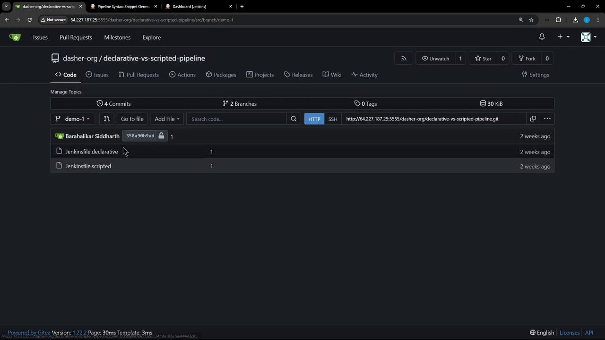
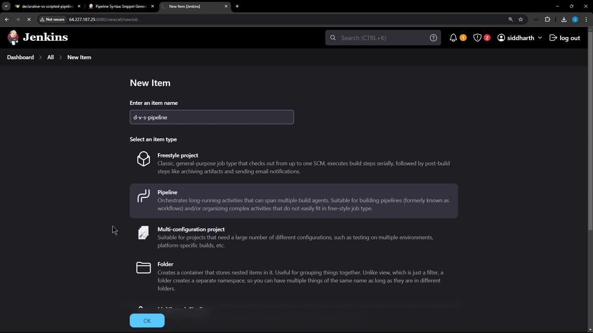
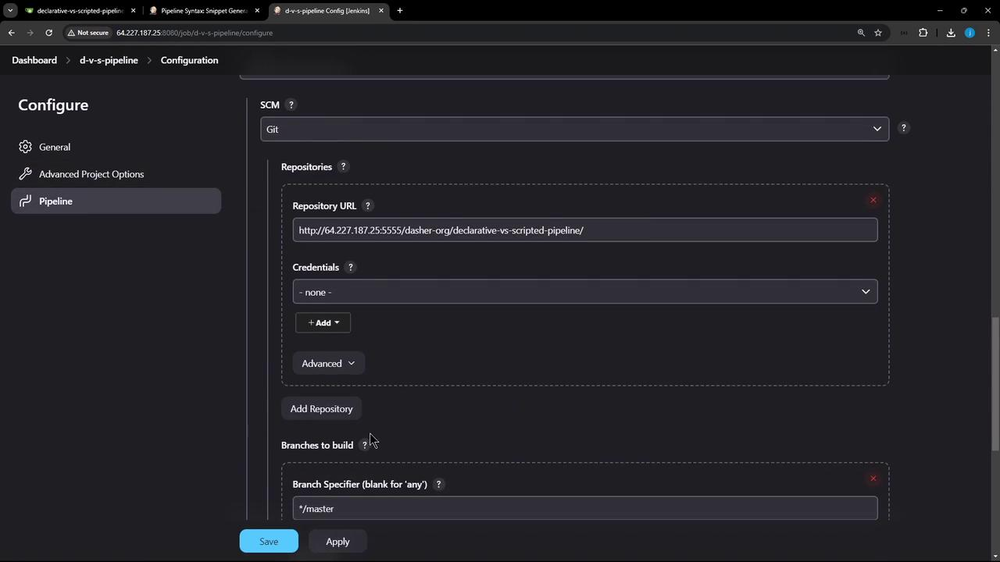
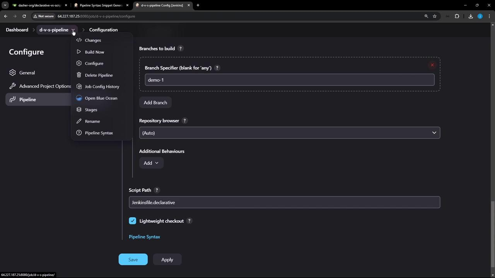
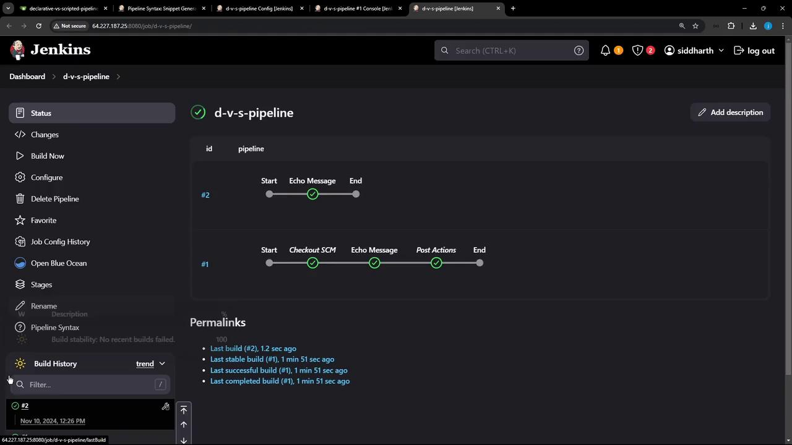

# Demo Declarative vs Scripted Pipeline

Source: https://notes.kodekloud.com/docs/Certified-Jenkins-Engineer/Pipeline-Structure-and-Scripted-vs-Declarative/Demo-Declarative-vs-Scripted-Pipeline/page

This guide explores the differences between Declarative and Scripted Jenkins Pipelines using sample Jenkinsfiles stored in a Git repository.

In this guide, we’ll explore the differences between **Declarative** and **Scripted** Jenkins Pipelines using two sample `Jenkinsfile`s stored in a Git repository. You’ll learn how each pipeline type handles source control, error handling, and post-build actions.

## Repository Overview

Our Gitea repository **declarative-vs-scripted-pipeline** holds two pipeline definitions:

* **Jenkinsfile.declarative** – a Declarative Pipeline
* **Jenkinsfile.scripted** – a Scripted Pipeline

<Frame>
  
</Frame>

## Declarative Pipeline (`Jenkinsfile.declarative`)

A Declarative Pipeline uses a fixed, structured syntax that’s easy to read and maintain. Here’s a minimal example:

```groovy theme={null}
pipeline {
    agent any

    stages {
        stage('Echo Message') {
            steps {
                sh 'ls -ltr'
                sh 'echo "This is executed within a DECLARATIVE Pipeline"'
            }
        }
    }

    post {
        always {
            sh 'echo "This will always run"'
            sh 'rm -rf *'
        }
    }
}
```

Key features of Declarative Pipelines:

* **Built-in SCM Checkout** via an automatic stage
* **Structured Syntax**: `pipeline`, `agent`, `stages`, `post`
* **Stage Restarts**: rerun from any completed stage

## Scripted Pipeline (`Jenkinsfile.scripted`)

<Callout icon="triangle-alert">
  Scripted Pipelines require you to explicitly call `checkout scm` if you need source files. They do *not* include automatic SCM checkout.
</Callout>

A Scripted Pipeline offers full Groovy flexibility. Here’s a basic example without SCM checkout:

```groovy theme={null}
node {
    try {
        stage('Echo Message') {
            sh 'ls -ltr'
            sh 'echo This is executed within a SCRIPTED Pipeline'
        }
    } catch (err) {
        echo "Failed: ${err}"
    } finally {
        sh 'echo "This will always run."'
        // sh 'rm -rf *'
    }
}
```

## 1. Configuring a Declarative Pipeline Job

1. In the Jenkins dashboard, click **New Item**, enter `d-v-s-pipeline`, select **Pipeline**, then **OK**.

<Frame>
  
</Frame>

2. Under **Pipeline**, choose **Pipeline script from SCM**, then set:
   * **SCM**: Git
   * **Repository URL** and **Credentials**
   * **Branch**: `demo-1`
   * **Script Path**: `Jenkinsfile.declarative`

<Frame>
  
</Frame>

3. Click **Apply** & **Save**, then **Build Now**. In Blue Ocean or the classic pipeline view, you’ll see:
   * *(Declarative: Checkout SCM)*
   * **Echo Message**
   * *(Declarative: Post Actions)*

<Frame>
  
</Frame>

### Sample Declarative Pipeline Logs

```text theme={null}
Checking out Revision abcdef12345 (origin/demo-1)
[Pipeline] stage (Echo Message)
[Pipeline] sh
+ ls -ltr
Jenkinsfile.declarative  Jenkinsfile.scripted
[Pipeline] sh
+ echo This is executed within a DECLARATIVE Pipeline
This is executed within a DECLARATIVE Pipeline
[Pipeline] stage (Declarative: Post Actions)
[Pipeline] sh
+ echo This will always run
This will always run
[Pipeline] sh
+ rm -rf *
```

***

## 2. Running the Scripted Pipeline

Edit the job’s **Script Path** to `Jenkinsfile.scripted` and start a new build. Since we haven’t added `checkout scm`, the build will:

* Execute **Echo Message** without listing repository files
* Run the **finally** block for cleanup

<Frame>
  
</Frame>

### Sample Scripted Pipeline Logs (without checkout)

```text theme={null}
+ ls -ltr
(total 0)
+ echo This is executed within a SCRIPTED Pipeline
This is executed within a SCRIPTED Pipeline
+ echo This will always run
This will always run
```

***

## 3. Key Differences

| Pipeline Feature   | Declarative Pipeline                              | Scripted Pipeline                              |
| ------------------ | ------------------------------------------------- | ---------------------------------------------- |
| SCM Checkout       | Automatic `Checkout SCM` stage                    | Must add `checkout scm` explicitly             |
| Syntax             | Structured DSL (`pipeline`, `stages`, `post`)     | Free-form Groovy (`node`, `try-catch-finally`) |
| Restart from Stage | Supported                                         | Not supported                                  |
| Post Actions       | Built-in `post` block (`always`, `success`, etc.) | Implement via `finally` block                  |

***

## 4. Enabling SCM Checkout in Scripted Pipeline

To include source checkout, update **Jenkinsfile.scripted**:

```groovy theme={null}
node {
    try {
        stage('Echo Message') {
            checkout scm
            sh 'ls -ltr'
            sh 'echo This is executed within a SCRIPTED Pipeline'
        }
    } catch (err) {
        echo "Failed: ${err}"
    } finally {
        sh 'echo "This will always run."'
        // sh 'rm -rf *'
    }
}
```

Commit your changes and rebuild. Now the pipeline will fetch your repository before running the stage:

<Frame>
  
</Frame>

### Sample Scripted Pipeline Logs (with checkout)

```text theme={null}
> git rev-parse --resolve-git-dir /var/lib/jenkins/workspace/d-v-s-pipeline/.git # timeout=10
> git fetch remote.origin.url http://... # timeout=10
> git checkout -f abcdef12345 # timeout=10
+ ls -ltr
Jenkinsfile.declarative  Jenkinsfile.scripted
+ echo This is executed within a SCRIPTED Pipeline
This is executed within a SCRIPTED Pipeline
+ echo This will always run
This will always run
```

***

## Conclusion

* **Declarative Pipelines**: Use for built-in SCM checkout, stage-level restarts, and a clear, opinionated syntax.
* **Scripted Pipelines**: Opt for full Groovy control, but remember to manage SCM checkout and error handling manually.

Thank you for following this comparison of Declarative vs. Scripted Jenkins Pipelines!

## Links and References

* [Jenkins Pipeline Documentation](https://www.jenkins.io/doc/book/pipeline/)
* [Jenkins Blue Ocean](https://www.jenkins.io/projects/blueocean/)
* [Gitea Git Hosting](https://gitea.io/)

<CardGroup>
  <Card title="Watch Video" icon="video" href="https://learn.kodekloud.com/user/courses/certified-jenkins-engineer/module/956fce34-baa6-4655-a3cf-7b12d2364544/lesson/3454a17d-b4d0-4b5c-ac4b-0c8c9080aacb" />
</CardGroup>
