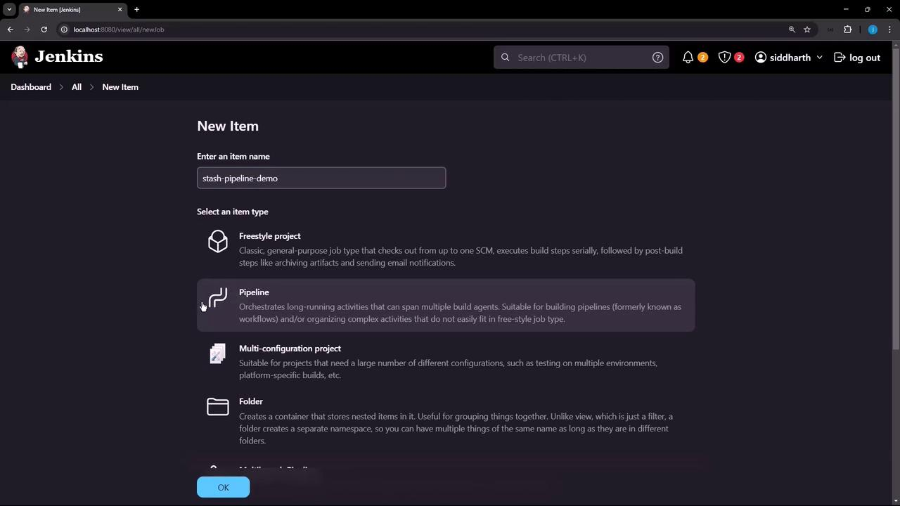
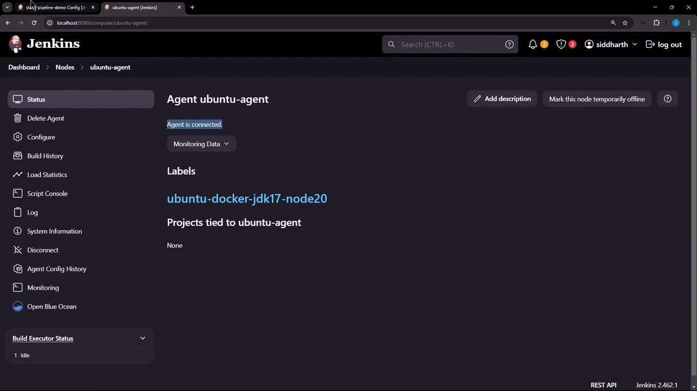
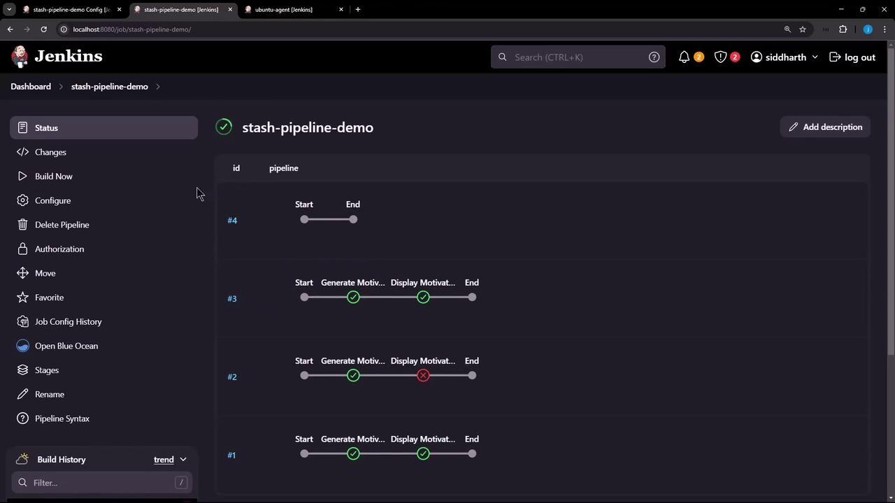

# Demo Preversing Stash in Declarative Pipeline

Source: https://notes.kodekloud.com/docs/Certified-Jenkins-Engineer/Pipeline-Structure-and-Scripted-vs-Declarative/Demo-Preversing-Stash-in-Declarative-Pipeline/page

This tutorial explains how to use stash and unstash in a Declarative Jenkins Pipeline to share artifacts between stages and across restarts.

In this tutorial, you’ll learn how to share artifacts between stages—and even across restarts—in a Declarative Jenkins Pipeline using `stash` and `unstash`. This is especially useful when stages run on different agents or when you need to resume a job from a later stage.

***

## Table of Contents

1. [Creating the Pipeline](#creating-the-pipeline)
2. [Running on a Different Agent](#running-on-a-different-agent)
3. [Sharing Files with stash/unstash](#sharing-files-with-stashunstash)
4. [Restarting from a Later Stage](#restarting-from-a-later-stage)
5. [Preserving Stashes Across Builds](#preserving-stashes-across-builds)
6. [References](#references)

***

## Creating the Pipeline

1. In Jenkins, click **New Item**.
2. Enter **stash-pipeline-demo**, select **Pipeline**, and click **OK**.

<Frame>
  
</Frame>

3. Paste this basic pipeline script. It has two stages on the same agent, so `quote.txt` is created and read successfully.

```groovy theme={null}
pipeline {
  agent any
  stages {
    stage('Generate Motivational Quote') {
      steps {
        script {
          def quotes = [
            "Believe you can and you're halfway there.",
            "The only way to do great work is to love what you do.",
            "Don't watch the clock; do what it does. Keep going.",
            "Success is not the key to happiness. Happiness is the key to success.",
            "The only limit to our realization of tomorrow will be our doubts of today."
          ]
          def quote = quotes[new Random().nextInt(quotes.size())]
          writeFile file: 'quote.txt', text: quote
        }
        sh 'echo Generate Motivational Quote Success!'
        sh 'cat quote.txt'
      }
    }
    stage('Display Motivational Quote') {
      steps {
        sh 'cat quote.txt'
      }
    }
  }
}
```

***

## Running on a Different Agent

If you assign the first stage to a different agent, the file won’t persist on the controller:

```groovy theme={null}
pipeline {
  agent any
  stages {
    stage('Generate Motivational Quote') {
      agent { label 'ubuntu-docker-jdk17-node20' }
      steps {
        /* same script to generate quote.txt */
        sh 'cat quote.txt'
      }
    }
    stage('Display Motivational Quote') {
      steps {
        sh 'cat quote.txt'
        sh 'rm quote.txt'
      }
    }
  }
}
```

Run this build—the first stage completes on the Ubuntu agent, but the second fails because `quote.txt` doesn’t exist on the controller:

<Frame>
  
</Frame>

```console theme={null}
+ echo Generate Motivational Quote Success!
Generate Motivational Quote Success!
+ cat quote.txt
Success is not the key to happiness. Happiness is the key to success.
+ cat quote.txt
cat: quote.txt: No such file or directory
```

***

## Sharing Files with stash/unstash

To transfer `quote.txt` from one agent to another, use the `stash` and `unstash` steps:

```groovy theme={null}
pipeline {
  agent any
  stages {
    stage('Generate Motivational Quote') {
      agent { label 'ubuntu-docker-jdk17-node20' }
      steps {
        /* generate quote.txt as before */
        stash name: 'quote', includes: 'quote.txt'
      }
    }
    stage('Display Motivational Quote') {
      steps {
        unstash 'quote'
        sh 'cat quote.txt'
        sh 'rm quote.txt'
      }
    }
  }
}
```

| Step    | Description                                | Example                                      |
| ------- | ------------------------------------------ | -------------------------------------------- |
| stash   | Stashes files for later retrieval          | `stash name: 'quote', includes: 'quote.txt'` |
| unstash | Retrieves stashed files into the workspace | `unstash 'quote'`                            |

After running, you’ll see:

```console theme={null}
[Pipeline] stash
Stashed 1 file(s)
...
[Pipeline] unstash
[Pipeline] sh
+ cat quote.txt
The only way to do great work is to love what you do.
+ rm quote.txt
```

***

## Restarting from a Later Stage

By default, restarting the pipeline at **Display Motivational Quote** fails since the stash from the previous run isn’t retained:

<Frame>
  
</Frame>

```console theme={null}
Stage "Generate Motivational Quote" skipped due to this build restarting at stage "Display Motivational Quote"
[Pipeline] unstash
ERROR: No such saved stash 'quote'
Finished: FAILURE
```

***

## Preserving Stashes Across Builds

Use the `preserveStashes` option in your pipeline to keep stashes from recent builds. You can generate this snippet with the **Declarative Directive Generator**:

<Frame>
  
</Frame>

```groovy theme={null}
pipeline {
  agent any
  options {
    preserveStashes(buildCount: 5)
  }
  stages {
    stage('Generate Motivational Quote') {
      agent { label 'ubuntu-docker-jdk17-node20' }
      steps {
        /* generate and stash quote.txt */
      }
    }
    stage('Display Motivational Quote') {
      steps {
        unstash 'quote'
        sh 'cat quote.txt'
        sh 'rm quote.txt'
      }
    }
  }
}
```

<Callout icon="lightbulb">
  `preserveStashes(buildCount: 5)` retains stashes from the last 5 builds. Adjust `buildCount` according to your retention policy.
</Callout>

After a few runs, restart from **Display Motivational Quote**—it now succeeds:

```bash theme={null}
+ cat quote.txt
Believe you can and you're halfway there.
+ rm quote.txt
```

With `preserveStashes`, you can confidently resume your Declarative pipelines without losing critical artifacts.

***

## References

* [Jenkins Pipeline Syntax](https://www.jenkins.io/doc/book/pipeline/syntax/)
* [stash step](https://www.jenkins.io/doc/pipeline/steps/workflow-basic-steps/#stash-stash-files-for-later-use)
* [unstash step](https://www.jenkins.io/doc/pipeline/steps/workflow-basic-steps/#unstash-restore-stashed-files)
* [Declarative Pipeline Options](https://www.jenkins.io/doc/book/pipeline/syntax/#options)

<CardGroup>
  <Card title="Watch Video" icon="video" href="https://learn.kodekloud.com/user/courses/certified-jenkins-engineer/module/956fce34-baa6-4655-a3cf-7b12d2364544/lesson/d9165081-d2ff-4b5d-829b-41ad497ec2a7" />
</CardGroup>
