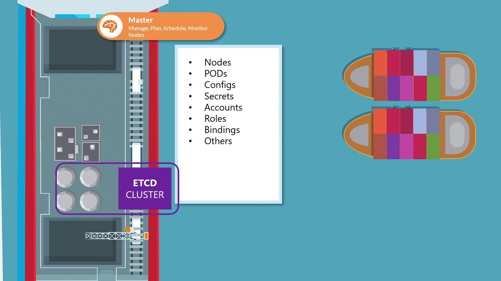

# ETCD in Kubernetes

Source: https://notes.kodekloud.com/docs/Certified-Kubernetes-Administrator-CKA/Core-Concepts/ETCD-in-Kubernetes/page

This article explores the role of etcd in Kubernetes, covering deployment methods and high availability considerations.

Welcome to this comprehensive guide on etcd in Kubernetes. In this article, we explore the critical role of etcd in storing cluster state, detail different deployment approaches, and explain high availability considerations. Whether you're setting up a Kubernetes cluster from scratch or using kubeadm, understanding etcd is essential.

etcd is a distributed key-value store that maintains configuration data, state information, and metadata for your Kubernetes cluster. Every object—nodes, pods, configurations, secrets, accounts, roles, and role bindings—is stored within etcd. When you run a command like `kubectl get`, the data is retrieved from this data store.

<Frame>
  
</Frame>

Any changes you make to the cluster—whether adding nodes, deploying pods, or configuring ReplicaSets—are first recorded in etcd. Only after etcd is updated are these changes considered to be complete.

<Callout icon="lightbulb">
  The etcd server typically listens on port 2379 for client requests. Ensuring that the advertised client URL (via the `--advertise-client-urls` option) is correctly configured is crucial for proper communication between the Kubernetes API Server and etcd.
</Callout>

## Deployment Methods

Depending on your Kubernetes setup, you can deploy etcd in two primary ways: manually from scratch or automatically with kubeadm. Each method has its use cases, with manual setups providing a deeper understanding of etcd configurations and kubeadm streamlining the deployment process.

***

## Deploying etcd from Scratch

When setting up your cluster manually, you'll need to download the etcd binaries, install them, and configure etcd as a service on your master node. Manual deployment gives you more control over configuration options, particularly for setting up TLS certificates.

Below is an example of how you might download the etcd binaries and configure the etcd service:

```bash theme={null}
wget -q --https-only \
"https://github.com/coreos/etcd/releases/download/v3.3.9/etcd-v3.3.9-linux-amd64.tar.gz"
