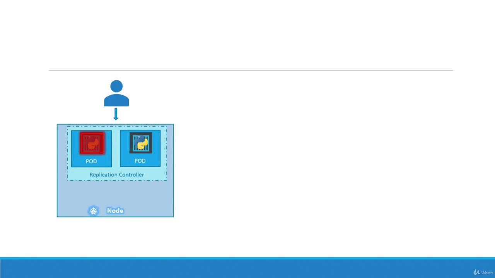
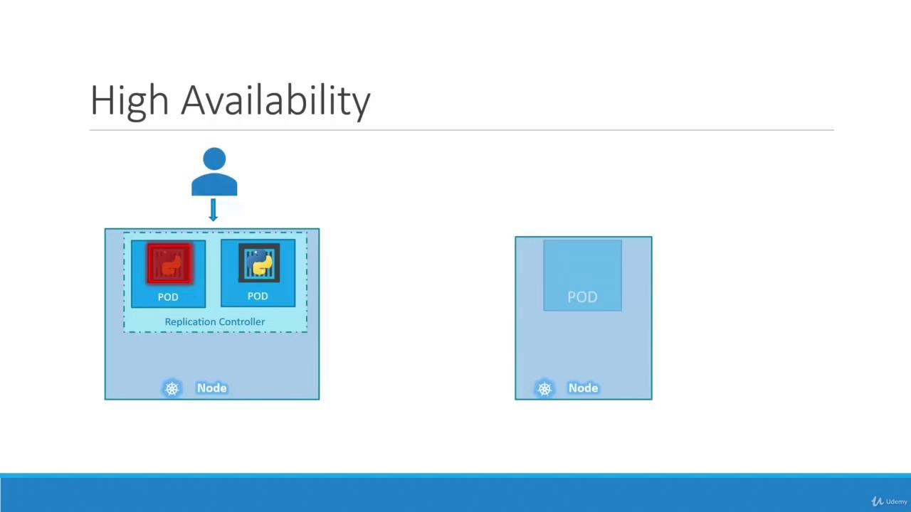
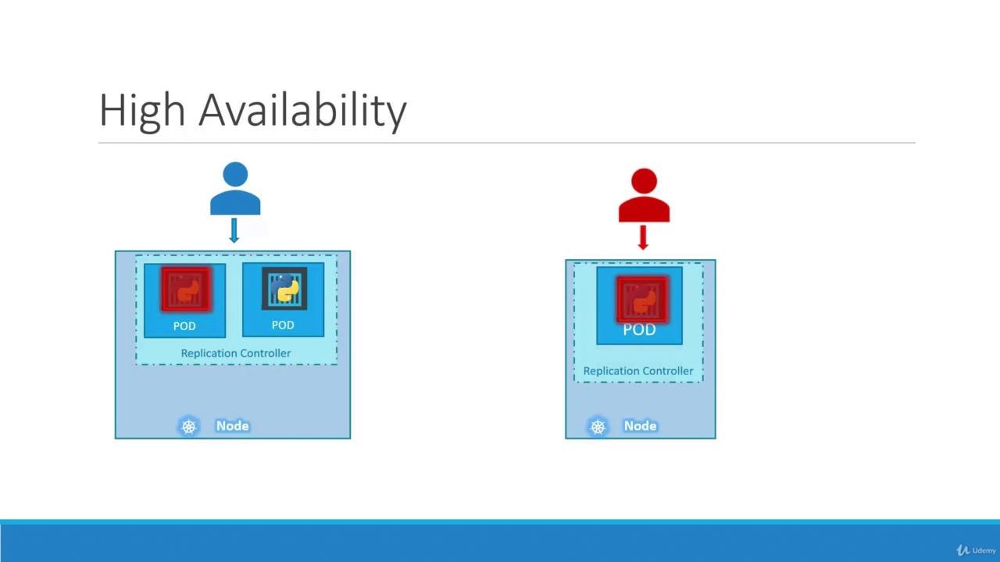
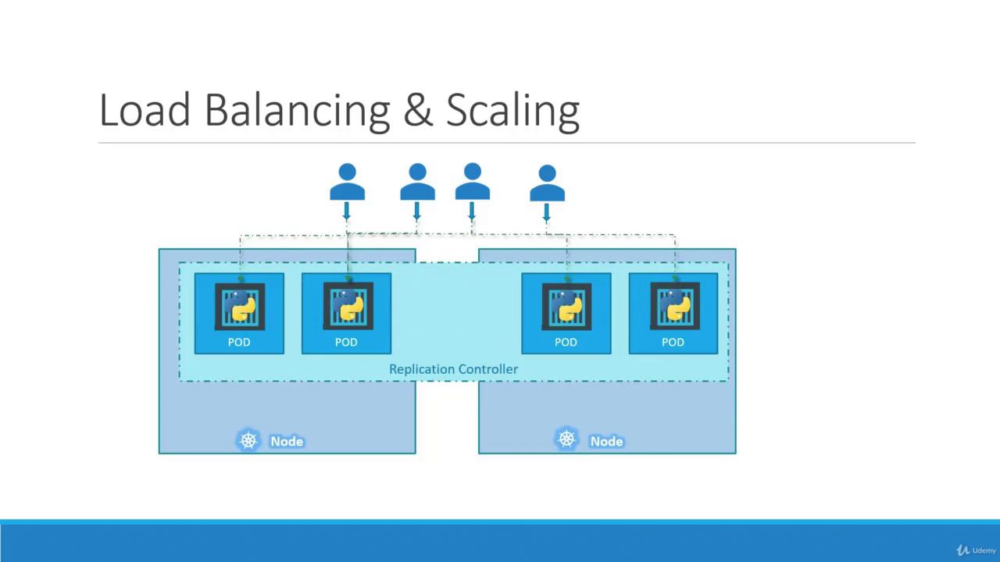

# ReplicaSets

Source: https://notes.kodekloud.com/docs/Certified-Kubernetes-Administrator-CKA/Core-Concepts/ReplicaSets/page

This article explains Kubernetes replication controllers and ReplicaSets, focusing on their roles in maintaining high availability and load balancing in clusters.

Hello, and welcome to this lesson on Kubernetes controllers. I'm Mumshad Mannambeth, and today we'll dive into the essential components that drive Kubernetes operations. Kubernetes controllers continuously monitor objects and take necessary actions, and in this lesson, we focus on the replication controller—an essential building block for maintaining high availability in your cluster.

Imagine a scenario where a single pod runs your application. If that pod crashes or fails, users lose access. To prevent this risk, running multiple pod instances is key. A replication controller ensures high availability by creating and maintaining the desired number of pod replicas. Even if you intend to run a single pod, a replication controller adds redundancy by automatically creating a replacement if the pod fails.

<Frame>
  
</Frame>

If one pod serving your application crashes, the replication controller immediately deploys a new one to keep the service available.

<Frame>
  
</Frame>

For example, if you need to maintain a constant service level, the controller ensures the desired number of pods—whether one or one hundred—are always running.

<Frame>
  
</Frame>

Beyond availability, replication controllers also help distribute load. When user demand increases, additional pods can better balance that load. If resources on a particular node become scarce, new pods can be scheduled across other nodes in your cluster.

<Frame>
  
</Frame>

<Callout icon="lightbulb">
  While both replication controllers and replica sets serve similar purposes, the replication controller is the older technology being gradually replaced by the replica set. In this lesson, we will focus on replica sets for our demos and implementations.
</Callout>

***

## Creating a Replication Controller

To create a replication controller, start by writing a configuration file (e.g., `rc-definition.yaml`). Like any Kubernetes manifest, the file contains four main sections: `apiVersion`, `kind`, `metadata`, and `spec`.

1. **apiVersion**: For a replication controller, use `v1`.
2. **kind**: Set this to `ReplicationController`.
3. **metadata**: Provide a name (e.g., `myapp-rc`) and include labels such as `app` and `type`.
4. **spec**: This section is crucial. It not only defines the desired number of replicas with the `replicas` key but also includes a `template` section which serves as the blueprint for creating the pods. Ensure that all pod-related entries in the template are indented correctly and aligned with `replicas` as siblings.

Once your YAML file is ready, create the replication controller using the following command:

```bash theme={null}
kubectl create -f rc-definition.yml
```

Below is a complete example of a replication controller definition:

```yaml theme={null}
apiVersion: v1
kind: ReplicationController
metadata:
  name: myapp-rc
  labels:
    app: myapp
    type: front-end
spec:
  replicas: 3
  template:
    metadata:
      name: myapp-pod
      labels:
        app: myapp
        type: front-end
    spec:
      containers:
      - name: nginx-container
        image: nginx
```

When you run the following command, Kubernetes creates three pods according to the provided template:

```bash theme={null}
kubectl create -f rc-definition.yml
