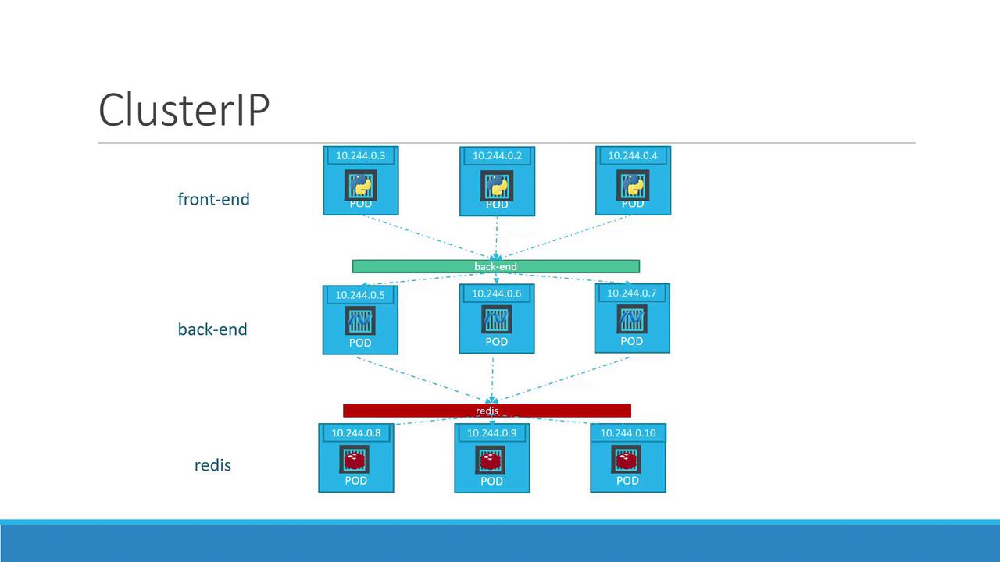

# Output:
# replicationcontroller "myapp-rc" created
```

To view the replication controller and its pods, run these commands:

```bash theme={null}
kubectl get replicationcontroller
kubectl get pods
```

A sample output might look like:

```bash theme={null}
> kubectl get replicationcontroller
NAME      DESIRED   CURRENT   READY   AGE
myapp-rc  3         3         3       19s

> kubectl get pods
NAME            READY   STATUS    RESTARTS   AGE
myapp-rc-4lvk9  1/1     Running   0          20s
myapp-rc-mc2mf  1/1     Running   0          20s
myapp-rc-px9pz  1/1     Running   0          20s
```

Notice that the pods' names include the replication controller's name (`myapp-rc`), indicating their origin.

***

## Introducing ReplicaSet

A ReplicaSet is a modern alternative to the replication controller, using an updated API version and some improvements. Here are the key differences:

1. **API Version**: Use `apps/v1` for a ReplicaSet.
2. **Selector**: In addition to metadata and specification, a ReplicaSet requires a `selector` to explicitly determine which pods to manage. This is defined using `matchLabels`, which can also capture pods created before the ReplicaSet if they match the criteria.

Below is an example ReplicaSet definition:

```yaml theme={null}
apiVersion: apps/v1
kind: ReplicaSet
metadata:
  name: myapp-replicaset
  labels:
    app: myapp
    type: front-end
spec:
  replicas: 3
  selector:
    matchLabels:
      type: front-end
  template:
    metadata:
      name: myapp-pod
      labels:
        app: myapp
        type: front-end
    spec:
      containers:
      - name: nginx-container
        image: nginx
```

Create the ReplicaSet with:

```bash theme={null}
kubectl create -f replicaset-definition.yml
```

Then, verify its creation:

```bash theme={null}
kubectl get replicaset
```

And view the associated pods:

```bash theme={null}
kubectl get pods
```

***

## Labels and Selectors

Labels in Kubernetes are critical because they enable controllers, such as ReplicaSets, to identify and manage the appropriate pods within a large cluster. For example, if you deploy multiple instances of a front-end web application, assign a label (e.g., `tier: front-end`) to each pod. Then, use a selector to target those pods:

```yaml theme={null}
selector:
  matchLabels:
    tier: front-end
```

The pod definition should similarly include the label:

```yaml theme={null}
metadata:
  name: myapp-pod
  labels:
    tier: front-end
```

This label-selector mechanism ensures that the ReplicaSet precisely targets the intended pods and maintains the set number of replicas by replacing any failed pods.

***

## Is the Template Section Required?

Even if three pods with matching labels already exist in your cluster, the template section in the ReplicaSet specification remains essential. It serves as the blueprint for creating new pods if any fail, ensuring the desired state is consistently maintained.

***

## Scaling the ReplicaSet

Scaling a ReplicaSet involves adjusting the number of pod replicas. There are two methods to achieve this:

1. **Update the Definition File**

   Modify the `replicas` value in your YAML file (e.g., change from 3 to 6) and update the ReplicaSet with:

   ```bash theme={null}
   kubectl replace -f replicaset-definition.yml
   ```

2. **Use the kubectl scale Command**

   Scale directly from the command line:

   ```bash theme={null}
   kubectl scale --replicas=6 -f replicaset-definition.yml
   ```

<Callout icon="lightbulb">
  Keep in mind that if you scale using the `kubectl scale` command, the YAML file still reflects the original number of replicas. To maintain consistency, it may be necessary to update the YAML file after scaling.
</Callout>

***

## Common Commands Overview

Below is a quick reference table summarizing some useful commands when working with replication controllers and ReplicaSets:

| Resource Type        | Use Case                        | Example Command                                                 |
| -------------------- | ------------------------------- | --------------------------------------------------------------- |
| Create Object        | Create from a definition file   | `kubectl create -f <filename>`                                  |
| View ReplicaSets/RC  | List replication controllers    | `kubectl get replicaset` or `kubectl get replicationcontroller` |
| Delete ReplicaSet/RC | Remove a replication controller | `kubectl delete replicaset <replicaset-name>`                   |
| Update Definition    | Replace object using YAML file  | `kubectl replace -f <filename>`                                 |
| Scale ReplicaSet/RC  | Change number of replicas       | `kubectl scale --replicas=<number> -f <filename>`               |

***

That concludes our lesson on ReplicaSets and replication controllers in Kubernetes. Understanding these concepts is vital for managing high availability and load balancing in your cluster. Happy learning!

For further reading, check out [Kubernetes Documentation](https://kubernetes.io/docs/).

<CardGroup>
  <Card title="Watch Video" icon="video" href="https://learn.kodekloud.com/user/courses/cka-certification-course-certified-kubernetes-administrator/module/c6d2ac7d-8192-4cff-aa54-e36d888c5bd9/lesson/4547ba5b-b314-4efd-a8a3-0efee621f3ae" />

  <Card title="Practice Lab" icon="installation" href="https://learn.kodekloud.com/user/courses/cka-certification-course-certified-kubernetes-administrator/module/c6d2ac7d-8192-4cff-aa54-e36d888c5bd9/lesson/d2b32804-b9cd-4e15-b7c7-c060d1b13d7f" />
</CardGroup>


# Services Cluster IP

Source: https://notes.kodekloud.com/docs/Certified-Kubernetes-Administrator-CKA/Core-Concepts/Services-Cluster-IP/page

This article explains how Kubernetes Service Cluster IP facilitates stable pod-to-pod communication in microservices-based applications.

Welcome to this lesson on Kubernetes Service Cluster IP. In this guide, we explain how Cluster IP streamlines connectivity within a full-stack web application by providing a stable interface for pod-to-pod communication.

A typical microservices-based application consists of several pods. Some pods host a front-end web server, while others run a back-end server; additional pods manage services like a key-value store using Redis or persistent databases like MySQL. The front-end pods need to communicate with the back-end services, and the back-end servers must interact with databases and caching mechanisms.

Because pods receive dynamic IP addresses that can change when they are recreated, relying on these IPs for internal communication is impractical. Moreover, when a front-end pod (for example, with IP 10.244.0.3) needs to connect to a back-end service, there arises the issue of determining which pod should handle the request. Kubernetes solves this challenge by grouping related pods under a single service. This service provides a fixed Cluster IP or a service name, allowing other pods to access them without worrying about individual IPs. The service automatically load-balances incoming requests among the available pods.

For instance, by creating a service for the back-end pods, you can group them together under one interface. Similarly, services can be set up for Redis or other application tiers, ensuring that each layer can scale independently without disrupting internal connectivity.

<Frame>
  
</Frame>

<Callout icon="lightbulb">
  Each service in Kubernetes is automatically assigned an IP and DNS name within the cluster. This Cluster IP should be used by other pods when accessing the service, ensuring consistent and reliable connectivity.
</Callout>

## Example: "back-end" Service

Below is a sample YAML configuration for creating a service named "back-end". This service exposes port 80 on the Cluster IP, forwarding requests to the back-end pods that match the specified labels (`app: myapp` and `type: back-end`). The targetPort is set to 80, matching the port where the back-end container listens:

```yaml theme={null}
apiVersion: v1
kind: Service
metadata:
  name: back-end
spec:
  type: ClusterIP
  ports:
    - port: 80
      targetPort: 80
  selector:
    app: myapp
    type: back-end
```

To create the service, run the following command:

```bash theme={null}
kubectl create -f service-definition.yml
```

After deploying the service, verify its status with:

```bash theme={null}
kubectl get services
```

The output should resemble the following:

```plaintext theme={null}
NAME         TYPE        CLUSTER-IP       EXTERNAL-IP   PORT(S)    AGE
kubernetes   ClusterIP   10.96.0.1        <none>        443/TCP    16d
back-end     ClusterIP   10.106.127.123   <none>        80/TCP     2m
```

With this setup, components of your application can access the back-end service using either its Cluster IP or its DNS service name, ensuring uninterrupted connectivity even as individual pods scale dynamically.

This concludes the lesson. Thank you for reading, and we look forward to seeing you in the next lesson.

<CardGroup>
  <Card title="Watch Video" icon="video" href="https://learn.kodekloud.com/user/courses/cka-certification-course-certified-kubernetes-administrator/module/c6d2ac7d-8192-4cff-aa54-e36d888c5bd9/lesson/ed55adc0-218e-42f7-b9ee-98cb46c21c5a" />
</CardGroup>
