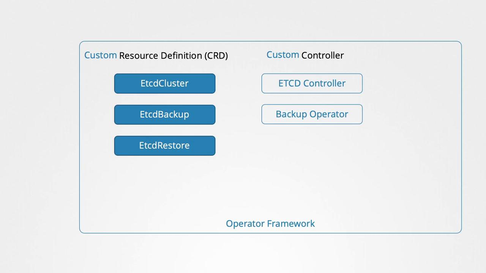
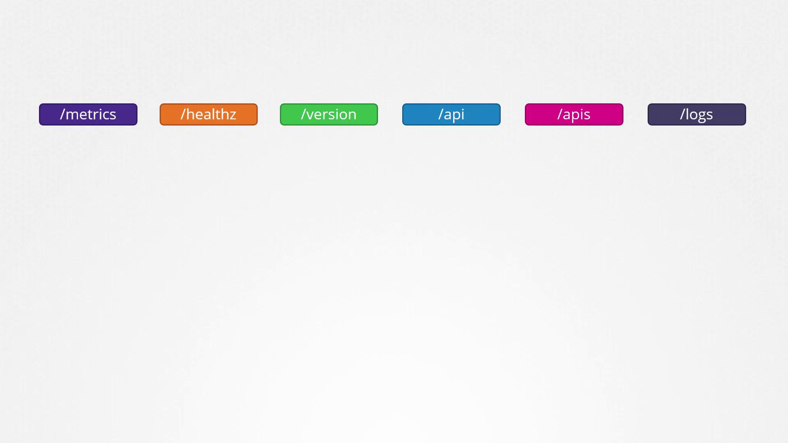
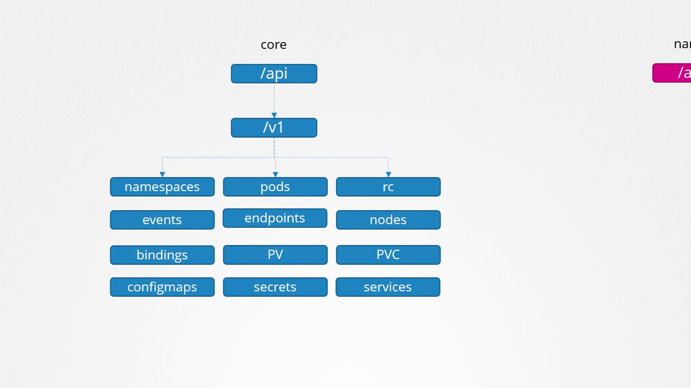
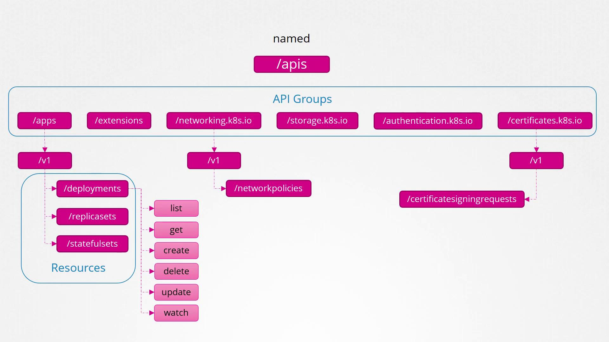
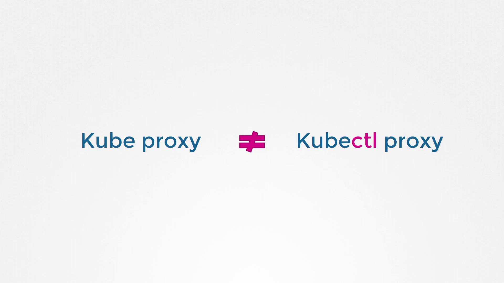
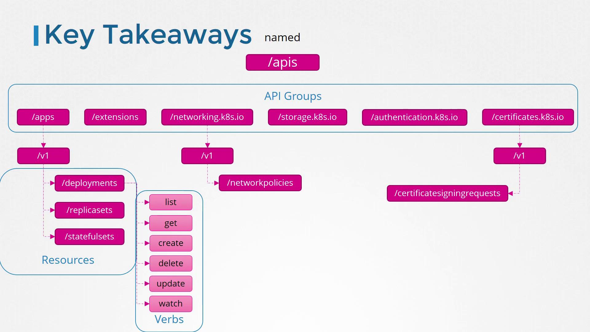

# flightticket-custom-definition.yml
apiVersion: apiextensions.k8s.io/v1
kind: CustomResourceDefinition
metadata:
  name: flighttickets.flights.com
spec:
  scope: Namespaced
  group: flights.com
  names:
    kind: FlightTicket
    singular: flightticket
    plural: flighttickets
    shortnames:
      - ft
  versions:
    - name: v1
      served: true
      storage: true
```

Below is an example of the custom controller written in Go. This controller monitors and synchronizes the state of FlightTicket resources within your Kubernetes cluster:

```go theme={null}
package flightticket

import "k8s.io/api/apps/v1"

var controllerKind = v1.SchemeGroupVersion.WithKind("Flightticket")

// Run begins watching and syncing.
func (dc *FlightTicketController) Run(workers int, stopCh <-chan struct{}) {}

// callBookFlightAPI invokes the Book Flight API for a ReplicaSet.
func (dc *FlightTicketController) callBookFlightAPI(obj interface{}) {}
```

To deploy the operator, simply run:

```bash theme={null}
# Deploy the operator
kubectl create -f flight-operator.yaml
```

> **lightbulb** The operator framework not only streamlines resource deployment but also simplifies ongoing management tasks such as application updates, backups, and recovery.

One of the most popular examples is the etcd operator. It deploys and manages an etcd cluster within Kubernetes using a dedicated CRD and a custom controller that observes changes in the etcd cluster resource. Additionally, it supports extended functionalities such as taking backups and executing restores, simply by creating supplementary CRDs. Backup and Restore operators enhance these capabilities further.



Kubernetes operators handle tasks that would typically require manual intervention by system administrators. These tasks include application installation, routine maintenance, backup operations, disaster recovery through data restoration, and troubleshooting.

For a comprehensive list of available operators, visit the [Operator Hub](https://operatorhub.io/). Many popular applications—such as etcd, MySQL, Prometheus, Grafana, Argo CD, and Istio—have dedicated operators with detailed installation instructions accessible via an install button.

## How to Deploy an Application Using an Operator

Deploying an application with an operator is an easy process that typically involves:

1. Installing the Operator Lifecycle Manager.
2. Deploying the operator.
3. Enjoying streamlined application management.

The following commands show you how to install the Operator Lifecycle Manager and deploy the etcd operator for hands-on practice:

```bash theme={null}
# Install the Operator Lifecycle Manager
curl -sL https://github.com/operator-framework/operator-lifecycle-manager/releases/download/v0.19.1/install.sh | bash -s v0.19.1

# Deploy the etcd operator
kubectl create -f https://operatorhub.io/install/etcd.yaml

# Retrieve the installed Cluster Service Version in the "my-etcd" namespace
kubectl get csv -n my-etcd
```

> **lightbulb** This overview provides a high-level understanding of how operators simplify application management. A deep dive into operators will be explored in a dedicated future lesson. For exam preparation, note that most content primarily focuses on CRDs, making this article a valuable supplemental resource.

Thank you for reading, and we'll see you in the next lesson.

- [Watch Video](https://learn.kodekloud.com/user/courses/cka-certification-course-certified-kubernetes-administrator/module/77826599-d456-4cb5-8cbc-b713cc077b45/lesson/925da760-b102-43b4-a13d-6645f57e4bd1)


# API Groups

Source: https://notes.kodekloud.com/docs/Certified-Kubernetes-Administrator-CKA/Security/API-Groups/page

This article provides an in-depth look into Kubernetes API groups, their structure, and methods for querying the API server.

Before diving into authorization, it's essential to understand the concept of API groups in Kubernetes and how they integrate with overall cluster operations. This article provides an in-depth look into Kubernetes API groups, their structure, and the methods for querying the API server.

## Understanding the Kubernetes API

The Kubernetes API is the primary interface for interacting with your cluster. Whether using the command-line tool `kubectl` or directly sending HTTP requests via REST, every interaction communicates with the API server. For example, to check your cluster's version, run:

```bash theme={null}
curl https://kube-master:6443/version
```

The response may look like:

```json theme={null}
{
  "major": "1",
  "minor": "13",
  "gitVersion": "v1.13.0",
  "gitCommit": "ddf47ac13c1a9483ea035a79cd7c1005ff21a6d",
  "gitTreeState": "clean",
  "buildDate": "2018-12-03T20:56:12Z",
  "goVersion": "go1.11.2",
  "compiler": "gc",
  "platform": "linux/amd64"
}
```

Likewise, listing pods in the cluster involves accessing the `/api/v1/pods` endpoint.

## API Groups and Their Purpose

Kubernetes organizes its API into multiple groups based on specific functionality. These groups help in managing versioning, health metrics, logging, and more. For instance, the `/version` endpoint provides cluster version data, while endpoints like `/metrics` and `/healthz` offer insights into the cluster’s performance and health.



This article focuses on two main API group categories:

1. **Core API Group:**\
   Contains the essential features of Kubernetes such as namespaces, pods, replication controllers, events, endpoints, nodes, bindings, persistent volumes, persistent volume claims, config maps, secrets, and services.

2. **Named API Groups:**\
   Provides an organized structure for newer features. These groups include apps, extensions, networking, storage, authentication, and authorization. For example, under the apps group, you’ll find Deployments, ReplicaSets, and StatefulSets, whereas the networking group hosts resources such as Network Policies. Certificate-related resources like Certificate Signing Requests are also grouped under their relevant named groups.



Every API group includes various resources along with associated actions (verbs) such as list, get, create, delete, update, and watch.



For detailed information on the objects in each API group, consult the official Kubernetes API reference documentation.

## Querying the API Server

To retrieve the list of available API groups, access the API server's root endpoint on port 6443:

```bash theme={null}
curl http://localhost:6443 -k
```

The command returns a JSON response similar to:

```json theme={null}
{
  "paths": [
    "/api",
    "/api/v1",
    "/apis",
    "/apis/",
    "/healthz",
    "/logs",
    "/metrics",
    "/openapi/v2",
    "/swagger-2.0.0.json"
  ]
}
```

> **lightbulb** When using `curl` without proper authentication, only selected endpoints (like `/version`) may be accessible. Unauthenticated requests to protected endpoints will result in a 403 Forbidden error.

For example, an unauthenticated request may yield:

```bash theme={null}
curl http://localhost:6443 -k
```

```json theme={null}
{
  "kind": "Status",
  "apiVersion": "v1",
  "metadata": {},
  "status": "Failure",
  "message": "forbidden: User \"system:anonymous\" cannot get path \"/\"",
  "reason": "Forbidden",
  "details": {},
  "code": 403
}
```

To fully access the API server, use your certificate files with `curl`:

```bash theme={null}
curl http://localhost:6443 -k \
  --key admin.key \
  --cert admin.crt \
  --cacert <your-ca-cert-file>
```

Alternatively, you can use the `kubectl proxy` command, which starts a local HTTP proxy server on port 8001 using the credentials in your kubeconfig file. This eliminates the need to manually specify certificate files. Start the proxy by running:

```bash theme={null}
kubectl proxy
```

The output confirms the proxy is running:

```bash theme={null}
kubectl proxy
Starting to serve on 127.0.0.1:8001
```

Now, you can access the API server through the proxy:

```bash theme={null}
curl http://localhost:8001 -k
```

The typical response should be:

```json theme={null}
{
  "paths": [
    "/api/",
    "/api/v1",
    "/apis",
    "/apis/",
    "/healthz",
    "/logs",
    "/metrics",
    "/openapi/v2",
    "/swagger-2.0.0.json"
  ]
}
```

> **lightbulb** Remember that "kube proxy" and "kubectl proxy" serve different purposes. The former facilitates pod-to-pod and service communication within the cluster, while the latter is a local HTTP proxy for accessing the API server.



## Summary

Kubernetes organizes its resources into various API groups. At the highest level, there is the core API group coupled with multiple named API groups, each containing specific resources and actions. The diagram below outlines the hierarchical structure and relationships between API groups, resources, and associated verbs:



In the next section on authorization, we'll explore how these API groups and their associated actions control access to cluster resources.

That’s it for this lesson. See you in the next article!

- [Watch Video](https://learn.kodekloud.com/user/courses/cka-certification-course-certified-kubernetes-administrator/module/77826599-d456-4cb5-8cbc-b713cc077b45/lesson/2de396dd-91d1-46d2-a957-15409134c41b)
