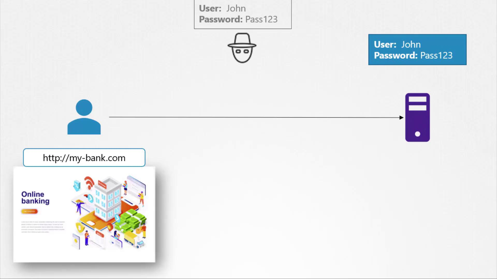
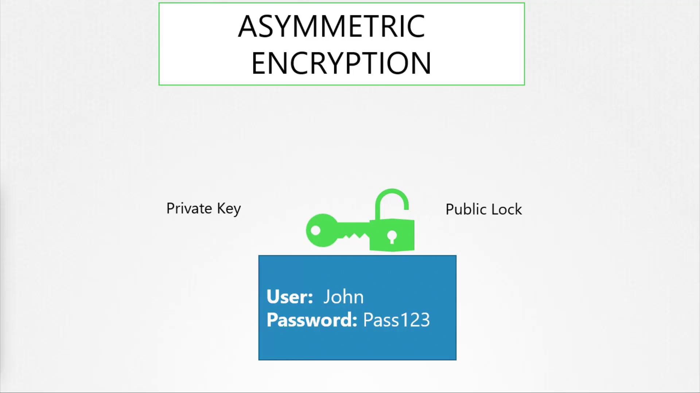

# TLS Basics

Source: https://notes.kodekloud.com/docs/Certified-Kubernetes-Administrator-CKA/Security/TLS-Basics/page

This article covers the fundamentals of TLS certificates, their importance for secure communications, and configuration for SSH and web servers.

Welcome to this comprehensive lesson on SSL/TLS certificates. In this guide, we will explore the fundamentals of TLS certificates, discuss why they are essential for secure communications, and demonstrate how to configure them for securing SSH and web servers. A TLS certificate establishes trust during a transaction by ensuring that communications are encrypted and that the server is indeed who it claims to be.

Imagine a scenario where a user accesses their online banking application over an unsecured connection. The credentials entered would be transmitted in plain text, making it easy for a hacker spying on the network to intercept and misuse the sensitive data.

<Frame>
  
</Frame>

To prevent such risks, data is encrypted using encryption keys—a set of random numbers and characters. Initially, symmetric encryption was used, where the same key is responsible for both encrypting and decrypting data. However, transmitting this key over the network to initiate a secure session introduces vulnerabilities, as an attacker intercepting the key could decrypt the data.

This is where asymmetric encryption becomes valuable. Asymmetric encryption uses a pair of keys: a private key and a public key. You can think of these as a private key and a public lock. The private key remains securely with the owner, while the public lock can be shared openly. Data encrypted with the public key can only be decrypted using its corresponding private key, ensuring that intercepted data remains secure.

Before delving into the web server example, let’s explore a simpler use case: securing SSH access using key pairs.

<Frame>
  
</Frame>

Imagine you need to access a server but want to avoid the security risks associated with passwords. By using key pairs, you can generate a private key (id\_rsa) and a public key (id\_rsa.pub). The private key stays secure on your device, while the public key is added to the server's SSH authorized keys file. When you initiate an SSH connection, you specify your private key to authenticate.

:::note SSH Key Pair Generation
Generate your SSH key pair with the following command:
:::

```bash theme={null}
