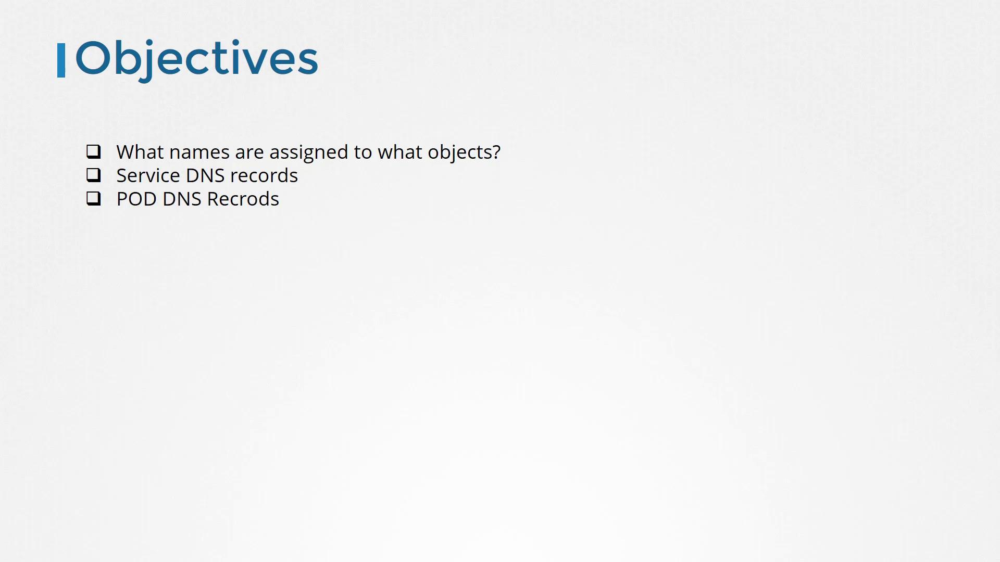
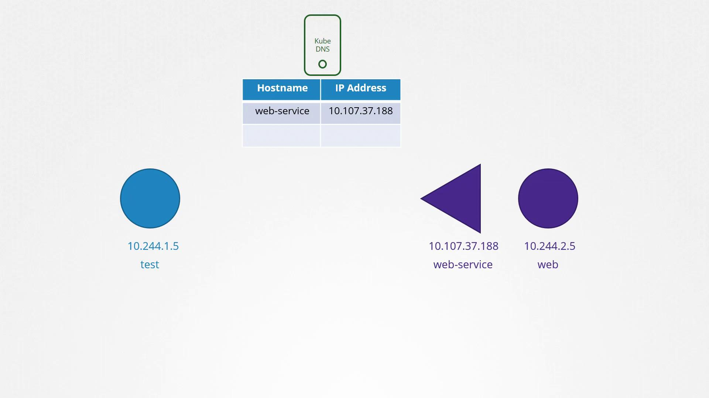

# DNS in kubernetes

Source: https://notes.kodekloud.com/docs/Certified-Kubernetes-Administrator-CKA/Networking/DNS-in-kubernetes/page

This article explains how DNS is managed in Kubernetes, covering service and pod DNS records and their role in pod communication.

Welcome to this comprehensive guide on how DNS is managed within a Kubernetes cluster. In this article, we explore the mechanisms behind both service and pod DNS records, along with practical examples for enabling communication between pods. Before diving in, ensure you are familiar with the basics of DNS. If you're new to DNS concepts, please review the prerequisites below.


Previously, we covered the fundamentals of DNS, including common tools such as `host`, `nslookup`, and `dig` alongside various DNS record types (A, CNAME, etc.) and the domain name hierarchy. We even demonstrated how to set up your own DNS server using CoreDNS. Now, we shift our focus to the DNS names assigned to various Kubernetes objects—like services and pods—and the different methods of accessing one pod from another.



Imagine a three-node Kubernetes cluster with multiple pods and services distributed across them. Each node typically has a unique name and IP address registered in your organization's DNS server. However, our focus here is on the internal DNS resolution among the cluster’s pods and services. By default, when you create a cluster, Kubernetes deploys a built-in DNS server (unless manually configured otherwise), which facilitates name resolution for pods and services.

> **lightbulb** Consider a simple scenario with two pods and a service in your cluster:

  * A **test pod** with IP `10.244.1.5`.
  * A **web pod** with IP `10.244.2.5`.

  Even if these pods reside on different nodes (as indicated by their IP addresses), Kubernetes DNS assumes that all pods and services can be reached via their IP addresses. To allow the test pod to communicate with the web pod, a service named **web-service** is created. This service is assigned its own IP address (e.g., `10.107.37.188`) and automatically gets a DNS record mapping the service name to its IP.



Within the cluster, any pod can resolve and access the web service using its service name. For example, to access the web-service from the test pod, you could use:

```bash theme={null}
curl http://web-service
