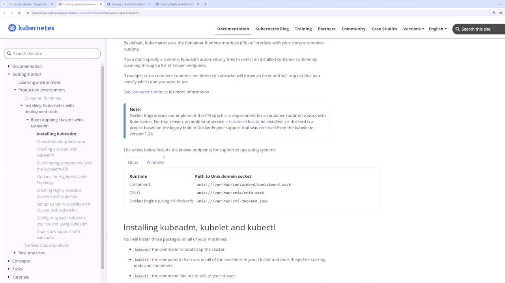

# Demo Deployment with Kubeadm

Source: https://notes.kodekloud.com/docs/Certified-Kubernetes-Administrator-CKA/Install-Kubernetes-the-kubeadm-way/Demo-Deployment-With-Kubeadm/page

This guide explains how to bootstrap a Kubernetes cluster using kubeadm with a master and two worker nodes.

In this guide, we'll walk through bootstrapping a Kubernetes cluster using kubeadm. The setup involves three virtual machines (VMs): one control plane (master) node and two worker nodes. We will review the VM network configurations, install the container runtime and Kubernetes components, initialize the control plane, deploy a pod network add-on, and finally join the worker nodes to complete the cluster.

***

## 1. VM Overview and Network Interfaces

Before you start, ensure that all required VMs are created. The cluster consists of one master and two worker nodes. Verify the network interfaces on each node by executing the `ip add` command.

### Master Node Network Configuration

Run the following command on the master node:

```bash theme={null}
vagrant@kubemaster:~$ ip add
1: lo: <LOOPBACK,UP,LOWER_UP> mtu 65536 qdisc noqueue state UNKNOWN group default qlen 1000
    link/loopback 00:00:00:00:00:00 brd 00:00:00:00:00:00
    inet 127.0.0.1/8 scope host lo
       valid_lft forever preferred_lft forever
    inet6 ::1/128 scope host
       valid_lft forever preferred_lft forever
2: enp0s3: <BROADCAST,MULTICAST,UP,LOWER_UP> mtu 1500 qdisc fq_codel state UP group default qlen 1000
    link/ether 02:95:21:8a:38:bd brd ff:ff:ff:ff:ff:ff
    inet 10.0.2.15/24 metric 100 brd 10.0.2.255 scope global dynamic enp0s3
       valid_lft forever preferred_lft 51sec
    inet6 fe80::95:21ff:fe8a:38bd/64 scope link
       valid_lft forever preferred_lft forever
3: enp0s8: <BROADCAST,MULTICAST,UP,LOWER_UP> mtu 1500 qdisc fq_codel state UP group default qlen 1000
    link/ether 02:42:fd:69:82:cd brd ff:ff:ff:ff:ff:ff
    inet 192.168.44.2/24 brd 192.168.44.255 scope global enp0s8
       valid_lft forever preferred_lft forever
    inet6 fe80::42:fdff:fe69:82cd/64 scope link
       valid_lft forever preferred_lft forever

vagrant@kubemaster:~$ ls
vagrant@kubemaster:~$
```

### Worker Node One Network Configuration

On the first worker node, run:

```bash theme={null}
vagrant@kubenode01:~$ ip add
1: lo: <LOOPBACK,UP,LOWER_UP> mtu 65536 qdisc noqueue state UNKNOWN group default qlen 1000
   link/loopback 00:00:00:00:00:00:00
   inet 127.0.0.1/8 scope host lo
      valid_lft forever preferred_lft forever
   inet6 ::1/128 scope host
      valid_lft forever preferred_lft forever
2: enp0s3: <BROADCAST,MULTICAST,UP,LOWER_UP> mtu 1500 qdisc fq_codel state UP group default qlen 1000
   link/ether 02:95:e1:8a:38:bd brd ff:ff:ff:ff:ff:ff
   inet 10.0.2.15/24 metric 100 brd 10.0.2.255 scope global dynamic enp0s3
      valid_lft 83015sec preferred_lft 0sec
   inet6 fe80::a00:27ff:fe47:a2e/64 scope link
      valid_lft forever preferred_lft forever
3: enp0s8: <BROADCAST,MULTICAST,UP,LOWER_UP> mtu 1500 qdisc fq_codel state UP group default qlen 1000
   link/ether 02:95:e1:8a:38:bd brd ff:ff:ff:ff:ff:ff
   inet 192.168.56.101/24 metric 1024 scope global enp0s8
      valid_lft forever preferred_lft forever

vagrant@kubenode01:~$
```

### Worker Node Two Network Configuration

On the second worker node, verify the network configuration:

```bash theme={null}
vagrant@kubenode02:~$ ip add
1: lo: <LOOPBACK,UP,LOWER_UP> mtu 65536 qdisc noqueue state UNKNOWN group default qlen 1000
    link/loopback 00:00:00:00:00:00
    inet 127.0.0.1/8 scope host lo
       valid_lft forever preferred_lft forever
    inet6 ::1/128 scope link
       valid_lft forever preferred_lft forever
2: enp03: <BROADCAST,MULTICAST,UP,LOWER_UP> mtu 1500 qdisc fq_codel state UP group default qlen 1000
    link/ether 02:95:e1:8a:38:b0 brd ff:ff:ff:ff:ff:ff
    inet 10.12.0.2/24 brd 10.12.0.255 scope global dynamic enp0s3
       valid_lft 83155sec
    inet6 fe80::f50:e:38b:d6c5/64 scope link
       valid_lft forever preferred_lft forever
3: enp08: <BROADCAST,MULTICAST,UP,LOWER_UP> mtu 1500 qdisc fq_codel state UP group default qlen 1000
    link/ether 02:80:2c:50:5d:f0 brd ff:ff:ff:ff:ff:ff
    inet6 fe80::27f:f50:5c0:5c0/64 scope link
       valid_lft forever preferred_lft forever
vagrant@kubenode02:~$
```

The output confirms that each node has the correct network interfaces and associated IP addresses, ensuring both dynamic and static configurations are in place.

> 

***

## 2. Reviewing Prerequisites

Before initializing your Kubernetes cluster, verify the following prerequisites:

* A supported Linux distribution (e.g., Ubuntu).
* A minimum of 2 GB memory and at least two CPUs per node.
* Required kernel modules (BR, netfilter, overlay) are loaded.

<Callout icon="lightbulb">
  Ensure that system variables are correctly set (to 1) so the network
  interfaces function properly. For more details, refer to the official
  [Kubernetes
  Documentation](https://kubernetes.io/docs/setup/production-environment/container-runtimes/).
</Callout>

***

## 3. Installing the Container Runtime (ContainerD)

A container runtime is essential on every node. In this example, we will use ContainerD.

### Step 1: Add the Kubernetes Repository and GPG Key

Execute these commands on all nodes:

```bash theme={null}
sudo apt-get update
sudo apt-get install -y apt-transport-https ca-certificates curl gnupg
