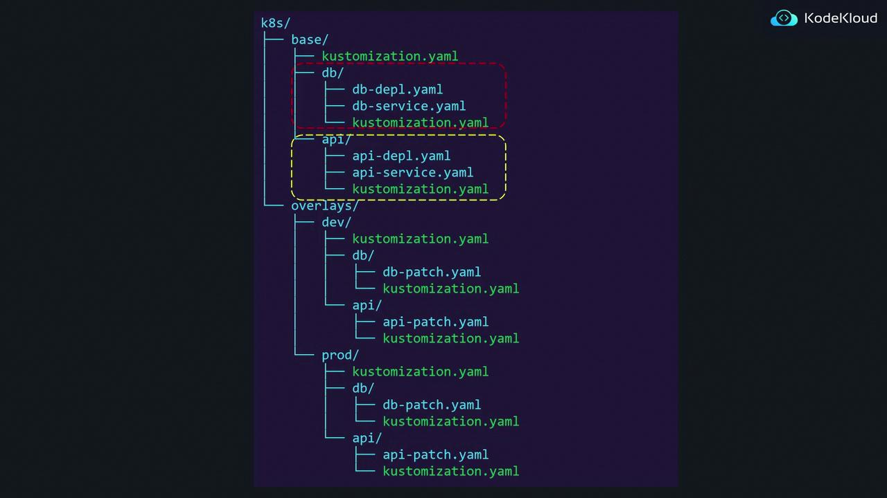

# base/kustomization.yaml
resources:
  - nginx-depl.yaml
  - service.yaml
  - redis-depl.yaml
```

And the `nginx-depl.yaml` file is defined as follows:

```yaml theme={null}
# base/nginx-depl.yaml
apiVersion: apps/v1
kind: Deployment
metadata:
  name: nginx-deployment
spec:
  replicas: 1
```

## Creating Overlays

### Development Overlay

To create an overlay for the development environment, you would set up a `kustomization.yaml` file in the `dev` overlay folder. This file references the base configuration and includes a patch to update the replica count:

```yaml theme={null}
# overlays/dev/kustomization.yaml
bases:
  - ../../base
patch: |-
  - op: replace
    path: /spec/replicas
    value: 2
```

In this overlay, the `bases` property points to the shared base resources using the relative path `../../base`. The patch then modifies the replica count from 1 to 2 for the development environment.

### Production Overlay

Similarly, to tailor the configuration for production, the overlay can reference the same base while applying a different patch:

```yaml theme={null}
# overlays/prod/kustomization.yaml
bases:
  - ../../base
patch: |-
  - op: replace
    path: /spec/replicas
    value: 3
```

This overlay increases the replica count to 3 for production.

### Adding New Resources in Overlays

Overlays can also introduce new resources that don’t exist in the base configuration. For instance, if you want to add a production-specific Grafana deployment, you can include its YAML file in the production overlay:

```yaml theme={null}
# overlays/prod/kustomization.yaml
bases:
  - ../../base
resources:
  - grafana-depl.yaml
patch: |-
  - op: replace
    path: /spec/replicas
    value: 2
```

In this configuration, the overlay imports the base resources, applies a patch to change the replica count for the existing deployment, and adds a new Grafana deployment.

> **lightbulb** Kustomize is flexible in the way you structure your configurations. While the base can be organized into subdirectories based on features, the overlay directories do not need to mirror that structure. The critical factor is correctly referencing the shared resources in the appropriate `kustomization.yaml` file.

Below is another diagram that provides a more detailed look at the directory structure using Kustomize, showing both the base and overlay directories across different environments:



## Summary

Overlays in Kustomize enable you to:

* Import and reuse a base configuration containing shared resources.
* Apply environment-specific patches to adjust base resources such as replica counts.
* Introduce new resources within an overlay without affecting the base configuration.

This approach helps maintain a clean separation between shared configurations and environment-specific customizations while taking full advantage of Kustomize's powerful features for managing Kubernetes deployments.

For further information on Kubernetes configuration management, consider exploring additional resources in the [Kubernetes Documentation](https://kubernetes.io/docs/) and [Kustomize GitHub repository](https://github.com/kubernetes-sigs/kustomize).

- [Watch Video](https://learn.kodekloud.com/user/courses/cka-certification-course-certified-kubernetes-administrator/module/031e84b8-bcbc-4f39-94d6-66d93b05bddc/lesson/d02f6c7a-d704-4c64-b08b-d3ef01ee9a4d)

  - [Practice Lab](https://learn.kodekloud.com/user/courses/cka-certification-course-certified-kubernetes-administrator/module/031e84b8-bcbc-4f39-94d6-66d93b05bddc/lesson/a2d3ef06-b264-41a2-8e13-2ec409afabfe)


# Patches Dictionary

Source: https://notes.kodekloud.com/docs/Certified-Kubernetes-Administrator-CKA/Kustomize-Basics-2025-Updates/Patches-Dictionary/page

Learn to update, add, and remove keys in Kubernetes Deployment configurations using JSON 6902 patches and strategic merge patches with practical examples.

In this article, you'll learn how to update, add, and remove keys in a Kubernetes Deployment configuration using both JSON 6902 patches and strategic merge patches. Each example starts with a Deployment that contains a label with the key "component" set to "api". The goal is to modify or update these labels as needed in each scenario.

***

## Updating a Key in a Dictionary

### Using a JSON 6902 Patch

Consider the following Deployment configuration:

```yaml theme={null}
apiVersion: apps/v1
kind: Deployment
metadata:
  name: api-deployment
spec:
  replicas: 1
  selector:
    matchLabels:
      component: api
  template:
    metadata:
      labels:
        component: api
    spec:
      containers:
        - name: nginx
          image: nginx
```

To update the label from `"component: api"` to `"component: web"` using a JSON 6902 patch, include this patch in your `kustomization.yaml`:

```yaml theme={null}
kustomization:
  patches:
    - target:
        kind: Deployment
        name: api-deployment
      patch: |-
        - op: replace
          path: /spec/template/metadata/labels/component
          value: web
```

The patch navigates to the "component" key within the labels dictionary using the path `/spec/template/metadata/labels/component` and replaces its value with "web".

> **lightbulb** The JSON 6902 patch method provides precise control when updating complex configurations. Choose the patch type that best fits your needs.

### Using a Strategic Merge Patch

Alternatively, you can update the label using a strategic merge patch stored in a separate file, for example, `label-patch.yaml`. Your main Deployment configuration remains unchanged, and your `kustomization.yaml` is updated as follows:

```yaml theme={null}
kustomization:
  patches:
    - label-patch.yaml
```

Here is an example of the contents for `label-patch.yaml`:

```yaml theme={null}
apiVersion: apps/v1
kind: Deployment
metadata:
  name: api-deployment
spec:
  template:
    metadata:
      labels:
        component: web
```

Kustomize will merge this patch with the original Deployment configuration, resulting in an updated "component" label.

***

## Adding a New Key to a Dictionary

### Using a JSON 6902 Patch

Suppose you want to add a new label `"org"` with the value `"KodeKloud"` while keeping the original `"component: api"` label. Start with the following Deployment:

```yaml theme={null}
apiVersion: apps/v1
kind: Deployment
metadata:
  name: api-deployment
spec:
  replicas: 1
  selector:
    matchLabels:
      component: api
  template:
    metadata:
      labels:
        component: api
    spec:
      containers:
        - name: nginx
          image: nginx
```

Then, add the following JSON 6902 patch in your `kustomization.yaml`:

```yaml theme={null}
kustomization:
  patches:
    - target:
        kind: Deployment
        name: api-deployment
      patch: |-
        - op: add
          path: /spec/template/metadata/labels/org
          value: KodeKloud
```

This patch uses the `add` operation to insert the new key `"org"` with the specified value into the labels dictionary.

### Using a Strategic Merge Patch

For a strategic merge patch, create a separate file (e.g., `label-patch.yaml`) with the following content:

```yaml theme={null}
apiVersion: apps/v1
kind: Deployment
metadata:
  name: api-deployment
spec:
  template:
    metadata:
      labels:
        org: KodeKloud
```

Then, reference the patch file in your `kustomization.yaml`:

```yaml theme={null}
kustomization:
  patches:
    - label-patch.yaml
```

Kustomize automatically merges the patch with the existing configuration while preserving both labels: `"component: api"` and `"org: KodeKloud"`.

> **lightbulb** When adding new keys, always verify that the target dictionary exists to avoid runtime errors.

***

## Removing a Key from a Dictionary

### Using a JSON 6902 Patch

Assume you have a Deployment configuration that includes two labels:

```yaml theme={null}
apiVersion: apps/v1
kind: Deployment
metadata:
  name: api-deployment
spec:
  replicas: 1
  selector:
    matchLabels:
      component: api
  template:
    metadata:
      labels:
        org: KodeKloud
        component: api
    spec:
      containers:
        - name: nginx
          image: nginx
```

To remove the `"org"` label using a JSON 6902 patch, modify your `kustomization.yaml` as follows:

```yaml theme={null}
kustomization:
  patches:
    - target:
        kind: Deployment
        name: api-deployment
      patch: |-
        - op: remove
          path: /spec/template/metadata/labels/org
```

This patch navigates to the "org" key and removes it, leaving only the "component" label in place.

### Using a Strategic Merge Patch

To remove the `"org"` label via a strategic merge patch, create a patch file (e.g., `label-patch.yaml`) with the following content:

```yaml theme={null}
apiVersion: apps/v1
kind: Deployment
metadata:
  name: api-deployment
spec:
  template:
    metadata:
      labels:
        org: null
```

Reference this patch file in your `kustomization.yaml`:

```yaml theme={null}
kustomization:
  patches:
    - label-patch.yaml
```

Kustomize interprets the `null` value as an instruction to remove the `"org"` label from the original configuration.

> **triangle-alert** Ensure that you specify the correct path for removal operations to avoid inadvertently deleting other keys in the configuration.

***

With these examples, you now understand how to update, add, and remove keys in a Kubernetes Deployment configuration using both JSON 6902 patches and strategic merge patches. For more detailed information on Kubernetes configurations and patch strategies, visit the [Kubernetes Documentation](https://kubernetes.io/docs/).

- [Watch Video](https://learn.kodekloud.com/user/courses/cka-certification-course-certified-kubernetes-administrator/module/031e84b8-bcbc-4f39-94d6-66d93b05bddc/lesson/045b04b8-d4bc-42a1-8c50-dfb934e67cce)
