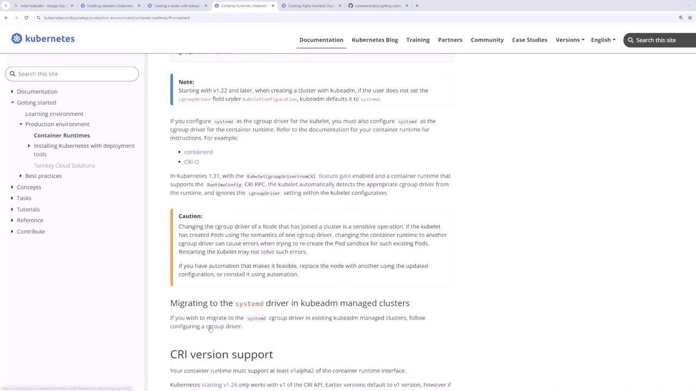
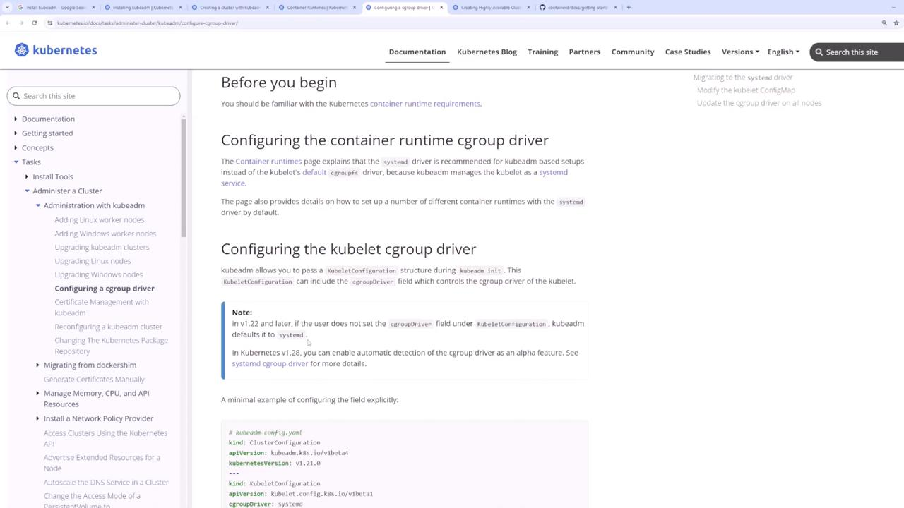
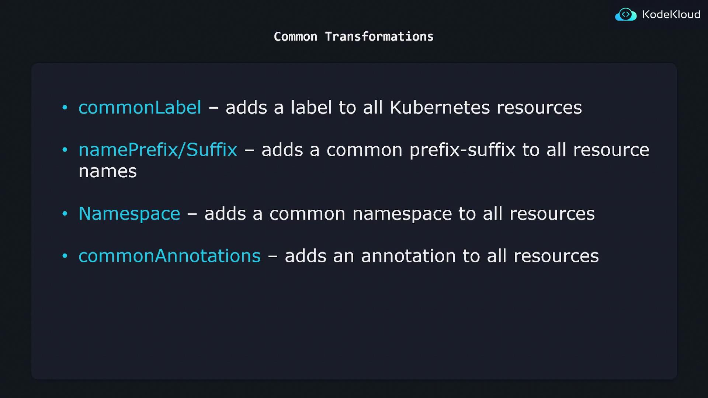

# Create the keyrings directory if it does not exist
sudo mkdir -p /etc/apt/keyrings
curl -fsSL https://pkgs.k8s.io/core/stable/v1.31/deb/Release.key | sudo gpg --dearmor -o /etc/apt/keyrings/kubernetes.gpg
echo "deb [signed-by=/etc/apt/keyrings/kubernetes.gpg] https://pkgs.k8s.io/core/stable/v1.31/deb/ /" | sudo tee /etc/apt/sources.list.d/kubernetes.list
sudo apt-get update
sudo apt-get install -y kubelet kubectl
```

### Step 2: Install ContainerD

Run these commands on each node to install ContainerD:

```bash theme={null}
sudo apt-get update
sudo apt-get install -y kubelet kubeadm kubectl
sudo apt-mark hold kubelet kubeadm kubectl
sudo systemctl enable --now kubelet
```

Now, install ContainerD:

```bash theme={null}
sudo apt-get update
sudo apt-get install -y containerd
```

Verify the installation:

```bash theme={null}
sudo systemctl status containerd
```

### Step 3: Configure ContainerD for the systemd Cgroup Driver

It is critical that both ContainerD and kubelet use the same cgroup driver. Since systemd is the init system (check via `ps -p 1`), update the ContainerD configuration:

```bash theme={null}
sudo mkdir -p /etc/containerd
containerd config default | sed 's/SystemdCgroup = false/SystemdCgroup = true/' | sudo tee /etc/containerd/config.toml
sudo systemctl restart containerd
```

<Callout icon="lightbulb">
  For further details on cgroup drivers, please review the [container runtime
  documentation](https://kubernetes.io/docs/setup/production-environment/container-runtimes/).
</Callout>

> 

> 

***

## 4. Installing kubeadm, kubelet, and kubectl

After configuring the container runtime, install the Kubernetes components. Holding these packages prevents unintentional upgrades:

```bash theme={null}
sudo apt-get update
sudo apt-get install -y kubelet kubeadm kubectl
sudo apt-mark hold kubelet kubeadm kubectl
sudo systemctl enable --now kubelet
```

The components serve the following purposes:

* **kubeadm:** Bootstraps and manages the cluster initialization.
* **kubelet:** Manages pods and containers on every node.
* **kubectl:** Provides the command-line interface to interact with the cluster.

***

## 5. Initializing the Kubernetes Cluster

On the master node, initialize the control plane with `kubeadm init`, making sure to specify the following:

* `--pod-network-cidr`: Sets the CIDR for pod networking (e.g., "10.244.0.0/16").
* `--apiserver-advertise-address`: Uses the master node's static IP.

Before proceeding, verify the master node's IP address:

```bash theme={null}
ip addr
```

For instance, if your master node's static IP is 192.168.56.11, run:

```bash theme={null}
sudo kubeadm init --apiserver-advertise-address=192.168.56.11 --pod-network-cidr="10.244.0.0/16" --upload-certs
```

After initialization, an `admin.conf` file is created. Configure kubectl by copying this file:

```bash theme={null}
mkdir -p $HOME/.kube
sudo cp -i /etc/kubernetes/admin.conf $HOME/.kube/config
sudo chown $(id -u):$(id -g) $HOME/.kube/config

export KUBECONFIG=/etc/kubernetes/admin.conf
```

Confirm access to the cluster by checking the pods:

```bash theme={null}
kubectl get pods -A
```

A lack of pods in the default namespace indicates that the cluster is successfully initialized.

***

## 6. Deploying a Pod Network Add-on

To enable inter-pod communication, deploy a pod network add-on. In this demo, we use Weave Net. Run the following command on the master node:

```bash theme={null}
kubectl apply -f [podnetwork].yaml
```

Replace `[podnetwork].yaml` with the URL or local file path to the Weave Net configuration file. This command deploys a DaemonSet that ensures the network add-on is applied across the control plane and later propagates to worker nodes.

Verify the network add-on by checking the pods:

```bash theme={null}
kubectl get pods -A
```

Ensure the Weave Net pods are running on the control plane. Adjust network settings if necessary to match the pod network CIDR used during initialization.

***

## 7. Joining Worker Nodes to the Cluster

Once the pod network is deployed, add your worker nodes to the cluster using the `kubeadm join` command printed by the `kubeadm init` process.

For example, run the following command on each worker node:

```bash theme={null}
sudo kubeadm join 192.168.56.11:6443 --token ps4rl5.0ns9vwu9exjul8tg \
    --discovery-token-ca-cert-hash sha256:[SECRET_REDACTED]
```

After joining, verify the nodes from the master node:

```bash theme={null}
kubectl get nodes
```

All nodes (master and workers) should appear with a "Ready" status.

***

## 8. Verifying the Cluster

To ensure that your Kubernetes cluster is operational, deploy a test pod (for example, an nginx container):

```bash theme={null}
kubectl run nginx --image=nginx
kubectl get pod
```

Once the test pod is in the Running state, your cluster setup is complete. You may remove the test pod when finished.

***

## Conclusion

This guide covered the following steps to bootstrap your Kubernetes cluster using kubeadm:

1. Reviewed VM network configurations.
2. Installed and configured ContainerD as the container runtime.
3. Installed Kubernetes components (kubeadm, kubelet, and kubectl).
4. Initialized the control plane with `kubeadm init` (including specifying pod network CIDR and the API server advertise address).
5. Deployed a pod network add-on (Weave Net).
6. Joined the worker nodes to the cluster.
7. Verified cluster functionality with a test pod deployment.

You have now successfully set up your Kubernetes cluster from scratch using kubeadm. Happy clustering!

<CardGroup>
  <Card title="Watch Video" icon="video" href="https://learn.kodekloud.com/user/courses/cka-certification-course-certified-kubernetes-administrator/module/357c2670-c16c-49ac-aa27-8af52523afde/lesson/60b2bfa0-42de-428e-b2d7-e5124f65b0da" />

  <Card title="Practice Lab" icon="installation" href="https://learn.kodekloud.com/user/courses/cka-certification-course-certified-kubernetes-administrator/module/357c2670-c16c-49ac-aa27-8af52523afde/lesson/a4f095ef-ca2b-4cf9-9c6d-9c6739c3ca6e" />
</CardGroup>


# Common Transformers

Source: https://notes.kodekloud.com/docs/Certified-Kubernetes-Administrator-CKA/Kustomize-Basics-2025-Updates/Common-Transformers/page

Learn to use Kustomize transformers for modifying Kubernetes configurations, focusing on common transformations for consistent resource management.

In this lesson, you will learn how to use Kustomize transformers to modify Kubernetes configurations. Kustomize supports several built-in transformers, and you can also create custom ones. Here, we focus on a subgroup known as Common Transformers.

Imagine you have multiple YAML files such as deployment.yaml and service.yaml. You might want to apply a common configuration—for example, adding a label like "org: KodeKloud" or appending "-dev" to resource names—across all these files. Manually updating each file in a production environment isn’t scalable or efficient. Kustomize transformers offer a systematic way to make consistent changes across all resources.

Below are the original Kubernetes resource examples:

```yaml theme={null}
apiVersion: apps/v1
kind: Deployment
metadata:
  name: api-deployment
spec:
  replicas: 1
  selector:
    matchLabels:
      component: api
  template:
    metadata:
      labels:
        component: api
    spec:
      containers:
      - name: nginx
        image: nginx
```

```yaml theme={null}
apiVersion: v1
kind: Service
metadata:
  name: db-service
spec:
  selector:
    component: db-depl
  ports:
  - protocol: "TCP"
    port: 27017
    targetPort: 27017
  type: LoadBalancer
```

After applying Kustomize transformations, the resources might look like this:

```yaml theme={null}
apiVersion: apps/v1
kind: Deployment
metadata:
  name: api-deployment-dev
spec:
  replicas: 1
  selector:
    matchLabels:
      component: api
      org: KodeKloud
  template:
    metadata:
      labels:
        component: api
        org: KodeKloud
    spec:
      containers:
      - name: nginx
        image: nginx
```

```yaml theme={null}
apiVersion: v1
kind: Service
metadata:
  labels:
    org: KodeKloud
  name: api-service-dev
spec:
  selector:
    component: api
  ports:
  - protocol: "TCP"
    port: 80
    targetPort: 3000
  type: LoadBalancer
```

<Callout icon="lightbulb">
  Kustomize transformers are essential for ensuring that your Kubernetes configurations remain consistent and manageable across various environments.
</Callout>

***

## Common Transformation Methods

Below is an overview of common transformations available in Kustomize for managing Kubernetes resources:

### 1. Common Label Transformation

This transformer automatically adds the specified labels to all Kubernetes resources. You can define the labels in your `kustomization.yaml` file as shown below:

```yaml theme={null}
commonLabels:
  org: KodeKloud
```

For example, a transformed Service resource would appear as:

```yaml theme={null}
apiVersion: v1
kind: Service
metadata:
  labels:
    org: KodeKloud
  name: api-service
spec:
  ports:
  - port: 80
    protocol: TCP
    targetPort: 3000
  selector:
    component: api
  type: LoadBalancer
```

***

### 2. Namespace Transformation

The namespace transformer assigns all Kubernetes resources to a specified namespace. By specifying the namespace in your `kustomization.yaml`, all resources will be modified accordingly. For example:

```yaml theme={null}
namespace: lab
```

After this transformation, a Service resource might look like:

```yaml theme={null}
apiVersion: v1
kind: Service
metadata:
  annotations:
    branch: master
  labels:
    org: KodeKloud
    name: api-service
    namespace: lab
spec:
  ports:
  - port: 80
    protocol: TCP
    targetPort: 3000
  selector:
    component: api
    org: KodeKloud
  type: LoadBalancer
```

<Callout icon="lightbulb">
  When applying namespace transformations, ensure that the specified namespace exists in your cluster to avoid deployment issues.
</Callout>

***

### 3. Name Prefix and Suffix Transformation

This transformer enables you to systematically add a prefix or suffix to resource names. For instance, to prepend "KodeKloud-" and append "-dev" to each resource name, include the following in your `kustomization.yaml`:

```yaml theme={null}
namePrefix: KodeKloud-
nameSuffix: -dev
```

After applying this configuration, a Service resource would be renamed to "KodeKloud-api-service-dev":

```yaml theme={null}
apiVersion: v1
kind: Service
metadata:
  name: KodeKloud-api-service-dev
spec:
  ports:
  - port: 80
    protocol: TCP
    targetPort: 3000
  selector:
    component: api
  type: LoadBalancer
```

***

### 4. Common Annotation Transformation

If you need to add specific annotations to all resources, use the common annotations transformer. By setting the annotations in your `kustomization.yaml`, each resource will automatically include them. For example:

```yaml theme={null}
commonAnnotations:
  branch: master
```

This transformation results in a Service resource similar to:

```yaml theme={null}
apiVersion: v1
kind: Service
metadata:
  annotations:
    branch: master
  labels:
    org: KodeKloud
    name: api-service
    namespace: auth
spec:
  ports:
  - port: 80
    protocol: TCP
    targetPort: 3000
  selector:
    component: api
    org: KodeKloud
  type: LoadBalancer
```

***

## Summary

The common transformations available in Kustomize include:

| Transformation Type              | Purpose                                                          |
| -------------------------------- | ---------------------------------------------------------------- |
| Common Label Transformation      | Adds specified labels (e.g., org: KodeKloud) to all resources    |
| Namespace Transformation         | Assigns a specific namespace to all resources                    |
| Name Prefix and Suffix           | Adds predetermined prefixes and suffixes to resource names       |
| Common Annotation Transformation | Appends specific annotations (e.g., branch: master) to resources |

These methods provide a scalable and systematic approach to maintaining consistent configurations across your Kubernetes resources.

<Frame>
  
</Frame>

In summary, Kustomize transformers offer a robust and error-resistant way to apply common configurations—such as labels, namespaces, name modifications, and annotations—to your Kubernetes resources, ensuring that your deployments remain consistent and manageable across various environments.

<CardGroup>
  <Card title="Watch Video" icon="video" href="https://learn.kodekloud.com/user/courses/cka-certification-course-certified-kubernetes-administrator/module/031e84b8-bcbc-4f39-94d6-66d93b05bddc/lesson/f5d9be8b-990f-40eb-bfc2-6594c0cb8a3b" />
</CardGroup>
