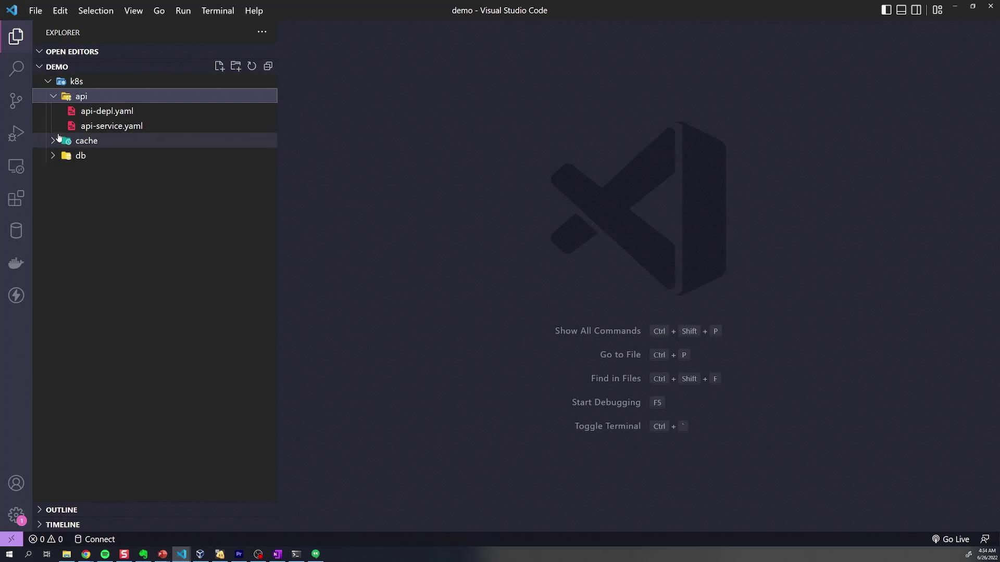

# Managing Directories Demo

Source: https://notes.kodekloud.com/docs/Certified-Kubernetes-Administrator-CKA/Kustomize-Basics-2025-Updates/Managing-Directories-Demo/page

This article explores managing Kubernetes manifest directories and introduces Kustomize for simplifying resource management and deployment.

In this lesson, we explore how to effectively manage directories containing Kubernetes manifests. The demonstration uses a structured "K8s" directory that holds all Kubernetes configurations organized into three subdirectories: one for the API, one for the cache (acting as a readers' database), and one for the MongoDB database.

When you open the K8s directory, you'll see three distinct folders. Each folder includes configuration files (YAML manifests) tailored for a specific component. For instance, the database folder contains the deployment YAML files for MongoDB, while the API and cache directories contain configurations for services such as ClusterIP or LoadBalancer services along with associated ConfigMaps.

<Frame>
  
</Frame>

Below is an excerpt showcasing a typical service configuration for the cache component:

```yaml theme={null}
apiVersion: v1
kind: Service
metadata:
  name: redis-cluster-ip-service
spec:
  type: ClusterIP
  selector:
    component: redis
  ports:
    - port: 6379
      targetPort: 6379
```

Before we introduce Kustomize, let's deploy these resources using the conventional approach without customization. Typically, you navigate into each directory and run the `kubectl apply` command as shown below:

```bash theme={null}
kubectl apply -f k8s/api
