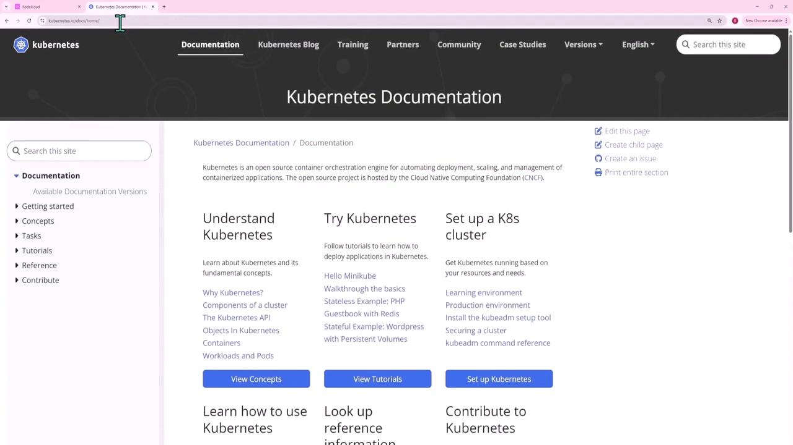
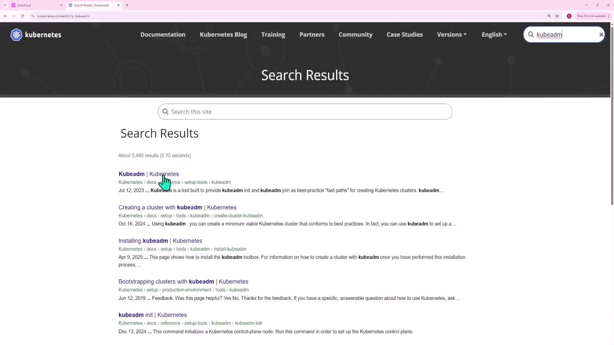
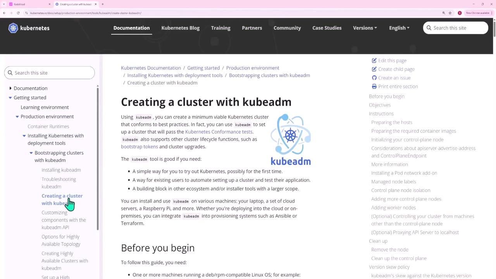

# Mock Exam 3 Step by Step Solutions

Source: https://notes.kodekloud.com/docs/Certified-Kubernetes-Administrator-CKA/Mock-Exams/Mock-Exam-3-Step-by-Step-Solutions/page

This lesson provides detailed solutions for each question in Mock Exam Three, focusing on specific Kubernetes tasks with clear instructions and code examples.

This lesson presents detailed solutions for each question in Mock Exam Three. Each solution focuses on a specific Kubernetes task and provides clear instructions, configuration code blocks, and diagram references. All image links and descriptions remain exactly as provided.

***

## Question 1 – Adjusting Network Parameters for Kubernetes

To deploy a Kubernetes cluster using kubeadm, you must enable IPv4 packet forwarding and ensure the settings persist across reboots. Refer to the kubeadm documentation for guidance when provisioning a new cluster.

<Frame>
  
</Frame>

Searching for “kubeadm” in the docs will help you locate the bootstrapping guide.

<Frame>
  
</Frame>

Navigate through the following path:
Production Environment → Installing Kubernetes Deployment Tools → Bootstrapping a Cluster → Creating a Cluster with kubeadm.

<Frame>
  
</Frame>

The first step is to set up a container runtime and enable IPv4 packet forwarding using these commands:

```bash theme={null}
cat <<EOF | sudo tee /etc/sysctl.d/k8s.conf
net.ipv4.ip_forward = 1
EOF

sudo sysctl --system

sysctl net.ipv4.ip_forward
```

For additional persistence, use this command if provided:

```bash theme={null}
