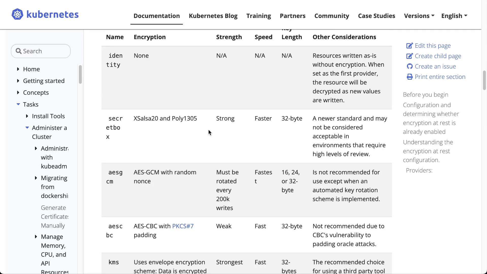
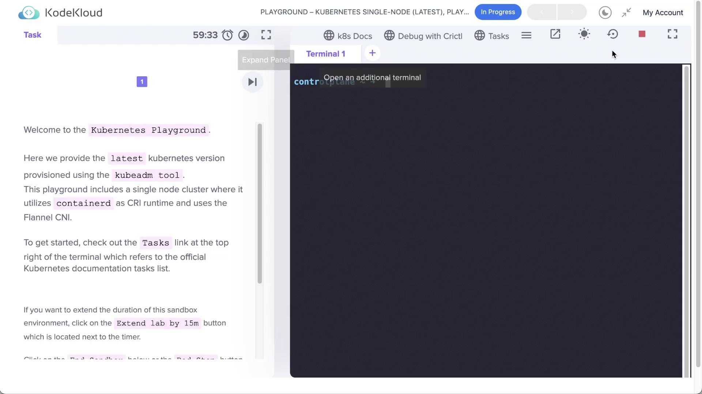

# Demo Encrypting Secret Data at Rest

Source: https://notes.kodekloud.com/docs/Certified-Kubernetes-Application-Developer-CKAD/Configuration/Demo-Encrypting-Secret-Data-at-Rest/page

This guide explains how to encrypt secret data at rest in Kubernetes, covering creation, inspection, and configuration of encryption for sensitive information.

In this guide, you will learn how to encrypt secret data at rest in Kubernetes. Based on the [official Kubernetes documentation](https://kubernetes.io/docs/), this tutorial walks you through the storage of secret objects, inspecting them in etcd, and configuring encryption at rest to secure sensitive data.

***

In the beginning, launch a Kubernetes playground running a single-node cluster based on Kubernetes and ContainerD.

<Frame>
  
</Frame>

Once the playground is up, open the terminal.

<Frame>
  
</Frame>

***

## Creating a Secret Object

Kubernetes secrets help to store sensitive data such as passwords, tokens, or keys. There are multiple methods to create a secret object, including from files, literals, or environment variable files. Below are some examples:

```bash theme={null}
