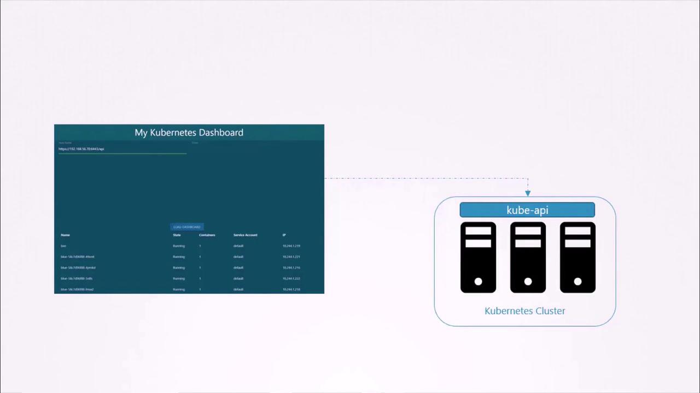
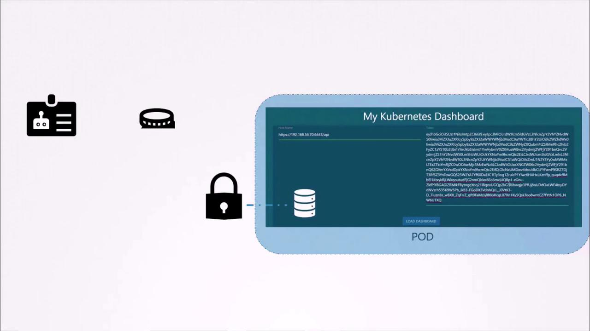
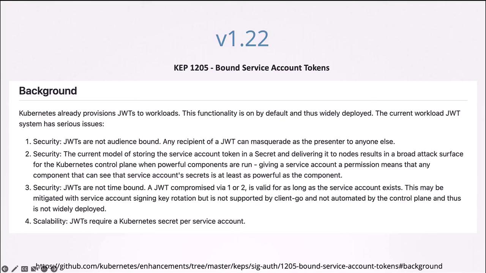
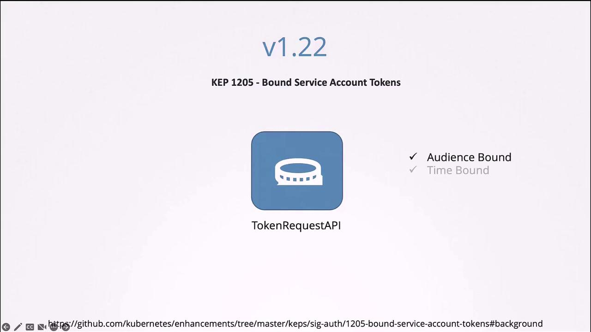
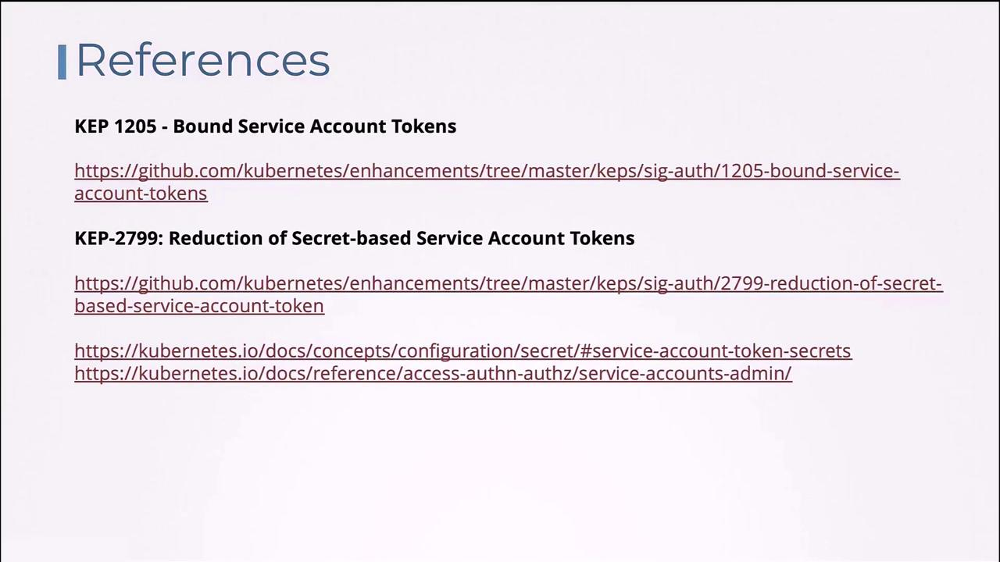

# Service Account

Source: https://notes.kodekloud.com/docs/Certified-Kubernetes-Application-Developer-CKAD/Configuration/Service-Account/page

This article explores Kubernetes service accounts for authenticating and authorizing machine-to-cluster interactions, focusing on their creation and management.

Welcome to this lesson on Kubernetes service accounts. In this article, we explore how service accounts serve as the backbone for authenticating and authorizing machine-to-cluster interactions. While closely related to authentication, authorization, and role-based access control topics, this guide specifically focuses on creating and managing service accounts as part of our Kubernetes curriculum.

There are two primary account types in Kubernetes:

* **User Accounts:** For human users such as administrators and developers.
* **Service Accounts:** For machine users, such as monitoring tools (e.g., Prometheus) or CI/CD systems like [Jenkins](https://learn.kodekloud.com/user/courses/jenkins).

## Example: Kubernetes Dashboard Application

Consider a simple dashboard application, “my Kubernetes dashboard,” built in Python. When deployed, it queries the Kubernetes API to retrieve the list of Pods and displays them on a web page. For secure communication with the Kubernetes API, the application uses a service account to authenticate.

<Frame>
  
</Frame>

## Creating a Service Account

To create a service account for your application, run the following command. In this example, we create a service account named `dashboard-sa`:

```bash theme={null}
kubectl create serviceaccount dashboard-sa
```

After creation, list all service accounts with:

```bash theme={null}
kubectl get serviceaccount
```

The output might look similar to:

```plaintext theme={null}
NAME          SECRETS   AGE
default       1         218d
dashboard-sa  1         4d
```

Inspect the newly created service account along with its token by executing:

```bash theme={null}
kubectl describe serviceaccount dashboard-sa
```

This command will show details including the associated token (stored as a secret), such as:

```plaintext theme={null}
Name:                dashboard-sa
Namespace:           default
Labels:              <none>
Annotations:         <none>
Image pull secrets:  <none>
Mountable secrets:   dashboard-sa-token-kbbdm
Tokens:              dashboard-sa-token-kbbdm
Events:              <none>
```

The token is stored in a Secret object. To view the token, describe the corresponding secret:

```bash theme={null}
kubectl describe secret dashboard-sa-token-kbbdm
```

Use the token as a bearer authentication token when accessing the Kubernetes API. For example:

```bash theme={null}
curl https://192.168.56.70:6443/api --insecure --header "Authorization: Bearer eyJhbgG…"
```

## Automatic Token Mounting in Pods

When a third-party application is deployed on a Kubernetes cluster, the service account token is automatically mounted as a volume inside the Pod. This allows your application to read the token from a well-known location rather than providing it manually.

<Frame>
  
</Frame>

By default, each namespace in Kubernetes includes a service account named `default`. When a Pod is created without specifying a service account, Kubernetes mounts the default service account’s token into the Pod. Consider the following minimal Pod definition:

```yaml theme={null}
apiVersion: v1
kind: Pod
metadata:
  name: my-kubernetes-dashboard
spec:
  containers:
    - name: my-kubernetes-dashboard
      image: my-kubernetes-dashboard
```

To inspect the Pod, run:

```bash theme={null}
kubectl describe pod my-kubernetes-dashboard
```

A typical output displays that a secret (e.g., `default-token-j4hkv`) is mounted at `/var/run/secrets/kubernetes.io/serviceaccount`:

```plaintext theme={null}
Name:         my-kubernetes-dashboard
Namespace:    default
Status:       Running
IP:           10.244.0.15
Containers:
  my-kubernetes-dashboard:
    Image:      my-kubernetes-dashboard
Mounts:
  /var/run/secrets/kubernetes.io/serviceaccount from default-token-j4hkv (ro)
Volumes:
  default-token-j4hkv:
    Type:        Secret (a volume populated by a Secret)
    SecretName:  default-token-j4hkv
    Optional:    false
```

Inside the Pod, you can list the mounted secret files:

```bash theme={null}
kubectl exec -it my-kubernetes-dashboard -- ls /var/run/secrets/kubernetes.io/serviceaccount
```

And to view the token:

```bash theme={null}
kubectl exec -it my-kubernetes-dashboard -- cat /var/run/secrets/kubernetes.io/serviceaccount/token
```

The file named `token` contains the bearer token used for accessing the Kubernetes API. Keep in mind that the default service account has limited permissions geared towards basic API queries.

## Using a Custom Service Account in Pods

To use a service account other than the default (for example, `dashboard-sa`), update your Pod definition by specifying the `serviceAccountName` field:

```yaml theme={null}
apiVersion: v1
kind: Pod
metadata:
  name: my-kubernetes-dashboard
spec:
  containers:
    - name: my-kubernetes-dashboard
      image: my-kubernetes-dashboard
  serviceAccountName: dashboard-sa
```

After recreating the Pod (since you cannot change the service account for an existing Pod), inspect it with:

```bash theme={null}
kubectl describe pod my-kubernetes-dashboard
```

You should notice that the volume now mounts the token belonging to `dashboard-sa`:

```plaintext theme={null}
Mounts:
  /var/run/secrets/kubernetes.io/serviceaccount from dashboard-sa-token-kbbdm (ro)
```

If you prefer to disable the automatic mounting of the service account token, set the `automountServiceAccountToken` field to `false`:

```yaml theme={null}
apiVersion: v1
kind: Pod
metadata:
  name: my-kubernetes-dashboard
spec:
  automountServiceAccountToken: false
  containers:
    - name: my-kubernetes-dashboard
      image: my-kubernetes-dashboard
```

## Changes in Kubernetes Versions 1.22 and 1.24

Starting with Kubernetes 1.22, enhancements were made to how service account tokens are handled. Previously, creating a service account automatically produced a Secret with a non-expiring token. Now, tokens are generated via the token request API and mounted as projected volumes with a defined lifetime.

The following is an example Pod manifest that reflects the new token provisioning method:

```yaml theme={null}
apiVersion: v1
kind: Pod
metadata:
  name: nginx
  namespace: default
spec:
  containers:
    - image: nginx
      name: nginx
      volumeMounts:
        - mountPath: /var/run/secrets/kubernetes.io/serviceaccount
          name: kube-api-access-6mtg8
          readOnly: true
  volumes:
    - name: kube-api-access-6mtg8
      projected:
        defaultMode: 420
        sources:
          - serviceAccountToken:
              expirationSeconds: 3607
              path: token
          - configMap:
              name: kube-root-ca.crt
              items:
                - key: ca.crt
                  path: ca.crt
          - downwardAPI:
              items:
                - fieldRef:
                    apiVersion: v1
                    fieldPath: metadata.namespace
```

In this configuration, the token is automatically requested with a specified validity (e.g., 3607 seconds) and is mounted through a projected volume rather than a pre-created secret.

With Kubernetes version 1.24, further improvements (as detailed in Kubernetes Enhancement Proposal 2799) have minimized the use of secret-based service account tokens. Now, when a service account is created, a token is not automatically generated. Instead, explicitly generate a token using this command if needed:

```bash theme={null}
kubectl create token dashboard-sa
```

This command produces a token that is both audience-bound and time-limited. You can adjust the expiration using additional options. If you prefer the legacy behavior of creating non-expiring tokens stored in Secrets (though this method is less secure), manually create a Secret object with the proper annotation:

```yaml theme={null}
apiVersion: v1
kind: Secret
type: kubernetes.io/service-account-token
metadata:
  name: mysecretname
  annotations:
    kubernetes.io/service-account.name: dashboard-sa
```

Ensure that the service account (`dashboard-sa`) already exists before creating this Secret.

<Callout icon="lightbulb">
  Decoding the token using tools like `jq` or services such as [jwt.io](https://jwt.io) can help verify token details. Note that earlier tokens did not have an expiry date, but the new token request API provides tokens with a bounded lifetime for enhanced security.
</Callout>

<Frame>
  
</Frame>

<Frame>
  
</Frame>

## Summary

In this lesson, you learned how to:

* Create a service account and retrieve its token (either stored as a Secret or generated via the token request API).
* Automatically mount the service account token into Pods for in-cluster applications.
* Customize Pod definitions to use a specific service account or disable automatic token mounting.
* Understand the improvements in Kubernetes versions 1.22 and 1.24 regarding bound, time-limited tokens using the token request API.

For further reading, refer to the official Kubernetes documentation and relevant enhancement proposals.

<Frame>
  
</Frame>

<CardGroup>
  <Card title="Watch Video" icon="video" href="https://learn.kodekloud.com/user/courses/certified-kubernetes-application-developer-ckad/module/a2ce8bef-967b-48a9-9f58-253035a96c98/lesson/3cac267b-8c3c-4fe5-bfc7-572667d63596" />

  <Card title="Practice Lab" icon="installation" href="https://learn.kodekloud.com/user/courses/certified-kubernetes-application-developer-ckad/module/a2ce8bef-967b-48a9-9f58-253035a96c98/lesson/82dfcb70-c85a-4e96-843c-2c9a46c5abfb" />
</CardGroup>
