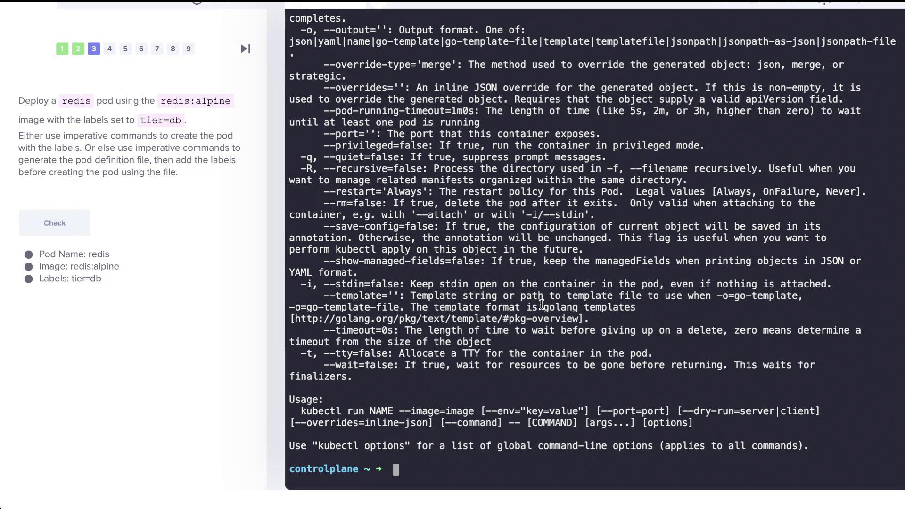
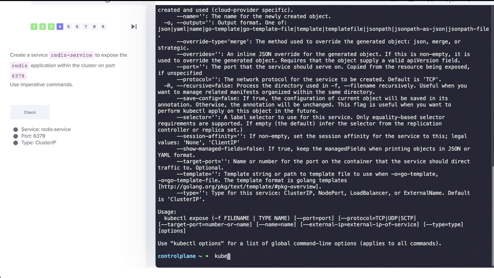

# Solution Imperative Commands optional

Source: https://notes.kodekloud.com/docs/Certified-Kubernetes-Application-Developer-CKAD/Core-Concepts/Solution-Imperative-Commands-optional/page

This article provides hands-on tasks using imperative commands in Kubernetes to create and manage objects with the kubectl command-line tool.

In this lesson, we walk you through a series of hands-on tasks using imperative commands in Kubernetes. These exercises reinforce concepts and help you prepare for your exam by showcasing how to create and manage Kubernetes objects on the fly using the kubectl command-line tool.

***

## Deploying an Nginx Pod

Start by deploying a pod named "nginx-pod" using the nginx Alpine image with the following command:

```bash theme={null}
kubectl run nginx-pod --image=nginx:alpine
```

If successful, your terminal will output something similar to:

```bash theme={null}
pod/nginx-pod created
```

***

## Deploying a Redis Pod with Labels

Next, create a Redis pod using the Redis Alpine image and assign it a label (`tier=db`) to facilitate later operations like service selection:

```bash theme={null}
kubectl run redis --image=redis:alpine --labels=tier=db
```

This command creates the Redis pod with the specified label.

<Frame>
  
</Frame>

***

## Creating a Redis Service

Expose the Redis pod within the cluster by creating a service called "redis-service" on port 6379. We recommend using the kubectl expose command as it automatically detects pod labels to configure selectors.

Run the following command to expose the pod:

```bash theme={null}
kubectl expose pod redis --port=6379 --name=redis-service
```

This command creates a ClusterIP service that routes traffic to your Redis pod. To verify the service, execute:

```bash theme={null}
kubectl get svc
```

<Frame>
  
</Frame>

***

## Creating a Deployment for a Web Application

Now, create a deployment named "webapp" with a specified image and scale it to three replicas using the following command:

```bash theme={null}
kubectl create deployment webapp --image=<your-image> --replicas=3
```

After deploying, verify that all replicas are running correctly by checking the deployment status.

<Callout icon="lightbulb">
  Ensure you use the correct number of dashes when specifying replica count to avoid syntax errors.
</Callout>

***

## Creating a Custom Nginx Pod with a Specific Port

Create a pod named "custom-nginx" with the nginx image and set up the container to listen on port 8080:

```bash theme={null}
kubectl run custom-nginx --image=nginx --port=8080
```

This command configures the container’s port to 8080. Check the pod’s configuration to confirm it is running with the correct port settings.

***

## Creating a New Namespace

To isolate your resources, create a new namespace called "dev-ns":

```bash theme={null}
kubectl create namespace dev-ns
```

You should see a confirmation message similar to:

```bash theme={null}
namespace/dev-ns created
```

***

## Creating a Redis Deployment in the "dev-ns" Namespace

Within the "dev-ns" namespace, deploy a Redis application with two replicas by running:

```bash theme={null}
kubectl create deployment redis-deploy --image=redis --replicas=2 -n dev-ns
```

Verify the deployment with:

```bash theme={null}
kubectl get deployment -n dev-ns
```

Expected output:

```bash theme={null}
NAME           READY   UP-TO-DATE   AVAILABLE   AGE
redis-deploy   2/2     2            2           12s
```

***

## Creating a Pod and Exposing It as a Service in a Single Command

For the final task, create a pod named "httpd" using the httpd Alpine image and simultaneously expose it as a ClusterIP service on port 80. You can accomplish this in a single step:

```bash theme={null}
kubectl run httpd --image=httpd:alpine --port=80 --expose
```

This command does the following:

* Creates a pod named "httpd".
* Exposes the pod by creating a corresponding ClusterIP service on port 80.

Verify both the pod and service with:

```bash theme={null}
kubectl get pod
kubectl get svc
```

For a detailed view of the service configuration, run:

```bash theme={null}
kubectl describe svc httpd
```

The output will include details such as the selector (e.g., "run=httpd") and the endpoint configurations, ensuring that the service is properly set up to expose the pod on port 80.

***

## Verification Commands

After completing the above tasks, use the following commands to check the status of your pods and services:

1. To list all pods:

   ```bash theme={null}
   kubectl get pod
   ```

   An example output might look like:

   ```bash theme={null}
   NAME                       READY   STATUS    RESTARTS   AGE
   nginx-pod                  1/1     Running   0          12m
   redis                      1/1     Running   0          10m
   webapp-7b59bf687d-n7xxp    1/1     Running   0          5m4s
   webapp-7b59bf687d-rds95    1/1     Running   0          5m4s
   webapp-7b59bf687d-4gqmt    1/1     Running   0          5m4s
   custom-nginx               1/1     Running   0          3m41s
   httpd                      1/1     Running   0          8s
   ```

2. To list all services:

   ```bash theme={null}
   kubectl get svc
   ```

   Sample output:

   ```bash theme={null}
   NAME            TYPE        CLUSTER-IP      EXTERNAL-IP   PORT(S)       AGE
   kubernetes      ClusterIP   10.43.0.1       <none>        443/TCP       20m
   redis-service   ClusterIP   10.43.56.187    <none>        6379/TCP      6m35s
   httpd           ClusterIP   10.43.112.233   <none>        80/TCP        15s
   ```

3. To describe the httpd service in detail:

   ```bash theme={null}
   kubectl describe svc httpd
   ```

   You should see output detailing the service configuration, such as:

   ```text theme={null}
   Name:              httpd
   Namespace:         default
   Labels:            <none>
   Annotations:       <none>
   Selector:          run=httpd
   Type:              ClusterIP
   IP Family Policy:  SingleStack
   IP Families:       IPv4
   IP:                10.43.112.233
   IPs:               10.43.112.233
   Port:              <unset>  80/TCP
   TargetPort:       80/TCP
   Endpoints:        10.0.2.17:80
   Session Affinity:  None
   Events:           <none>
   ```

This confirms that the "httpd" service is correctly exposing the corresponding pod on port 80.

***

This concludes the lab on imperative commands for deploying and exposing Kubernetes objects. Each command illustrates a practical approach to managing pods, deployments, and services, providing valuable hands-on experience for your journey toward becoming a certified Kubernetes professional. Happy practicing!

<CardGroup>
  <Card title="Watch Video" icon="video" href="https://learn.kodekloud.com/user/courses/certified-kubernetes-application-developer-ckad/module/eae8cedf-d483-471f-8796-49f69baec6cf/lesson/b50b770b-f092-48a6-9b5b-be782744b0ae" />
</CardGroup>
