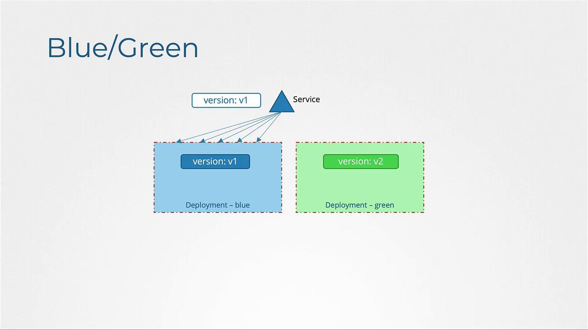
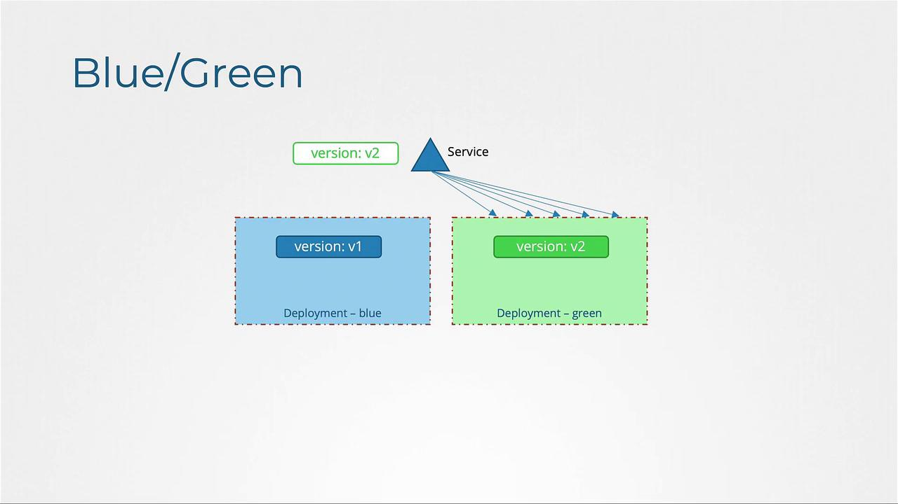
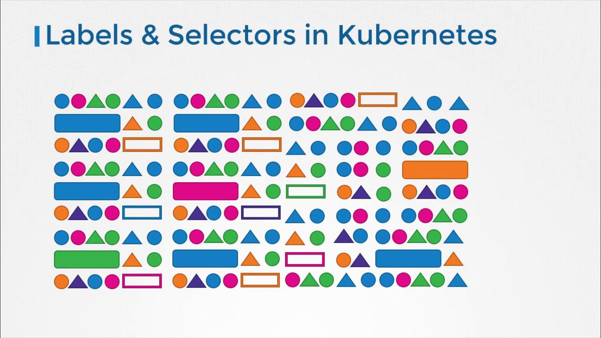
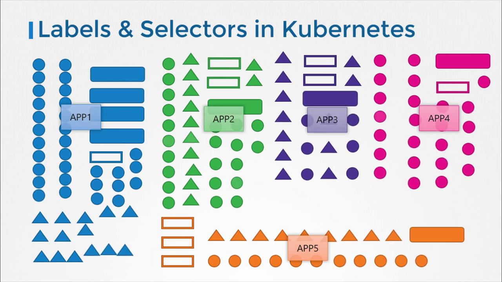
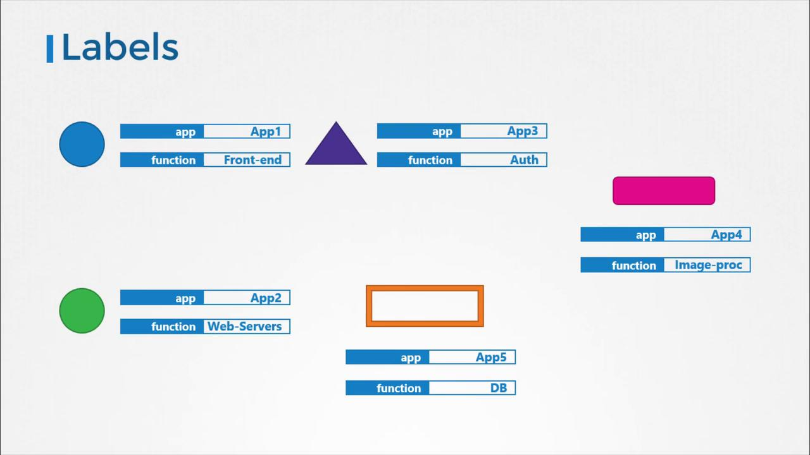

# service-definition.yaml
apiVersion: v1
kind: Service
metadata:
  name: my-service
spec:
  selector:
    version: v1
```

Here is the deployment definition for the blue version:

```yaml theme={null}
# myapp-blue.yml
apiVersion: apps/v1
kind: Deployment
metadata:
  name: myapp-blue
  labels:
    app: myapp
    type: front-end
spec:
  replicas: 5
  selector:
    matchLabels:
      version: v1
  template:
    metadata:
      labels:
        version: v1
    spec:
      containers:
        - name: app-container
          image: myapp-image:1.0
```

After the blue version is deployed and receiving all user traffic, you can deploy the green version by creating a similar deployment with the updated image (for example, `myapp-image:2.0`) and labeling it as `version: v2`.

Once the green version has been rigorously tested, update the Service to switch traffic to it:

```yaml theme={null}
# Updated service-definition.yaml to route traffic to the green version
apiVersion: v1
kind: Service
metadata:
  name: my-service
spec:
  selector:
    version: v2
```

This change ensures that all incoming traffic will now be routed to the green deployment, completing the blue-green transition.

<Frame>
  
</Frame>

<Frame>
  
</Frame>

<Callout icon="lightbulb">
  By utilizing blue-green deployments, you can reduce downtime and mitigate risks during application updates by ensuring the new version is fully tested before it takes over production traffic.
</Callout>

<CardGroup>
  <Card title="Watch Video" icon="video" href="https://learn.kodekloud.com/user/courses/certified-kubernetes-application-developer-ckad/module/c44b5e7c-5854-4c65-87bf-7e07cb026e71/lesson/ace0df47-d390-4f27-8745-365de5febbc3" />
</CardGroup>


# Labels Selectors Annotations

Source: https://notes.kodekloud.com/docs/Certified-Kubernetes-Application-Developer-CKAD/POD-Design/Labels-Selectors-Annotations/page

This article explores how Kubernetes uses labels, selectors, and annotations to organize and manage objects within a cluster.

Hello and welcome! I'm Mumshad Mannambeth, and in this article we explore how Kubernetes leverages labels, selectors, and annotations to efficiently organize and manage objects within a cluster. Understanding these concepts is crucial for maintaining large-scale, dynamic environments.

Labels and selectors offer a systematic approach for grouping and filtering objects. Think of them like product filters in an online store or YouTube video tags; you attach specific properties (labels) to each item and then use selectors to filter items based on those properties. This helps when you want to narrow down a collection—for instance, filtering for green animals or green birds from a larger set.

In Kubernetes, objects such as Pods, Services, ReplicaSets, and Deployments are often created simultaneously. Over time, as clusters grow to include hundreds or thousands of these objects, using labels and selectors to group and locate them by attributes like type, application, or functionality is essential.

<Frame>
  
</Frame>

For each Kubernetes object, you can attach labels (e.g., app, function, etc.). When selecting objects, you define a condition—such as app equals "App1"—to filter exactly the objects you need.

<Frame>
  
</Frame>

Consider the following diagram that demonstrates how you can label objects with attributes like "Front-end," "Auth," and "DB" and then filter them accordingly:

<Frame>
  
</Frame>

## Specifying Labels in Kubernetes

Labels are specified in a Pod definition file under the metadata section as key-value pairs. For example:

```yaml theme={null}
apiVersion: v1
kind: Pod
metadata:
  name: simple-webapp
  labels:
    app: App1
    function: Front-end
spec:
  containers:
  - name: simple-webapp
    image: simple-webapp
    ports:
    - containerPort: 8080
```

Once the Pod is created, use the following command to select it based on its label:

```bash theme={null}
kubectl get pods --selector app=App1
```

The output might look similar to:

```bash theme={null}
NAME            READY   STATUS      RESTARTS   AGE
simple-webapp   0/1     Completed   0          1d
```

## Using Labels and Selectors with ReplicaSets

Kubernetes objects use labels and selectors to form relationships. For instance, when deploying a ReplicaSet that manages multiple Pods, each Pod's definition includes labels that the ReplicaSet uses to identify and manage them. See the example below of a ReplicaSet definition:

```yaml theme={null}
apiVersion: apps/v1
kind: ReplicaSet
metadata:
  name: simple-webapp
  labels:
    app: App1
    function: Front-end
  annotations:
    buildversion: "1.34"
spec:
  replicas: 3
  selector:
    matchLabels:
      app: App1
  template:
    metadata:
      labels:
        app: App1
        function: Front-end
    spec:
      containers:
      - name: simple-webapp
        image: simple-webapp
```

<Callout icon="lightbulb">
  In the ReplicaSet configuration above:

  * The labels in the ReplicaSet `metadata` describe its properties.
  * The `selector` matches the Pods based on labels.
  * The labels in the Pod template (`metadata.labels`) specify which Pods the ReplicaSet should manage.
  * Annotations, like `buildversion: "1.34"`, are used for storing metadata that does not affect selection.
</Callout>

Beginners often confuse the labels on the ReplicaSet with those on the Pods. Remember, the ReplicaSet’s `selector` is key—it connects the ReplicaSet to the corresponding Pods based on matching labels. Using a single common label (e.g., `app: App1`) will cause the ReplicaSet to manage only those Pods. For finer control, additional labels can be added to avoid unintentional matches.

Whenever other objects (such as Services) need to identify these Pods, they use selectors that match the labels assigned directly to the Pods.

## Understanding Annotations

While labels and selectors are used for grouping and selection, annotations are designed for storing non-identifying metadata. This metadata might include tool information, version numbers, build details, or contact information. Annotations provide additional context for integrations, debugging, and information sharing without affecting how objects are grouped or selected.

In our ReplicaSet example, the annotation `buildversion: "1.34"` demonstrates how version-specific metadata can be coupled with object definitions.

<Callout icon="lightbulb">
  Annotations are especially useful for external systems or processes that require insight into the object's metadata without impacting the operational logic in Kubernetes.
</Callout>

That concludes our comprehensive review of labels, selectors, and annotations. Practice these concepts to enhance your expertise on how Kubernetes organizes and manages its objects.

For further reading, visit the following resources:

* [Kubernetes Documentation](https://kubernetes.io/docs/)
* [Kubernetes Basics](https://kubernetes.io/docs/concepts/overview/what-is-kubernetes/)
* [Docker Hub](https://hub.docker.com/)
* [Terraform Registry](https://registry.terraform.io/)

<CardGroup>
  <Card title="Watch Video" icon="video" href="https://learn.kodekloud.com/user/courses/certified-kubernetes-application-developer-ckad/module/c44b5e7c-5854-4c65-87bf-7e07cb026e71/lesson/e2da9b1c-23db-4f5a-a6f3-503507dbbc9d" />

  <Card title="Practice Lab" icon="installation" href="https://learn.kodekloud.com/user/courses/certified-kubernetes-application-developer-ckad/module/c44b5e7c-5854-4c65-87bf-7e07cb026e71/lesson/a8e963ec-27dd-4df0-b55e-d4d70dee8ba0" />
</CardGroup>
