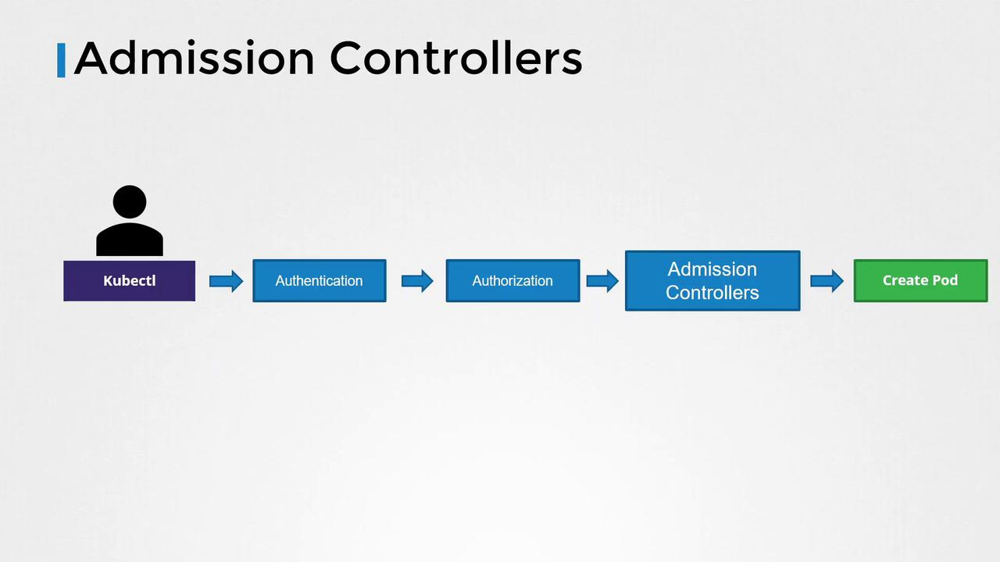

# Example using apps/v1alpha1:
apiVersion: apps/v1alpha1
kind: Deployment
metadata:
  name: nginx
spec:
  # Deployment spec fields go here
---
# Example using apps/v1beta1:
apiVersion: apps/v1beta1
kind: Deployment
metadata:
  name: nginx
spec:
  # Deployment spec fields go here
---
# Example using apps/v1 (the preferred and storage version):
apiVersion: apps/v1
kind: Deployment
metadata:
  name: nginx
spec:
  # Deployment spec fields go here
```

While you can create an object with any supported API version, only one version is designated as the *preferred* version. This is the version used by default with commands like `kubectl get deployment` or `kubectl explain deployment`. Furthermore, only one version—the *storage version*—is used to persist objects in etcd. If you create an object using a non-preferred version (like apps/v1alpha1 or apps/v1beta1), Kubernetes will automatically convert it to the storage version (typically apps/v1) before saving.

For example, after creating a Deployment using any API version, running these commands will show that it is stored as apps/v1:

```bash theme={null}
kubectl get deployment
```

```bash theme={null}
kubectl explain deployment
```

```plaintext theme={null}
KIND:     Deployment
VERSION:  apps/v1
```

## Determining the Preferred and Storage Versions

When multiple API versions are available within a group, the preferred version is listed in the API group details. For example, querying the batch API group might return:

```json theme={null}
{
  "kind": "APIGroup",
  "apiVersion": "v1",
  "name": "batch",
  "versions": [
    {
      "groupVersion": "batch/v1",
      "version": "v1"
    },
    {
      "groupVersion": "batch/v1beta1",
      "version": "v1beta1"
    }
  ],
  "preferredVersion": {
    "groupVersion": "batch/v1",
    "version": "v1"
  }
}
```

While you can determine the preferred version via the API, the storage version remains hidden. To reveal the storage version, you can query the etcd database directly. For instance, using the etcdctl utility with the following command:

```bash theme={null}
ETCDCTL_API=3 etcdctl \
  --endpoints=https://127.0.0.1:2379 \
  --cacert=/etc/kubernetes/pki/etcd/ca.crt \
  --cert=/etc/kubernetes/pki/etcd/server.crt \
  --key=/etc/kubernetes/pki/etcd/server.key \
  get "/registry/deployments/default/blue" --print-value-only
```

You might receive output similar to:

```plaintext theme={null}
apps/v1
Deployment

bluedefault"*${cf8dcd55-8819-4be2-85e7-bb71665c2ddf2ZB
successfully progressed8"2
```

This output confirms that the object is stored as apps/v1.

## Enabling or Disabling Specific API Versions

To modify which API versions are enabled, adjust the `--runtime-config` parameter of the kube-apiserver. For instance, if you need to enable alpha APIs that aren’t enabled by default, update the kube-apiserver's service configuration. Below is an example ExecStart configuration for kube-apiserver:

```bash theme={null}
ExecStart=/usr/local/bin/kube-apiserver \
  --advertise-address=${INTERNAL_IP} \
  --allow-privileged=true \
  --apiserver-count=3 \
  --authorization-mode=Node,RBAC \
  --bind-address=0.0.0.0 \
  --enable-swagger-ui=true \
  --etcd-cafile=/var/lib/kubernetes/ca.pem \
  --etcd-certfile=/var/lib/kubernetes/apiserver-etcd-client.crt \
  --etcd-keyfile=/var/lib/kubernetes/apiserver-etcd-client.key \
  --etcd-servers=https://127.0.0.1:2379 \
  --event-ttl=1h \
  --kubelet-certificate-authority=/var/lib/kubernetes/ca.pem \
  --kubelet-client-[SECRET_REDACTED]-etcd-client.crt \
  --kubelet-client-key=/var/lib/kubernetes/apiserver-etcd-client.key \
  --kubelet-https=true \
  --runtime-config=api/all \
  --service-account-key-file=/var/lib/kubernetes/service-account.pem \
  --service-cluster-ip-range=10.32.0.0/24 \
  --service-node-port-range=30000-32767 \
  --client-ca-file=/var/lib/kubernetes/ca.pem \
  --tls-cert-file=/var/lib/kubernetes/apiserver.crt \
  --tls-private-key-file=/var/lib/kubernetes/apiserver.key \
  --v=2
```

After updating the configuration to enable the desired API versions (specified as comma-separated values in the `--runtime-config` parameter), restart the kube-apiserver service for the changes to take effect.

<Callout icon="triangle-alert">
  Always back up your configuration and validate your changes in a non-production environment before applying them to production.
</Callout>

## Conclusion

This lesson provided an in-depth look at Kubernetes API versions, the significance of each version stage (Alpha, Beta, and GA), and how Kubernetes handles multiple API versions within a single API group. By understanding preferred and storage versions along with how to enable or disable specific API versions, you are better equipped to manage your Kubernetes infrastructure effectively.

Happy learning and stay tuned for more in-depth explorations of the Kubernetes API components!

<CardGroup>
  <Card title="Watch Video" icon="video" href="https://learn.kodekloud.com/user/courses/certified-kubernetes-application-developer-ckad/module/ee404020-8c94-4f3b-a69a-240984b9553e/lesson/bdd9e106-7045-47ec-bb66-c4fd169999b9" />
</CardGroup>


# Admission Controllers

Source: https://notes.kodekloud.com/docs/Certified-Kubernetes-Application-Developer-CKAD/Security/Admission-Controllers/page

This article explores admission controllers in Kubernetes, detailing their role in enforcing security and modifying requests before persistence.

In this lesson, we’ll explore admission controllers—an essential component of Kubernetes that enforces additional security measures and modifies requests before they are persisted. Understanding how admission controllers work and how to configure them is key to enhancing your cluster’s security and operations.

When you use the kubectl utility to interact with a Kubernetes cluster (for example, to create a pod), the request first reaches the API server. The following sequence outlines the process:

1. The API server receives the request.

2. It authenticates the request—commonly using certificates specified in your KubeConfig file. For example, inspect your KubeConfig with:

   ```bash theme={null}
   cat ~/.kube/config
   apiVersion: v1
   clusters:
   - cluster:
       certificate-authority-data: LS0t...
       # Truncated for brevity
   ```

3. Once authenticated, the request proceeds to the authorization phase where Kubernetes checks if the user has permission to perform the operation, typically using Role-Based Access Control (RBAC). For example, a developer role can be defined as follows:

   ```yaml theme={null}
   apiVersion: rbac.authorization.k8s.io/v1
   kind: Role
   metadata:
     name: developer
   rules:
   - apiGroups: [""]
     resources: ["pods"]
     verbs: ["list", "get", "create", "update", "delete"]
     resourceNames: ["blue", "orange"]
   ```

   In this example, the developer role is limited to operations on pods named "blue" or "orange". These RBAC rules operate solely at the API level to control permitted operations.

After authentication and authorization, you might need to enforce restrictions beyond what RBAC offers. Consider these scenarios:

* Preventing images from public Docker Hub by allowing only images from a specific internal registry.
* Enforcing that images never use the "latest" tag.
* Rejecting pod creation when a container is configured to run as the root user.
* Allowing specific capabilities (like "MAC\_ADMIN") only under certain conditions.
* Ensuring resource metadata always includes specific labels.

To address such policies, admission controllers are used. They operate after authentication and authorization but before the request is saved in etcd. Admission controllers can validate configurations, modify requests, or trigger additional operations.

Below is an overview of the Kubernetes process flow with admission controllers positioned between the authorization phase and resource creation:

<Frame>
  
</Frame>

## Built-in Admission Controllers

Kubernetes includes several built-in admission controllers, such as:

* **Always Pull Images:** Ensures that images are pulled every time a pod is created.
* **Default Storage Class:** Automatically assigns a default storage class to PersistentVolumeClaims (PVCs) when none is specified.
* **Event Rate Limit:** Throttles the number of requests processed by the API server to prevent overload.
* **Namespace Exists:** Rejects requests for resources in namespaces that do not exist.

### Example: Namespace Existence Check

Consider the "namespace exists" admission controller. When you attempt to create a pod in a namespace that doesn’t exist, for instance:

```bash theme={null}
kubectl run nginx --image nginx --namespace blue
```

The API server goes through authentication and RBAC authorization. Then, the namespace exists controller checks for the "blue" namespace. Since it isn’t found, the request is rejected with an error similar to:

```bash theme={null}
Error from server (NotFound): namespaces "blue" not found
```

<Callout icon="lightbulb">
  Some clusters may have the namespace auto-provision admission controller enabled (disabled by default) to automatically create missing namespaces.
</Callout>

To list the admission controllers enabled by default, run:

```bash theme={null}
kube-apiserver -h | grep enable-admission-plugins
```

If you’re using a kubeadm-based setup, execute this command inside the kube-apiserver control plane pod using the kubectl exec command.

## Configuring Admission Controllers

To add an admission controller, update the `--enable-admission-plugins` flag on the Kubernetes API server. In a kubeadm-based setup, modify the kube-apiserver manifest file accordingly. For example, to enable both NodeRestriction and NamespaceAutoProvision, update the ExecStart command as follows:

```bash theme={null}
ExecStart=/usr/local/bin/kube-apiserver \
  --advertise-address=${INTERNAL_IP} \
  --allow-privileged=true \
  --apiserver-count=3 \
  --authorization-mode=Node,RBAC \
  --bind-address=0.0.0.0 \
  --enable-swagger-ui=true \
  --etcd-servers=https://127.0.0.1:2379 \
  --event-ttl=1h \
  --runtime-config=api/all \
  --service-cluster-ip-range=10.32.0.0/24 \
  --service-node-port-range=30000-32767 \
  --v=2 \
  --enable-admission-plugins=NodeRestriction,NamespaceAutoProvision
```

For clusters running the API server as a pod (common in kubeadm setups), the manifest might look like this:

```yaml theme={null}
apiVersion: vl
kind: Pod
metadata:
  creationTimestamp: null
  name: kube-apiserver
  namespace: kube-system
spec:
  containers:
  - command:
    - kube-apiserver
    - --authorization-mode=Node,RBAC
    - --advertise-address=172.17.0.107
    - --allow-privileged=true
    - --enable-bootstrap-token-auth=true
    - --enable-admission-plugins=NodeRestriction,NamespaceAutoProvision
    image: k8s.gcr.io/kube-apiserver-amd64:vl.11.3
    name: kube-apiserver
```

To disable specific admission controller plugins, use the `--disable-admission-plugins` flag similarly.

## Auto-Provisioning Example

With NamespaceAutoProvision enabled, running the following command:

```bash theme={null}
kubectl run nginx --image nginx --namespace blue
```

passes through authentication and authorization. The auto-provision controller detects that the "blue" namespace is missing, creates it automatically, and the pod creation completes successfully. The output would be:

```bash theme={null}
kubectl run nginx --image nginx --namespace blue
Pod/nginx created!
```

Verifying the existing namespaces:

```bash theme={null}
kubectl get namespaces
NAME         STATUS   AGE
blue         Active   3m
default      Active   23m
kube-public  Active   24m
kube-system  Active   24m
```

This example shows that admission controllers not only validate and potentially reject requests but can also perform background operations and modify the request content as needed.

<Callout icon="triangle-alert">
  Note that the NamespaceAutoProvision and NamespaceExists admission controllers are deprecated. They have been replaced by the Namespace Lifecycle admission controller, which now ensures that requests to non-existent namespaces are rejected and protects default namespaces (such as default, kube-system, and kube-public) from deletion.
</Callout>

This concludes our lesson on admission controllers. By practicing with these controllers, you can gain a deeper understanding of how to enhance Kubernetes security and manage your cluster effectively.

## References

* [Kubernetes Documentation](https://kubernetes.io/docs/)
* [Kubernetes Basics](https://kubernetes.io/docs/concepts/overview/what-is-kubernetes/)

<CardGroup>
  <Card title="Watch Video" icon="video" href="https://learn.kodekloud.com/user/courses/certified-kubernetes-application-developer-ckad/module/ee404020-8c94-4f3b-a69a-240984b9553e/lesson/3daea1a8-e40b-4ec9-8621-84abcb4e015c" />

  <Card title="Practice Lab" icon="installation" href="https://learn.kodekloud.com/user/courses/certified-kubernetes-application-developer-ckad/module/ee404020-8c94-4f3b-a69a-240984b9553e/lesson/4c63ee14-dd02-4c4d-be87-17685de01d13" />
</CardGroup>
