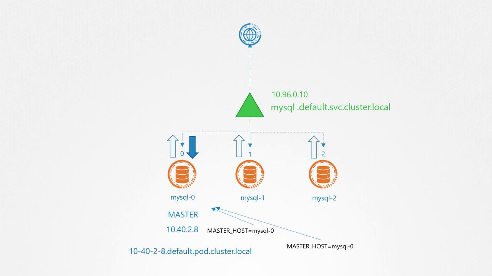

# Headless Services

Source: https://notes.kodekloud.com/docs/Certified-Kubernetes-Application-Developer-CKAD/State-Persistence/Headless-Services/page

This article explores headless services in Kubernetes and their role in addressing routing challenges in master-slave architectures like MySQL clusters.

In this article, we explore headless services in Kubernetes and how they solve routing challenges in a master-slave architecture, such as a MySQL cluster. When using a StatefulSet, each pod is deployed one at a time with a unique ordinal index (for example, mysql-0, mysql-1, mysql-2). This approach provides stable, unique names for each pod, making it easier to direct connections to specific nodes—an essential requirement for database clusters where write operations must be handled by a single master.

## The Problem with Traditional Services

Under typical conditions, Kubernetes services function as load balancers. They provide a Cluster IP and a DNS name (like mysql.default.svc.cluster.local) that routes traffic evenly to all matching pods. This behavior is acceptable when the application only performs read operations in a MySQL cluster but becomes problematic for write operations. Write queries must be directed solely to the master pod, and load balancing across all pods could lead to data inconsistency or conflicts.

## How Headless Services Address the Issue

Headless services eliminate the load balancing behavior by not assigning a Cluster IP. Instead, they generate DNS records for each individual pod in the following format:

  pod-name.headless-service-name.namespace.svc.cluster.local

For example, if you create a headless service named "mysql-h", the master pod can be accessed via:

  mysql-0.mysql-h.default.svc.cluster.local

This DNS entry consistently resolves to the master pod in the MySQL deployment.

<Callout icon="lightbulb">
  In a headless service, setting `clusterIP` to "None" is the only key difference from a standard service definition.
</Callout>

## Headless Service Definition Example

Below is an example of how to define a headless service:

```yaml theme={null}
apiVersion: v1
kind: Service
metadata:
  name: mysql-h
spec:
  ports:
    - port: 3306
  selector:
    app: mysql
  clusterIP: None
```

## Configuring Pods to Use Headless Services

When deploying a pod under a headless service, include the optional fields `subdomain` and `hostname` in the pod specification. The `subdomain` must match the name of your headless service, ensuring that Kubernetes creates the correct DNS record.

For example, to create a pod with only the subdomain specified:

```yaml theme={null}
apiVersion: v1
kind: Pod
metadata:
  name: myapp-pod
  labels:
    app: mysql
spec:
  containers:
    - name: mysql
      image: mysql
  subdomain: mysql-h
```

However, to generate a fully qualified DNS record that includes the pod name, you must set the `hostname` field as well:

```yaml theme={null}
apiVersion: v1
kind: Pod
metadata:
  name: myapp-pod
  labels:
    app: mysql
spec:
  containers:
    - name: mysql
      image: mysql
  subdomain: mysql-h
  hostname: mysql-pod
```

## Visual Overview of a MySQL Cluster Setup

The diagram below illustrates the setup of a MySQL database cluster with one master and two replicas. It highlights the network configuration, including IP addresses and hostnames:

<Frame>
  
</Frame>

## Deployments vs. StatefulSets

When deploying pods using a Deployment, the pod template generally does not specify the `hostname` or `subdomain` fields. Consequently, the headless service is unable to create unique A records for each pod. If these fields are manually added to the pod template, every pod receives the same DNS record, resulting in an address like mysql-pod.mysql-h.default.svc.cluster.local, which is unsuitable for distinct addressing.

### Deployment Example with Identical DNS Records

Below is an example where a Deployment assigns the same hostname and subdomain to all pods:

```yaml theme={null}
apiVersion: v1
kind: Service
metadata:
  name: mysql-h
spec:
  ports:
    - port: 3306
  selector:
    app: mysql
  clusterIP: None
```

```yaml theme={null}
apiVersion: apps/v1
kind: Deployment
metadata:
  name: mysql-deployment
  labels:
    app: mysql
spec:
  replicas: 3
  selector:
    matchLabels:
      app: mysql
  template:
    metadata:
      labels:
        app: mysql
    spec:
      containers:
        - name: mysql
          image: mysql
      subdomain: mysql-h
      hostname: mysql-pod
```

In this configuration, all pods share the same DNS record because they have identical hostnames and subdomains.

## Leveraging StatefulSets for Unique DNS Records

StatefulSets are designed to overcome this limitation by automatically generating unique hostnames for each pod. You do this by simply referencing the headless service name in the StatefulSet specification using the `serviceName` field. Kubernetes then assigns a unique DNS record to each pod based on its ordinal index.

### StatefulSet Example with Headless Service

Below is an example of a StatefulSet that utilizes a headless service:

```yaml theme={null}
apiVersion: v1
kind: Service
metadata:
  name: mysql-h
spec:
  ports:
    - port: 3306
  selector:
    app: mysql
  clusterIP: None
```

```yaml theme={null}
apiVersion: apps/v1
kind: StatefulSet
metadata:
  name: mysql-deployment
  labels:
    app: mysql
spec:
  serviceName: mysql-h
  replicas: 3
  selector:
    matchLabels:
      app: mysql
  template:
    metadata:
      labels:
        app: mysql
    spec:
      containers:
        - name: mysql
          image: mysql
```

In this configuration, each pod is assigned a unique DNS record, for example:

  mysql-0.mysql-h.default.svc.cluster.local\
  mysql-1.mysql-h.default.svc.cluster.local\
  mysql-2.mysql-h.default.svc.cluster.local

This setup meets the requirement for distinct addressing, ensuring that write requests intended for the master pod are routed correctly.

<Callout icon="lightbulb">
  StatefulSets combined with headless services provide a robust solution for applications requiring individual pod addressing without load balancing interference.
</Callout>

<CardGroup>
  <Card title="Watch Video" icon="video" href="https://learn.kodekloud.com/user/courses/certified-kubernetes-application-developer-ckad/module/cb16c9a3-1608-48cf-bfd5-2465f64b4f93/lesson/c7d592ea-fad9-49ca-8abd-2c58d83c6235" />
</CardGroup>
