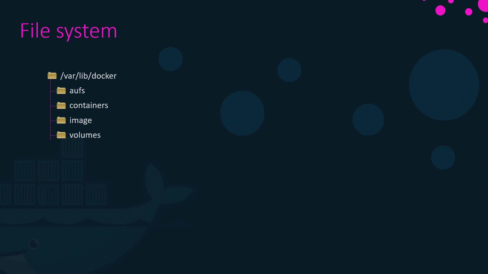
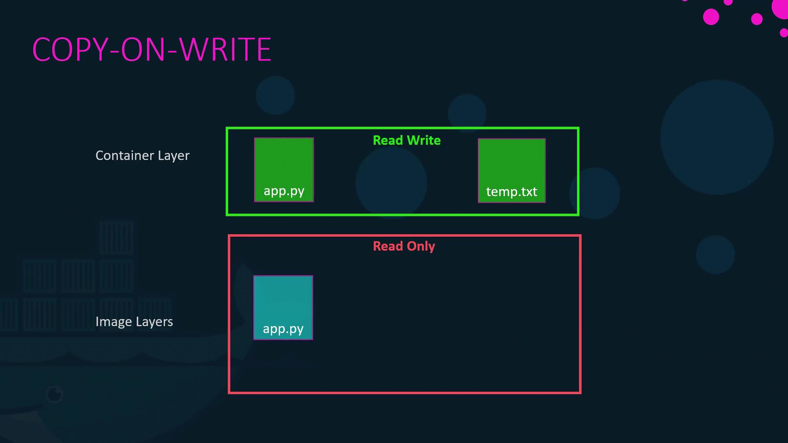
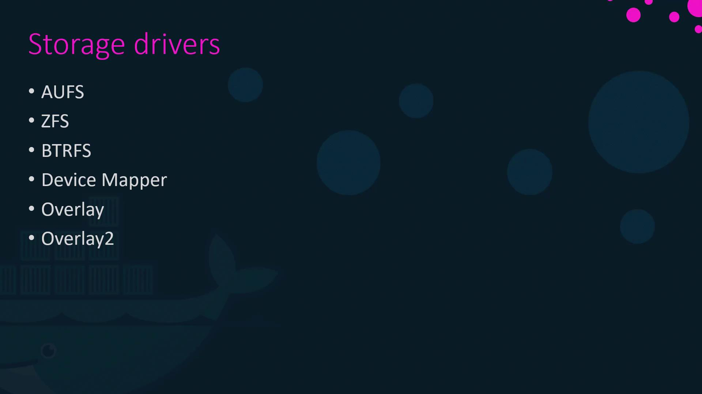

# pv-definition.yaml
apiVersion: v1
kind: PersistentVolume
metadata:
  name: pv-vol1
spec:
  accessModes:
    - ReadWriteOnce
  capacity:
    storage: 500Mi
  gcePersistentDisk:
    pdName: pd-disk
    fsType: ext4
```

```yaml theme={null}
# pvc-definition.yaml
apiVersion: v1
kind: PersistentVolumeClaim
metadata:
  name: myclaim
spec:
  accessModes:
    - ReadWriteOnce
  resources:
    requests:
      storage: 500Mi
```

```yaml theme={null}
# pod-definition.yaml
apiVersion: v1
kind: Pod
metadata:
  name: random-number-generator
spec:
  containers:
    - image: alpine
      name: alpine
      command: ["/bin/sh", "-c"]
      args: ["shuf -i 0-100 -n 1 >> /opt/number.out;"]
      volumeMounts:
        - mountPath: /opt
          name: data-volume
  volumes:
    - name: data-volume
      persistentVolumeClaim:
        claimName: myclaim
```

Before creating the corresponding PV, you must provision the disk on Google Cloud manually. For example, you would use the following command to create a disk:

```bash theme={null}
gcloud beta compute disks create \
  --size 1GB \
  --region us-east1 \
  pd-disk
```

<Callout icon="lightbulb">
  Static provisioning involves manually creating and managing the storage disks and their PV definitions. This can become cumbersome for dynamic applications.
</Callout>

***

## Dynamic Provisioning with Storage Classes

Storage classes simplify storage management by allowing you to automatically create and configure storage resources when a PVC is created. They define a provisioner (such as Google Cloud Persistent Disk) that automatically creates a new disk, dynamically provisions a PV, and binds it to a PVC based on the storage class specified.

To implement dynamic provisioning, create a StorageClass object with the API version set to storage.k8s.io/v1. For Google Cloud, set the provisioner to kubernetes.io/gce-pd. Here is an example:

```yaml theme={null}
# sc-definition.yaml
apiVersion: storage.k8s.io/v1
kind: StorageClass
metadata:
  name: google-storage
provisioner: kubernetes.io/gce-pd
```

When a PVC references a storage class by name, Kubernetes automatically creates and attaches the required storage. For instance:

```yaml theme={null}
# pvc-definition.yaml
apiVersion: v1
kind: PersistentVolumeClaim
metadata:
  name: myclaim
spec:
  accessModes:
    - ReadWriteOnce
  storageClassName: google-storage
  resources:
    requests:
      storage: 500Mi
```

```yaml theme={null}
# pod-definition.yaml
apiVersion: v1
kind: Pod
metadata:
  name: random-number-generator
spec:
  containers:
    - image: alpine
      name: alpine
      command: ["/bin/sh", "-c"]
      args: ["shuf -i 0-100 -n 1 >> /opt/number.out;"]
      volumeMounts:
        - mountPath: /opt
          name: data-volume
  volumes:
    - name: data-volume
      persistentVolumeClaim:
        claimName: myclaim
```

In this setup, when the PVC is created, Kubernetes uses the specified StorageClass to automatically provision a new disk, create a PV, and bind it to the PVC. This eliminates the need for manual disk provisioning.

***

## Advanced Storage Classes

Storage classes can be further customized with parameters specific to the underlying provisioner. For instance, with Google Cloud Persistent Disk, you can define the disk type and replication mode. Consider this example:

```yaml theme={null}
# google-storage with parameters
apiVersion: storage.k8s.io/v1
kind: StorageClass
metadata:
  name: google-storage
provisioner: kubernetes.io/gce-pd
parameters:
  type: pd-standard  # Options: pd-standard or pd-ssd
  replication-type: none  # Options: none or regional-pd
```

This customization allows enterprises to define different classes of service based on performance and availability requirements. Below are examples of multiple storage classes:

| Storage Class | Disk Type   | Replication Mode             |
| ------------- | ----------- | ---------------------------- |
| Silver        | pd-standard | None                         |
| Gold          | pd-ssd      | None                         |
| Platinum      | pd-ssd      | Regional (High Availability) |

Examples for each:

```yaml theme={null}
# silver storage class
apiVersion: storage.k8s.io/v1
kind: StorageClass
metadata:
  name: silver
provisioner: kubernetes.io/gce-pd
parameters:
  type: pd-standard
  replication-type: none
```

```yaml theme={null}
# gold storage class
apiVersion: storage.k8s.io/v1
kind: StorageClass
metadata:
  name: gold
provisioner: kubernetes.io/gce-pd
parameters:
  type: pd-ssd
  replication-type: none
```

```yaml theme={null}
# platinum storage class
apiVersion: storage.k8s.io/v1
kind: StorageClass
metadata:
  name: platinum
provisioner: kubernetes.io/gce-pd
parameters:
  type: pd-ssd
  replication-type: regional-pd
```

By utilizing these tailored storage classes in your PVC definitions, you ensure that the storage provisioned aligns precisely with your application’s performance requirements and budget considerations.

<Callout icon="lightbulb">
  Dynamic provisioning streamlines the process of deploying applications in Kubernetes by eliminating manual storage configuration. This leads to improved efficiency, reduced errors, and enhanced scalability.
</Callout>

***

## In Summary

Storage classes in Kubernetes offer a powerful mechanism to manage storage dynamically. By abstracting the complexities of physical disk configurations, storage classes enable you to create, manage, and bind storage resources automatically as needed. Whether you opt for static provisioning or embrace the flexibility of dynamic provisioning, storage classes are integral to ensuring your applications have the right storage infrastructure.

For more detailed information, consider visiting the official [Kubernetes Documentation](https://kubernetes.io/docs/concepts/storage/storage-classes/).

Happy provisioning!

<CardGroup>
  <Card title="Watch Video" icon="video" href="https://learn.kodekloud.com/user/courses/certified-kubernetes-application-developer-ckad/module/cb16c9a3-1608-48cf-bfd5-2465f64b4f93/lesson/b3eb9f6b-672b-4c2b-82e8-08d8833fd107" />

  <Card title="Practice Lab" icon="installation" href="https://learn.kodekloud.com/user/courses/certified-kubernetes-application-developer-ckad/module/cb16c9a3-1608-48cf-bfd5-2465f64b4f93/lesson/819fad39-4f84-413a-9d3b-828707393413" />
</CardGroup>


# Storage in Docker

Source: https://notes.kodekloud.com/docs/Certified-Kubernetes-Application-Developer-CKAD/State-Persistence/Storage-in-Docker/page

This lesson explores Docker storage drivers, file systems, and management of local filesystem data for images, containers, and volumes.

Welcome to this lesson on advanced Docker concepts. In this guide, we will explore Docker storage drivers, file systems, and how Docker manages local filesystem data for images, containers, and volumes.

## Docker Data Storage on the Host

When Docker is installed, it organizes data within the `/var/lib/docker` directory. This folder contains several subdirectories such as `aufs`, `containers`, `images`, and `volumes`. Each subdirectory serves a specific role in Docker’s architecture:

* **containers:** Stores all files related to running containers.
* **images:** Contains stored images.
* **volumes:** Holds data for persistent storage created by containers.

<Frame>
  
</Frame>

## Layered Architecture in Docker Images

Docker images use a layered architecture where each instruction in a Dockerfile creates a new layer capturing only the changes from the previous one. Consider the following example Dockerfile:

```dockerfile theme={null}
FROM Ubuntu

RUN apt-get update && apt-get -y install python

RUN pip install flask flask-mysql

COPY . /opt/source-code

ENTRYPOINT FLASK_APP=/opt/source-code/app.py flask run
```

You can build this image with the following command:

```bash theme={null}
docker build -t mmumshad/my-custom-app .
```

In this example:

* The **base layer** is the Ubuntu operating system.
* Subsequent layers add APT packages, Python packages, application source code, and finally, the entry point configuration.

Each layer only stores the differences from its predecessor. For example, although the base Ubuntu image might be around 120 MB and the APT updates add an additional 300 MB, the remaining layers are much smaller. This strategy optimizes build times and minimizes disk space usage.

### Reusing Layers for Similar Applications

<Callout icon="lightbulb">
  If subsequent applications share many common layers, Docker will reuse the unchanged layers from its cache, significantly speeding up builds.
</Callout>

Consider a second application similar to the first, with the same base image and dependencies but a different source file and entry point:

```dockerfile theme={null}
FROM Ubuntu

RUN apt-get update && apt-get -y install python

RUN pip install flask flask-mysql

COPY app2.py /opt/source-code

ENTRYPOINT FLASK_APP=/opt/source-code/app2.py flask run
```

Build this image using:

```bash theme={null}
docker build -t mmumshad/my-custom-app-2 .
```

Because the first three layers are identical across both applications, Docker reuses the cached layers and only builds the new layers corresponding to the changes.

## Understanding Image and Container Layers

A Docker image consists of several read-only layers:

1. **Base Layer:** The Ubuntu operating system.
2. **Packages Layer:** APT packages installed on top of Ubuntu.
3. **Dependencies Layer:** Python packages such as Flask.
4. **Source Code Layer:** Your application code included in the image.
5. **Entry Point Layer:** The layer that sets the container’s entry point.

When building the image:

```bash theme={null}
docker build -t mmumshad/my-custom-app Dockerfile
```

the resulting layers remain read-only. Running a container from this image creates a new writable layer on top, which stores changes such as logs, temporary files, or modifications made during runtime. This mechanism is known as copy-on-write. Even if you modify a read-only file from the image, Docker creates a separate copy in the writable layer before applying the changes.

```bash theme={null}
docker run mmumshad/my-custom-app
```

<Frame>
  
</Frame>

<Callout icon="triangle-alert">
  Remember, when you remove a container, its writable layer and any associated changes will be lost. The original image remains unchanged unless it is rebuilt.
</Callout>

## Persisting Data with Volumes

For data persistence outside the container’s ephemeral writable layer—such as database storage—use Docker volumes.

### Creating and Using Volumes

First, create a volume:

```bash theme={null}
docker volume create data_volume
```

Then, mount the created volume when launching a container. For example, to store MySQL data in the volume, run:

```bash theme={null}
docker run -v data_volume:/var/lib/mysql mysql
```

If a specified volume does not exist, Docker automatically creates it. To inspect the volumes, you can list the contents of `/var/lib/docker/volumes`.

### Bind Mounts

Alternatively, if you prefer using external storage (for instance, storing database files in `/data/mysql` on your host), you can use bind mounts:

```bash theme={null}
docker run -v /data/mysql:/var/lib/mysql mysql
```

This technique maps a directory on the host to the container, enabling direct access to the host’s filesystem.

### Using the --mount Option

The newer `--mount` flag provides a clearer and more explicit syntax. The equivalent bind mount example using `--mount` is:

```bash theme={null}
docker run \
  --mount type=bind,source=/data/mysql,target=/var/lib/mysql \
  mysql
```

This syntax explicitly defines each parameter (type, source, target) and is recommended for its clarity.

## Docker Storage Drivers

Docker uses storage drivers to manage layered filesystems, the creation of writable layers, and copy-on-write operations. Common storage drivers include:

* AUFS
* ZFS
* BTRFS
* Device Mapper
* Overlay
* Overlay2

The default storage driver varies by operating system: for example, Ubuntu typically uses AUFS, whereas Fedora or CentOS may use Device Mapper if AUFS is unavailable. Each driver offers unique performance and stability characteristics, so choose one based on your application’s requirements.

<Frame>
  
</Frame>

For more detailed information on these storage drivers, please refer to the documentation provided in the relevant links.

## Conclusion

This lesson on Docker’s storage architecture covered the fundamentals of how Docker organizes data on the host, utilizes a layered image architecture, and manages persistent data with volumes and bind mounts. Understanding these concepts is crucial for optimizing Docker builds, ensuring efficient disk usage, and managing data persistence.

Thank you for reading, and we look forward to sharing more advanced Docker topics in our next lesson.

## Further Reading

* [Docker Documentation](https://docs.docker.com/)
* [Kubernetes Basics](https://kubernetes.io/docs/concepts/overview/what-is-kubernetes/)
* [Docker Hub](https://hub.docker.com/)

<CardGroup>
  <Card title="Watch Video" icon="video" href="https://learn.kodekloud.com/user/courses/certified-kubernetes-application-developer-ckad/module/cb16c9a3-1608-48cf-bfd5-2465f64b4f93/lesson/5aefaee8-ec07-4dbd-8c91-b001f712dbd3" />
</CardGroup>
