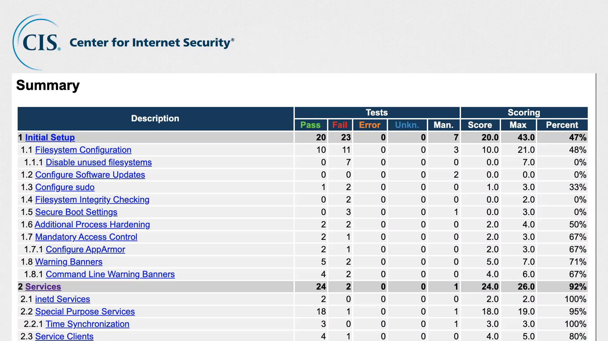
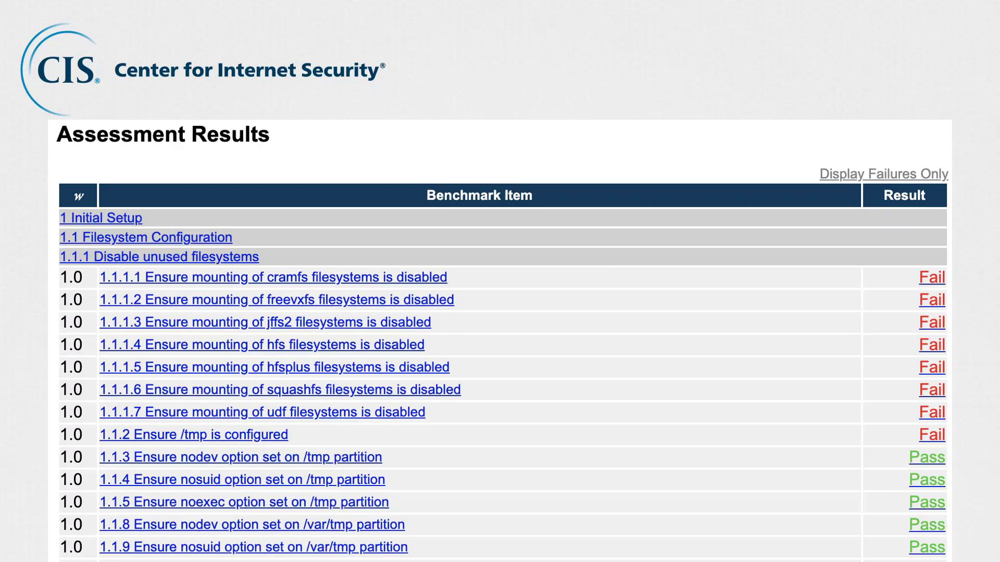
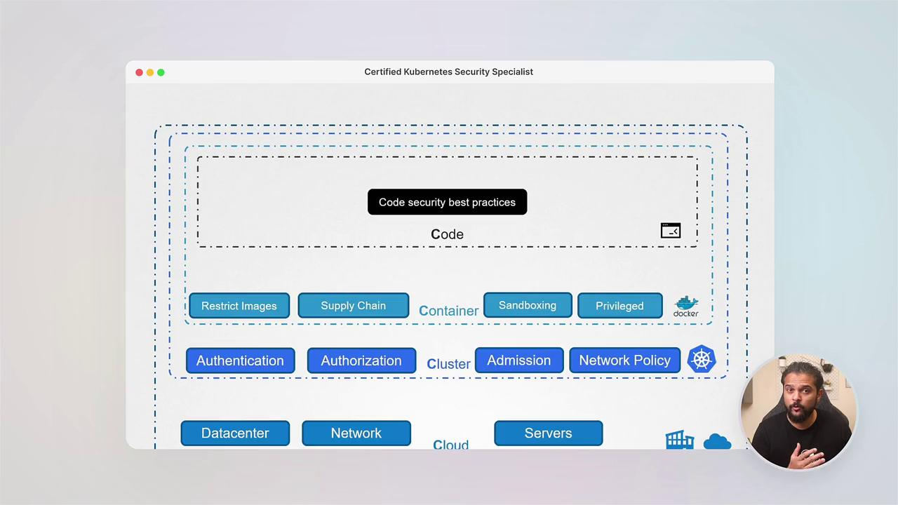

# modprobe -n -v usb-storage
```

<Callout icon="lightbulb">
  CIS not only provides these best practices but also offers tools for automated assessments. The [CIS CAT](https://www.cisecurity.org/cis-cat-pro/) (Configuration Assessment Tool) automates the process of comparing your server's configuration against CIS benchmarks and generates a comprehensive HTML report.
</Callout>

The CIS CAT report summarizes which security recommendations have been implemented and identifies areas requiring attention.

<Frame>
  
</Frame>

This assessment displays which tests passed and which failed, along with corresponding scores for each category. Users can click on each group for a detailed breakdown of the results.

<Frame>
  
</Frame>

In a later section of this lesson, you will perform a CIS Benchmark assessment on an Ubuntu system. You will review the generated report, remediate specific issues based on the findings, and run the assessment again to confirm that all security concerns have been addressed.

Good luck, and we look forward to guiding you through the next lesson on enhancing system security with CIS benchmarks.

<CardGroup>
  <Card title="Watch Video" icon="video" href="https://learn.kodekloud.com/user/courses/certified-kubernetes-security-specialist-cks/module/eac6dac8-4481-4138-96ef-a2135f20e05e/lesson/9ae0e34b-1251-45d2-8b10-12e59f2d3c83" />

  <Card title="Practice Lab" icon="installation" href="https://learn.kodekloud.com/user/courses/certified-kubernetes-security-specialist-cks/module/eac6dac8-4481-4138-96ef-a2135f20e05e/lesson/1f579418-522f-4c04-81f8-4b8ae7f6a2dc" />
</CardGroup>


# Course Introduction

Source: https://notes.kodekloud.com/docs/Certified-Kubernetes-Security-Specialist-CKS/Introduction/Course-Introduction/page

This article introduces a course for preparing for the Certified Kubernetes Security Specialist exam, focusing on Kubernetes security concepts and hands-on labs.

Kubernetes has rapidly become a cornerstone of modern cloud computing, often hailed as the "Linux of the future." Today’s cutting-edge AI technologies, including ChatGPT and OpenAI, run on Kubernetes clusters. With the rapid growth in the AI industry, the demand for Kubernetes expertise is soaring. In fact, a recent survey by Indeed revealed that job searches for Kubernetes surged by over 173% compared to the previous year.

This article introduces the Certified Kubernetes Security Specialist (CKS) exam preparation course. My name is Mumshad Mannambeth and, together with Vijin Palazhi, we will be your guides throughout this course.

Kubernetes security is crucial since it manages containers distributed across multiple systems, making it an attractive target for attacks. By implementing robust security practices, you safeguard both your applications and operational integrity in dynamic cloud environments.

This course kicks off with engaging lectures that break down essential Kubernetes security concepts, supported by visual aids and animations:

<Frame>
  
</Frame>

You will also gain hands-on experience through interactive labs, reinforcing your learning with real-life scenarios that simulate the actual CKS exam environment. Our AI assistants act as expert guides in the labs—tracking your progress, clarifying questions, and providing actionable feedback.

<Callout icon="lightbulb">
  Before you dive into this course, please note that the CKS exam requires you to be a [Certified Kubernetes Administrator (CKA)](https://learn.kodekloud.com/user/courses/cka-certification-course-certified-kubernetes-administrator). If you haven't completed that course or need to strengthen your foundational skills, consider starting with our beginner courses such as [Kubernetes for the Absolute Beginners - Hands-on Tutorial](https://learn.kodekloud.com/user/courses/kubernetes-for-the-absolute-beginners-hands-on-tutorial), [Docker Training Course for the Absolute Beginner](https://learn.kodekloud.com/user/courses/docker-training-course-for-the-absolute-beginner), or [DevOps Pre-Requisite Course](https://learn.kodekloud.com/user/courses/devops-pre-requisite-course).
</Callout>

## Course Structure and Key Topics

This course is meticulously structured to align with the CKS exam objectives, emphasizing both theoretical knowledge and practical security measures through real-world scenarios.

### 1. Exploring the Kubernetes Attack Surface

We begin by examining how various components of Kubernetes clusters can be exploited. This section introduces the four C’s of cloud-native security: cloud, clusters, containers, and code—providing a narrative that sets the stage for deeper exploration into security challenges.

### 2. Hardening Your Kubernetes Cluster

In this segment, you will discover essential strategies to secure your Kubernetes clusters, including:

* Implementing CIS Benchmarks
* Configuring authentication and authorization
* Managing Service Accounts
* Utilizing TLS certificates
* Securing the Kubernetes dashboard
* Enforcing network policies
* Conducting secure cluster upgrades

### 3. Securing the Underlying System

Securing the host system is as important as securing Kubernetes itself. This section covers methods such as:

* Minimizing the operating system footprint
* Implementing SSH hardening and access controls
* Restricting kernel modules and open ports
* Using firewalls and Seccomp for system call restrictions
* Leveraging tools like AppArmor for additional protection

### 4. Reducing Vulnerabilities in Microservices

This section outlines techniques to protect microservices, including:

* Managing Admission Controllers
* Implementing Pod Security Standards
* Utilizing policy engines such as the Open Policy Agent (OPA)
* Securing secrets and runtime sandboxes
* Applying mTLS for pod-to-pod encryption

### 5. Securing the Software Supply Chain

Securing your software supply chain is critical for maintaining a robust security posture. In this module, you will learn best practices such as:

* Minimizing base image sizes
* Scanning container images for vulnerabilities
* Validating and signing deployments

### 6. Runtime Security

The final section is dedicated to runtime security, focusing on behavioral analytics and threat detection. You will explore tools like Falco that help establish a defense-in-depth strategy through monitoring and activity logging.

## Hands-On Labs, Examples, and Exam Preparation

Every module of this course includes comprehensive hands-on labs and real-world examples to bolster your practical skills. The course concludes with a realistic mock exam designed to build your confidence and ensure you are exam-ready. Since the CKS exam is hands-on and permits referencing the official Kubernetes documentation, we also teach you how to navigate these resources efficiently to quickly locate critical information during the exam.

<Callout icon="lightbulb">
  KodeKloud is a CNCF Silver member, a Certified Kubernetes Training Partner, and a CNCF Endorsed Content Provider. This certification is a significant milestone in your journey to become a true "KubeAstronaut."
</Callout>

Let's get started—I'll see you in the first lecture.

<CardGroup>
  <Card title="Watch Video" icon="video" href="https://learn.kodekloud.com/user/courses/certified-kubernetes-security-specialist-cks/module/634a64ac-045c-479e-8d6a-6e2514af768d/lesson/363de760-ffac-46be-b1c2-5f0b6a5b6bee" />
</CardGroup>
