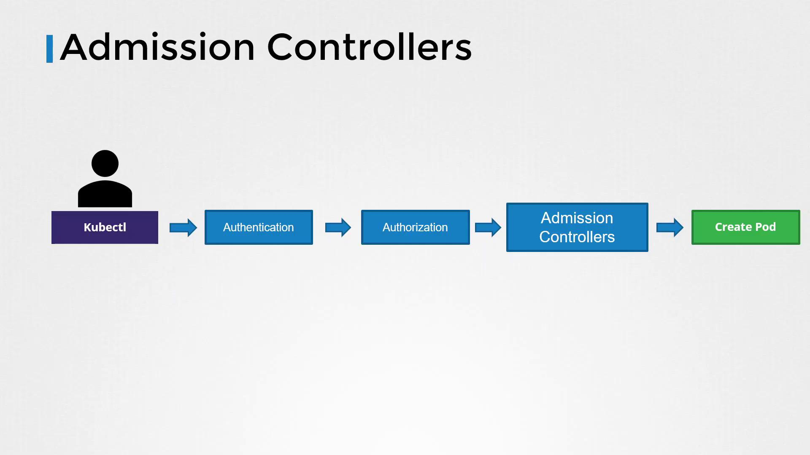

# Admission Controllers

Source: https://notes.kodekloud.com/docs/Certified-Kubernetes-Security-Specialist-CKS/Minimize-Microservice-Vulnerabilities/Admission-Controllers/page

This article explores admission controllers in Kubernetes, which validate, mutate, or reject API requests before they are persisted.

In this article, we explore admission controllers in Kubernetes—powerful components that validate, mutate, or reject API requests before they are persisted. Typically, users interact with the Kubernetes cluster using the kubectl utility. When a command such as creating a pod is issued, the request reaches the API server and is ultimately saved in the etcd database.

## Request Lifecycle in Kubernetes

When a request is sent to the API server, it undergoes several critical steps:

1. **Authentication:**\
   The API server authenticates the request. For instance, when using kubectl, the KubeConfig file supplies the necessary certificates. You can view a snippet from the KubeConfig file using:

   ```bash theme={null}
   cat ~/.kube/config
   ```

   ```yaml theme={null}
   apiVersion: v1
   clusters:
   - cluster:
       certificate-authority-data: LS0tLS1CRUdJTiBDRVUx...
   ```

<Callout icon="lightbulb">
  Only a portion of the base64-encoded certificate data is shown for brevity.
</Callout>

2. **Authorization:**\
   After authentication, the request is authorized. Kubernetes uses role-based access control (RBAC) to determine if the user has permission to perform the requested operation. For example, a role allowing the manipulation of pods might be defined as:

   ```yaml theme={null}
   apiVersion: rbac.authorization.k8s.io/v1
   kind: Role
   metadata:
     name: developer
   rules:
   - apiGroups: [""]
     resources: ["pods"]
     verbs: ["list", "get", "create", "update", "delete"]
   ```

   More granular permissions can also be established. For instance, the following role permits a developer to create only specific pods:

   ```yaml theme={null}
   apiVersion: rbac.authorization.k8s.io/v1
   kind: Role
   metadata:
     name: developer
   rules:
   - apiGroups: [""]
     resources: ["pods"]
     verbs: ["create"]
     resourceNames: ["blue", "orange"]
   ```

   In this case, the developer is restricted to creating pods named either "blue" or "orange."

## The Role of Admission Controllers

Beyond basic authentication and authorization, there are scenarios that require additional validations or modifications to incoming requests. Consider a pod creation request, where you might want to:

* Ensure that images are only pulled from an approved internal registry.
* Enforce that the image tag is not set to "latest."
* Reject requests if the container runs as the root user.
* Modify the container’s security context or enforce specific metadata labels.

Take this pod manifest as an example:

```yaml theme={null}
apiVersion: v1
kind: Pod
metadata:
  name: web-pod
spec:
  containers:
    - name: ubuntu
      image: ubuntu:latest
      command: ["sleep", "3600"]
      securityContext:
        runAsUser: 0
        capabilities:
          add: ["MAC_ADMIN"]
```

RBAC does not cover these complex validations or modifications. That is where admission controllers come into play; they provide an additional security layer by examining, modifying, or rejecting API requests before they reach etcd.

<Frame>
  
</Frame>

### Built-In Admission Controllers

Kubernetes includes several pre-built admission controllers, such as:

* **Always Pull Images:** Ensures that images are pulled on each pod creation.
* **Default Storage Class:** Automatically assigns a default storage class to persistent volume claims if none is specified.
* **Event Rate Limit:** Restricts the number of requests processed by the API server concurrently.
* **Namespace Exists:** Verifies that the specified namespace exists, rejecting requests for non-existent namespaces.

## Namespace-Related Admission Controllers

### Namespace Exists Admission Controller

If you attempt to create a pod in a non-existent namespace, the namespace exists admission controller will reject the request. For example:

```bash theme={null}
kubectl run nginx --image nginx --namespace blue
```

The flow is as follows:

1. The API server authenticates and authorizes the request.
2. The namespace exists admission controller verifies if the "blue" namespace is available.
3. Since the namespace does not exist, the request is rejected.

### Namespace Auto-Provision Admission Controller

An alternate admission controller, the namespace auto-provision admission controller, can automatically create a namespace if it does not exist. Note that this controller is not enabled by default. Without auto-provisioning, running the command:

```bash theme={null}
kubectl run nginx --image nginx --namespace blue
```

results in:

```bash theme={null}
Error from server (NotFound): namespaces "blue" not found
```

To see which admission controllers are enabled by default, run:

```bash theme={null}
kube-apiserver -h | grep enable-admission-plugins
```

If your cluster uses a kubeadm-based setup, execute this command within the kube-apiserver control plane pod:

```bash theme={null}
kubectl exec kube-apiserver-controlplane -n kube-system -- kube-apiserver -h | grep enable-admission-plugins
```

<Callout icon="lightbulb">
  Using these commands helps ensure that you're aware of all the active admission controllers in your cluster.
</Callout>

## Configuring Admission Controllers

### Enabling Admission Controllers

To enable additional admission controllers, update the `--enable-admission-plugins` flag on the kube-apiserver. In a kubeadm-based setup, this update is performed in the kube-apiserver manifest file. For example, you might configure the API server service as follows:

```bash theme={null}
ExecStart=/usr/local/bin/kube-apiserver \\
  --advertise-address=${INTERNAL_IP} \\
  --allow-privileged=true \\
  --apiserver-count=3 \\
  --authorization-mode=Node,RBAC \\
  --bind-address=0.0.0.0 \\
  --enable-swagger-ui=true \\
  --etcd-servers=https://127.0.0.1:2379 \\
  --event-ttl=1h \\
  --runtime-config=api/all \\
  --service-cluster-ip-range=10.32.0.0/24 \\
  --service-node-port-range=30000-32767 \\
  --v=2 \\
  --enable-admission-plugins=NodeRestriction,NamespaceAutoProvision
```

When the API server runs as a pod in a kubeadm-based setup, the manifest might look like this:

```yaml theme={null}
apiVersion: v1
kind: Pod
metadata:
  creationTimestamp: null
  name: kube-apiserver
  namespace: kube-system
spec:
  containers:
    - name: kube-apiserver
      image: k8s.gcr.io/kube-apiserver-amd64:v1.11.3
      command:
        - kube-apiserver
        - --authorization-mode=Node,RBAC
        - --advertise-address=172.17.0.107
        - --allow-privileged=true
        - --enable-bootstrap-token-auth=true
        - --enable-admission-plugins=NodeRestriction,NamespaceAutoProvision
```

To disable specific admission controller plugins, leverage the `--disable-admission-plugins` flag in a similar way.

### Testing Auto-Provisioning

After enabling the desired admission controllers, a pod creation request in a non-existent namespace behaves differently. With the namespace auto-provision controller enabled, executing:

```bash theme={null}
kubectl run nginx --image nginx --namespace blue
```

will successfully create the pod. Upon listing namespaces with:

```bash theme={null}
kubectl get namespaces
```

you should observe that the "blue" namespace has been automatically created:

```plaintext theme={null}
NAME         STATUS   AGE
blue         Active   3m
default      Active   23m
kube-public  Active   24m
kube-system  Active   24m
```

## Deprecation Notice

Note that the namespace auto-provision and namespace existence admission controllers have been deprecated and replaced by the namespace lifecycle admission controller. The namespace lifecycle admission controller now ensures that requests targeting non-existent namespaces are rejected, while also safeguarding critical namespaces (such as default, kube-system, and kube-public) from deletion.

## Conclusion

Admission controllers represent an advanced layer of security within Kubernetes by allowing for complex validations and modifications to API requests. They operate seamlessly in the background, ensuring that your cluster adheres to stringent security and operational policies. Practice deploying and configuring these controllers to strengthen your understanding and enhance your Kubernetes security posture.

For further details, consider reviewing additional Kubernetes documentation on [Admission Controllers](https://kubernetes.io/docs/reference/access-authn-authz/admission-controllers/) and [RBAC](https://kubernetes.io/docs/reference/access-authn-authz/rbac/).

<CardGroup>
  <Card title="Watch Video" icon="video" href="https://learn.kodekloud.com/user/courses/certified-kubernetes-security-specialist-cks/module/7431dd03-f5c2-4ebb-b94a-2d35615bbd8c/lesson/357adf04-1e02-4e8e-ac27-d1706d01e46d" />

  <Card title="Practice Lab" icon="installation" href="https://learn.kodekloud.com/user/courses/certified-kubernetes-security-specialist-cks/module/7431dd03-f5c2-4ebb-b94a-2d35615bbd8c/lesson/07a89281-4a2c-4cf1-a6ce-db287457cf05" />
</CardGroup>
