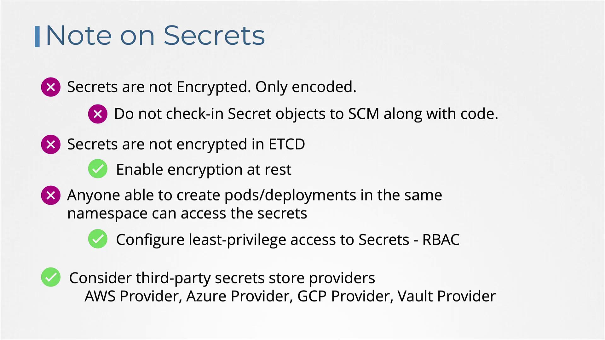
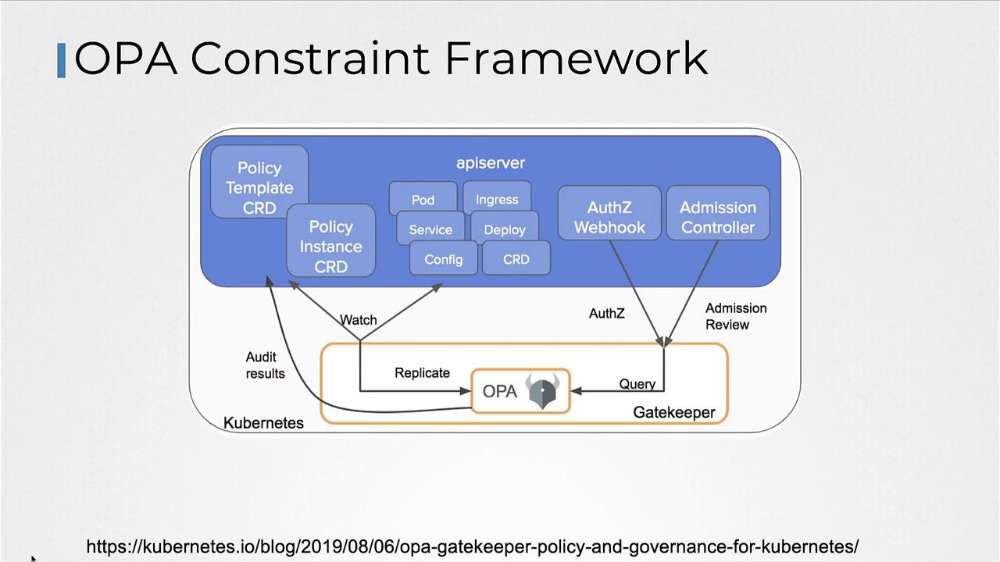
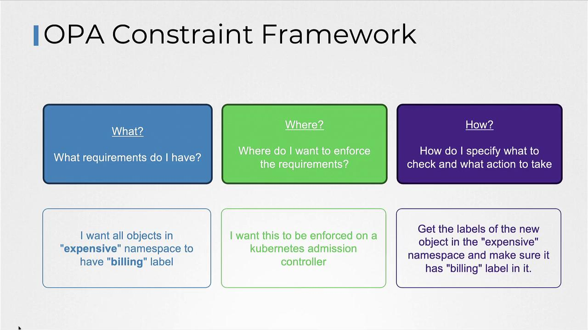

# Output: cGFzd3Jk
```

## Viewing and Decoding Secrets

To list all Secrets, execute:

```bash theme={null}
kubectl get secrets
```

Sample output:

```plaintext theme={null}
NAME          TYPE     DATA   AGE
app-secret    Opaque   3      10m
```

To view detailed information about a specific Secret without revealing its actual values, use:

```bash theme={null}
kubectl describe secrets app-secret
```

For example:

```plaintext theme={null}
Name:         app-secret
Namespace:    default
Labels:       <none>
Annotations:  <none>
Type:         Opaque

Data
====
DB_Host:      10 bytes
DB_User:      4 bytes
DB_Password:  6 bytes
```

To display the Secret in YAML format (this shows the encoded values), run:

```bash theme={null}
kubectl get secret app-secret -o yaml
```

To decode an encoded value, execute:

```bash theme={null}
echo -n 'bXlzcWw=' | base64 --decode
echo -n 'cm9vdA==' | base64 --decode
# Output: root
```

## Injecting Secrets into a Pod

After creating a Secret, you can inject it into a Pod in two ways: as environment variables or as files via a mounted volume.

### Injecting as Environment Variables

Use the `envFrom` property in your container specification to inject the Secret data as environment variables. For example:

```yaml theme={null}
apiVersion: v1
kind: Pod
metadata:
  name: simple-webapp-color
  labels:
    name: simple-webapp-color
spec:
  containers:
    - name: simple-webapp-color
      image: simple-webapp-color
      ports:
        - containerPort: 8080
      envFrom:
        - secretRef:
            name: app-secret
```

All key-value pairs in the "app-secret" will be available as environment variables in your container.

### Injecting as Files in a Volume

Alternatively, mount the Secret as a volume so that each key is written into a separate file. Example configuration:

```yaml theme={null}
volumes:
  - name: app-secret-volume
    secret:
      secretName: app-secret
```

Mount the volume into your container (for instance, at `/opt/app-secret-volumes`) and inspect the files:

```bash theme={null}
ls /opt/app-secret-volumes
cat /opt/app-secret-volumes/DB_Password
# Output: paswrd
```

## Security Considerations

When managing Secrets in Kubernetes, keep the following security best practices in mind:

* Kubernetes Secrets are encoded but not encrypted, meaning anyone with access can decode them using base64.
* Avoid checking in secret definition files to version control systems, such as GitHub.
* By default, Secrets stored in etcd are not encrypted. Consider enabling encryption at rest for enhanced security.

### Enabling Encryption at Rest

To enhance security, enable encryption at rest by configuring an encryption file similar to the snippet below:

```yaml theme={null}
apiVersion: apiserver.config.k8s.io/v1
kind: EncryptionConfiguration
resources:
  - resources:
      - secrets
providers:
  - identity: {}
  - aesgcm:
      keys:
        - name: key1
          secret: c2VjcmV0IGlzIHN1bXdlcnZlZQ==
        - name: key2
          secret: dGhpcPyBcyBwYXNzd29yZA==
  - aescbc:
      keys:
        - name: key1
          secret: c2VjcmV0IGlzIHN1bXdlcnZlZQ==
        - name: key2
          secret: dGhpcPyBcyBwYXNzd29yZA==
  - secretbox:
      keys:
        - name: key1
          secret: YWjZGVmZ2hpamtsbW5vcHyc3R1nd4eXokMjY=
```

Then, pass the configuration to the kube-apiserver. Modify your API server Pod specification as follows:

```yaml theme={null}
apiVersion: v1
kind: Pod
metadata:
  annotations:
    kubeadm.kubernetes.io/kube-apiserver.advertise-address.endpoint: 10.10.30.4:6443
  labels:
    component: kube-apiserver
    tier: control-plane
  name: kube-apiserver
  namespace: kube-system
spec:
  containers:
    - command:
        - kube-apiserver
        # ... other command arguments ...
        - --encryption-provider-config=/etc/kubernetes/enc/enc.yaml  # Add this line
      volumeMounts:
        # ... other mounts ...
        - name: enc
          mountPath: /etc/kubernetes/enc
          readOnly: true  # Add this line
  volumes:
    # ... other volumes ...
    - name: enc
      hostPath:
        path: /etc/kubernetes/enc
        type: DirectoryOrCreate  # Add this line
```

Keep in mind that anyone who can create Pods or Deployments in the same namespace could potentially access these Secrets. Use role-based access control (RBAC) to limit access effectively.

For additional protection, consider integrating third-party secret providers such as the AWS Provider, Azure Provider, GCP Provider, or Vault Provider. These external solutions store Secrets outside etcd and provide advanced security controls.

<Frame>
  
</Frame>

## Conclusion

In this lesson, we covered the importance of managing sensitive data in Kubernetes using Secrets. We discussed both imperative and declarative methods to create Secrets, learned how to inject them into your Pods as environment variables or as files in a volume, and reviewed critical best practices along with encryption strategies. Practice these techniques to improve the security of your Kubernetes deployments and safeguard your sensitive data.

For more detailed information, explore the official [Kubernetes Documentation](https://kubernetes.io/docs/).

<CardGroup>
  <Card title="Watch Video" icon="video" href="https://learn.kodekloud.com/user/courses/certified-kubernetes-security-specialist-cks/module/7431dd03-f5c2-4ebb-b94a-2d35615bbd8c/lesson/2cc1de3d-e070-4999-a083-0eb4ff7f8084" />

  <Card title="Practice Lab" icon="installation" href="https://learn.kodekloud.com/user/courses/certified-kubernetes-security-specialist-cks/module/7431dd03-f5c2-4ebb-b94a-2d35615bbd8c/lesson/0f29d43a-a993-41fb-b58d-5c99f56c356a" />
</CardGroup>


# OPA in Kubernetes

Source: https://notes.kodekloud.com/docs/Certified-Kubernetes-Security-Specialist-CKS/Minimize-Microservice-Vulnerabilities/OPA-in-Kubernetes/page

This article explores integrating OPA with Kubernetes using the Gatekeeper approach for enhanced policy enforcement and governance.

In this article, we explore the integration of OPA (Open Policy Agent) with Kubernetes using the Gatekeeper approach. This method leverages the OPA Constraint Framework alongside Kubernetes admission controllers for enhanced policy enforcement and governance.

<Frame>
  
</Frame>

With the Gatekeeper approach, the admission controller collaborates with the OPA Constraint Framework by using CRD-based (Custom Resource Definition) policies. This facilitates easier policy sharing and builds trust across your Kubernetes environment.

Before diving into the details of the OPA Constraint Framework, let’s review how to deploy OPA Gatekeeper in Kubernetes.

## Installing OPA Gatekeeper

Deploying OPA Gatekeeper is simple. Execute the following command to apply the Gatekeeper specification files:

```bash theme={null}
kubectl apply -f https://raw.githubusercontent.com/open-policy-agent/gatekeeper/v3.14.0/deploy/gatekeeper
```

After deployment, verify that all Gatekeeper components are installed and running in the `gatekeeper-system` namespace:

```bash theme={null}
kubectl get all -n gatekeeper-system
```

Expected output:

```bash theme={null}
NAME                                           READY   STATUS      RESTARTS   AGE
pod/gatekeeper-audit-6699999786d-6n8xt           1/1     Running     1          (12s ago)   31s
pod/gatekeeper-controller-manager-854f95df4f-dbhp7   1/1  Running     0          31s
pod/gatekeeper-controller-manager-854f95df4f-k96kj   1/1  Running     0          31s
pod/gatekeeper-controller-manager-854f95df4f-zfnbw   1/1  Running     0          31s

NAME                                          TYPE            CLUSTER-IP       EXTERNAL-IP    PORT(S)        AGE
service/gatekeeper-webhook-service            ClusterIP       172.20.60.127   <none>         443/TCP        31s

NAME                                          READY   UP-TO-DATE   AVAILABLE   AGE
deployment.apps/gatekeeper-audit             1/1     1            1           31s
deployment.apps/gatekeeper-controller-manager  3/3     3            3           31s

NAME                                          DESIRED   CURRENT   READY   AGE
replicaset.apps/gatekeeper-audit-6699999786   1         1         1       31s
replicaset.apps/gatekeeper-controller-manager-854f95df4f   3         3         3       31s
```

<Callout icon="lightbulb">
  Ensure that you have adequate RBAC permissions before deploying Gatekeeper in your cluster.
</Callout>

## Understanding the OPA Constraint Framework

The OPA Constraint Framework allows you to declare policies that specify required conditions, enforce those conditions at the appropriate locations, and define the checks to be performed. For example, if you want all objects in a specific namespace (e.g., "example") to include a "billing" label, the framework will enforce this rule via the Kubernetes admission controller.

When a pod creation request is submitted, the admission controller follows these steps:

1. Retrieve the labels from the pod.
2. Verify if the required label (e.g., "billing") is present.
3. Return an error if the label is missing.

<Frame>
  
</Frame>

## Implementing Label Validation with Rego

Below is an example of Rego code that validates the presence of a required label (e.g., "billing") on a pod. The code compares the provided labels with a hard-coded required label.

### Example 1

```rego theme={null}
package systemrequiredlabels

import data.lib.helpers

violation["msg": msg, "details": {"missing_labels": missing}} {
    provided := {label | input.request.object.metadata.labels[label]}
    required := {label | label == ["billing"]}
    missing = required - provided
    count(missing) > 0
    msg = sprintf("you must provide labels: %v", [missing])
}
```

### Example 2

A similar rule with a slightly different format:

```rego theme={null}
package systemrequiredlabels

import data.lib.helpers

violation["msg"] = msg {
    details := {"missing_labels": missing}
    provided := {label | input.request.object.metadata.labels[label]}
    required := {label | label := ["billing"]}
    missing = required - provided
    count(missing) > 0
    msg = sprintf("you must provide labels: %v", [missing])
}
```

### Example 3

An alternative format with syntactical differences:

```rego theme={null}
package systemrequiredlabels

import data.lib.helpers

violation["msg": msg, "details": {"missing_labels": missing}} {
    provided := {label | input.request.object.metadata.labels[label]}
    required := {label | label = ["billing"]}
    missing := required - provided
    count(missing) > 0
    msg = sprintf("you must provide labels: %v", [missing])
}
```

In these examples:

* The `provided` variable extracts labels from the incoming pod object.
* The `required` set is fixed to include "billing".
* The `missing` variable determines any labels from the `required` set that are absent.
* If any required labels are missing (`count(missing) > 0`), an error message is generated.

## Extending the Use Case with Parameterization

To support more dynamic scenarios—such as enforcing different labels based on the namespace—you can create a Constraint Template. This enables you to pass the required label as a parameter instead of hardcoding it.

Below is an example Constraint Template that encapsulates the Rego code while exposing a parameter for the required label:

```yaml theme={null}
apiVersion: templates.gatekeeper.sh/v1
kind: ConstraintTemplate
metadata:
  name: systemrequiredlabels
spec:
  crd:
    spec:
      names:
        kind: SystemRequiredLabel
      validation:
        # Schema for the 'parameters' field goes here
  targets:
    - target: admission.k8s.gatekeeper.sh
      rego: |
        package systemrequiredlabels

        import data.lib.helpers

        violation[{"msg": msg, "details": {"missing_labels": missing}}] {
          provided := {label | input.request.object.metadata.labels[label]}
          # Use the parameter passed in the constraint instead of hardcoding
          required := {label | label == input.parameters.labels[_]}
          missing = required - provided
          count(missing) > 0
          msg = sprintf("you must provide labels: %v", [missing])
        }
```

Once your Constraint Template is ready, define specific constraints to enforce policies for different namespaces. For instance:

### Constraint for Billing Label

```yaml theme={null}
apiVersion: constraints.gatekeeper.sh/v1beta1
kind: SystemRequiredLabel
metadata:
  name: require-billing-label
spec:
  match:
    namespaces: ["expensive"]
  parameters:
    labels: ["billing"]
```

### Constraint for Tech Label

```yaml theme={null}
apiVersion: constraints.gatekeeper.sh/v1beta1
kind: SystemRequiredLabel
metadata:
  name: require-tech-label
spec:
  match:
    namespaces: ["engineering"]
  parameters:
    labels: ["tech"]
```

These constraints dynamically pass the required labels via the `input.parameters` object in Rego based on the namespace.

## Summary

Below is a quick reference table summarizing the key steps for integrating OPA with Kubernetes using Gatekeeper:

| Step                        | Description                                              | Example Command/Definition                                         |
| --------------------------- | -------------------------------------------------------- | ------------------------------------------------------------------ |
| Install OPA Gatekeeper      | Deploy Gatekeeper components using Kubernetes manifests. | `kubectl apply -f [Gatekeeper URL]`                                |
| Verify Deployment           | Check that all Gatekeeper components are running.        | `kubectl get all -n gatekeeper-system`                             |
| Validate Labels with Rego   | Use Rego code to compare provided and required labels.   | See provided Rego examples                                         |
| Create Constraint Template  | Define a CRD that accepts dynamic parameters for labels. | Provided YAML for Constraint Template                              |
| Define Constraint Resources | Enforce policies on specific namespaces with parameters. | Provided YAML for `require-billing-label` and `require-tech-label` |

<Callout icon="lightbulb">
  Any object creation that violates the defined policies will trigger an error during the admission phase, preventing non-compliant objects from being admitted into the cluster.
</Callout>

### Example Files

#### requiredlabels-template.yaml

```yaml theme={null}
apiVersion: templates.gatekeeper.sh/v1
kind: ConstraintTemplate
metadata:
  name: systemrequiredlabels
spec:
  crd:
    spec:
      names:
        kind: SystemRequiredLabel
      validation:
        # Schema for the 'parameters' field goes here
  targets:
    - target: admission.k8s.gatekeeper.sh
      rego: |
        package systemrequiredlabels

        import data.lib.helpers

        violation[{"msg": msg, "details": {"missing_labels": missing}}] {
          provided := {label | input.request.object.metadata.labels[label]}
          required := {label | label == input.parameters.labels[_]}
          missing = required - provided
          count(missing) > 0
          msg = sprintf("you must provide labels: %v", [missing])
        }
```

#### require-label-billing.yaml

```yaml theme={null}
apiVersion: constraints.gatekeeper.sh/v1beta1
kind: SystemRequiredLabel
metadata:
  name: require-billing-label
spec:
  match:
    namespaces: ["expensive"]
  parameters:
    labels: ["billing"]
```

Apply these configurations with the following commands:

```bash theme={null}
kubectl apply -f requiredlabels-template.yaml
kubectl apply -f require-label-billing.yaml
