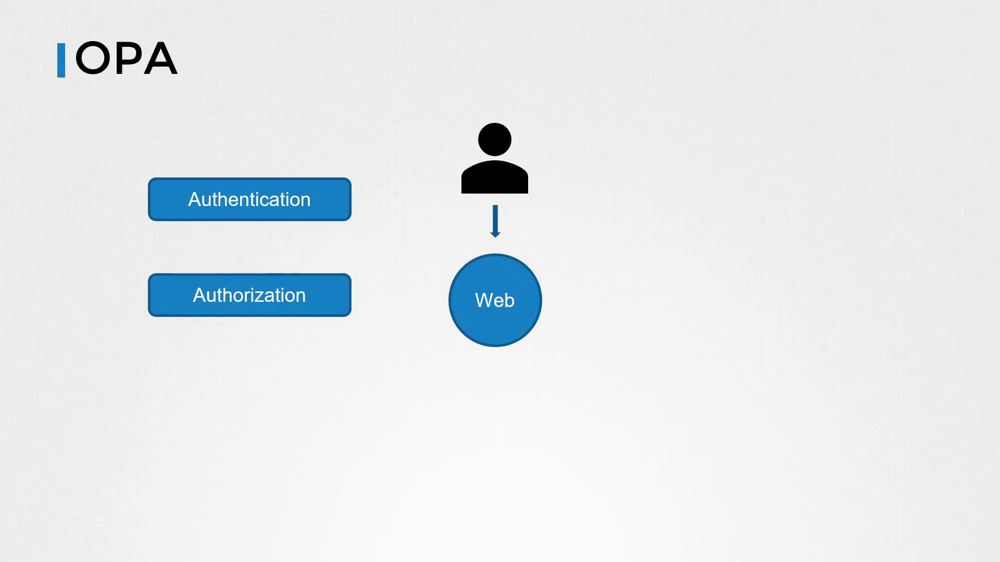

# Open Policy Agent OPA

Source: https://notes.kodekloud.com/docs/Certified-Kubernetes-Security-Specialist-CKS/Minimize-Microservice-Vulnerabilities/Open-Policy-Agent-OPA/page

This lesson introduces Open Policy Agent (OPA) for managing authorization in a web service scenario using a simple Flask application.

In this lesson, we dive into Open Policy Agent (OPA) by examining a straightforward web service scenario and demonstrating how OPA can manage authorization. We focus on plain OPA without using Docker or Kubernetes, making it easy to understand the core concepts.

Imagine a web service where users place orders for products. The service must be secure: communications between the user and the web portal are both authenticated and authorized. Authentication confirms the user’s identity (e.g., via usernames/passwords or certificates), while authorization controls what an authenticated user is permitted to do—such as viewing past orders or placing new ones.

<Frame>
  
</Frame>

Below, we first demonstrate a basic Python-based Flask application without any authorization. Next, we incorporate basic authorization within Flask. Finally, we integrate OPA to provide a robust and flexible authorization solution.

***

## A Simple Flask Application Without Authorization

Consider this basic Flask application which serves the "/home" endpoint and returns a welcome message:

```python theme={null}
@app.route('/home')
def hello_world():
    return 'Welcome Home!', 200
```

In this initial version, there is no authorization in place, meaning the endpoint is accessible to anyone.

***

## Adding Basic Authorization in Flask

To add a simple layer of authorization, we check if the user is "john". In this example, the username is provided as a URL parameter:

```python theme={null}
@app.route('/home')
def hello_world():
    user = request.args.get("user")
    if user != "john":
        return 'Unauthorized!', 401
    return 'Welcome Home!', 200
```

While this manual check works for a single case, it quickly becomes unmanageable as the number of users, groups, and roles grows—especially in environments where multiple programming languages are used.

***

## Introducing OPA for Scalable Authorization

To overcome the complexities of distributed authorization, OPA can be deployed as a centralized policy decision point. With OPA, you define policies in a single location that all services can query via an API to determine access permissions.

### Deploying the OPA Server

Begin by downloading the OPA binary, making it executable, and starting the OPA server using the `-s` flag. By default, OPA listens on port 8181 and has an open API without built-in authentication or authorization:

```bash theme={null}
curl -L -o opa https://github.com/open-policy-agent/opa/releases/download/v0.11.0/opa_linux_amd64
chmod 755 ./opa
./opa run -s
{"addrs":["8181"],"insecure_addr":"","level":"info","msg":"First line of log stream.","time":"2021-03-18T20:25:38+08:00"}
```

<Callout icon="lightbulb">
  By default, OPA’s API is open, so it is advisable to implement proper network security measures in production environments.
</Callout>

***

### Defining an Authorization Policy with Rego

OPA policies are authored in Rego and stored in files with the `.rego` extension. Below is an example policy that permits access to the `/home` endpoint only if the user is "john":

```rego theme={null}
package httpapi.authz
