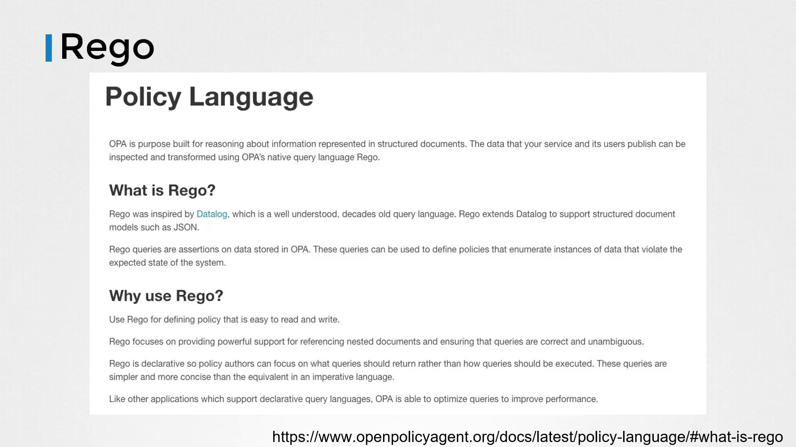
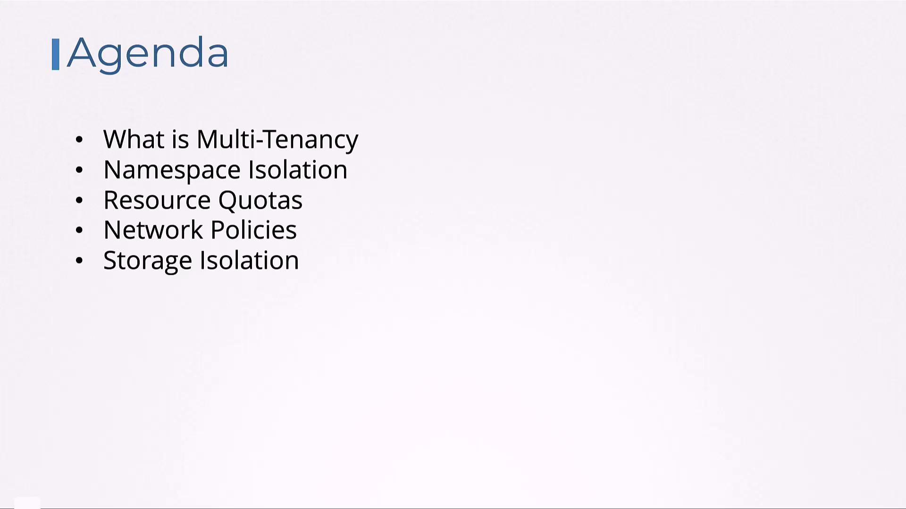
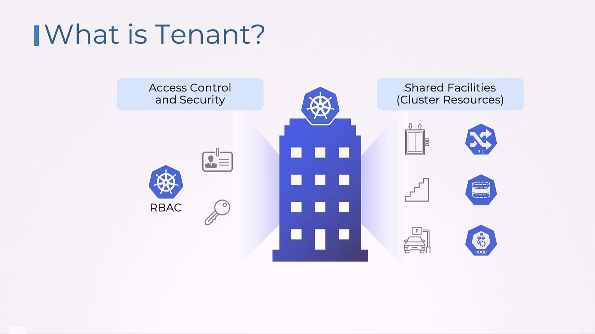
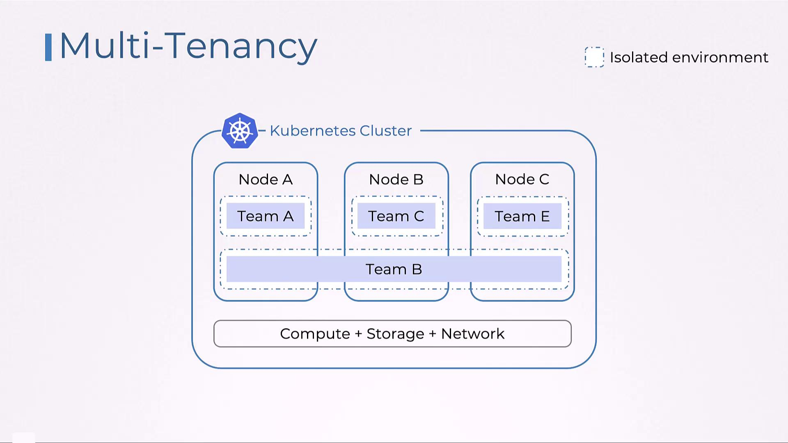
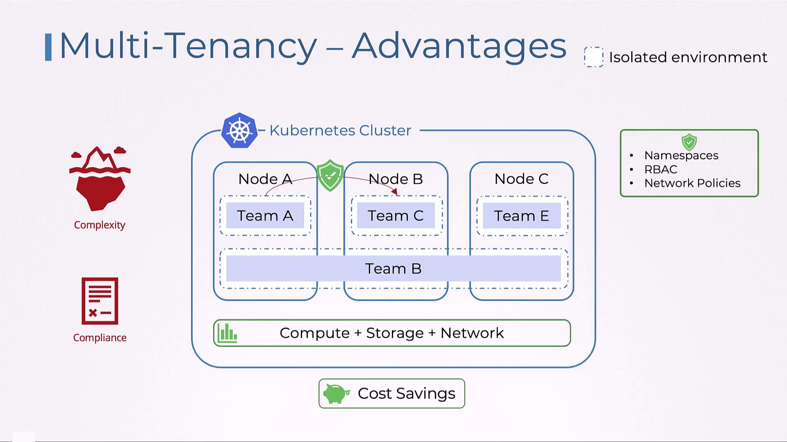

# HTTP API request
import input

default allow = false

allow {
    input.path == "home"
    input.user == "john"
}
```

To load this policy into OPA, use a PUT request:

```bash theme={null}
curl -X PUT --data-binary @example.rego http://localhost:8181/v1/policies/example1
```

To list all existing policies, run:

```bash theme={null}
curl http://localhost:8181/v1/policies
```

***

### Integrating OPA with the Python Application

Instead of embedding the authorization check within your application code, you can now delegate it to the OPA server. The updated Flask application builds an input dictionary and sends it as JSON to the OPA API. The appropriate query endpoint for our policy package, `httpapi.authz`, is `/v1/data/httpapi/authz`.

```python theme={null}
@app.route('/home')
def hello_world():
    user = request.args.get("user")
    input_dict = {
        "input": {
            "user": user,
            "path": "home"
        }
    }
    rsp = requests.post("http://127.0.0.1:8181/v1/data/httpapi/authz", json=input_dict)
    if not rsp.json()["result"]["allow"]:
        return 'Unauthorized!', 401
    return 'Welcome Home!', 200
```

With this implementation, the Flask application offloads the authorization decision to OPA, which evaluates the input against its policies and responds with a decision.

***

### Experimenting with Rego in the Playground

OPA offers an interactive Rego playground at [play.openpolicyagent.org](https://play.openpolicyagent.org), where you can experiment with writing and testing policies. The playground allows you to work with structured input data and refine your policies on the fly.

For instance, given the input:

```json theme={null}
{
    "user": "john",
    "path": "home"
}
```

The policy will return:

```json theme={null}
{
    "allow": true
}
```

Check out the playground to experiment with more complex policies and inputs.

***

### Testing Your OPA Policies

OPA includes a built-in testing framework that allows you to run tests using Rego test files. Below is an example test file for an authorization policy:

```rego theme={null}
package authz

test_post_allowed {
    allow with input as {"path": ["users"], "method": "POST"}
}

test_get_anonymous_denied {
    not allow with input as {"path": ["users"], "method": "GET"}
}

test_get_user_allowed {
    allow with input as {"path": ["users", "bob"], "method": "GET", "user_id": "bob"}
}

test_get_another_user_denied {
    not allow with input as {"path": ["users", "bob"], "method": "GET", "user_id": "alice"}
}
```

Execute the tests with the following command:

```bash theme={null}
$ opa test -v
data.authz.test_post_allowed: PASS (1.417µs)
data.authz.test_get_anonymous_denied: PASS (426ns)
data.authz.test_get_user_allowed: PASS (367ns)
data.authz.test_get_another_user_denied: PASS (320ns)
-----------------------------------------------------------
PASS: 4/4
```

<Callout icon="lightbulb">
  Using OPA's testing framework ensures that your policies perform as expected before deploying them into production.
</Callout>

***

<Frame>
  
</Frame>

***

## Conclusion

This lesson provided an introduction to OPA by starting with a simple Flask application, adding basic in-code authorization, and finally migrating to a centralized authorization model using OPA. We explored how to author policies in Rego, load them into OPA, integrate policy queries into your application, and test your policies using OPA’s testing framework.

In future lessons, we will explore how OPA integrates with Kubernetes and delve into more advanced use cases. Practice with OPA to gain a deeper understanding of centralized authorization—happy coding!

For additional resources and further reading, explore:

* [Open Policy Agent Documentation](https://www.openpolicyagent.org/docs/)
* [Rego Language Guide](https://www.openpolicyagent.org/docs/latest/policy-language/)
* [Flask Documentation](https://flask.palletsprojects.com/)
* [Python Requests Library](https://docs.python-requests.org/)

<CardGroup>
  <Card title="Watch Video" icon="video" href="https://learn.kodekloud.com/user/courses/certified-kubernetes-security-specialist-cks/module/7431dd03-f5c2-4ebb-b94a-2d35615bbd8c/lesson/ec830ff8-68a1-48de-b113-7f588bacdf7c" />

  <Card title="Practice Lab" icon="installation" href="https://learn.kodekloud.com/user/courses/certified-kubernetes-security-specialist-cks/module/7431dd03-f5c2-4ebb-b94a-2d35615bbd8c/lesson/eecb8373-8a36-4008-871e-afd5dbf59b23" />
</CardGroup>


# Overview of Multi Tenancy in Kubernetes

Source: https://notes.kodekloud.com/docs/Certified-Kubernetes-Security-Specialist-CKS/Minimize-Microservice-Vulnerabilities/Overview-of-Multi-Tenancy-in-Kubernetes/page

This article explores multi-tenancy in Kubernetes, focusing on user isolation, security, and resource management within a shared cluster environment.

In this article, we explore multi-tenancy in Kubernetes and demonstrate how the platform enables multiple users, tenants, or customers to share a single cluster while ensuring strong isolation, security, and efficient resource management. You will learn about various approaches such as namespace isolation, resource quotas, network policies, and storage isolation, which help maintain fairness and security among tenants sharing the same infrastructure. This concept is especially relevant in SaaS environments where multiple customers use a single cluster.

<Frame>
  
</Frame>

<Callout icon="lightbulb">
  Think of a large office building representing your Kubernetes cluster. Each floor, analogous to a namespace, provides a distinct environment for different teams, companies, or customers. Shared common areas such as elevators and parking lots are like cluster-wide resources (networking, storage, and nodes) that require careful management to ensure balanced use.
</Callout>

One common anti-pattern in Kubernetes is provisioning a separate cluster for each tenant or application. Although this might seem like an effective way to isolate teams or applications, it quickly becomes unsustainable as the number of tenants increases. Managing multiple clusters—each with its individual resources, security policies, and configurations—introduces significant complexity and operational overhead.

To illustrate, imagine that each floor of a multi-story building (Kubernetes namespace) is used by a different tenant. Even though the building (cluster) is shared, strict controls such as access badges (Kubernetes RBAC) and designated facilities (network policies, storage limitations) ensure that no single tenant monopolizes resources or compromises security.

<Frame>
  
</Frame>

Kubernetes multi-tenancy is all about providing isolated environments within a common infrastructure. This is particularly important for cloud-native applications, where compute, storage, and networking resources need to be shared efficiently and securely among various users and teams.

<Frame>
  
</Frame>

<Callout icon="triangle-alert">
  Without robust isolation mechanisms, unauthorized data access or resource contention might occur. Overconsumption of resources by one tenant can impact the performance and stability of the overall system. Always enforce strict isolation and monitoring to avoid these pitfalls.
</Callout>

Implementing multi-tenancy comes with its challenges. It is essential to set up strong isolation mechanisms to prevent data leakage between tenants and ensure that one tenant’s workload does not adversely affect others. As the number of tenants increases, managing security policies, access controls, and resource allocations becomes more complex, all while adhering to regulatory requirements and safeguarding data privacy and sovereignty.

The advantages of a multi-tenant architecture in Kubernetes are substantial. By sharing a single cluster, organizations can maximize resource utilization and reduce both hardware and operational costs. Here’s a quick look at the benefits:

| Benefit                 | Description                                                                                              |
| ----------------------- | -------------------------------------------------------------------------------------------------------- |
| Cost Efficiency         | Reduced hardware and operational expenses by eliminating the need for separate clusters.                 |
| Enhanced Resource Usage | Better utilization of compute, storage, and network resources across multiple tenants.                   |
| Simplified Management   | Centralized control simplifies operational management, monitoring, and troubleshooting.                  |
| Robust Security         | Isolation mechanisms like namespaces, RBAC, and network policies prevent interference and data breaches. |

<Frame>
  
</Frame>

In summary, multi-tenancy in Kubernetes allows multiple teams or users to safely share the same underlying infrastructure while maintaining strong isolation and efficient resource management. In the upcoming lessons, we will dive deeper into the specifics of namespaces, RBAC, network policies, and other techniques that form the backbone of multi-tenant environments in Kubernetes.

For additional insights on Kubernetes usage and best practices, consider exploring the following resources:

* [Kubernetes Documentation](https://kubernetes.io/docs/)
* [Kubernetes Basics](https://kubernetes.io/docs/concepts/overview/what-is-kubernetes/)
* [Docker Hub](https://hub.docker.com/)
* [Terraform Registry](https://registry.terraform.io/)

<CardGroup>
  <Card title="Watch Video" icon="video" href="https://learn.kodekloud.com/user/courses/certified-kubernetes-security-specialist-cks/module/7431dd03-f5c2-4ebb-b94a-2d35615bbd8c/lesson/d0e9f6b4-246e-4d88-bd04-afdc00afad40" />
</CardGroup>
