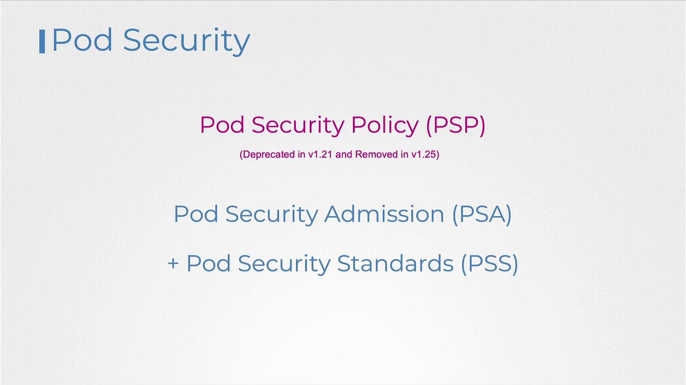
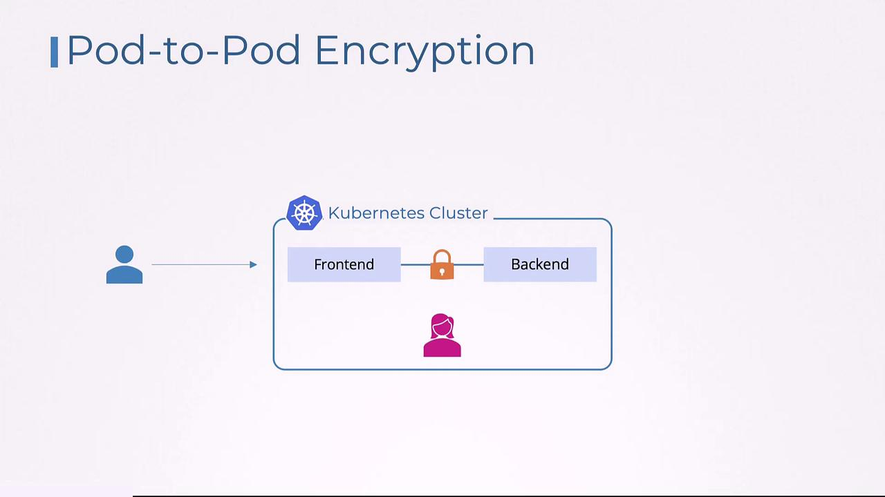
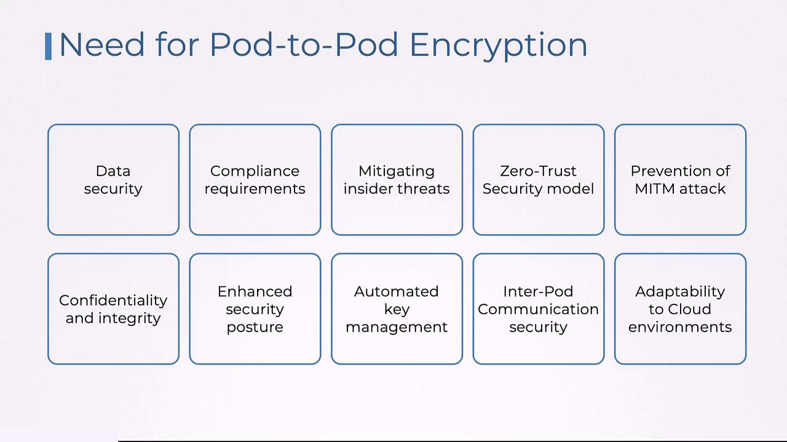
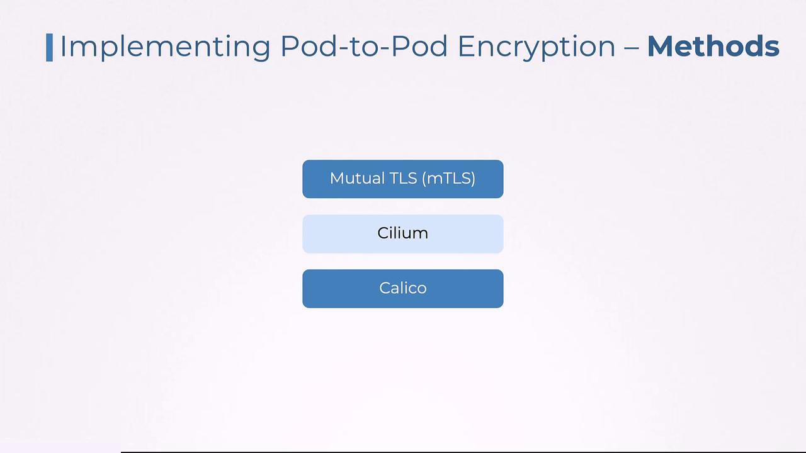

# pod.yaml
apiVersion: v1
kind: Pod
metadata:
  name: sample-pod
spec:
  containers:
    - name: ubuntu
      image: ubuntu
      command: ["sleep", "3600"]
      securityContext:
        privileged: True
        runAsUser: 0
        capabilities:
          add: ["CAP_SYS_BOOT"]
  volumes:
    - name: data-volume
      hostPath:
        path: /data
        type: Directory
---
# psp.yaml
apiVersion: policy/v1beta1
kind: PodSecurityPolicy
metadata:
  name: example-psp
spec:
  privileged: false
  seLinux:
    rule: RunAsAny
  supplementalGroups:
    rule: RunAsAny
  runAsUser:
    rule: MustRunAsNonRoot
  requiredDropCapabilities:
    - CAP_SYS_BOOT
  defaultAddCapabilities:
    - CAP_SYS_TIME
  volumes:
    - persistentVolumeClaim
```

<Callout icon="lightbulb">
  It is important to understand that while PSPs can add default values to pod definitions, the new Pod Security Admission and Pod Security Standards do not support this mutating behavior.
</Callout>

***

## How the Admission Controller Works

When a pod creation request is submitted, the PSP admission controller:

* Queries all available Pod Security Policy objects.
* Validates the pod against the defined rules.
* Denies requests that conflict with the established policies (e.g., a pod using a disallowed `privileged` flag).

If the PSP admission controller is enabled without the proper PSP objects and roles, all pod creation requests may be blocked. This scenario emphasizes the need for correctly defined policies and associated Role and RoleBinding configurations.

For pods to access a PSP, they must be associated with a Service Account. By default, the `default` Service Account is used if none is specified. Then, you need to create a Role and RoleBinding to grant the Service Account permission to use the specific PSP. For example:

```yaml theme={null}
apiVersion: rbac.authorization.k8s.io/v1
kind: Role
metadata:
  name: psp-example-role
rules:
  - apiGroups: ["policy"]
    resources: ["podsecuritypolicies"]
    resourceNames: ["example-psp"]
    verbs: ["use"]
```

```yaml theme={null}
apiVersion: rbac.authorization.k8s.io/v1
kind: RoleBinding
metadata:
  name: psp-example-rolebinding
subjects:
  - kind: ServiceAccount
    name: default
    namespace: default
roleRef:
  kind: Role
  name: psp-example-role
  apiGroup: rbac.authorization.k8s.io
```

With these permissions in place, any pod creation request that fails to meet the PSP criteria is denied by the admission controller.

***

## Summary and Challenges

To summarize:

* Pod Security Policies validate and potentially modify pod definitions based on strict security rules.
* Enabling PSPs requires changes both at the API server level (by enabling the admission controller) and at the cluster level (by creating the necessary PSP objects and RBAC permissions).
* An incomplete setup can result in the unintentional denial of all pod creation requests.
* Binding PSP access to specific Service Accounts might interfere with the functionality of controllers (like Deployments) if not correctly configured.

<Callout icon="triangle-alert">
  Due to the complexities and effort required to manage PSP configurations, they were deprecated in Kubernetes 1.21 and removed entirely in 1.25. The newer Pod Security Admission and Pod Security Standards provide a more streamlined approach to securing your cluster.
</Callout>

<Frame>
  
</Frame>

We will further explore the Pod Security Admission mechanism and explain how it simplifies securing your Kubernetes environment.

<CardGroup>
  <Card title="Watch Video" icon="video" href="https://learn.kodekloud.com/user/courses/certified-kubernetes-security-specialist-cks/module/7431dd03-f5c2-4ebb-b94a-2d35615bbd8c/lesson/a2615821-9959-462d-8869-080fb902705b" />
</CardGroup>


# Pod to Pod Encryption

Source: https://notes.kodekloud.com/docs/Certified-Kubernetes-Security-Specialist-CKS/Minimize-Microservice-Vulnerabilities/Pod-to-Pod-Encryption/page

Pod-to-pod encryption in Kubernetes secures communication between pods, ensuring data confidentiality and integrity, especially in multi-tenant environments.

Pod-to-pod encryption is a critical security measure in Kubernetes clusters. It ensures that communication between pods—whether within the same namespace or across different namespaces—is encrypted, maintaining the confidentiality and integrity of transmitted data. This security mechanism is especially vital in multi-tenant environments where sensitive data flows between services.

Imagine an e-commerce application deployed on Kubernetes with two main components: a front-end pod that manages customer orders and a back-end pod that processes payment information. When a customer places an order, the front-end pod sends sensitive payment details, including credit card information, to the back-end pod. Without encryption, an attacker could intercept this communication during a man-in-the-middle attack, leading to a potential data breach.

<Callout icon="lightbulb">
  Enabling pod-to-pod encryption ensures that even if data is intercepted, it remains unreadable and tamper-proof because it is securely encrypted.
</Callout>

<Frame>
  
</Frame>

Encrypting data in transit not only protects against eavesdropping and interception but also helps organizations meet compliance standards such as GDPR and HIPAA. This encryption mitigates insider threats by securing internal communications and supports the zero-trust security model—where every connection is considered untrusted until verified. In this way, pod-to-pod encryption reinforces the overall security posture of your Kubernetes cluster without introducing significant operational complexity.

Automated key management provided by Kubernetes-native tools further simplifies the encryption process. This ease of management is crucial in multi-tenant environments where numerous tenants may share the same network infrastructure. In cloud-native scenarios, where traditional network boundaries are blurred, pod-to-pod encryption becomes indispensable for securing communications.

<Frame>
  
</Frame>

There are several methods to implement pod-to-pod encryption:

* **Mutual TLS (mTLS):** Commonly implemented via service meshes like Istio or Linkerd.
* **Cilium Encryption:** Utilizes IPsec or WireGuard protocols.
* **Calico Encryption:** Leverages IPsec for secure communication.

Each method offers its own advantages depending on the specific requirements of your environment. Detailed discussions, especially regarding Cilium encryption, highlight the flexibility and robustness of these solutions.

<Frame>
  
</Frame>

<Callout icon="lightbulb">
  Implementing pod-to-pod encryption is a key best practice for securing Kubernetes deployments. It not only safeguards sensitive data against external attacks but also reinforces trust in internal communications.
</Callout>

<CardGroup>
  <Card title="Watch Video" icon="video" href="https://learn.kodekloud.com/user/courses/certified-kubernetes-security-specialist-cks/module/7431dd03-f5c2-4ebb-b94a-2d35615bbd8c/lesson/e01226b6-c183-4049-85a5-866f0015f4fa" />
</CardGroup>
