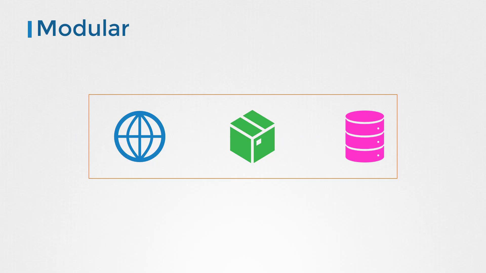
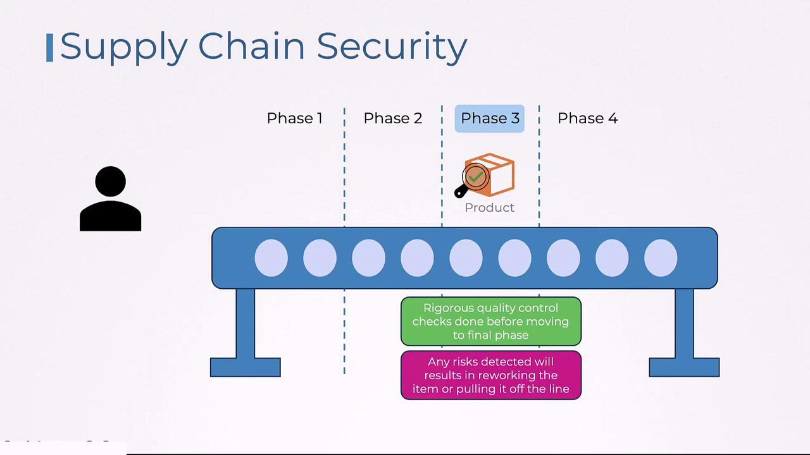
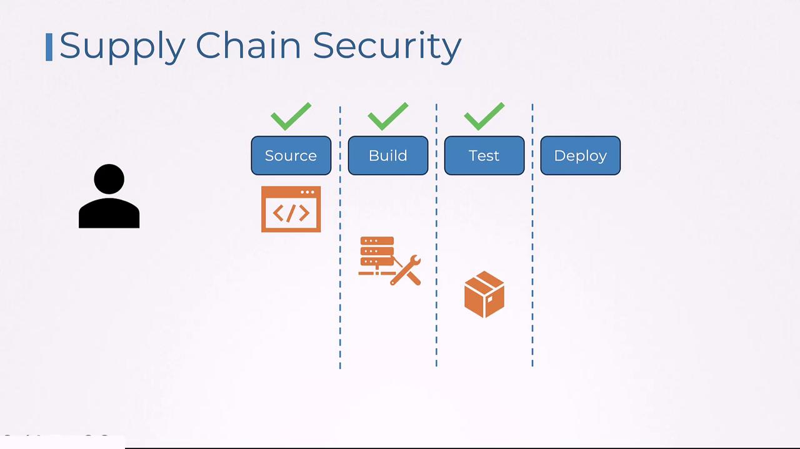
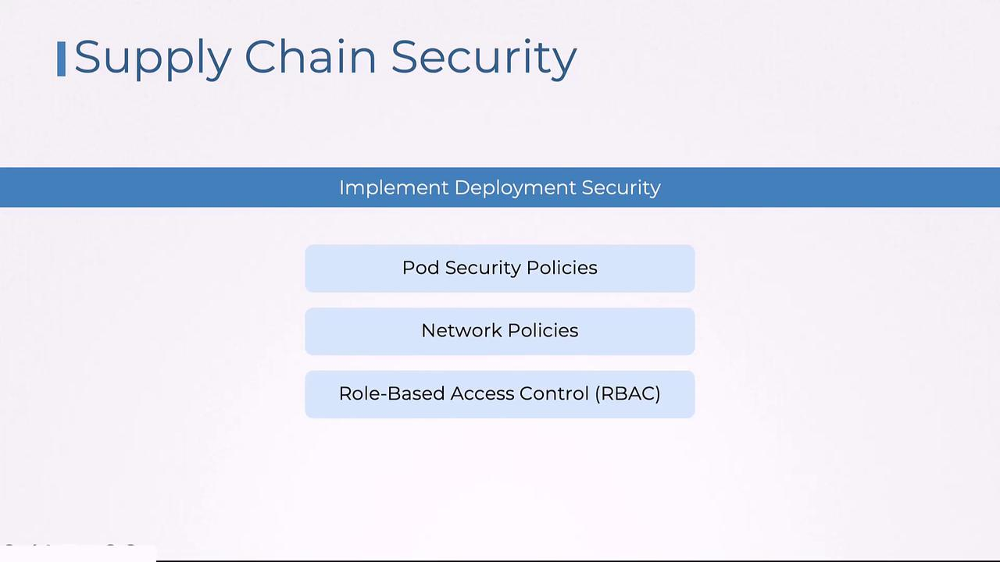

# Dockerfile – My Custom Webapp
FROM httpd
COPY index.html htdocs/index.html
```

The initial line of this Dockerfile specifies the parent image from which the custom image is constructed—in this example, the HTTPD image. But have you ever wondered how the HTTPD image itself is constructed? Let’s examine its Dockerfile:

```dockerfile theme={null}
# Dockerfile - httpd
FROM debian:buster-slim
ENV HTTPD_PREFIX /usr/local/apache2
ENV PATH $HTTPD_PREFIX/bin:$PATH
WORKDIR $HTTPD_PREFIX
# <content trimmed>
```

Here, the HTTPD image is built upon the Debian base image. The Debian image is defined as follows:

```dockerfile theme={null}
# Dockerfile - debian:buster-slim
FROM scratch
ADD rootfs.tar.xz /
CMD ["bash"]
```

When an image is constructed from scratch (i.e., without a parent image), it is referred to as a base image. Although terms like "parent image" and "base image" are sometimes used interchangeably, for the purpose of this lesson, any image that serves as the foundation for another image is considered a base image.

## Best Practices for Building Images

When creating Docker images, follow these best practices to ensure efficiency, security, and ease of management:

1. **Separate Applications:**\
   Do not combine multiple applications (e.g., a web server, a database) within a single image. Instead, build separate, modular images for each component. This approach allows each component to manage its own libraries and dependencies and enables independent scaling.

<Frame>
  
</Frame>

<Callout icon="lightbulb">
  For modularity, ensure that each container performs a single task. This not only simplifies management but also enhances security through isolation.
</Callout>

2. **Avoid Data Persistence Inside Containers:**\
   Containers are ephemeral by design. Avoid storing data or state within a container; always make use of external volumes or caching services (e.g., Redis) to persist data securely.

3. **Select Base Images Wisely:**\
   Choose your base image based on your application's specific needs. If your web application requires an HTTPD server, opt for a trusted HTTPD image from Docker Hub. Look for images that come with authenticity markers, such as the official or verified publisher tags, and ensure they are regularly updated.

   Below is a sample snippet for selecting a base image:

   ```dockerfile theme={null}
   FROM <base-image>
   COPY index.html htdocs/index.html
   ```

4. **Minimize Image Size:**\
   Smaller images download faster and launch more quickly. Use minimal versions of operating systems, install only the necessary libraries, and remove temporary files along with unnecessary tools like curl or wget that could be exploited by attackers. Additionally, if package managers (e.g., yum or apt) are not needed in production, consider removing them.

5. **Differentiate Development and Production Images:**\
   Development images may include debugging tools and extra packages that should not be present in production. Maintain separate images for development and production to optimize performance and security.

## Minimizing Vulnerabilities

Reducing the number of packages and keeping your image footprint small can significantly decrease security vulnerabilities. For example, consider using Google's distroless images, which include only the application and runtime dependencies without additional software like package managers, shells, or network tools.

To illustrate the impact on security, compare the vulnerability scan results of a standard HTTP image with an HTTP Alpine image using the Trivy tool:

```bash theme={null}
trivy image httpd
httpd (debian 10.8)
====================
Total: 124 (UNKNOWN: 0, LOW: 88, MEDIUM: 9, HIGH: 25, CRITICAL: 2)

trivy image httpd:alpine
httpd:alpine (alpine 3.12.4)
==============================
Total: 0 (UNKNOWN: 0, LOW: 0, MEDIUM: 0, HIGH: 0, CRITICAL: 0)
```

This comparison clearly demonstrates that smaller images with fewer packages have a reduced attack surface, leading to fewer vulnerabilities.

<Callout icon="triangle-alert">
  Always verify the security updates and patches of any base image you choose to prevent introducing vulnerabilities into your Docker images.
</Callout>

## Conclusion

By following these best practices—selecting suitable base images, reducing installed packages, and maintaining a modular approach—you can build Docker images that are both efficient and secure. Implement what you've learned in this lesson and experiment with hands-on exercises to refine these techniques.

For further reading, consider exploring [Docker’s Official Documentation](https://docs.docker.com/) and [Best Practices for Docker Images](https://docs.docker.com/develop/develop-images/dockerfile_best-practices/).

<CardGroup>
  <Card title="Watch Video" icon="video" href="https://learn.kodekloud.com/user/courses/certified-kubernetes-security-specialist-cks/module/e4511664-185f-4204-9aa2-b4250cbadf84/lesson/5ef152ec-a459-4560-a6ff-20f56f4e9fc8" />
</CardGroup>


# Overview of Supply Chain Security

Source: https://notes.kodekloud.com/docs/Certified-Kubernetes-Security-Specialist-CKS/Supply-Chain-Security/Overview-of-Supply-Chain-Security/page

This article delves into the importance of supply chain security and its role in ensuring the integrity of both physical and digital products.

This article delves into the importance of supply chain security and its role in ensuring the integrity of both physical and digital products.

Imagine a factory assembly line where each product goes through multiple stages before reaching the customer. In a secure supply chain, every stage—from receiving raw materials to the final shipment—is rigorously monitored for quality and safety.

## Stages of a Secure Supply Chain

1. **Receiving and Inspection**\
   The process begins with the receipt of raw materials and components from various suppliers. Each component undergoes thorough quality inspections to confirm its compliance with defined standards. Once verified, the components advance to the next stage.

2. **Assembly and Intermediate Quality Checks**\
   During the assembly phase, components are combined to form the final product. Additional quality and security checks are conducted to ensure that every stage of the build adheres to strict standards.

3. **Rigorous Quality Assurance Testing**\
   In the third phase, comprehensive quality assurance (QA) testing identifies any defects. Detected issues are either corrected immediately or the affected products are reworked.

<Frame>
  
</Frame>

4. **Packaging and Secure Release**\
   Once the product passes all previous stages, it moves to the final phase: packaging and release. Packaged products are shipped securely, ensuring they reach customers without being tampered with. This process serves as a strong analogy for a secure supply chain in software development.

<Callout icon="lightbulb">
  Just as raw materials are inspected in a factory, developers work in secure environments where source code is written and tested. Securing the supply chain in software involves multiple stages, from development to deployment.
</Callout>

## Securing the Software Development Life Cycle

In a secure software development process, the source code is initially crafted and tested by developers in a trusted environment. Following this, the code enters the build phase—where it is compiled and prepared for deployment. It is crucial to ensure the integrity of the build process by isolating environments, keeping dependencies up-to-date, and scanning for vulnerabilities using tools like [OWASP Dependency-Check](https://owasp.org/www-project-dependency-check/) and [Snyk](https://snyk.io/).

Before deployment, container images are scanned thoroughly to detect any vulnerabilities. Tools such as [Clair](https://github.com/quay/clair) and [Trivy](https://github.com/aquasecurity/trivy) are commonly used for this process. This stage is analogous to the careful logistics required to deliver a finished product safely to the end user.

<Frame>
  
</Frame>

## Enhancing Deployment Security

Deployment is the final and critical stage in ensuring software integrity. It involves implementing robust security measures to safeguard production environments from unauthorized access or modifications. Techniques such as [Pod Security Policies](https://kubernetes.io/docs/concepts/policy/pod-security-policy/), network policies, and role-based access controls (RBAC) help secure Kubernetes resources during deployment.

<Frame>
  
</Frame>

## The Benefits of Robust Supply Chain Security

Implementing a secure supply chain process offers numerous advantages:

* **Early Vulnerability Detection:** Issues are identified during early stages, allowing for swift remediation.
* **Optimized Resource Management:** Continuous inspections prevent security incidents from disrupting production.
* **Improved Compliance:** Adhering to stringent security standards helps organizations meet industry regulations.
* **Efficient Incident Response:** Streamlined processes minimize damage in the event of a breach.
* **Enhanced Overall Security Posture:** A secure supply chain reinforces the integrity of every stage—from development to deployment.

<Frame>
  
</Frame>

<Callout icon="triangle-alert">
  Neglecting any stage of the supply chain security process can expose your systems to risks and potential breaches. Always ensure that security measures are enforced at every phase to protect both your digital and physical products.
</Callout>

By comprehensively securing your supply chain, you reinforce the safety of the products and services delivered to your customers, ensuring trust and reliability throughout your operational processes.

<CardGroup>
  <Card title="Watch Video" icon="video" href="https://learn.kodekloud.com/user/courses/certified-kubernetes-security-specialist-cks/module/e4511664-185f-4204-9aa2-b4250cbadf84/lesson/7daa7498-717c-4f3c-a1d1-1ca07ddb70b1" />
</CardGroup>
