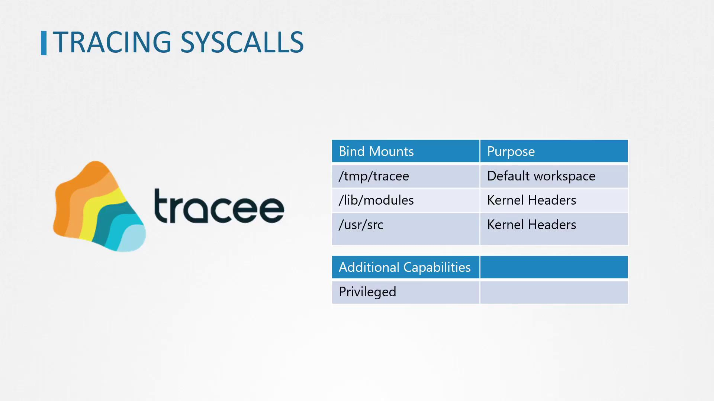

# mkdir test
```

You will encounter an error similar to:

```bash theme={null}
mkdir: can't create directory 'test': Operation not permitted
```

<Callout icon="lightbulb">
  While Seccomp restricts which system calls a container can execute, it does not control access to the filesystem. For enhanced resource-level security, AppArmor is used.
</Callout>

## Introducing AppArmor

AppArmor confines applications to a limited set of resources, including specific file and directory permissions, network settings, and Linux capabilities. It is installed and enabled by default on most Linux distributions.

### Verifying AppArmor

To ensure that AppArmor is active, run the following command:

```bash theme={null}
systemctl status apparmor
```

Additionally, make sure that the AppArmor kernel module is loaded on every node hosting your container. You can verify this by checking the enabled parameter:

```bash theme={null}
cat /sys/module/apparmor/parameters/enabled
```

The expected output should be:

```text theme={null}
Y
```

To view all loaded AppArmor profiles, inspect the profiles file:

```bash theme={null}
cat /sys/kernel/security/apparmor/profiles
```

This command might produce output similar to:

```text theme={null}
docker-default (enforce)
/usr/sbin/tcpdump (enforce)
/usr/sbin/ntpd (enforce)
/usr/lib/snapd/snap-confine (enforce)
/usr/lib/snapd/snap-confine/mount-namespace-capture-helper (enforce)
/usr/lib/connman/scripts/dhclient-script (enforce)
/usr/lib/NetworkManager/nm-dhcp-helper (enforce)
/usr/lib/NetworkManager/nm-dhcp-client.action (enforce)
/sbin/dhclient (enforce)
/usr/bin/man (enforce)
/usr/bin/man_filter (enforce)
```

## Creating and Using AppArmor Profiles

An AppArmor profile is a plain text file that defines the resources accessible to an application, such as Linux capabilities, network access, and file permissions. For instance, the profile below restricts write access across the entire filesystem:

```plain theme={null}
profile apparmor-deny-write flags=(attach_disconnected) {
    file,
    # Deny all file writes.
    deny /** w,
}
```

This profile initially permits filesystem access with the "file" shorthand, then explicitly denies write operations on any file under the root directory and its subdirectories.

Similarly, to prevent remounting the root filesystem as read-only, you can create the following profile:

```plain theme={null}
profile apparmor-deny-remount-root flags=(attach_disconnected) {
  # Deny remounting the root filesystem as read-only.
  deny mount options=(ro, remount) -> /,
}
```

<Callout icon="triangle-alert">
  Ensure that your AppArmor profiles are correctly configured. Incorrect settings may lead to unexpected behavior or reduced security. Always test profiles in a controlled environment before deploying them in production.
</Callout>

### Checking AppArmor Profile Status

The `aa-status` tool provides a comprehensive view of AppArmor’s current state. Running this command displays details such as loaded profiles, their modes (enforce, complain, or unconfined), and the processes constrained by these profiles.

Example output of `aa-status`:

```bash theme={null}
aa-status
apparmor module is loaded.
12 profiles are loaded.
12 profiles are in enforce mode.
    /sbin/dhclient
    /usr/bin/man
    /usr/lib/NetworkManager/nm-dhcp-client.action
    /usr/lib/NetworkManager/nm-dhcp-helper
    ...
    /usr/sbin/tcpdump
    docker-default
    man_filter
    man_groff
0 profiles are in complain mode.
11 processes have profiles defined.
11 processes are in enforce mode:
    /sbin/dhclient (621)
    docker-default (3970)
    docker-default (4025)
    docker-default (9853)
    docker-default (9964)
0 processes are in complain mode.
0 processes are 'unconfined' but have a profile defined.
```

## AppArmor Profile Modes

AppArmor profiles operate in three distinct modes:

* **Enforce mode:** The profile rules are strictly enforced on the application.
* **Complain mode:** The application is allowed to perform actions outside the defined profile rules while logging such actions as warnings.
* **Unconfined mode:** No restrictions are applied, and actions are not logged.

Moving forward, we will discuss how to create and manage AppArmor profiles using dedicated AppArmor utilities.

For more details on securing containerized environments, you may refer to the following resources:

* [Linux Security Modules (LSM) Overview](https://en.wikipedia.org/wiki/Linux_Security_Modules)
* [Kubernetes Security Best Practices](https://kubernetes.io/docs/concepts/security/overview/)

Thank you.

<CardGroup>
  <Card title="Watch Video" icon="video" href="https://learn.kodekloud.com/user/courses/certified-kubernetes-security-specialist-cks/module/d67be5ee-871d-4435-a187-382610cb6a1f/lesson/06f55a49-58d3-4d83-815f-0350ebc9c803" />
</CardGroup>


# AquaSec Tracee

Source: https://notes.kodekloud.com/docs/Certified-Kubernetes-Security-Specialist-CKS/System-Hardening/AquaSec-Tracee/page

This article explores Tracee, an open-source tool for tracing system calls in containers using eBPF technology.

In this article, we explore Tracee—an open-source tool from Aqua Security that leverages eBPF (Extended Berkeley Packet Filter) to trace system calls on containers at runtime. By running programs directly in kernel space without modifying the kernel or loading additional modules, eBPF empowers Tracee to monitor operating system behavior and detect suspicious activity with minimal overhead.

## Running Tracee as a Docker Container

Running Tracee as a Docker container simplifies dependency management and environment setup. When Tracee runs as a container, it compiles the eBPF program and, by default, stores the output in the `/tmp/tracee` directory. To persist the compiled program between runs, bind mount the `/tmp/tracee` directory from the host to the container.

Additionally, Tracee requires access to kernel headers to compile the eBPF program. On Ubuntu systems, these headers are typically located in `/lib/modules` (with dependencies in `/usr/src`). Ensure these directories are also bind mounted into the container in read-only mode. Since Tracee needs extended privileges for syscall tracing, run the container using Docker’s `--privileged` flag.

<Frame>
  
</Frame>

<Callout icon="lightbulb">
  Remember to bind mount the `/tmp/tracee`, `/lib/modules`, and `/usr/src` directories properly to ensure that the eBPF program compiles and persists across runs.
</Callout>

## Tracing Syscalls for a Single Command

To capture system calls generated by a single command (for example, `ls`), run the Tracee container with the `--trace` option specifying the command to trace. Execute the following command:

```bash theme={null}
docker run --name tracee --rm --privileged --pid=host \
  -v /lib/modules/:/lib/modules:ro \
  -v /usr/src:/usr/src:ro \
  -v /tmp/tracee:/tmp/tracee \
  aquasec/tracee:0.4.0 --trace comm=ls
```

This command outputs a list of syscalls invoked by the `ls` command. A sample output might include:

```text theme={null}
TIME(s)      UID    COMM    PID    TID    RET
1263.457188  0      ls      27461  27461  -2
1263.457218  0      ls      27461  27461  -2
1263.457238  0      ls      27461  27461  0
...
[output truncated]
```

## Tracing Syscalls for All New Processes

If you wish to monitor the system calls for all new processes on the host, configure Tracee with the `--trace` flag to track new process IDs. Use the command below:

```bash theme={null}
sudo docker run --name tracee --rm --privileged --pid=host \
  -v /lib/modules/:/lib/modules:ro \
  -v /usr/src:/usr/src:ro \
  -v /tmp/tracee:/tmp/tracee \
  aquasec/tracee:0.4.0 --trace pid=new
```

This setup produces extensive output as Tracee collects syscall data for every new process initiated on the host. An excerpt from the output may resemble:

```text theme={null}
1613.769845 0  wc      1619 1619  -2   openat
1613.846148 0  kubectl 1617 1621  -2   openat
...
```

<Callout icon="lightbulb">
  For environments where heavy logging might overwhelm the output, consider filtering or redirecting logs to manage the volume of data.
</Callout>

## Tracing Syscalls for New Containers

Tracee also supports capturing system calls from new containers. To enable this functionality, launch Tracee with the option `--trace container=new`. Follow these steps:

1. Open a terminal and run Tracee with container tracing enabled:

   ```bash theme={null}
   sudo docker run --name tracee --rm --privileged --pid=host \
     -v /lib/modules/:/lib/modules:ro \
     -v /usr/src:/usr/src:ro \
     -v /tmp/tracee:/tmp/tracee \
     aquasec/tracee:0.4.0 --trace container=new
   ```

2. In another terminal window, launch an Ubuntu container that prints a message and exits:

   ```bash theme={null}
   docker run ubuntu echo hi
   ```

Upon executing the Ubuntu container, you should see "hi" printed in the container's output and Tracee’s terminal will display all syscalls generated by this container.

## Conclusion

Tracee is a powerful eBPF-based tool that enables real-time monitoring of system calls in various environments—whether for a single command, all new processes, or new containers. By running Tracee as a Docker container, you streamline dependency management while ensuring effective tracking of system activities. In our next article, we will cover strategies to restrict system calls made by applications to further enhance security.

For more detailed documentation and related resources, refer to the [Aqua Security Tracee GitHub repository](https://github.com/aquasecurity/tracee) and explore additional guides on eBPF tracing and container security practices.

<CardGroup>
  <Card title="Watch Video" icon="video" href="https://learn.kodekloud.com/user/courses/certified-kubernetes-security-specialist-cks/module/d67be5ee-871d-4435-a187-382610cb6a1f/lesson/f1281fe2-f470-4565-a898-836d990047ec" />
</CardGroup>
