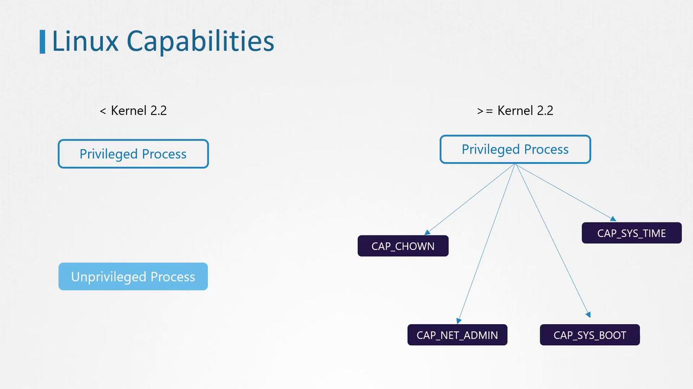
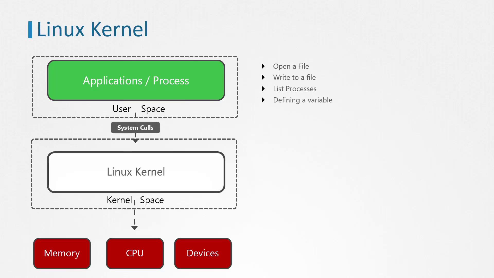

# date -s '19 APR 2012 22:00:00'
date: cannot set date: Operation not permitted
Thu Apr 19 22:00:00 UTC 2012

kubectl run --rm -it ubuntu-sleeper --image=ubuntu -- bash
```

Even though the container runs as the root user (UID 0), the attempt to change the date fails. This behavior helps us understand how Linux processes operate under different privilege levels.

## Understanding Linux Process Privileges

Before Linux kernel 2.2, processes were classified into:

* **Privileged processes:** Run by the root user (UID 0) and bypass many kernel permission checks.
* **Unprivileged processes:** Run by non-root users and are subject to various kernel restrictions.

Starting with Linux kernel 2.2, the traditional superuser privileges were broken down into individual units called capabilities. This allows administrators to grant only specific privileges to processes, even if they run as the root user.

Some examples of these capabilities include:

* **CAP\_CHOWN:** Allows changing file ownership.
* **CAP\_NET\_ADMIN:** Permits operations like modifying network interface configurations, managing routing tables, and binding processes to specific addresses.
* **CAP\_SYS\_BOOT:** Enables a process to reboot the system.
* **CAP\_SYS\_TIME:** Permits setting or adjusting the system clock.

For a comprehensive list of capabilities, consult the official Linux documentation.

## Checking Capabilities

You can determine the capabilities required by a command using the `getcap` command. For example, the `ping` command requires the `CAP_NET_RAW` capability:

```bash theme={null}
getcap /usr/bin/ping
```

The expected output is:

```bash theme={null}
/usr/bin/ping = cap_net_raw+ep
```

To inspect the capabilities of a running process, use the `getpcaps` command. For instance, to check the capabilities of the SSH daemon process:

1. Locate the PID of the SSH daemon:
   ```bash theme={null}
   ps -ef | grep /usr/sbin/sshd | grep -v grep
   ```
   Output:
   ```bash theme={null}
   root     779     1  0 03:55 ?        00:00:00 /usr/sbin/sshd -D
   ```
2. Use `getpcaps` with the PID:
   ```bash theme={null}
   getpcaps 779
   ```

## Visual Overview

The image below compares Linux capabilities before and after Kernel 2.2, highlighting examples like CAP\_CHOWN and CAP\_SYS\_TIME:

<Frame>
  
</Frame>

## Linux Capabilities in Kubernetes Containers

Returning to our Ubuntu sleeper pod example, attempting to change the date from within the container resulted in:

```bash theme={null}
kubectl run --rm -it ubuntu-sleeper --image=ubuntu -- bash
root@ubuntu-sleeper:# date -s '19 APR 2012 22:00:00'
date: cannot set date: Operation not permitted
Thu Apr 19 22:00:00 UTC 2012
root@ubuntu-sleeper:#
```

This failure occurs because containers, even when running as root, are started with a limited set of capabilities. Docker, the container runtime, initiates containers with only 14 capabilities by default. Without the specific capability `CAP_SYS_TIME` required to modify the system clock, the operation is prohibited.

## Default Capabilities in Linux

The following Go code snippet demonstrates how default capabilities are defined in a Linux environment:

```go theme={null}
// DefaultCapabilities returns a Linux kernel default capabilities
func DefaultCapabilities() []string {
    return []string{
        "CAP_CHOWN",
        "CAP_DAC_OVERRIDE",
        "CAP_FOWNER",
        "CAP_MKNOD",
        "CAP_NET_RAW",
        "CAP_SETGID",
        "CAP_SETUID",
        "CAP_SETFCAP",
        "CAP_SETPCAP",
        "CAP_NET_BIND_SERVICE",
        "CAP_SYS_CHROOT",
        "CAP_KILL",
        "CAP_AUDIT_WRITE",
    }
}
```

## Modifying Container Capabilities

To adjust the capabilities for a container:

* **Add a Capability:** Update the container manifest under the security context by including the required capability (e.g., `CAP_SYS_TIME`) in the capabilities array. With this configuration, the container will be permitted to adjust the system clock.

* **Remove a Capability:** Use the drop field with an array of capabilities to be removed. For example, if you remove `CAP_CHOWN`, the `chown` command will no longer function within the container.

<Callout icon="triangle-alert">
  Modifying container capabilities can expose the host system to security risks. Always ensure that only the necessary capabilities are granted and follow the principle of least privilege.
</Callout>

## Conclusion

Understanding how Linux capabilities function is crucial for effectively managing security in Kubernetes pods. Experiment with modifying capabilities to gain hands-on experience, and refer to the official documentation for more detailed information.

For more insights and detailed documentation on Kubernetes and container security, consider exploring these resources:

* [Kubernetes Documentation](https://kubernetes.io/docs/)
* [Linux Capabilities Documentation](https://man7.org/linux/man-pages/man7/capabilities.7.html)

<CardGroup>
  <Card title="Watch Video" icon="video" href="https://learn.kodekloud.com/user/courses/certified-kubernetes-security-specialist-cks/module/d67be5ee-871d-4435-a187-382610cb6a1f/lesson/aa37d503-85f0-47ba-9360-31514b3c5030" />

  <Card title="Practice Lab" icon="installation" href="https://learn.kodekloud.com/user/courses/certified-kubernetes-security-specialist-cks/module/d67be5ee-871d-4435-a187-382610cb6a1f/lesson/058cc5f9-4239-44ec-8021-e9201d4edc2b" />
</CardGroup>


# Linux Syscalls

Source: https://notes.kodekloud.com/docs/Certified-Kubernetes-Security-Specialist-CKS/System-Hardening/Linux-Syscalls/page

This article explores Linux syscalls, detailing their role in process execution and interactions between user applications and the kernel.

In this article, we'll explore Linux syscalls (system calls) and examine what happens under the hood when an application or process runs. We will review how a process executes on Linux by examining some fundamental concepts of the Linux operating system.

The Linux kernel is the central component that acts as an interface between the hardware and running processes. It efficiently manages system resources by operating in a dedicated memory area called kernel space, while user applications (written in languages such as C, Java, or Python) run in user space. The kernel space contains the kernel code, device drivers, and its extensions—all essential for proper communication between hardware and applications.

## How Programs Use System Calls

System calls enable applications running in user space to request services from the kernel. For instance, when an application needs to open a file stored on disk, it cannot access the hardware directly; instead, it must instruct the kernel to perform the necessary operations. Consider the task of creating an empty file named `error.log` in the `/tmp` directory. This process involves a series of system calls, beginning with the `execve` call to execute the binary (such as the `touch` command).

The Linux kernel architecture involves many layers: user space, kernel space, system calls, and the interactions with memory, CPU, and devices. The image below reinforces this conceptual framework:

<Frame>
  
</Frame>

Common system calls include `open`, `close`, `read`, and several others. The `execve` system call, for example, is used to execute a program by passing an array of arguments. In our example, it executes the `touch` command with `/tmp/error.log` as an argument. The output provided indicates that 23 environment variables were inherited during this call.

## Tracing Syscalls with strace

One effective method for tracing the system calls made by a process is by using the `strace` command.

> **Tip**
>
> To verify if `strace` is installed and locate its executable path, run:

```bash theme={null}
which strace
/usr/bin/strace
```

`strace` is available by default on most Linux distributions. It traces system calls invoked by an application as well as the signals delivered to it. For example, to observe the system calls made when creating a file in `/tmp`, prefix the operation with the `strace` command:

```bash theme={null}
strace touch /tmp/error.log
```

The output will begin with a line similar to the following:

```bash theme={null}
execve("/usr/bin/touch", ["touch", "/tmp/error.log"], 0x7ffce8f874f8 /* 23 vars */) = 0
...
[Output Truncated]
```

In this example:

* `execve` is the system call used to execute the program.
* The first argument is the absolute path to the executable (`/usr/bin/touch`).
* The second argument is an array containing `"touch"` and the file path `/tmp/error.log`.
* The comment `/* 23 vars */` indicates that the call inherited 23 environment variables.

To verify the number of inherited environment variables, execute:

```bash theme={null}
env | wc -l
```

The output should display `23`.

## Tracing a Running Process

To trace system calls of a process that is already running, first determine its PID. For example, to find the PID of the `etcd` process, run:

```bash theme={null}
pidof etcd
```

Assuming the PID is `3596`, attach `strace` to the process as follows:

```bash theme={null}
strace -p 3596
```

You might see output similar to this while `etcd` continues to run:

```bash theme={null}
strace: Process 3596 attached
futex(0x1ac6be8, FUTEX_WAIT_PRIVATE, 0, NULL) = 0
futex(0xc000540bc8, FUTEX_WAKE_PRIVATE, 1) = 1
```

Press Control+C to detach once you have gathered the necessary information.

## Displaying a Summary of Syscalls

To generate a summary report of system call usage, add the `-c` flag to `strace`:

```bash theme={null}
strace -c touch /tmp/error.log
```

This command produces an output summary like the one below:

```plaintext theme={null}
% time     seconds  usecs/call  calls  errors syscall
------ ----------- ----------- ------ ------ -----------
  0.00      0.000000        0      1      0  read
  0.00      0.000000        0      6      0  close
  0.00      0.000000        0      2      0  fstat
  0.00      0.000000        0      5      0  mmap
  0.00      0.000000        0      4      0  mprotect
  0.00      0.000000        0      1      0  munmap
  0.00      0.000000        0      3      0  brk
  0.00      0.000000        0      3      3  access
  0.00      0.000000        0      1      0  dup2
  0.00      0.000000        0      1      0  execve
  0.00      0.000000        0      1      0  arch_prctl
  0.00      0.000000        0      1      0  openat
  0.00      0.000000        0      1      0  utimensat
------ ----------- ----------- ------ ------ -----------
100.00      0.000000       32      3 total
```

Even simple commands like `touch` invoke multiple system calls; complex applications can generate hundreds or even thousands of system calls per second.

> **Summary**
>
> This exploration of Linux syscalls illustrates the fundamental interactions between user applications and the kernel. Understanding these interactions is essential for troubleshooting, performance tuning, and system analysis.

This concludes our in-depth look at Linux syscalls. For more advanced topics, consider exploring related resources such as the [Linux Kernel Documentation](https://www.kernel.org/doc/html/latest/) and online tutorials on system performance analysis.

<CardGroup>
  <Card title="Watch Video" icon="video" href="https://learn.kodekloud.com/user/courses/certified-kubernetes-security-specialist-cks/module/d67be5ee-871d-4435-a187-382610cb6a1f/lesson/57f1aafe-3307-4bd0-bde4-84f472b588af" />
</CardGroup>
