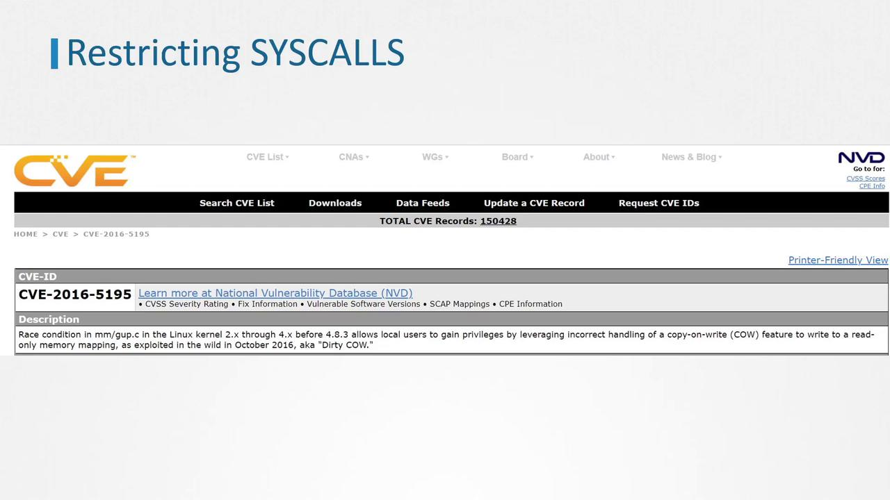

# lsmod
Module                  Size  Used by
floppy                 69417  0
xt_conntrack           16384  1
ipt_MASQUERADE         16384  1
nf_nat_masquerade_ipv4 16384  1 ipt_MASQUERADE
nf_conntrack_netlink   40960  0
nfnetlink              16384  2 nf_conntrack_netlink
xfrm_user              32768  1
xfrm_algo              16384  1 xfrm_user
xt_addrtype            16384  2
iptable_filter         16384  1
iptable_nat            16384  1
nf_conntrack_ipv4      16384  3
nf_defrag_ipv4         16384  1 nf_conntrack_ipv4
nf_nat_ipv4            16384  1 iptable_nat
```

<Callout icon="lightbulb">
  Be aware that an unprivileged process running inside a pod may cause some network protocol-related modules to load automatically—for example, by creating a network socket.
</Callout>

Due to this behavior, attackers might exploit the automatic module loading. Restricting these modules proactively enhances your system's security posture.

## Blacklisting Kernel Modules

To prevent potential security risks, you can blacklist kernel modules so that they are not loaded by the system—even if triggered by certain operations like network socket creation.

### Example: Blacklisting the SCTP Module

The SCTP module is seldom used in Kubernetes clusters and is a common example to blacklist. Follow these steps to disable its loading:

1. Create or edit a configuration file under `/etc/modprobe.d/` (e.g., `/etc/modprobe.d/blacklist.conf`).
2. Add the following entry to the file:

   ```bash theme={null}
   cat /etc/modprobe.d/blacklist.conf
   blacklist sctp
   ```

You can use any file name ending with a `.conf` extension as long as it is located in the `/etc/modprobe.d/` directory.

### Blacklisting Multiple Modules

To also prevent the loading of the dccp module (Datagram Congestion Control Protocol), append its entry into the same file. Once done, reboot your system and confirm that the module is no longer active:

```bash theme={null}
cat /etc/modprobe.d/blacklist.conf
blacklist sctp
blacklist dccp
shutdown -r now
lsmod | grep dccp
```

<Callout icon="triangle-alert">
  After updating the configuration file, reboot your system to ensure changes take effect. Failure to do so might leave the module active, potentially exposing your system to security risks.
</Callout>

For further details on kernel module security and additional best practices, refer to section 3.4 in the [CIS Benchmarks for Kubernetes](https://www.cisecurity.org/benchmark/kubernetes/).

<CardGroup>
  <Card title="Watch Video" icon="video" href="https://learn.kodekloud.com/user/courses/certified-kubernetes-security-specialist-cks/module/d67be5ee-871d-4435-a187-382610cb6a1f/lesson/2af4c922-95be-4292-a78d-eccce18e5359" />
</CardGroup>


# Restrict syscalls using seccomp

Source: https://notes.kodekloud.com/docs/Certified-Kubernetes-Security-Specialist-CKS/System-Hardening/Restrict-Syscalls-Using-Seccomp/page

This article explores restricting system calls in applications using Seccomp to enhance security and minimize the attack surface.

In this article, we’ll explore how to restrict the system calls (syscalls) that applications can invoke, limiting them to only those essential for their operation. This approach minimizes the attack surface, boosting security by preventing access to all 435+ available Linux syscalls.

Even seemingly simple commands, such as using the touch command, trigger multiple syscalls. For example, running:

```bash theme={null}
strace -c touch /tmp/error.log
% time     seconds  usecs/call     calls    errors  syscall
-------  -----------  -----------  --------  -------  ----------------
  0.00    0.000000        0     1              1    read
  0.00    0.000000        0     6              0    close
  0.00    0.000000        0     2              0    fstat
  0.00    0.000000        0     5              0    mmap
  0.00    0.000000        0     4              0    mprotect
  0.00    0.000000        0     1              0    munmap
  0.00    0.000000        0     3              0    brk
  0.00    0.000000        0     3              3    access
  0.00    0.000000        0     1              0    dup2
  0.00    0.000000        0     1              0    execve
  0.00    0.000000        0     1              0    arch_prctl
  0.00    0.000000        0     3              0    openat
  0.00    0.000000        0     1              0    utimensat
-------  -----------  -----------  --------  -------  ----------------
100.00    0.000000      32     3    total
```

Running the command again shows similar syscall statistics, illustrating that even everyday applications use numerous syscalls:

```bash theme={null}
strace -c touch /tmp/error.log
% time     seconds  usecs/call  calls  errors syscall
------ ----------- ----------- ------ --------- ----------------
 0.00      0.000000         0.0      1       0  read
 0.00      0.000000         0.0      6       0  close
 0.00      0.000000         0.0      2       0  fstat
 0.00      0.000000         0.0      5       0  mmap
 0.00      0.000000         0.0      4       0  mprotect
 0.00      0.000000         0.0      1       0  munmap
 0.00      0.000000         0.0      3       0  brk
 0.00      0.000000         0.0      3       3  access
 0.00      0.000000         0.0      2       0  dup2
 0.00      0.000000         0.0      1       0  execve
 0.00      0.000000         0.0      1       0  arch_prctl
 0.00      0.000000         0.0      3       0  openat
 0.00      0.000000         0.0      1       0  utimensat
------ ----------- ----------- ------ --------- ----------------
100.00     0.000000        32.0     32       3  total
```

Allowing unrestricted syscall access increases the risk of exploitation. For instance, the [Dirty COW vulnerability](https://en.wikipedia.org/wiki/Dirty_COW) in 2016 exploited the ptrace syscall to write to a read-only file, leading to privilege escalation and container escape.

<Frame>
  
</Frame>

## The Role of Seccomp

By default, the Linux kernel permits all user-space programs to invoke any syscall. Seccomp (Secure Computing) is a kernel-level feature, introduced in 2005 and available since Linux version 2.6.12, that allows you to sandbox applications by filtering their allowed syscalls.

To verify if your kernel supports Seccomp, run:

```bash theme={null}
grep -i seccomp /boot/config-$(uname -r)
CONFIG_HAVE_ARCH_SECCOMP_FILTER=y
CONFIG_SECCOMP_FILTER=y
CONFIG_SECCOMP=y
```

If these options are set to "y", then Seccomp is supported on your system.

### Demonstrating Seccomp in Action

First, run a container using the popular Docker whalesay image. This container prints Docker’s signature whale ASCII art alongside a provided argument (here, "hello!"):

```bash theme={null}
docker run docker/whalesay cowsay hello!
< hello! >
       ------
        \
         \
          ##     :
       ## ## ##  ==
       ## ## ##  ===
        '""""""'   /
         ~~~  ~~~~~~~~~~~~~~~~~~~ ~  ---
```

Next, start another container with an interactive shell. Inside the container, try changing the system time. Note that the shell runs as PID 1:

```bash theme={null}
docker run -it --rm docker/whalesay /bin/sh
#
