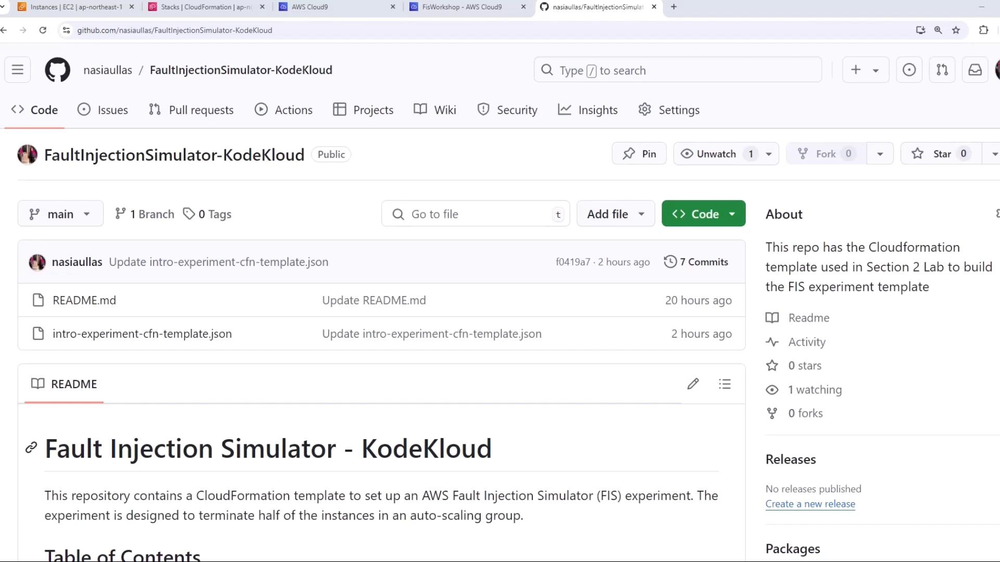
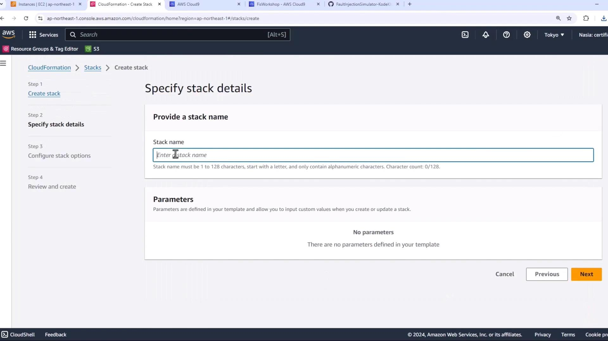
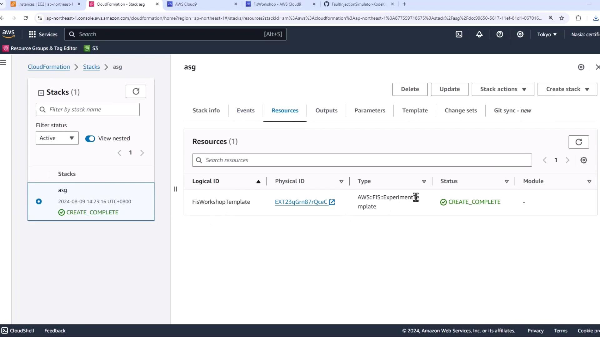
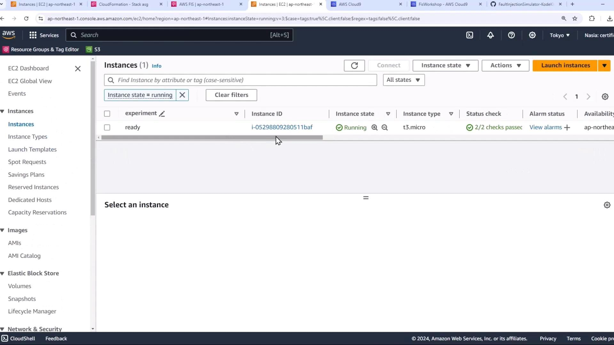

# Demo Create FIS Experiment using CF

Source: https://notes.kodekloud.com/docs/Chaos-Engineering/Building-a-Basic-FIS-experiment/Demo-Create-FIS-Experiment-using-CF/page

This tutorial demonstrates deploying an AWS Fault Injection Simulator experiment using a CloudFormation template for chaos engineering.

In this tutorial, you’ll deploy an AWS Fault Injection Simulator (FIS) experiment with a CloudFormation template—the same experiment you could create in the AWS Management Console. This approach enables repeatable, version-controlled chaos engineering deployments.

<Frame>
  
</Frame>

## Prerequisites

* AWS account with administrative permissions (or FIS, EC2, CloudFormation privileges)
* AWS CLI configured locally
* Basic familiarity with CloudFormation and Auto Scaling groups

## Step 1: Clone the Repository

1. Navigate to the GitHub repo shown above.
2. Download or clone the repository to your local system:
   ```bash theme={null}
   git clone https://github.[AWS_SECRET_ACCESS_KEY]-KodeKloud.git
   cd FaultInjectionSimulator-KodeKloud
   ```
3. Locate the CloudFormation template (`fis-experiment-template.json`).

## Step 2: Review the CloudFormation Template

Below is the core resource definition that creates an FIS experiment template to terminate 50% of instances in an Auto Scaling group:

```json theme={null}
{
  "Resources": {
    "FisWorkshopTemplate": {
      "Type": "AWS::FIS::ExperimentTemplate",
      "Properties": {
        "Description": "Terminate half of the instances in the auto scaling group",
        "Tags": { "Name": "FisWorkshop-Exp1-CloudFormation" },
        "Actions": {
          "FisWorkshopAsg-TerminateInstances": {
            "ActionId": "aws:ec2:terminate-instances",
            "Description": "Terminate instances",
            "Parameters": {},
            "Targets": { "Instances": "FisWorkshopAsg-50Percent" }
          }
        }
      }
    }
  }
}
```

| Template Section | Purpose                                                             | Details                                                                |
| ---------------- | ------------------------------------------------------------------- | ---------------------------------------------------------------------- |
| Description      | Explains the experiment intent                                      | Terminate 50% of instances                                             |
| Tags             | Metadata for easy identification                                    | `Name=FisWorkshop-Exp1-CloudFormation`                                 |
| Actions          | Defines chaos actions                                               | `aws:ec2:terminate-instances` targeting a resource selector            |
| Targets          | Selects the EC2 instances to terminate                              | `FisWorkshopAsg-50Percent` selects half of the instances by tag filter |
| IAM Role & Logs  | (Not shown) Creates an IAM execution role and CloudWatch Logs group | Required for FIS permissions and audit trails                          |

<Callout icon="lightbulb">
  This template does not declare any parameters—everything is preconfigured.
</Callout>

## Step 3: Deploy the CloudFormation Stack

1. Open the [AWS CloudFormation console](https://console.aws.amazon.com/cloudformation).
2. Choose **Create stack** → **With new resources (standard)**.
3. Upload the JSON template (`fis-experiment-template.json`).

<Frame>
  
</Frame>

4. Provide a stack name (e.g., `fis-experiment-stack`) and click **Next** through the remaining screens.
5. Review and click **Create stack**.

Once the stack reaches **CREATE\_COMPLETE**, confirm that the `FisWorkshopTemplate` resource exists:

<Frame>
  
</Frame>

## Step 4: Inspect the Experiment in the FIS Console

1. In CloudFormation, click the **FisWorkshopTemplate** resource.
2. Select **View in Console** to open the AWS FIS console.

<Frame>
  
</Frame>

3. Review the **Actions** and **Targets**.
4. Click **Generate preview** to simulate which instances would be affected.

<Callout icon="triangle-alert">
  If your Auto Scaling group has fewer than 2 instances, the preview will fail because you cannot select 50% of one instance.
</Callout>

## Step 5: Scale the Auto Scaling Group

1. Open the [EC2 Auto Scaling console](https://console.aws.amazon.com/ec2autoscaling).
2. Select your Auto Scaling group and click **Edit**.
3. Increase the **Desired** and **Minimum** capacity from 1 to 2.
4. Save and wait for the second instance to reach the **running** state.

<Frame>
  
</Frame>

## Step 6: Generate Preview and Run the Experiment

1. Return to the FIS console and click **Generate preview** again. You’ll see one of the two instances selected.
2. Click **Start experiment** to terminate the instance.
3. Observe that the Auto Scaling group immediately replaces the terminated instance—maintaining your application’s capacity without disruption.

## Links and References

* [AWS Fault Injection Simulator Documentation](https://docs.aws.amazon.com/fis/latest/userguide/)
* [AWS CloudFormation User Guide](https://docs.aws.amazon.com/AWSCloudFormation/latest/UserGuide/)
* [EC2 Auto Scaling Documentation](https://docs.aws.amazon.com/autoscaling/ec2/userguide/)
* [Chaos Engineering on AWS](https://aws.amazon.com/blogs/architecture/introducing-chaos-engineering-on-aws/)

<CardGroup>
  <Card title="Watch Video" icon="video" href="https://learn.kodekloud.com/user/courses/chaos-engineering/module/d49a2b6d-60a1-4603-965d-7e8292688875/lesson/7d7982af-18a6-400e-b5b8-156608eea6b4" />
</CardGroup>
