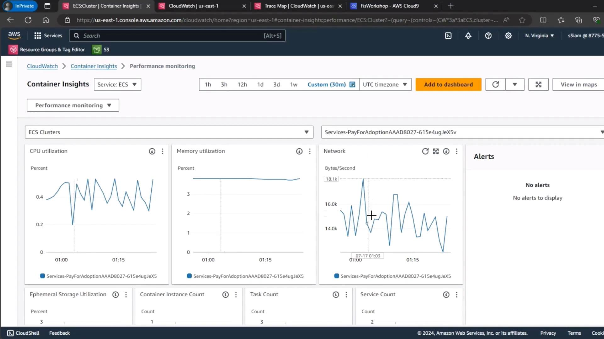

# Demo Fargate Steady State

Source: https://notes.kodekloud.com/docs/Chaos-Engineering/Chaos-Engineering-on-Serverless-Fargate/Demo-Fargate-Steady-State/page

Capturing baseline metrics for ECS Fargate tasks to quantify the impact of an I/O stress fault test.

Before introducing an I/O stress fault into our ECS Fargate task, it’s essential to capture baseline metrics. This steady-state data will help us quantify the impact of the stress test.

## Prerequisites

* You have an active ECS Fargate cluster (e.g., *pay-for-adoption*).
* Container Insights is enabled for your cluster.
* Permissions to view AWS CloudWatch metrics.

<Callout icon="lightbulb">
  Baseline metrics enable you to compare system behavior before and after fault injection. Make sure you record the values for each metric over a consistent time window.
</Callout>

## 1. Navigate to Container Insights

1. Open the AWS Management Console.
2. Go to **CloudWatch** > **Container Insights** > **ECS**.
3. Select your ECS cluster (for example, *pay-for-adoption*).
4. Set the time range to the **last 30 minutes**.

<Frame>
  
</Frame>

## 2. Review Key Metrics

Use the following table to track your baseline values:

| Metric             | Description                                      |
| ------------------ | ------------------------------------------------ |
| CPU Utilization    | Percentage of vCPU resources consumed            |
| Memory Utilization | Percentage of container memory in use            |
| Network Throughput | Ingress and egress data transfer rates (Bytes/s) |

<Callout icon="triangle-alert">
  If any metric is already at or near its limit (e.g., > 80% CPU or memory), address capacity issues before proceeding with fault injection.
</Callout>

## Next Steps

After recording these steady-state values, we’ll inject the I/O stress fault into the Fargate task and revisit the same metrics to observe deviations from this baseline.

***

## Links and References

* [AWS CloudWatch Container Insights](https://docs.aws.amazon.[SECRET_REDACTED]-Insights.html)
* [ECS on AWS Fargate](https://docs.aws.amazon.com/AmazonECS/latest/developerguide/AWS_Fargate.html)

<CardGroup>
  <Card title="Watch Video" icon="video" href="https://learn.kodekloud.com/user/courses/chaos-engineering/module/5fdff083-6ddb-4b6a-a584-9c877b0e9c7b/lesson/3f747326-5557-4870-ba20-3ccec93f0998" />
</CardGroup>
