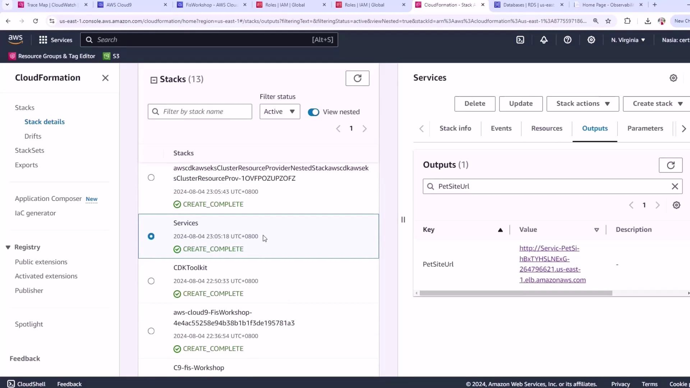

# Demo Setup Architecture and Deploy Application

Source: https://notes.kodekloud.com/docs/Chaos-Engineering/Introduction-to-Real-life-Application/Demo-Setup-Architecture-and-Deploy-Application/page

This article covers the deployment and testing of a pet adoption application using AWS services and load testing with k6.

The application deployment is now complete. To verify, open the AWS CloudFormation console and navigate to **Stacks**. You should see all related stacks—such as **C9FS workshop** and your service stacks—in the **CREATE\_COMPLETE** state.

<Frame>
  
</Frame>

<Callout icon="lightbulb">
  If any stack is still in progress, refresh the console after a few moments or check the [AWS CloudFormation Troubleshooting guide](https://docs.aws.amazon.[SECRET_REDACTED].html).
</Callout>

## Accessing the Pet Site Application

In the **Outputs** tab of your services stack, locate the `PetSiteUrl` key. Click the URL to open the pet adoption site in your browser. This site lets you browse pets, select one to adopt, and complete the checkout flow.

## Establishing a Steady State by Generating Load

Before injecting faults, define your application’s steady state under normal traffic. We’ll scale up the existing ECS Fargate traffic-generator to simulate realistic load.

<Callout icon="triangle-alert">
  Scaling Fargate tasks may incur additional AWS charges. Monitor your [AWS Billing Dashboard](https://console.aws.amazon.com/billing) accordingly.
</Callout>

1. Open your Cloud9 environment:
   ```bash theme={null}
   cd ~/environment
   ```
2. Retrieve the ECS cluster ARN that contains “PetLis”:
   ```bash theme={null}
   PETLISTADOPTIONS_CLUSTER=$(aws ecs list-clusters \
     | jq -r '.clusterArns[] | select(contains("PetLis"))')
   ```
3. Find the traffic-generator service ARN:
   ```bash theme={null}
   TRAFFICGENERATOR_SERVICE=$(aws ecs list-services \
     --cluster "$PETLISTADOPTIONS_CLUSTER" \
     | jq -r '.serviceArns[] | select(contains("trafficgenerator"))')
   ```
4. Scale the service to 5 tasks:
   ```bash theme={null}
   aws ecs update-service \
     --cluster "$PETLISTADOPTIONS_CLUSTER" \
     --service "$TRAFFICGENERATOR_SERVICE" \
     --desired-count 5
   ```

Wait until the service stabilizes. You should see:

```json theme={null}
{
  "service": {
    "desiredCount": 5,
    "runningCount": 5,
    "pendingCount": 0,
    "status": "ACTIVE",
    "launchType": "FARGATE"
  }
}
```

## Simulating Real User Behavior with k6 and Chromium

We’ll use k6’s browser extension with Chromium in Docker to generate realistic user flows on the pet site.

1. Create the k6 script (`k6petsite.js`):
   ```javascript theme={null}
   import { chromium } from 'k6/x/browser';

   export async function browserTest() {
     const browser = chromium.launch();
     const page = browser.newPage();
     try {
       await page.goto('http://URI/');
       const submitButton = page.locator('input[value="Search"]');
       await Promise.all([
         page.waitForNavigation(),
         submitButton.click()
       ]);
     } finally {
       await page.close();
       await browser.close();
     }
   }
   ```
2. Inject your actual PetSite URL:
   ```bash theme={null}
   sed -i 's|URI|'"$MYSITE"'|g' k6petsite.js
   ```
3. Download the Docker seccomp profile and run the test:
   ```bash theme={null}
   curl -o chrome.json \
     https://raw.githubusercontent.[AWS_SECRET_ACCESS_KEY]/seccomp.json
   ```
   After downloading, launch k6 in Docker (approximately 10 minutes):
   ```bash theme={null}
   docker run --rm -i \
     -v "$PWD":/scripts \
     -v "$PWD"/chrome.json:/etc/docker/seccomp.json:ro \
     -e K6_BROWSER_HOST=0.0.0.0 \
     loadimpact/k6:latest run /scripts/k6petsite.js
   ```

<Callout icon="lightbulb">
  This browser-based load test runs for \~10 minutes and simulates real user searches on your pet adoption site.
</Callout>

## Next Steps

1. Open the [AWS CloudWatch console](https://console.aws.amazon.com/cloudwatch).
2. Navigate to **RUM (Real User Monitoring)**.
3. Review the performance metrics to confirm your steady-state baseline before starting fault-injection experiments.

***

## Links and References

* [AWS CloudFormation Documentation](https://docs.aws.amazon.com/cloudformation/)
* [Amazon ECS Developer Guide](https://docs.aws.amazon.com/ecs/latest/developerguide/)
* [k6 Browser Extension](https://k6.io/docs/browser-bundling/)
* [AWS CloudWatch Real User Monitoring](https://docs.aws.amazon.[SECRET_REDACTED]-RUM.html)

<CardGroup>
  <Card title="Watch Video" icon="video" href="https://learn.kodekloud.com/user/courses/chaos-engineering/module/a6b84b48-a401-48a4-8278-0be5a8bb0d38/lesson/601ecf5d-d4cc-47f1-bec4-3fface7ee24f" />
</CardGroup>
