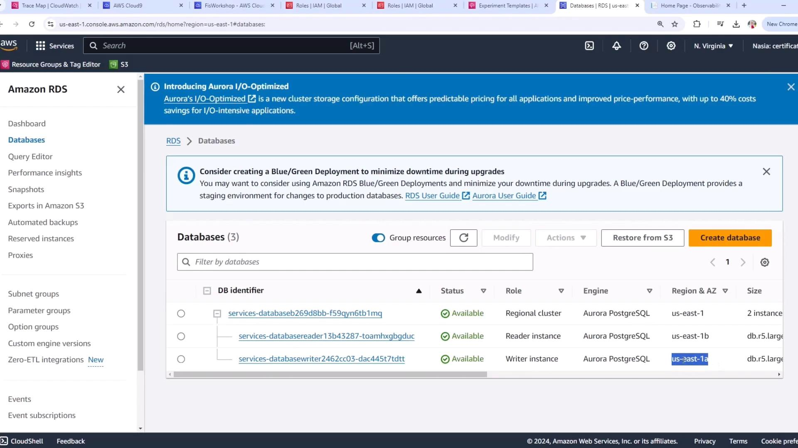
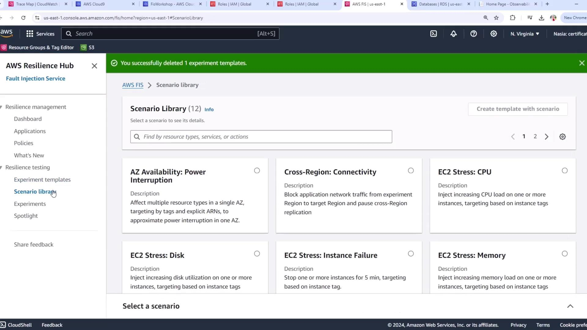
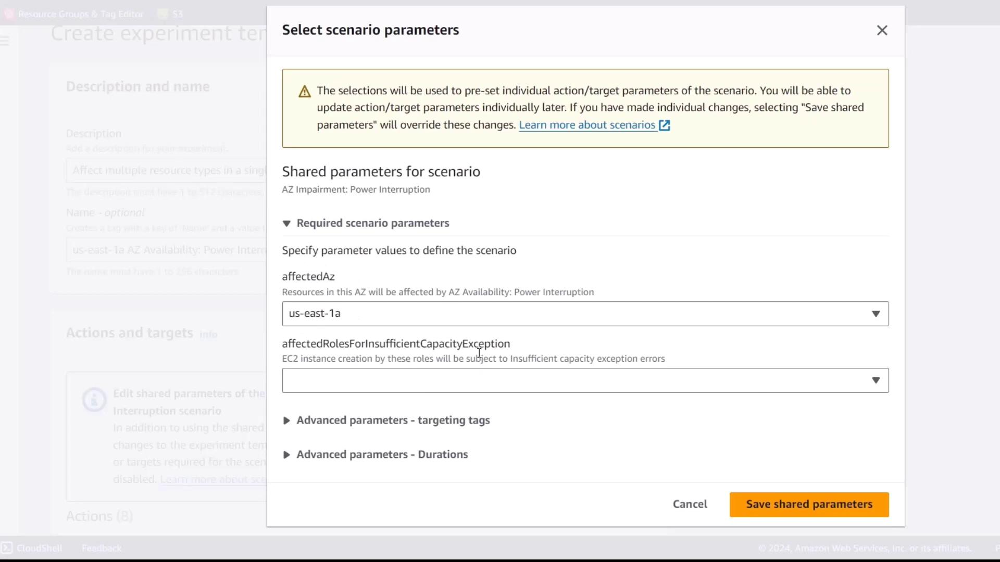
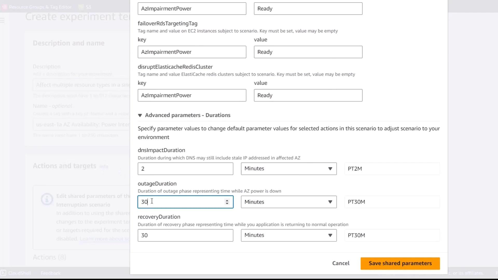
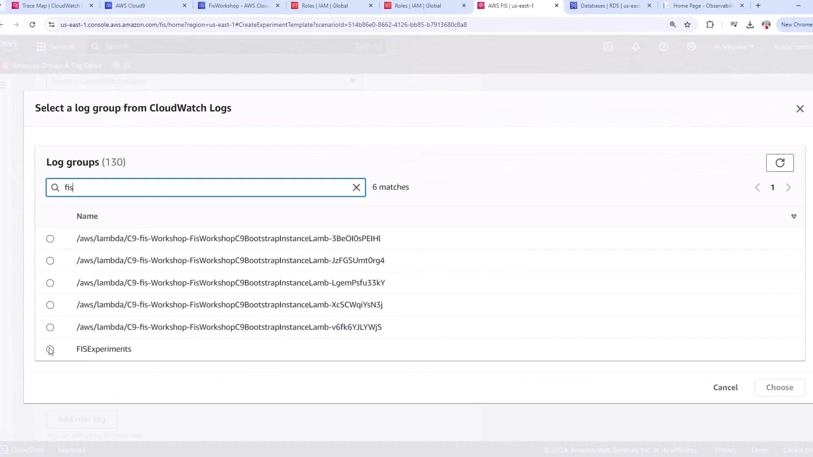

# Demo Prepare Experiment AZ

Source: https://notes.kodekloud.com/docs/Chaos-Engineering/Chaos-Engineering-on-Availability-Zone/Demo-Prepare-Experiment-AZ/page

Learn to create an AWS Fault Injection Simulator experiment template simulating an Availability Zone power interruption for an Amazon Aurora database.

In this article, you’ll learn how to create an AWS Fault Injection Simulator (FIS) experiment template that simulates an Availability Zone (AZ) power interruption for an Amazon Aurora database. You will:

* Identify the AZ of your Aurora writer instance
* Select and configure the appropriate FIS scenario
* Limit the blast radius with resource tags
* Define advanced parameters for timing
* Set up CloudWatch Logs for monitoring

## 1. Identify the Target AZ for Your Aurora Writer

1. Open the Amazon RDS console.
2. Select your Aurora cluster.
3. Note the Availability Zone (AZ) where the writer instance is running (e.g., **us-east-1a**).

<Frame>
  
</Frame>

## 2. Select the AZ Availability: Power Interruption Scenario

1. Navigate to the AWS Fault Injection Simulator (FIS) console.
2. Click **Scenario Library** to browse pre-built scenarios.
3. Choose **AZ Availability: Power Interruption**.

<Frame>
  
</Frame>

## 3. Review Scenario Actions and Targets

The **AZ Availability: Power Interruption** template orchestrates the following actions in sequence:

* Pause EC2 instance launches
* Pause EBS I/O
* Adjust Auto Scaling Group (ASG) scaling

Targets include IAM roles, EC2 instances, and EBS volumes in the specified AZ.

<Frame>
  
</Frame>

## 4. Configure Scenario Parameters

### Affected Availability Zone & IAM Role

* Set **Affected Availability Zone** to your Aurora writer’s AZ (e.g., `us-east-1a`).
* Specify the IAM role that FIS will assume to manage EC2 and EBS resources.

<Frame>
  
</Frame>

### Targeting Tags

Limit the blast radius by targeting only resources with predefined tags.

| Tag Key       | Tag Value   |
| ------------- | ----------- |
| AZ-impairment | power-ready |

<Callout icon="lightbulb">
  Ensure your EC2 instances and EBS volumes are already tagged with these keys and values before running the experiment.
</Callout>

### Advanced Timing Parameters

Align these durations with your application’s RPO (Recovery Point Objective) and RTO (Recovery Time Objective).

| Phase      | Description                      | Duration   |
| ---------- | -------------------------------- | ---------- |
| DNS Impact | Time for DNS propagation effects | 2 minutes  |
| Outage     | Simulated power-off window       | 10 minutes |
| Recovery   | Time to restore power            | 5 minutes  |

<Frame>
  
</Frame>

## 5. Configure Logging to CloudWatch

1. Under **Log group**, search for `fis`.
2. Select the CloudWatch Logs group where FIS will send experiment logs.

<Frame>
  
</Frame>

## 6. Create and Review the Experiment Template

* Verify all parameters and targets are correct.
* Capture baseline (steady-state) metrics for comparison.
* Click **Create experiment template**.

<Callout icon="triangle-alert">
  Chaos experiments can disrupt production workloads. Always test in a staging environment and monitor your application during the injection.
</Callout>

***

## Links and References

* [AWS Fault Injection Simulator User Guide](https://docs.aws.amazon.com/fis/latest/userguide/)
* [Amazon RDS Aurora High Availability](https://docs.aws.amazon.com[AWS_SECRET_ACCESS_KEY]-best-practices.html)
* [Amazon CloudWatch Logs](https://docs.aws.amazon.[SECRET_REDACTED].html)

<CardGroup>
  <Card title="Watch Video" icon="video" href="https://learn.kodekloud.com/user/courses/chaos-engineering/module/e28ed74d-a0c9-4dbd-9950-2b6f83cd8511/lesson/70e53d2c-c40a-4a83-b2da-212da6c516bf" />
</CardGroup>
