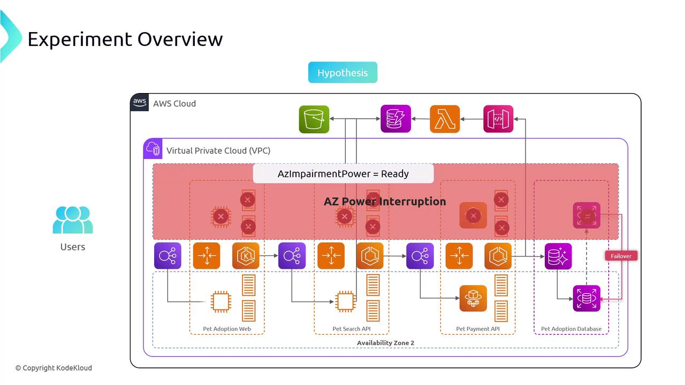

# Experiment Overview

Source: https://notes.kodekloud.com/docs/Chaos-Engineering/Chaos-Engineering-on-Availability-Zone/Experiment-Overview/page

This article describes an experiment using AWS Fault Injection Simulator to test the resilience of a multi-AZ architecture during a power interruption.

In this experiment, we use AWS Fault Injection Simulator (FIS) to simulate an Availability Zone (AZ) power interruption and validate our multi-AZ architecture’s resilience. By intentionally cutting power to one AZ, we expect EC2 instances and containers in that zone to fail, while load balancers and Auto Scaling groups in healthy AZs continue serving traffic.

## Goals

* Validate that the pet site remains accessible during an AZ-wide outage
* Measure performance degradation and failover behavior under controlled conditions

## Experiment Components

| Component  | Description                                                                                                |
| ---------- | ---------------------------------------------------------------------------------------------------------- |
| Given      | The pet site is deployed across multiple Availability Zones.                                               |
| Hypothesis | A single AZ power failure should not render the pet site unavailable; minor latency spikes are acceptable. |

## Limiting the Blast Radius

To ensure a focused test, only resources tagged with the following key-value pair will be targeted by FIS:

```yaml theme={null}
Key:   AZ impairment power
Value: ready
```

<Callout icon="lightbulb">
  Only resources labeled `AZ impairment power: ready` are affected by the experiment, keeping the rest of your environment safe.
</Callout>

<Frame>
  
</Frame>

## Expected Behavior

1. FIS triggers a simulated power loss in the targeted AZ.
2. EC2 instances and containers in that AZ go offline.
3. Application load balancers and Auto Scaling groups in remaining AZs absorb the traffic.
4. Pet site remains reachable, with possible latency increase during failover.

<Callout icon="triangle-alert">
  Always run FIS experiments in a non-production or staging environment first. Improper scoping can lead to real service disruptions.
</Callout>

## References

* [AWS Fault Injection Simulator User Guide](https://docs.aws.amazon.com/fis/latest/userguide/)
* [Designing Multi-AZ Architectures on AWS](https://aws.amazon.com/architecture/availability-zones/)

<CardGroup>
  <Card title="Watch Video" icon="video" href="https://learn.kodekloud.com/user/courses/chaos-engineering/module/e28ed74d-a0c9-4dbd-9950-2b6f83cd8511/lesson/b51b4998-fb2e-4ee9-b20b-4ab82e125a20" />
</CardGroup>
