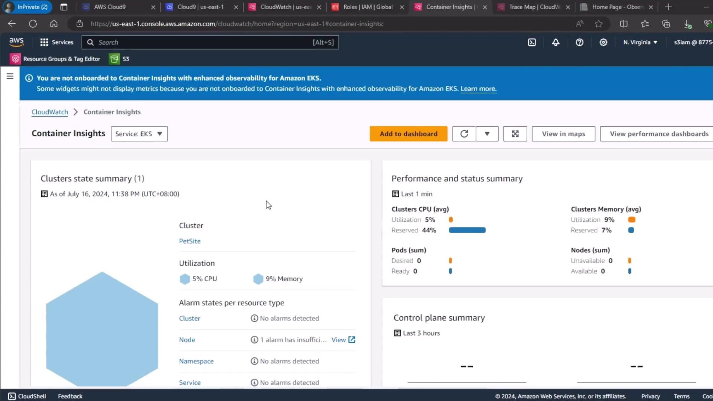
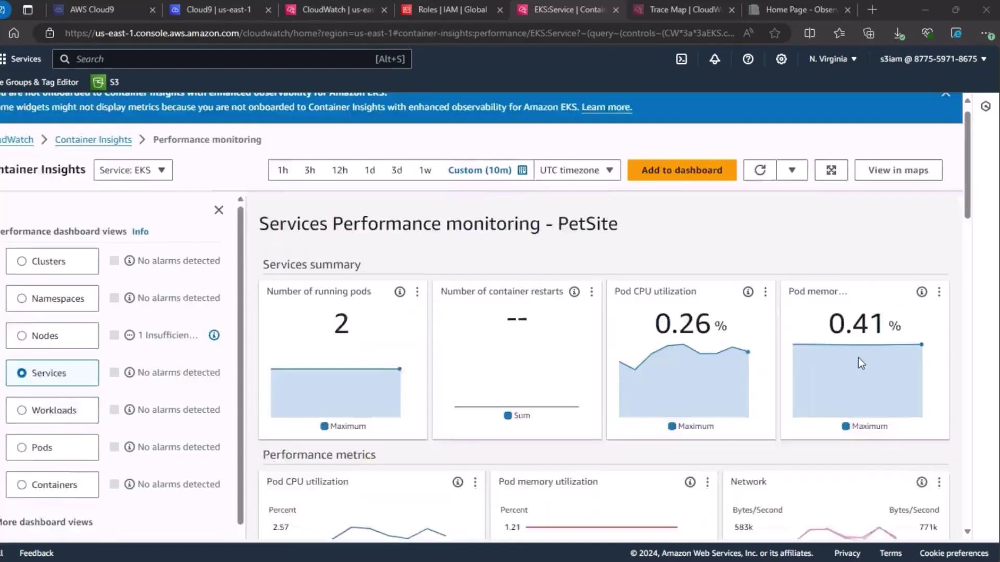
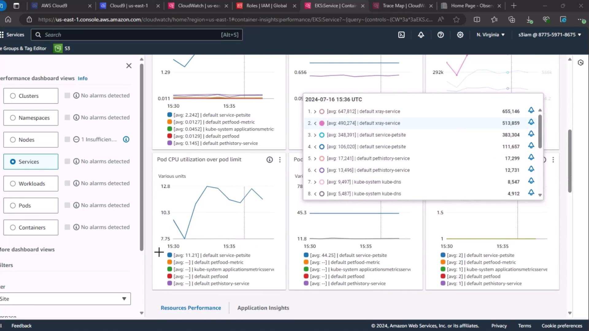
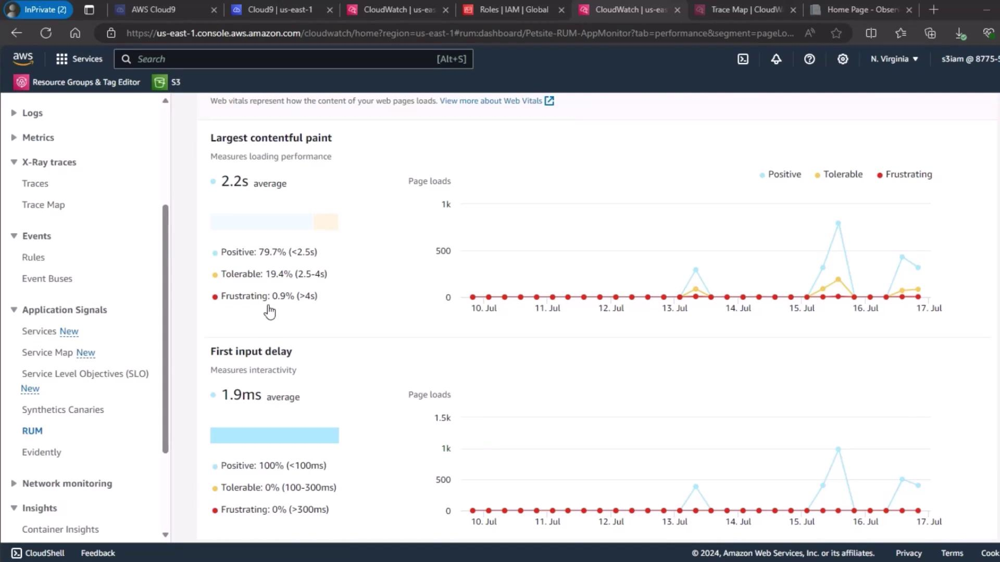

# Elevate to root
sudo su -

# Move to the EKS FIS workshop directory
cd ~/environment/workshopfiles/fis-workshop/eks-experiment/
```

List the files to confirm you have the expected prerequisites:

```bash theme={null}
ls -l
# total 8
# -rw-r--r-- 1 root root 212 Aug 17 16:14 fis-trust-policy.json
# -rw-r--r-- 1 root root 977 Aug 17 16:14 rbac.yaml
```

***

## 2. Create the IAM Role for FIS

Your `fis-trust-policy.json` defines which AWS service can assume this role. Create the role using:

```bash theme={null}
aws iam create-role \
  --role-name eks-fis-role \
  --assume-role-policy-document file://fis-trust-policy.json
```

Sample response:

```json theme={null}
{
  "Role": {
    "RoleName": "eks-fis-role",
    "Arn": "arn:aws:iam::123456789012:role/eks-fis-role",
    "AssumeRolePolicyDocument": {
      "Statement": [
        {
          "Effect": "Allow",
          "Principal": { "Service": ["fis.amazonaws.com"] },
          "Action": "sts:AssumeRole"
        }
      ]
    }
  }
}
```

<Callout icon="lightbulb">
  Ensure the path to `fis-trust-policy.json` is correct and your AWS CLI is configured with sufficient permissions.
</Callout>

***

## 3. Attach IAM Policies to the FIS Role

Grant the `eks-fis-role` permissions to manage EKS clusters, EC2 instances, Systems Manager, CloudWatch, and networking. You can attach them in a loop or individually. Below is a table of required policies:

| Policy Name                             | Purpose                                | AWS CLI Example                                                                |
| --------------------------------------- | -------------------------------------- | ------------------------------------------------------------------------------ |
| AWSFaultInjectionSimulatorNetworkAccess | VPC and networking operations          | `arn:aws:iam::aws:policy/service-role/AWSFaultInjectionSimulatorNetworkAccess` |
| AWSFaultInjectionSimulatorEKSAccess     | EKS API actions                        | `arn:aws:iam::aws:policy/service-role/AWSFaultInjectionSimulatorEKSAccess`     |
| AWSFaultInjectionSimulatorEC2Access     | EC2 instance management                | `arn:aws:iam::aws:policy/service-role/AWSFaultInjectionSimulatorEC2Access`     |
| AWSFaultInjectionSimulatorSSMAccess     | Systems Manager for remote commands    | `arn:aws:iam::aws:policy/service-role/AWSFaultInjectionSimulatorSSMAccess`     |
| CloudWatchLogsFullAccess                | CloudWatch Logs for experiment logging | `arn:aws:iam::aws:policy/CloudWatchLogsFullAccess`                             |
| CloudWatchAgentServerPolicy             | CloudWatch Agent metrics push          | `arn:aws:iam::aws:policy/CloudWatchAgentServerPolicy`                          |

Example of attaching one policy:

```bash theme={null}
aws iam attach-role-policy \
  --role-name eks-fis-role \
  --policy-arn arn:aws:iam::aws:policy/service-role/AWSFaultInjectionSimulatorNetworkAccess
```

Repeat for each policy listed above.

***

## 4. Configure `kubectl` & Apply RBAC

Update your kubeconfig to point at the target EKS cluster (replace `$AWS_REGION` and `PetSite` as needed):

```bash theme={null}
aws eks update-kubeconfig \
  --name PetSite \
  --region $AWS_REGION
```

<Callout icon="triangle-alert">
  Be sure your AWS CLI profile has permission to call `eks:UpdateKubeconfig`. Incorrect context may lead to applying objects to the wrong cluster.
</Callout>

Next, apply the RBAC manifests to map the IAM role to a Kubernetes service account:

```bash theme={null}
kubectl apply -f rbac.yaml

# serviceaccount/eks-fis-role created
# role.rbac.authorization.k8s.io/experiments created
# rolebinding.rbac.authorization.k8s.io/bind-role-experiments created
```

These objects allow FIS to interact with your pods using the service account credentials.

***

## 5. Verify Metrics-Server & Pod Metrics

Ensure the metrics-server pod is running in your cluster:

```bash theme={null}
kubectl get pods --all-namespaces | grep metrics-server

# kube-system   metrics-server-6d49bc694-c6stk    1/1     Running   0          15m
```

Once available, fetch pod-level metrics in the `default` namespace:

```bash theme={null}
kubectl top pod --namespace default

# NAME                             CPU(cores)   MEMORY(bytes)
# petfood-74f5d6b95-2xgmn          1m           188Mi
# petfood-74f68d887d-6v7rs         1m           196Mi
# petfood-metric-7b68d8b87d-c4ndk  1m           187Mi
# pethistory-deployment-7c4f8696f8-qd263 57m     89Mi
# petsite-deployment-568567f5c8-qghr2    57m    131Mi
# xray-daemon-v87f6                     2m     19Mi
```

With these prerequisites in place, you’re ready to launch your first AWS FIS memory-stress experiment on EKS!

***

## References

* [AWS Fault Injection Simulator User Guide](https://docs.aws.amazon.com/fis/latest/userguide/what-is-fis.html)
* [Amazon EKS Documentation](https://docs.aws.amazon.com/eks/latest/userguide/what-is-eks.html)
* [kubectl Cheat Sheet](https://kubernetes.io/docs/reference/kubectl/cheatsheet/)

<CardGroup>
  <Card title="Watch Video" icon="video" href="https://learn.kodekloud.com/user/courses/chaos-engineering/module/67947884-154a-43e4-a0cf-1137e1264eee/lesson/1ed99780-9932-4590-8039-96113c04e730" />
</CardGroup>


# Demo Memory Stress on EKS Part 2

Source: https://notes.kodekloud.com/docs/Chaos-Engineering/Chaos-Engineering-on-Kubernetes-EKS/Demo-Memory-Stress-on-EKS-Part-2/page

This lesson establishes a steady-state baseline for an Amazon EKS application by collecting metrics from AWS observability tools before a memory-stress experiment.

In this lesson, we’ll establish a steady-state baseline for our Amazon EKS application by collecting metrics from three AWS observability tools. This prepares us to measure the impact of our Fault Injection Service (FIS) memory‐stress experiment.

<Callout icon="lightbulb">
  Establishing a steady-state baseline is crucial before running any chaos experiment. It helps you distinguish normal behavior from fault-induced anomalies.
</Callout>

## Observability Tools and Key Metrics

| Observability Tool               | Focus            | Key Metrics                                                         |
| -------------------------------- | ---------------- | ------------------------------------------------------------------- |
| CloudWatch Container Insights    | Cluster-level    | CPU & memory utilization, alarms                                    |
| CloudWatch Performance Dashboard | Service-level    | Running pods, CPU utilization, memory use                           |
| CloudWatch RUM                   | End-user metrics | Largest Contentful Paint (LCP), First Input Delay (FID), UX ratings |

***

## 1. CloudWatch Container Insights

To begin, navigate to the [CloudWatch Container Insights](https://docs.aws.amazon.com/AmazonCloudWatch/latest/monitoring/ContainerInsights.html) dashboard and select your EKS cluster. Here you can view overall CPU and memory utilization, cluster state summaries, and alarm statuses.

<Frame>
  
</Frame>

This baseline snapshot reveals how your cluster performs under normal conditions.

***

## 2. Service-Level Performance Dashboard

Next, go to the **Services** section under CloudWatch performance dashboards. Wait for the metrics to load, then review:

* Number of running pods
* Pod CPU utilization
* Pod memory utilization

<Frame>
  
</Frame>

Inspect the time-series graphs to see how these values evolve in real time.

<Frame>
  
</Frame>

***

## 3. Real User Monitoring (RUM)

For end-user experience, use [CloudWatch RUM](https://docs.aws.amazon.com/AmazonCloudWatch/latest/monitoring/CloudWatch-RUM.html). Select your PetSite RUM app monitor to view session quality:

* **Positive**
* **Tolerable**
* **Frustrating**

The current “Frustrating” rate is 0.9%, indicating most user sessions are performing well.

<Frame>
  
</Frame>

***

## 4. Page Load Metrics Overview

Finally, review the page load times and Cumulative Layout Shift (CLS) trends to understand the front-end impact before fault injection.

<Frame>
  
</Frame>

***

## Next Steps

In the next demo, we’ll execute our FIS memory‐stress experiment and revisit these dashboards to observe how injected faults affect cluster health, service performance, and user experience.

## Links and References

* [AWS CloudWatch Container Insights Documentation](https://docs.aws.amazon.com/AmazonCloudWatch/latest/monitoring/ContainerInsights.html)
* [AWS CloudWatch RUM Documentation](https://docs.aws.amazon.com/AmazonCloudWatch/latest/monitoring/CloudWatch-RUM.html)
* [AWS Fault Injection Simulator (FIS)](https://docs.aws.amazon.com/fis/latest/userguide/)
* [Amazon EKS User Guide](https://docs.aws.amazon.com/eks/latest/userguide/)

<CardGroup>
  <Card title="Watch Video" icon="video" href="https://learn.kodekloud.com/user/courses/chaos-engineering/module/67947884-154a-43e4-a0cf-1137e1264eee/lesson/9de307a6-02e0-477d-a658-ce9c14bb4de4" />
</CardGroup>
