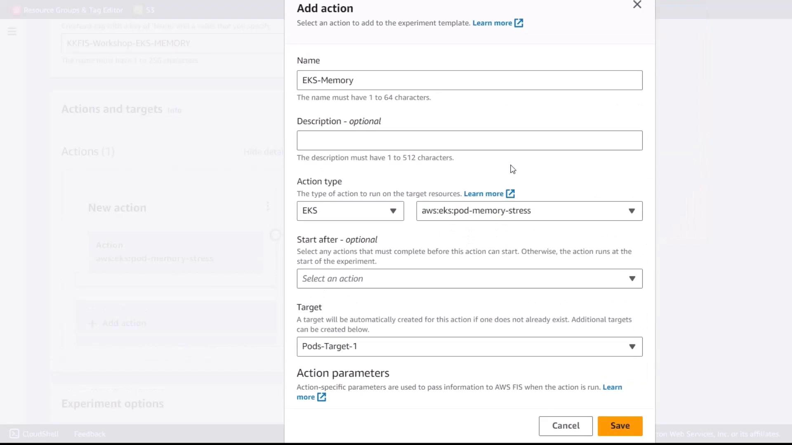
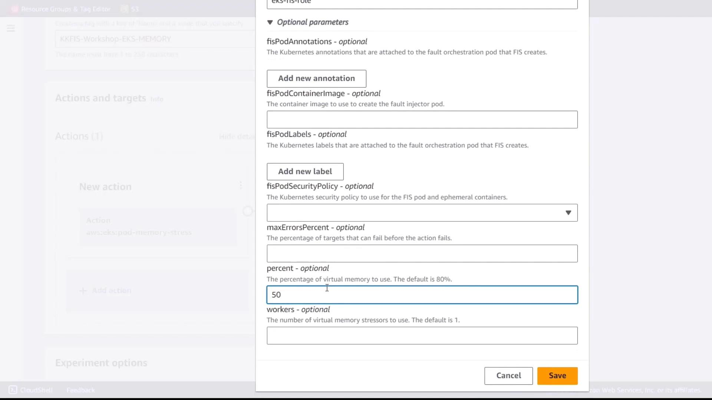
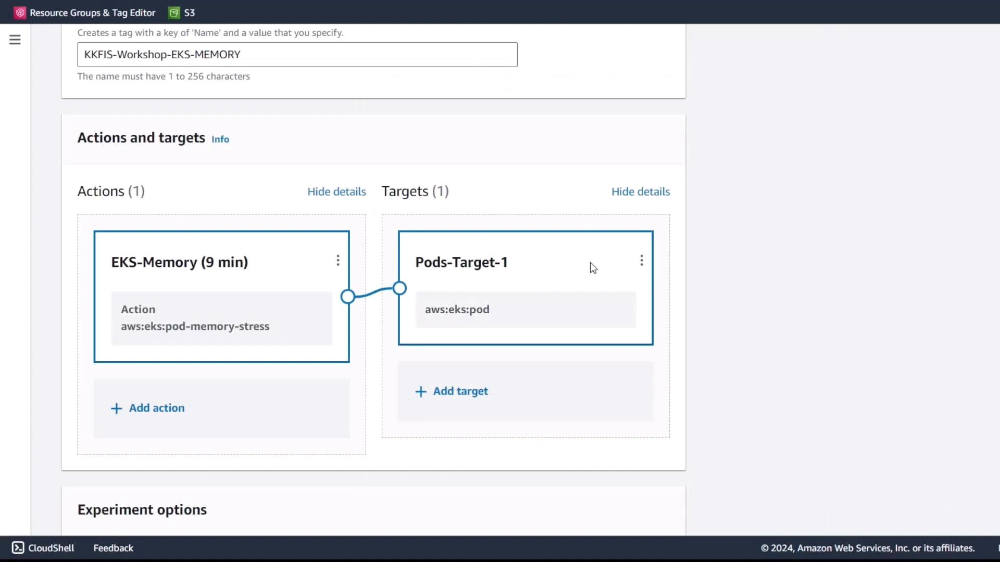
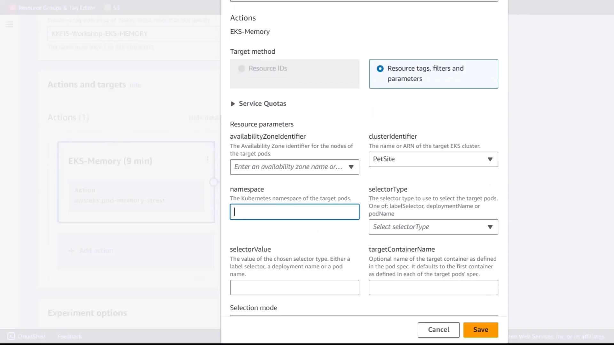

# Demo Memory Stress on EKS Part 3

Source: https://notes.kodekloud.com/docs/Chaos-Engineering/Chaos-Engineering-on-Kubernetes-EKS/Demo-Memory-Stress-on-EKS-Part-3/page

This tutorial guides creating an AWS FIS experiment to inject memory stress into a pod on Amazon EKS for resilience testing.

In this tutorial, you’ll create an AWS Fault Injection Simulator (FIS) experiment template that injects memory stress into a pod running on Amazon EKS. You will configure the fault action, define the target pods, and execute the experiment while monitoring performance in real time.

<Callout icon="lightbulb">
  * An AWS account with administrative permissions
  * An existing Amazon EKS cluster (e.g., `pet-site`)
  * A Kubernetes service account IAM role with FIS permissions
  * AWS FIS enabled in your account
</Callout>

## 1. Create the FIS Experiment Template

### 1.1 Configure Basic Settings

1. Sign in to the [AWS FIS console](https://console.aws.amazon.com/fis/) and go to **Experiment templates**.
2. Click **Create experiment template**.
3. Provide the following details:
   * **Name:** EKS-Memory-Stress
   * **Description:** Inject memory stress into pods on EKS for resilience testing

### 1.2 Add a Memory Stress Action

1. Under **Actions**, click **Add action**.
2. Set these parameters:
   * **Action name:** eks-memory
   * **Action type:** `aws:eks:inject-fault`
   * **Fault action:** Pod Memory Stress

<Frame>
  
</Frame>

### 1.3 Specify Action Parameters

Configure the memory stress parameters:

| Parameter  | Value                                       |
| ---------- | ------------------------------------------- |
| Duration   | `9 minutes`                                 |
| Role       | Kubernetes service account IAM role for FIS |
| Percentage | `50`                                        |

<Callout icon="lightbulb">
  Setting `Percentage` to 50 limits memory consumption to half of available memory on targeted pods.
</Callout>

<Frame>
  
</Frame>

## 2. Define the Target Pods

1. In the **Targets** section, click **Add target**.
2. Enter the following values:
   * **Cluster:** `pet-site`
   * **Namespace:** `default`
   * **Selector type:** Label
   * **Selector value:** `app=pet-site`

<Frame>
  
</Frame>

3. Review and save the target configuration.

<Frame>
  
</Frame>

## 3. Review and Create

1. Verify all settings:
   * **Action:** `eks-memory` (Pod Memory Stress)
   * **Target:** Pods labeled `app=pet-site` in the `default` namespace on `pet-site` cluster
2. Attach the experiment IAM role to allow publishing logs to CloudWatch.
3. Click **Create experiment template**.

## 4. Execute and Monitor the Experiment

1. From the **Experiment templates** list, select **EKS-Memory-Stress** and click **Start experiment**.
2. Let the experiment run for the configured duration (9 minutes).
3. Monitor performance metrics in:
   * CloudWatch RUM
   * EKS container performance dashboards

Compare metrics before, during, and after the memory stress injection to evaluate the resilience of your application.

## Links and References

* [AWS FIS Documentation](https://docs.aws.amazon.com/fis/)
* [Amazon EKS Documentation](https://docs.aws.amazon.com/eks/)
* [Kubernetes Portal](https://kubernetes.io/)

<CardGroup>
  <Card title="Watch Video" icon="video" href="https://learn.kodekloud.com/user/courses/chaos-engineering/module/67947884-154a-43e4-a0cf-1137e1264eee/lesson/7a3f4d6c-0341-4081-b818-b2f3cc810ae7" />
</CardGroup>
