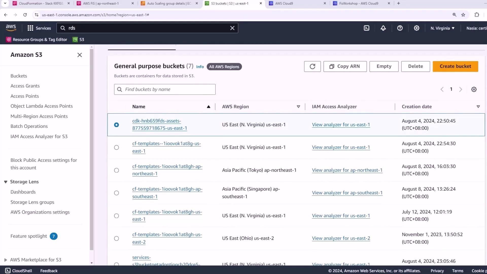
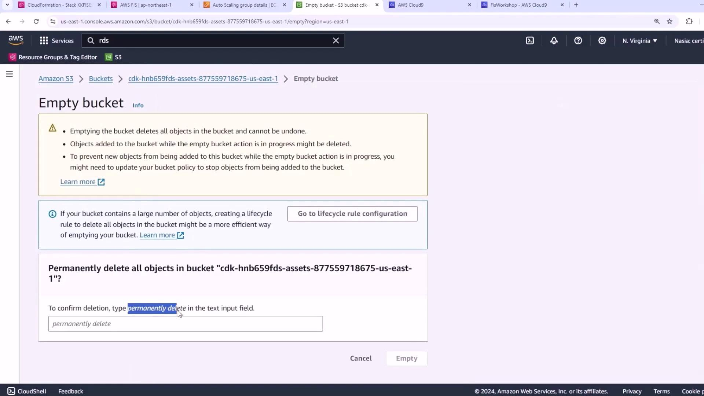
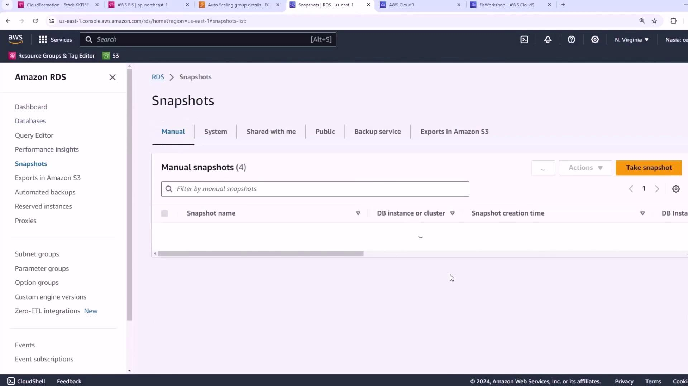
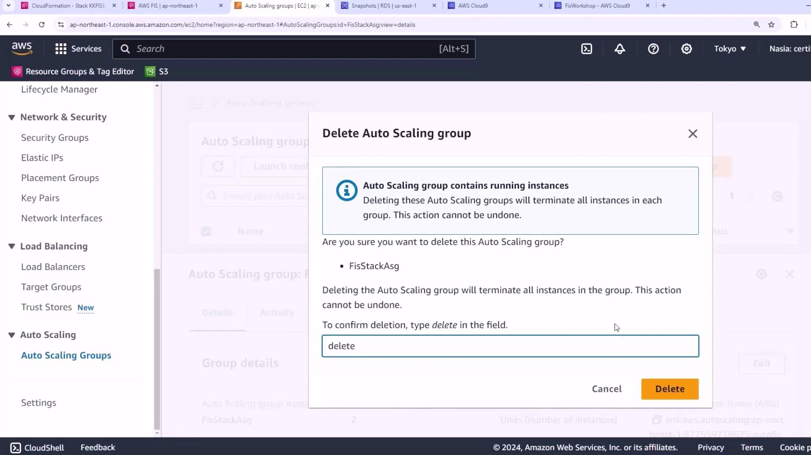
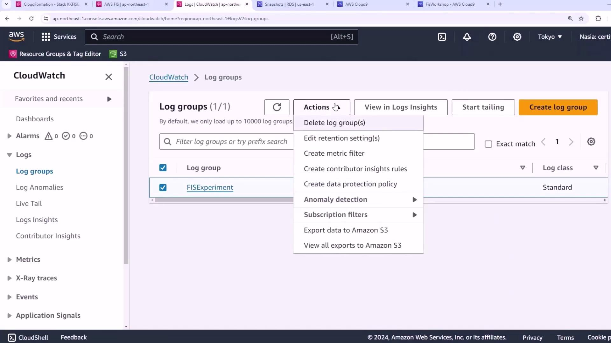

# Cleanup Process

Source: https://notes.kodekloud.com/docs/Chaos-Engineering/Conclusion/Cleanup-Process/page

This article outlines the steps to clean up AWS resources after a workshop to avoid unexpected charges.

After completing the workshop, it’s important to remove all AWS resources to prevent unexpected charges. Follow these steps in sequence:

| Step | Resource Type                        | Action                                          |
| ---- | ------------------------------------ | ----------------------------------------------- |
| 1    | Amazon S3 Buckets                    | Empty buckets before deletion                   |
| 2    | Amazon RDS Snapshots                 | Delete manual Aurora snapshots                  |
| 3    | AWS CDK Stacks                       | Run `cdk destroy` for all CDK-managed resources |
| 4    | Auto Scaling Group & Launch Template | Delete the group and associated launch template |
| 5    | CloudWatch Log Groups                | Delete the log group in CloudWatch              |

## 1. Empty Amazon S3 Buckets

Before tearing down your CloudFormation stacks or CDK apps, you must empty every S3 bucket. AWS will not delete buckets that contain objects.

<Frame>
  
</Frame>

<Callout icon="triangle-alert">
  Buckets with existing objects will block stack deletion. Ensure all objects are removed first.
</Callout>

1. Open the [Amazon S3 console](https://console.aws.amazon.com/s3/).
2. Select each workshop bucket.
3. Click **Empty**.
4. Type **permanently delete** and confirm.

<Frame>
  
</Frame>

Repeat for all seven buckets.

## 2. Delete RDS Snapshots

Remove any manual snapshots of your Aurora database. Retained snapshots prevent the CloudFormation stack from deleting the database instances.

<Frame>
  
</Frame>

1. Go to the [Amazon RDS console](https://console.aws.amazon.com/rds/).
2. Choose **Snapshots** in the navigation pane.
3. Select each manual snapshot and delete.

<Callout icon="lightbulb">
  Automated snapshots created by RDS are cleaned up when you delete the database instance.
</Callout>

## 3. Destroy CDK Stacks

With buckets and snapshots removed, destroy your CDK-managed stacks:

```bash theme={null}
cd ~/environment/workshopfiles/fis-workshop/intro-experiment/cdk
cdk destroy --all \
  --context admin_role_arn=$KS_ADMIN_ARN \
  --context dashboard_role_arn=$CONSOLE_ROLE_ARN \
  --require-approval never
```

When prompted, type `y` to confirm. For more details, see the [AWS CDK CLI Reference](https://docs.aws.amazon.com/cdk/v2/guide/cli.html#cli-destroy).

## 4. Remove Manual Auto Scaling Resources

If you created an Auto Scaling group and launch template manually, delete them now.

1. Navigate to the [Auto Scaling Groups console](https://console.aws.amazon.com/ec2autoscaling/).
2. Select the group (e.g., in the Tokyo region).
3. Click **Delete**, then type **delete** to confirm.

<Frame>
  
</Frame>

4. Finally, delete the associated launch template to terminate any remaining EC2 instances.

## 5. Delete CloudWatch Log Group

Remove the CloudWatch Logs group created during the workshop.

1. Open the [CloudWatch console](https://console.aws.amazon.com/cloudwatch/).
2. Click **Log groups**.
3. Select your log group, then choose **Actions → Delete log group**.

<Frame>
  
</Frame>

With these steps complete, all workshop resources are cleaned up.

## References

* [Deleting Amazon S3 Buckets](https://docs.aws.amazon.com/AmazonS3/latest/userguide/delete-bucket.html)
* [Deleting Amazon RDS Snapshots](https://docs.aws.amazon.com/AmazonRDS/latest/UserGuide/USER_DeleteSnapshot.html)
* [AWS CDK CLI Reference](https://docs.aws.amazon.com/cdk/v2/guide/cli.html#cli-destroy)
* [Deleting Auto Scaling Groups](https://docs.aws.amazon.com/autoscaling/ec2/userguide/deleting-asg.html)
* [Deleting CloudWatch Log Groups](https://docs.aws.amazon.[AWS_SECRET_ACCESS_KEY]-with-log-groups-and-streams.html#delete-log-group)

<CardGroup>
  <Card title="Watch Video" icon="video" href="https://learn.kodekloud.com/user/courses/chaos-engineering/module/141fe614-4e37-4e09-901b-dd914d7cd6e1/lesson/2a31854b-9ab2-410b-a718-a8cf188274d9" />
</CardGroup>
