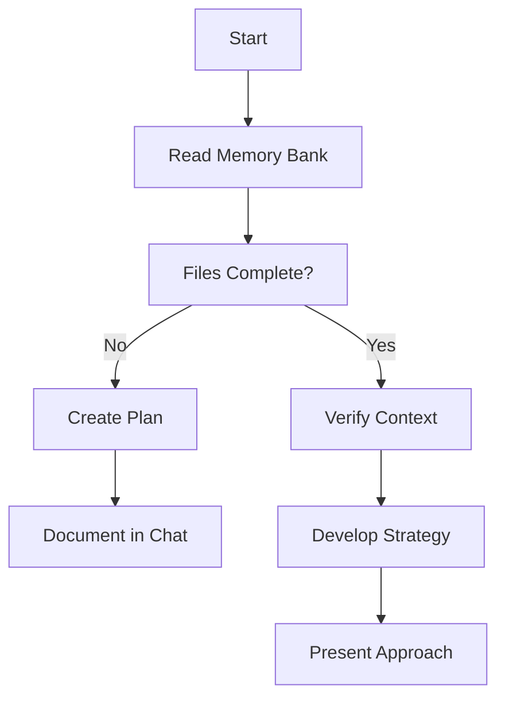

# Demo Ideal Setup Rules and Memory Bank

Source: https://notes.kodekloud.com/docs/Cline/Introduction-to-Cline/Demo-Ideal-Setup-Rules-and-Memory-Bank/page

Describes using client rules and the Cline memory bank to enforce project policies, coding standards, and persistent documentation so the assistant provides consistent, context aware development support

In this lesson we continue building an "ideal" development setup — a collection of tools and patterns you can adopt to make your environment consistent, secure, and productive. The ideal setup is the one that works for you; the suggestions here are practical defaults you can adapt.

This article focuses on two complementary components:

* Client rules — persistent, system-level guidance that the assistant will apply to every conversation and code generation task.
* The Cline memory bank — a structured, persistent documentation system that preserves project context across sessions.

***

## Client rules

Client rules let you encode project-level guidance that the assistant consults automatically. Use them for coding standards, security constraints (for example, "do not access repository X"), forbidden actions, network restrictions, or any team-wide policy you want enforced.

You can create client rules via the product UI or with shortcuts like `/new rule`. If you prefer editing locally, manage rules inside your editor (for example, Visual Studio Code). Rules can be:

* Global — apply to all projects for your account.
* Workspace — apply to the current workspace.
* Project-specific — apply only to the repository where they live.

Project-specific rules typically live under `.client/rules/`. For example, adding a file named `Python-rules.md` will create `.client/rules/Python-rules.md`, which the assistant will consult for that project.

<Callout icon="lightbulb">
  Client rules are persistent and applied automatically. Use them to encode team conventions, forbidden actions (for example, "do not access repository X"), or project-wide safety constraints.
</Callout>

### Example: Python coding rules

Below is a sample rules document you could add at `.client/rules/Python-rules.md`. Store it once and the assistant will consult it when generating or reviewing Python code for the project.

```markdown theme={null}
## Formatting

- **Indentation:** Use 4 spaces per indentation level.
- **Line Length:** Limit lines to 79 characters.
- **Blank Lines:**
  - Two blank lines between top-level functions/classes
  - One blank line between class methods
- **Whitespace:**
  - No extra whitespace inside `()`, `[]`, or `{}`.
  - No extra whitespace before `,`, `;`, or `:`.

## Naming

- **Variables:** Use `snake_case`
- **Functions:** Use `snake_case`
- **Classes:** Use `PascalCase`
- **Constants:** Use `UPPER_CASE`
- **Descriptive Names:** Use clear, descriptive names
- **Single-letter Variables:** Only for counters (`i`, `j`, `k`)

## Imports

- **Order:** Standard library, third-party, local imports
- **Grouping:** Group imports by type
- **Placement:** Place imports at the top of the file

## Comparisons

- Use `is`/`is not` for `None`
- Avoid `== True` or `== False`

## Code Structure

- Follow modular design and keep functions small and focused.
- Add docstrings to public modules, classes, and functions.
```

Once `.client/rules/Python-rules.md` exists, the assistant will follow these guidelines for Python-related requests in that repository.

***

## Memory bank

The memory bank is a structured documentation system that turns the assistant from a stateless helper into a persistent development partner. It preserves project context across sessions, making the assistant more effective on long-lived or large codebases.

<Frame>
  
</Frame>

The memory bank typically includes core markdown files that describe the project at multiple levels: high-level brief, product rationale, the current sprint, system patterns, progress, and known issues. See the official docs for more details: [https://docs.cline.bot/prompting/client-memory-bank](https://docs.cline.bot/prompting/client-memory-bank).

<Frame>
  
</Frame>

### Typical memory-bank files and purposes

| File                | Purpose                                           | Notes                                 |
| ------------------- | ------------------------------------------------- | ------------------------------------- |
| `projectbrief.md`   | High-level overview: what you're building and why | Foundation for new contributors       |
| `productContext.md` | Why the product exists, user problems, goals      | Updated frequently                    |
| `activeContext.md`  | Current sprint or active tasks                    | Short-lived; refreshed often          |
| `systemPatterns.md` | Architecture overview and technical decisions     | Useful for onboarding and design work |
| `progress.md`       | What works, what's left, known issues             | Tracks status and decision evolution  |

<Frame>
  
</Frame>

***

## Creating and updating the memory bank

A simple workflow:

1. Create a `memory-bank/` folder at the project root and add the core markdown files listed above.
2. Use the assistant's "initialize memory bank" action to scaffold standard files automatically.
3. As the project evolves, run the "update memory bank" action to push new or changed content into the memory bank so the assistant always reads the latest context.
4. Allow the assistant to perform tasks while consulting the memory bank for more accurate, context-aware results.

### Example scaffolding templates

Product Context (scaffold)

```markdown theme={null}
## Purpose
This document outlines why this project exists and the
problems it aims to solve.

## Problems Addressed
- [Placeholder: List specific problems or needs this project addresses.]

## User Experience Goals
- [Placeholder: Define how the product should work and feel for users.]

## Target Audience
- [Placeholder: Describe the intended users or stakeholders.]

**Note**: This file will be updated with detailed information as the project progresses.
```

System Patterns (scaffold)

```markdown theme={null}
## Architecture Overview
- [Placeholder: Describe the overall system architecture.]

## Key Technical Decisions
- [Placeholder: List significant technical choices made for the project.]

## Design Patterns
- [Placeholder: Outline design patterns currently in use.]

## Critical Implementation Paths
- [Placeholder: Detail important implementation paths or workflows.]

**Note**: This file will be updated with detailed information as the project's technical structure evolves.
```

Progress (scaffold)

```markdown theme={null}
## What Works
- [Placeholder: List features or components that are currently functional.]

## What's Left to Build
- [Placeholder: Outline remaining tasks or features to be implemented.]

## Current Status
- [Placeholder: Summarize the overall state of the project.]

## Known Issues
- [Placeholder: Document any identified bugs or issues.]

## Evolution of Decisions
- [Placeholder: Track how project decisions have changed over time.]

**Note**: This file will be updated regularly to reflect the project's advancement and challenges.
```

Core workflows (illustration)



***

## Using Act mode to scaffold and update

When you enable the assistant to perform actions (for example, the "initialize memory bank" action), it can:

* Generate scaffold files under `memory-bank/`.
* Create or update the core markdown files.
* Keep documentation synchronized with development changes as you push updates.

Run the "update memory bank" action whenever you make substantive changes so the assistant has the latest context for future tasks.

<Callout icon="warning">
  Do not store secrets (API keys, passwords, or private certificates) in the memory bank. Treat it as project documentation only. Use secure secret management for credentials.
</Callout>

***

## Why this matters

A well-maintained memory bank plus explicit client rules give the assistant:

* Clear policies and style preferences to apply automatically.
* Project context that informs design, implementation, and reviews.
* Reduced onboarding friction for new contributors.
* Better consistency for refactors and long-lived work.

For long-term projects, backfill the memory bank with historical decisions and then iterate. This makes the assistant immediately useful across many kinds of tasks.

***

## Links and references

* Cline Memory Bank docs: [https://docs.cline.bot/prompting/client-memory-bank](https://docs.cline.bot/prompting/client-memory-bank)
* Visual Studio Code: [https://code.visualstudio.com/](https://code.visualstudio.com/)

In short: combine client rules (policy and style) with a maintained memory bank (project context) to make the assistant a consistent, persistent development partner.

<CardGroup>
  <Card title="Watch Video" icon="video" href="https://learn.kodekloud.com/user/courses/cline/module/07505364-dfb1-4691-8f55-ce69bc5e81ec/lesson/4eb28e87-853f-41b1-b2ce-ca5b8ac73141" />
</CardGroup>
