# Use Node 20.16-alpine as the base image
FROM node:20.16-alpine3.19 AS base

# Create a user group and user
RUN groupadd -r appgroup && useradd -r -g appgroup appuser

# Set the working directory
WORKDIR /usr/src/app

# Copy the package.json and package-lock.json files
COPY package*.json ./

# Install production dependencies and clean the cache
RUN npm ci --omit=dev && npm cache clean --force

# Copy the entire source code into the container
COPY . .

# Change ownership of the application files
RUN chown -R appuser:appgroup /usr/src/app

# Switch to the non-root user
USER appuser

# Document the port that may need to be published
EXPOSE 5000

# Start the application
CMD ["node", "src/server.js"]
```

In this Dockerfile, each instruction customizes the base image. Copying the package files ensures that only the necessary dependencies are installed, and switching to a non-root user enhances security. The final command instructs the container on how to start the application.

***

## Challenges with Writing and Maintaining Dockerfiles

Designing a Dockerfile is straightforward when using a limited set of commands, but ensuring it adheres to best practices poses several challenges. Many organizations face issues such as:

* **Inconsistent Base Images:** Different teams might select various base images, leading to discrepancies.
* **Non-Reproducible Builds:** Updates in dependencies or base images can change the resulting build over time.
* **Manual Security Updates:** Implementing security patches requires manually updating the base image and rebuilding the entire image.
* **Varied Best Practices:** Inconsistent practices across teams can lead to variability in the quality and security of Dockerfiles.

<Frame>
  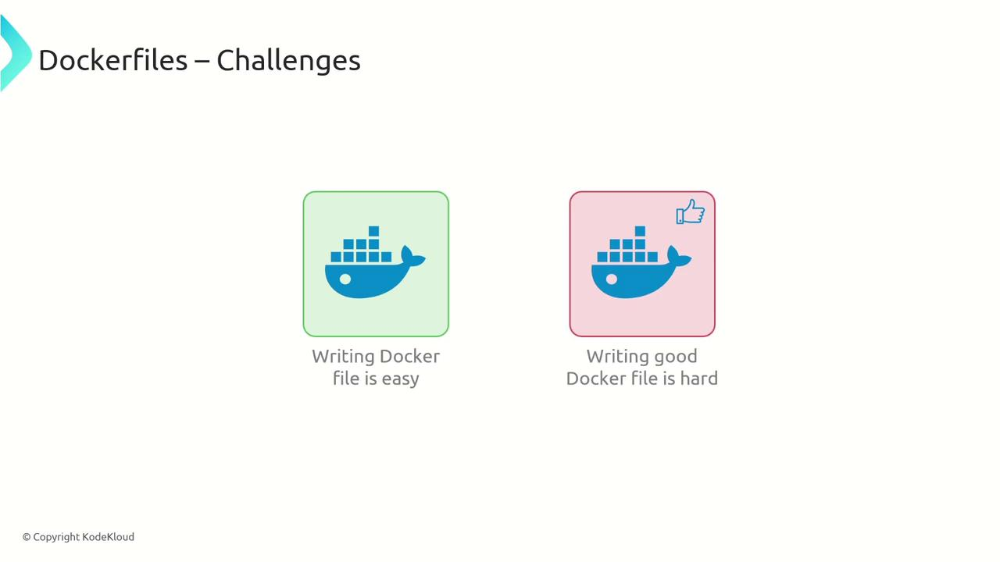
</Frame>

Many teams produce Dockerfiles that do not fully adhere to recommended best practices such as using trusted base images, avoiding running as the root user, leveraging multi-stage builds to reduce image size, and grouping related instructions into layers.

<Frame>
  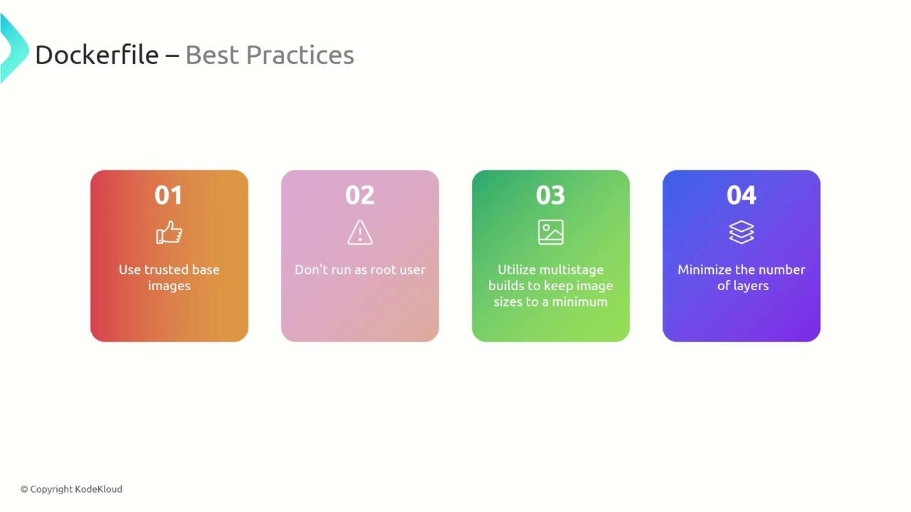
</Frame>

Within an organization, each team—be it handling authentication, front-end, or back-end—might craft their own Dockerfile, resulting in varying quality and potential security vulnerabilities.

<Frame>
  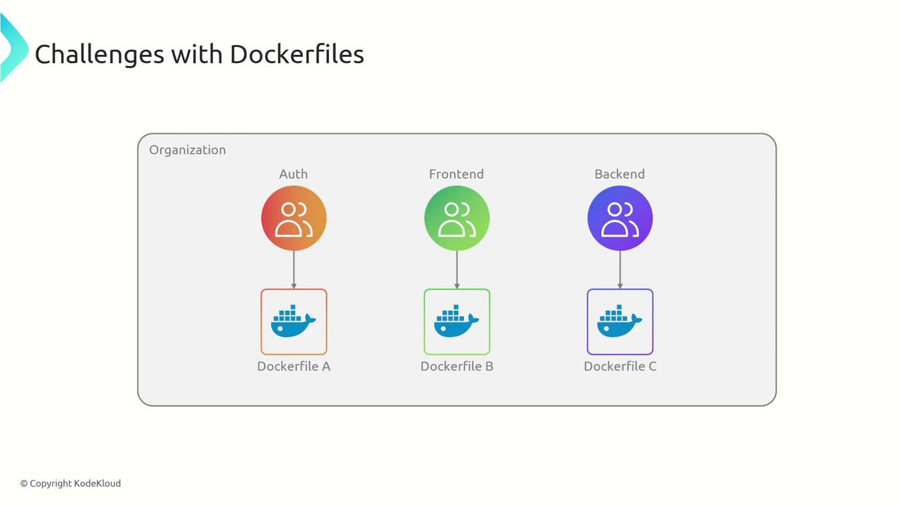
</Frame>

Additional challenges include:

* Variability in base images across teams leading to inconsistency.
* Triggered image rebuilds due to minor changes in base images.
* Difficulty in standardizing and reusing base images.
* Challenges with layer auditing and human error during manual creation.

<Frame>
  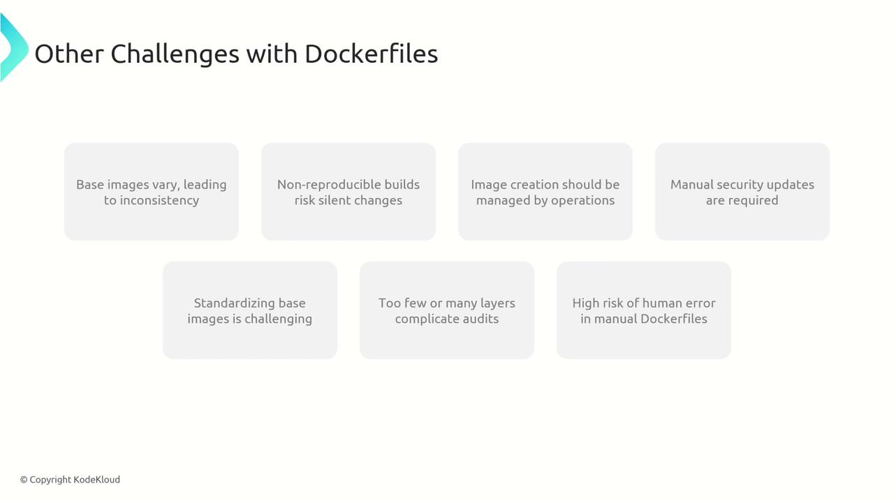
</Frame>

***

## Introducing CloudNative Buildpacks

CloudNative Buildpacks provide an automated solution to the challenges posed by Dockerfiles by streamlining the creation of OCI-compliant container images. Instead of manually maintaining Dockerfiles, developers can rely on buildpacks to analyze the application source code, choose the appropriate build process, and generate a container image.

Key features of buildpacks include:

* Language-agnostic support for runtimes such as Java, Ruby, .NET, Node.js, Go, Python, and more.
* Specific buildpacks for each programming language that detect and containerize the application automatically.
* A focus on code development while buildpacks manage dependency installation, configuration, and image creation.

To generate a container image with buildpacks, simply run the Pack CLI build command with your preferred image name:

```bash theme={null}
> pack build myapp
```

This command builds the container image automatically without needing a Dockerfile, abstracting away the details of dependency installation and configuration, regardless of the runtime.

***

## Benefits of Using CloudNative Buildpacks

CloudNative Buildpacks offer significant organizational and operational advantages over traditional Dockerfiles:

| Benefit                        | Description                                                                                          |
| ------------------------------ | ---------------------------------------------------------------------------------------------------- |
| Standardized Build Process     | Enforces a centralized, best-practice approach across teams for consistent image builds.             |
| Improved Security              | Centralized base images allow rapid security updates and produce detailed bills of materials.        |
| Separation of Responsibilities | Operations manage the build process, enabling developers to focus solely on code.                    |
| Efficient Rebasing             | Only the base layer is updated when changes occur, avoiding full rebuilds of all layers.             |
| Optimized Layering and Caching | Intelligent grouping of operations into shared layers reduces image size and accelerates deployment. |
| Layer Reusability              | Common runtime versions are shared between applications, lowering disk usage and speeding up pulls.  |

<Callout icon="lightbulb">
  CloudNative Buildpacks are ideal for multi-team environments where consistency and security are paramount.
</Callout>

* **Standardized Build Process:** Organizations can enforce centralized policies that benefit all teams, ensuring consistency in container image construction.

<Frame>
  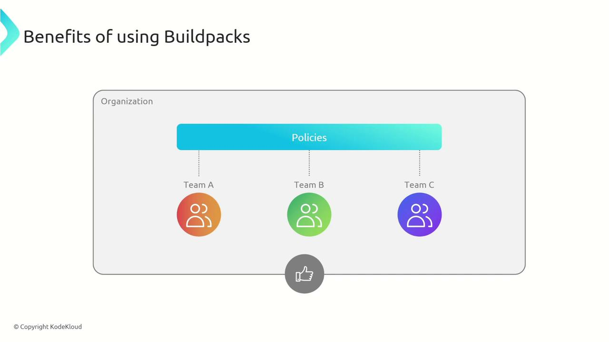
</Frame>

* **Improved Security and Auditing:** A single standardized base image streamlines security updates. Additionally, buildpacks generate a comprehensive bill of materials that details software versions, checksums, and licenses for easy auditing.

<Frame>
  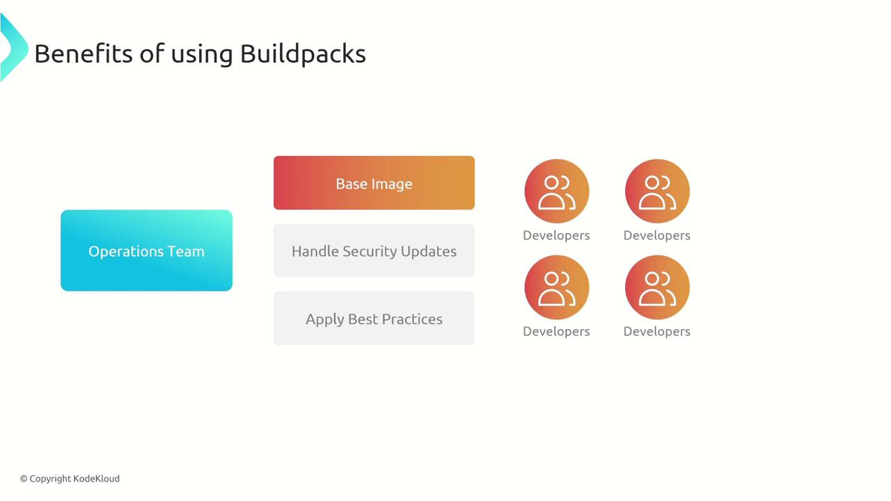
</Frame>

* **Separation of Responsibilities:** The operations team manages the build process, base images, and security policies so that developers can fully concentrate on writing code.

* **Efficient Rebasing:** When a base image update—such as a security patch—is necessary, buildpacks allow you to rebase the image efficiently, updating only the required layer.

<Frame>
  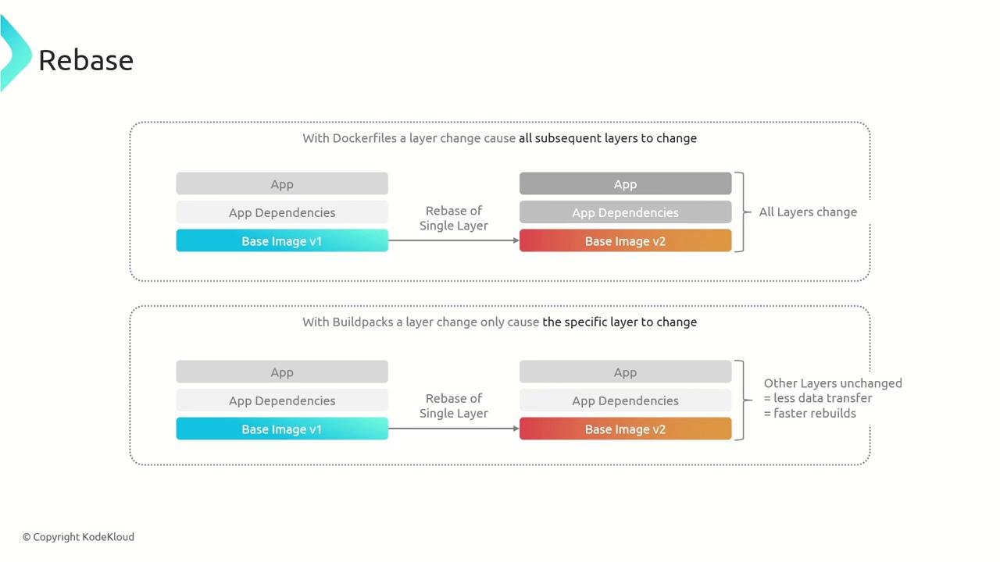
</Frame>

* **Optimized Layering and Caching:** Intelligent grouping allows only the changed layers to rebuild, reducing image size and storage needs. This also speeds up deployments, particularly in Kubernetes environments.

<Frame>
  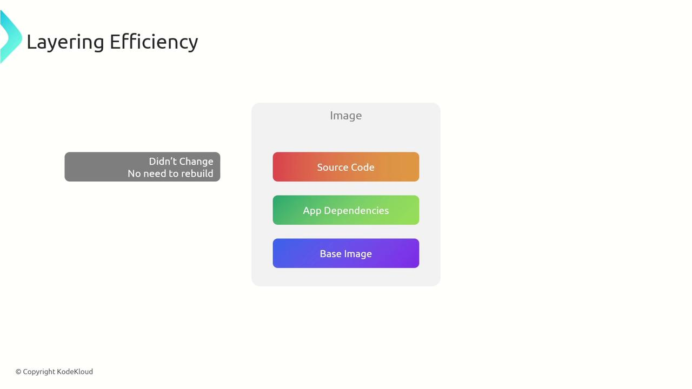
</Frame>

* **Layer Reusability:** When multiple applications use the same runtime, for example, Go v1.13, they share a common layer. This decreases storage usage and accelerates container pulls from registries.

<Frame>
  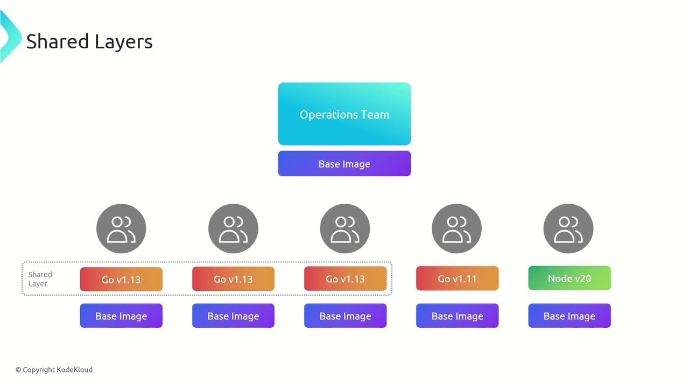
</Frame>

Consider a scenario in a Kubernetes node where two applications share the same runtime layer. Instead of downloading duplicate layers, the shared layer is reused, optimizing bandwidth and storage:

<Frame>
  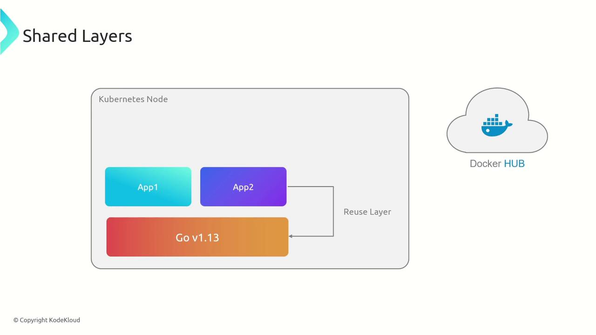
</Frame>

***

## Summary

CloudNative Buildpacks streamline the container image creation process while addressing many limitations of traditional Dockerfiles. The major benefits include:

* Automated build processes and dependency management.
* Consistent and rigorous adherence to best practices across development teams.
* Centralized management of base images and security updates by the operations team.
* Generation of detailed bills of materials for thorough auditing.
* Efficient rebasing that updates only modified layers, saving time.
* Optimized and reusable layers that reduce resource consumption and accelerate deployment.
* Support for multiple languages and frameworks, making them a versatile solution for diverse technology stacks.

Adopting CloudNative Buildpacks allows organizations to achieve secure, consistent, and efficient container image creation, freeing developers to focus on producing high-quality code while operations handle the build and deployment workflows.

<Callout icon="lightbulb">
  To further explore containerization best practices, consider visiting the [Kubernetes Documentation](https://kubernetes.io/docs/) and [Docker Hub](https://hub.docker.com/).
</Callout>

<CardGroup>
  <Card title="Watch Video" icon="video" href="https://learn.kodekloud.com/user/courses/cloud-native-buildpacks/module/d2170747-7a07-4648-b449-958edfff954b/lesson/7d21bacd-d56b-41d9-bb82-53fdca769607" />
</CardGroup>


# Introduction

Source: https://notes.kodekloud.com/docs/Cloud-Native-Buildpacks/Course-Introduction/Introduction/page

This course teaches how cloud native buildpacks enhance application development by streamlining build, package, and deployment processes for efficiency and scalability.

Hello, I'm Sanjeev Thiyagarajan, and welcome to the Cloud Native Buildpacks course. In this guide, you'll discover how cloud native buildpacks help developers build faster, more efficient, and scalable applications by streamlining the build, package, and deployment processes. By automating routine tasks, you can focus more on innovation and creativity.

Let's explore the key topics covered in this course.

<Frame>
  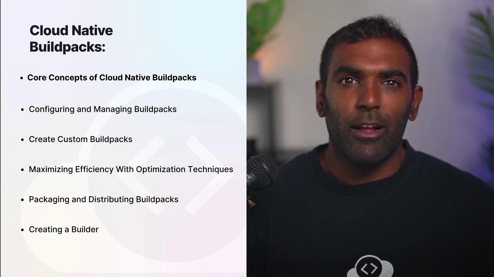
</Frame>

## Core Concepts of Cloud Native Buildpacks

We begin by diving into the core concepts of cloud native buildpacks. You will learn about their pivotal role in modern development, the benefits they bring to the software lifecycle, and how to master the Pack CLI for streamlined buildpack management.

## Configuring and Managing Buildpacks

Next, the course covers how to configure and manage your buildpacks. You will become familiar with the project.toml file, explore the benefits of rebasing for optimized builds, and learn how to create custom buildpacks tailored to your application's unique requirements.

## Buildpack Build Plans and Layers

The course also delves into buildpack build plans and layers, providing you with the skills to manage your application components with precision. Advanced techniques such as caching and optimization are discussed to enhance build efficiency.

## Packaging and Distributing Buildpacks

Packaging and distributing buildpacks is crucial for seamless integration into broader ecosystems. You will learn how to create builders that unify buildpacks and stacks into powerful environments.

## Installing the Pack CLI

At KodeKloud, we value community learning. You'll get guidance on installing the Pack CLI on your system so you can start building and experimenting right away.

The future of application development is here. Are you ready to build smarter, not harder? Enroll today and take the next step in revolutionizing your containerized application development process.

For more resources on cloud native technologies and best practices, check out [Cloud Native Buildpacks Documentation](https://buildpacks.io/docs/) and our other [learning resources](/learn).

<CardGroup>
  <Card title="Watch Video" icon="video" href="https://learn.kodekloud.com/user/courses/cloud-native-buildpacks/module/de8c11e5-2a31-4f82-86da-aa0b5a1b907f/lesson/ea239c7b-3648-40ba-8ced-4f01f048fcce" />
</CardGroup>
