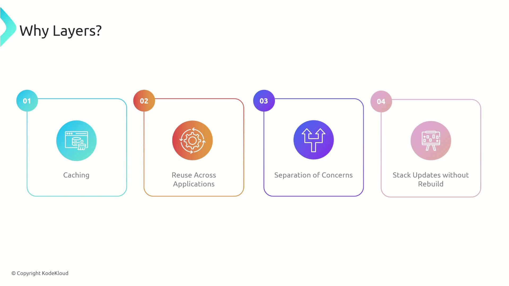
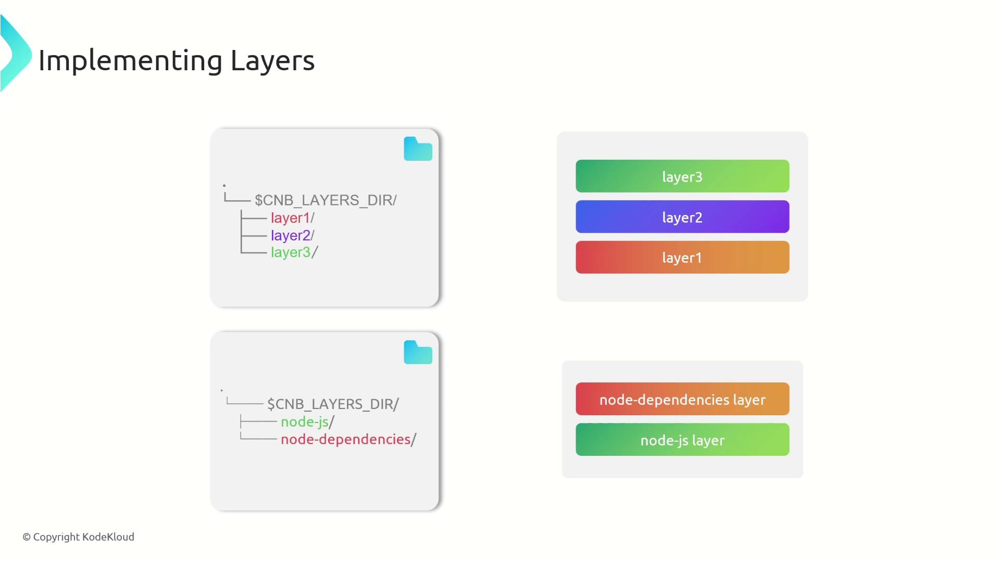
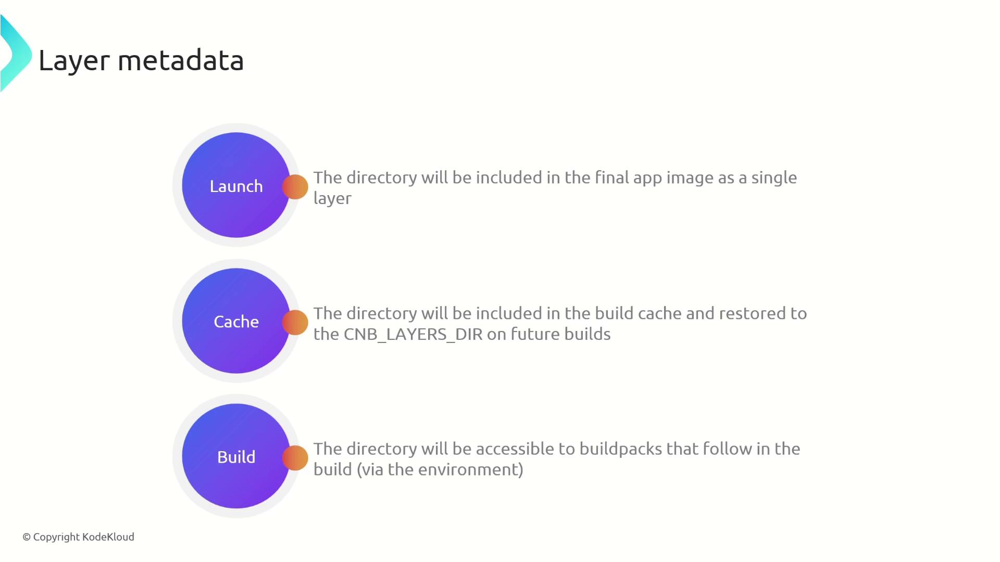
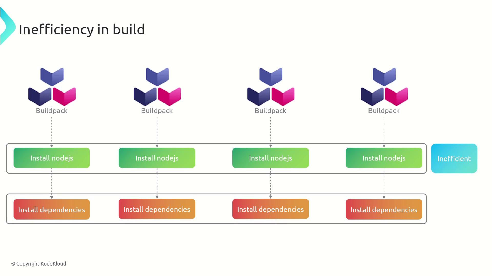
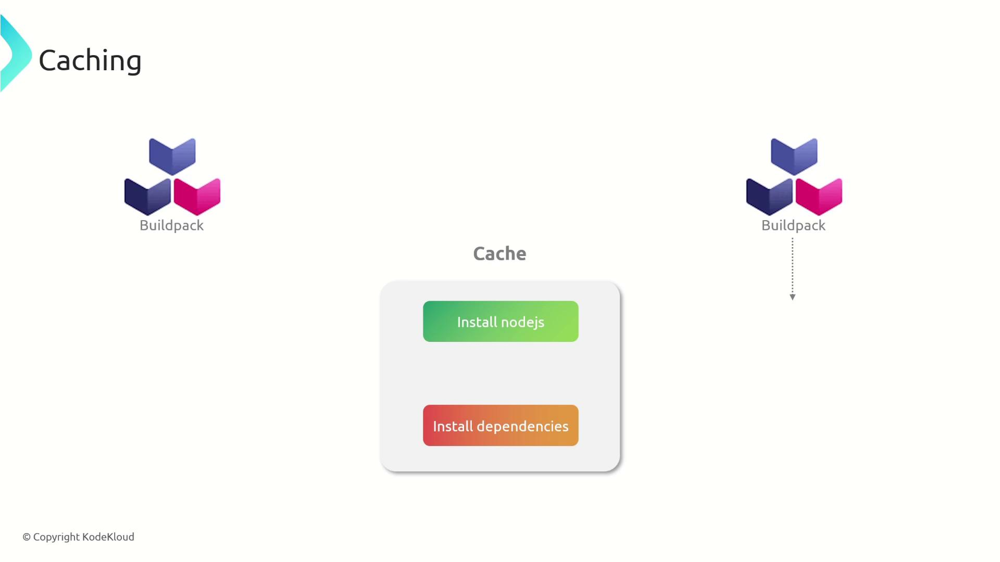

# Use Node 20.16 alpine as base image
FROM node:20.16-alpine3.19 AS base

# Copy the package.json and package-lock.json files to the /build directory
COPY package*.json ./

# Install production dependencies and clean the cache
RUN npm ci --omit=dev && npm cache clean --force

# Copy the entire source code into the container
COPY . .

# Start the application
CMD ["node", "src/server.js"]
```

Every step—from the base image selection to setting the entry point—creates a separate layer. This layering mechanism allows caches to be reused in subsequent builds. For example, if the Node.js installation layer remains unchanged, it is reused from cache, significantly reducing build time and workload.

<Callout icon="lightbulb">
  Consider structuring your Dockerfile commands to maximize caching. By separating operations like dependency installation and source code copying into distinct layers, you only need to rebuild layers that change.
</Callout>

Currently, our buildpack script builds everything in one layer. If any part of the process changes, the whole build must be repeated. Separating components into multiple layers—such as one for Node.js and another for dependencies—ensures that unchanged parts are cached and reused.

Below is an excerpt from our build script that downloads and extracts Node.js, installs dependencies, and leverages caching:

```bash theme={null}
#!/usr/bin/env bash
set -euo pipefail
echo "Building image using my-js-buildpack buildpack"
default_node_js_version="18.18.0"

# Retrieve the user's desired Node.js version
node_js_version=$(cat "${CNB_BP_PLAN_PATH}" | yj -t | jq -r '.entries[] | select(.name == "node-js") | .metadata.version' || echo ${default_node_js_version})
echo "nodejs version: ${node_js_version}"

echo "--> Downloading and extracting NodeJS"
node_js_url=https://nodejs.org/dist/v${node_js_version}/node-v${node_js_version}-linux-x64.tar.xz
wget -q -O - "${node_js_url}" | tar -xJf - --strip-components 1

echo "--> Installing Application Dependencies"
npm ci
```

By caching downloaded components in separate layers, subsequent builds skip redundant steps, resulting in faster and more efficient build processes.

## Benefits of Using Layers in Build Processes

Utilizing layers in your build process offers several key benefits:

| Benefit                   | Description                                                                                   |
| ------------------------- | --------------------------------------------------------------------------------------------- |
| Caching                   | Unchanged layers like the Node.js runtime are reused, speeding up builds by avoiding repeats. |
| Reuse Across Applications | Layers can be shared among multiple applications, reducing bandwidth and deployment times.    |
| Logical Separation        | Isolating components (runtime, dependencies, and application code) simplifies updates.        |
| Abstraction & Rebase      | Layers abstract your application from the underlying stack, allowing seamless rebase updates. |

<Frame>
  
</Frame>

## Creating Layers in Buildpacks

Buildpacks implement layers by structuring subdirectories under the environment variable directory CNB\_LAYERS\_DIR. Each subdirectory represents a layer in the final image. For example:

```text theme={null}
├── $CNB_LAYERS_DIR/
│   ├── layer1/
│   ├── layer2/
│   └── layer3/
```

For instance, to separate concerns, you may create one layer for the Node.js runtime and another for application dependencies. When Node.js is downloaded, its binaries can be stored in the "node-js" directory, while npm-installed dependencies reside in "node-dependencies". Each layer is then configured with its corresponding metadata file.

<Frame>
  
</Frame>

### Layer Metadata

Each layer uses a TOML configuration file (named identically to the layer with a `.toml` extension) to dictate its behavior. The metadata includes three primary settings:

* **launch:** If set to true, the layer is included in the final application image.
* **cache:** Determines whether the layer is stored in the build cache.
* **build:** Indicates if the layer should be available to subsequent buildpacks during the build phase.

For runtime layers like Node.js and application dependencies, set `launch` to true.

<Frame>
  
</Frame>

A typical TOML configuration for a runtime layer might look like this:

```toml theme={null}
launch = true
cache = false
build = false
```

## Implementing the Node.js and Dependencies Layers

Below are step-by-step instructions to create two distinct layers for your buildpack: one for the Node.js runtime and one for your application dependencies.

### Node.js Runtime Layer

Create a folder for the Node.js runtime layer under CNB\_LAYERS\_DIR and download Node.js into that directory. Then create the corresponding metadata file:

```sh theme={null}
# Create the Node.js runtime layer directory
node_js_layer="${CNB_LAYERS_DIR}/node-js"
mkdir -p "${node_js_layer}"

default_node_js_version="18.18.0"
# Retrieve the user's desired Node.js version
node_js_version=$(cat "$CNB_BP_PLAN_PATH" | yj -t | jq -r '.entries[] | select(.name == "node-js") | .metadata.version' || echo ${default_node_js_version})
echo "nodejs version: ${node_js_version}"

echo "---> Downloading and extracting NodeJS"
node_js_url=https://nodejs.org/dist/v${node_js_version}/node-v${node_js_version}-linux-x64.tar.xz
wget -q -O "${node_js_url}" | tar -xJf - --strip-components 1 -C "${node_js_layer}"

# Configure the Node.js layer to be available at launch time
cat > "${CNB_LAYERS_DIR}/node-js.toml" << EOL
[types]
build = false
launch = true
cache = false
EOL
```

### Node Modules (Dependencies) Layer

Create a separate layer for your Node.js dependencies. By copying package files, installing dependencies in the layer, and creating a symbolic link to the working directory, you ensure that dependencies are efficiently managed and available at runtime:

```sh theme={null}
workdir=$(pwd)
# Create layer for the node_modules
node_modules_layer="${CNB_LAYERS_DIR}/node-dependencies"
mkdir -p "${node_modules_layer}"

echo "---> Installing Application Dependencies"
# Copy package.json and package-lock.json to the layer
cp package*.json "${node_modules_layer}"

# Install dependencies in the layer
cd "${node_modules_layer}"
npm ci
cd "$workdir"

# Symlink to make the node_modules directory available in the working directory
ln -s "${node_modules_layer}/node_modules" "/workspace/node_modules"

# Configure the node_dependencies layer metadata
cat > "${node_modules_layer}.toml" << EOL
[types]
build = false
launch = true
cache = false
EOL
```

<Callout icon="lightbulb">
  By separating your build process into distinct layers for runtime and dependencies, you enable efficient caching, faster builds, and easier updates when only parts of your application change.
</Callout>

## Conclusion

Organizing your buildpack with dedicated layers for the Node.js runtime and application dependencies offers significant advantages:

* Faster and more efficient builds through effective caching.
* Reduced bandwidth usage and improved reuse across applications.
* Logical separation that simplifies updates and maintenance.

Utilizing these practices will help you achieve consistent, reproducible builds while optimizing your containerization workflow. For further reading on Docker optimization and buildpack strategies, refer to the [Docker Documentation](https://docs.docker.com/) and [Buildpacks Documentation](https://buildpacks.io/).

Happy building!

<CardGroup>
  <Card title="Watch Video" icon="video" href="https://learn.kodekloud.com/user/courses/cloud-native-buildpacks/module/0e306774-3067-4e23-9115-f3185d2ffa28/lesson/47831334-40d2-4998-803e-d1d0010c04d9" />
</CardGroup>


# Caching

Source: https://notes.kodekloud.com/docs/Cloud-Native-Buildpacks/Creating-Buildpacks/Caching/page

This article explores implementing caching in a buildpack to streamline the build process and reduce redundant work during repeated builds.

In this article, we explore how to implement caching within a buildpack to streamline the build process. Caching eliminates redundant work during repeated builds by storing pre-built layers, such as the Node.js runtime and application dependencies. Without caching, each build would require reinstalling Node.js and downloading all dependencies from scratch—an inefficient and time-consuming process.

<Frame>
  
</Frame>

By implementing caching, our buildpack creates reusable layers. For example, one layer is dedicated to Node.js and another to dependencies (node\_modules). These layers are stored and reused in subsequent builds, significantly reducing build times by avoiding unnecessary downloads and installations.

<Frame>
  
</Frame>

Below, we detail how caching is implemented for both the Node.js runtime layer and the node\_modules layer.

***

## Caching the Node.js Layer

To enable caching for the Node.js layer, we modify the `project.toml` file to set the cache property to true and include additional metadata, such as the Node.js version. The script below demonstrates how the desired Node.js version is retrieved from the build plan, compares it with the cached version, and determines whether to download and extract Node.js or reuse the existing cached version:

```bash theme={null}
