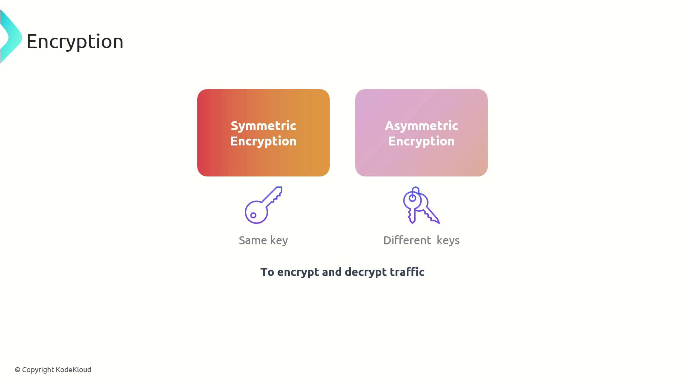
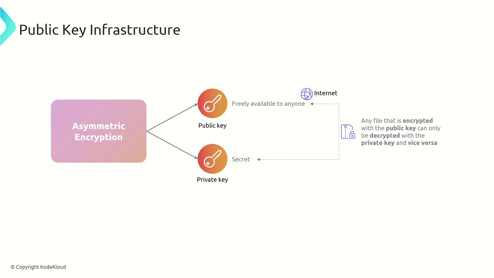
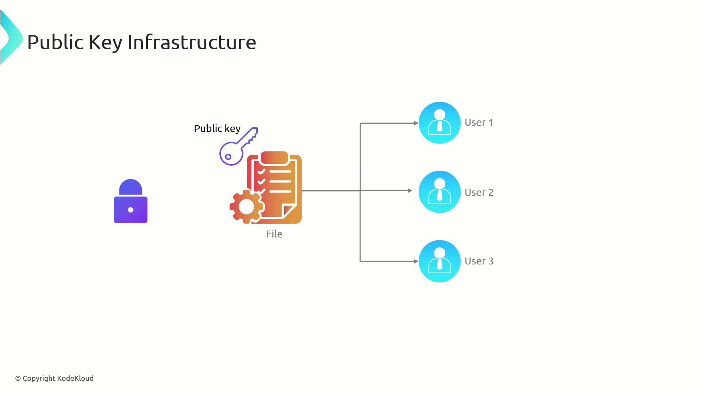
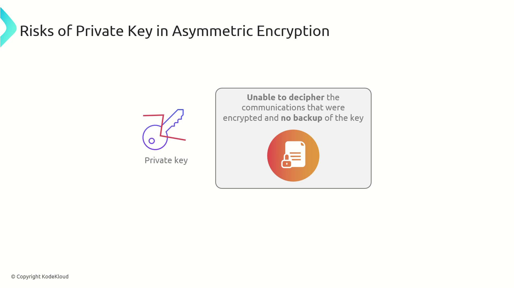
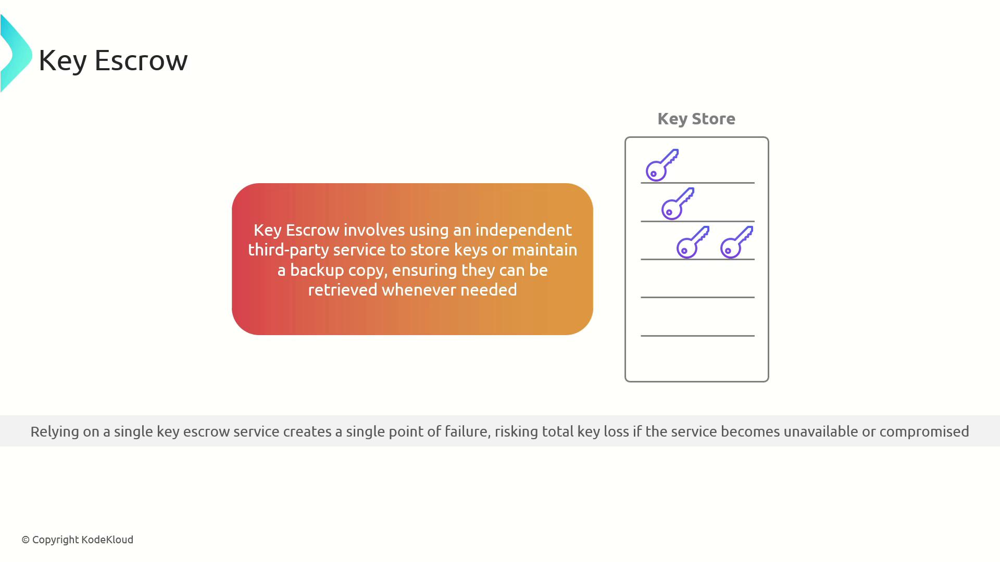
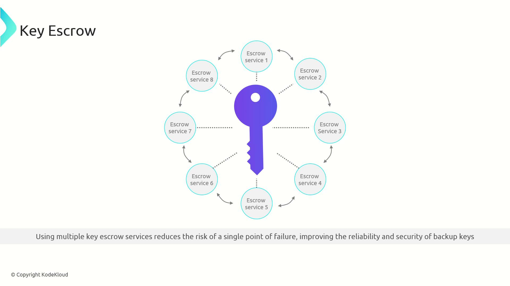

# PKI

Source: https://notes.kodekloud.com/docs/CompTIA-Security-Certification/Controls-and-Security-Concepts/PKI/page

This article explains Public Key Infrastructure (PKI) and its role in securing communications through asymmetric encryption and key management.

Welcome to our comprehensive lesson on encryption, where we dive into Public Key Infrastructure (PKI) and its role in securing communications.

## Understanding Encryption Methods

Earlier, we examined two fundamental encryption methods:

* **Symmetric Encryption:** Uses the same key for both encryption and decryption.
* **Asymmetric Encryption:** Utilizes a pair of keys—one public and one private—for encryption and decryption respectively.

<Frame>
  
</Frame>

## How Asymmetric Encryption Works in PKI

In asymmetric encryption, one key encrypts the data while a different key decrypts it. The two keys are defined as follows:

* **Public Key:** Shared openly and often made available on the Internet.
* **Private Key:** Kept confidential and stored securely.

Any file encrypted with the public key can only be decrypted using its matching private key, and vice versa. This mechanism is fundamental to PKI.

<Frame>
  
</Frame>

<Callout icon="lightbulb">
  Keep your private key secure at all times to maintain the integrity of your encrypted communications.
</Callout>

## Verifying Authenticity with Digital Signatures

Digital signatures are a crucial application of PKI. They allow users to verify the authenticity and integrity of shared files. For example, when distributing software, you can generate a digital signature by processing the file with your private key. Recipients can then use your public key to verify:

* The file's authenticity, confirming it originates from you.
* That the file has not been altered.

<Frame>
  
</Frame>

## Secure File Exchange

PKI also enables secure file transmission. When you make your public key available, anyone can encrypt a file for you. Only you can decrypt it with your private key, ensuring secure communication.

<Callout icon="triangle-alert">
  Never share your private key. Its confidentiality is essential for protecting your encrypted data.
</Callout>

## Key Management and Key Escrow

Managing private keys is critical. If a private key is lost or damaged without a backup, any data encrypted with its associated public key becomes inaccessible.

<Frame>
  
</Frame>

To mitigate this risk, secure backups are necessary. One method is key escrow, which involves storing a backup copy of your keys with a trusted third-party service. To further increase security, you can distribute key components across multiple escrow services, ensuring that the failure of one does not compromise your data.

<Frame>
  
</Frame>

<Frame>
  
</Frame>

## Summary

Public Key Infrastructure (PKI) leverages asymmetric encryption by using paired public and private keys to secure communications and verify data integrity. Its applications range from digital signatures to secure file exchanges, while key escrow offers a robust method for key management.

For more information on encryption and cybersecurity methodologies, explore additional resources from reputable sources and stay updated on the latest best practices.

<CardGroup>
  <Card title="Watch Video" icon="video" href="https://learn.kodekloud.com/user/courses/comptia-security-certification/module/1846e159-7ab4-46d3-be5d-95c1a0eb51b9/lesson/ebb773b6-47de-4e8b-b021-eaad4e2b4ce5" />
</CardGroup>
