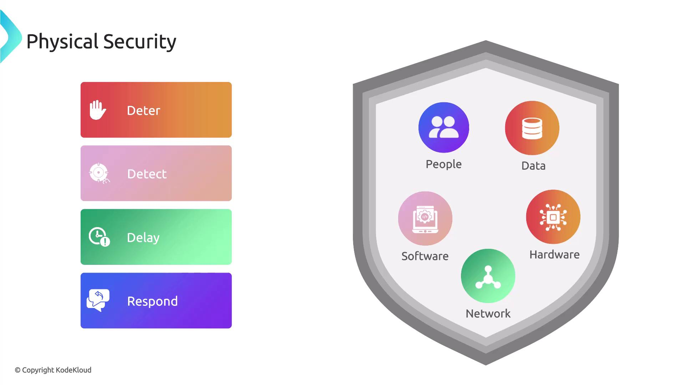
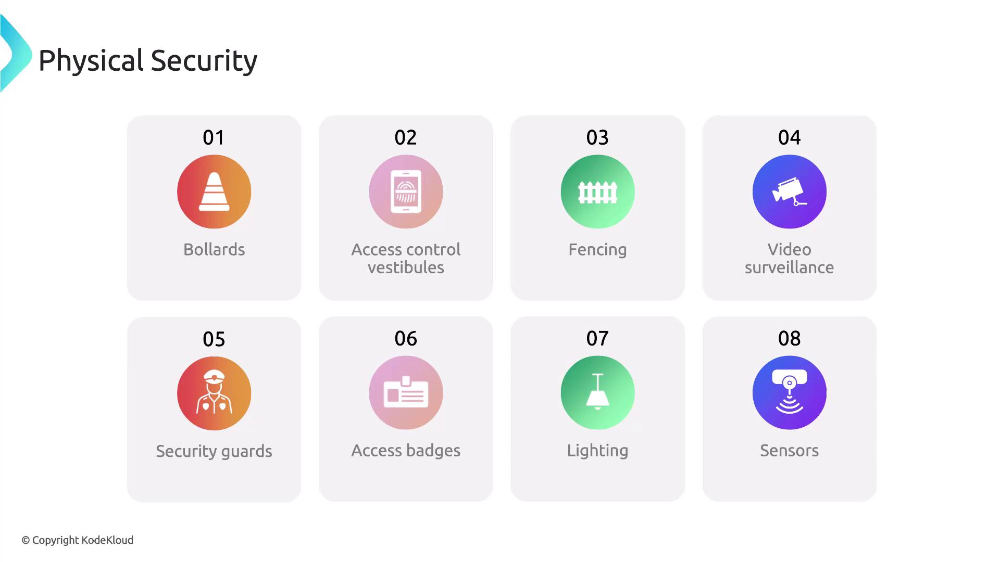
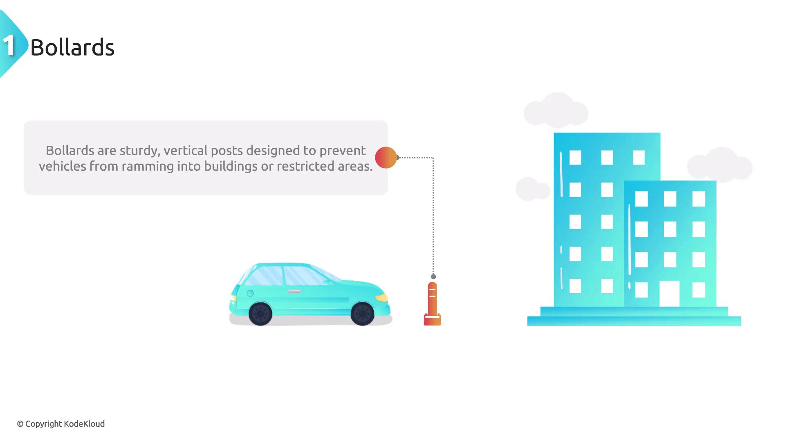
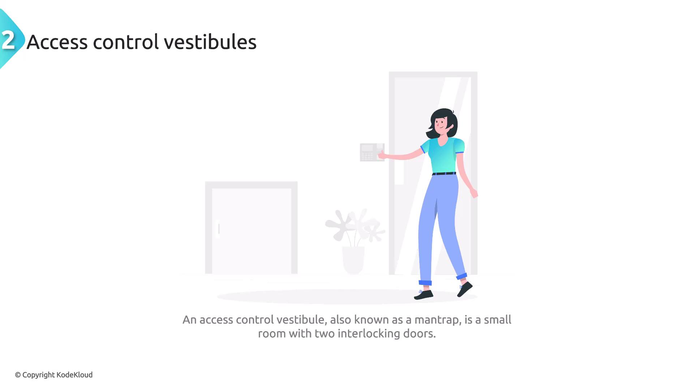
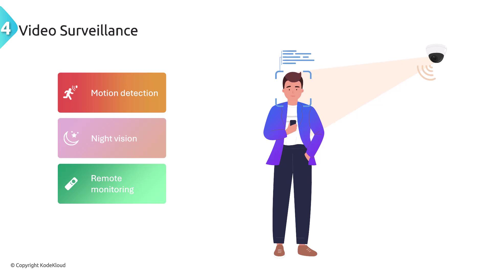
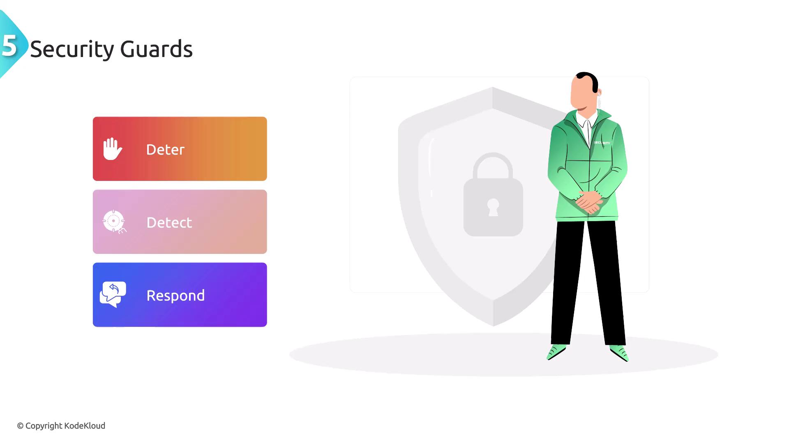
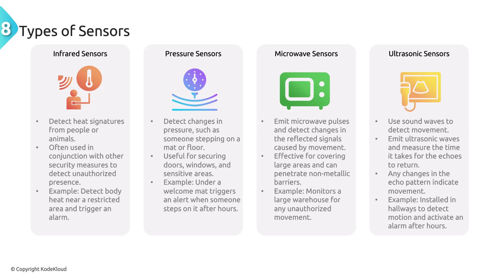
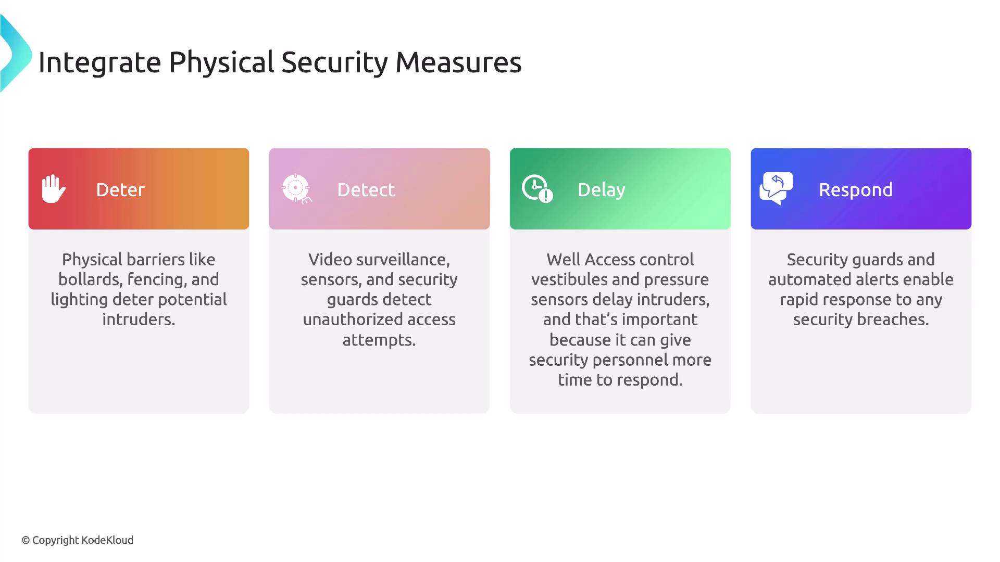
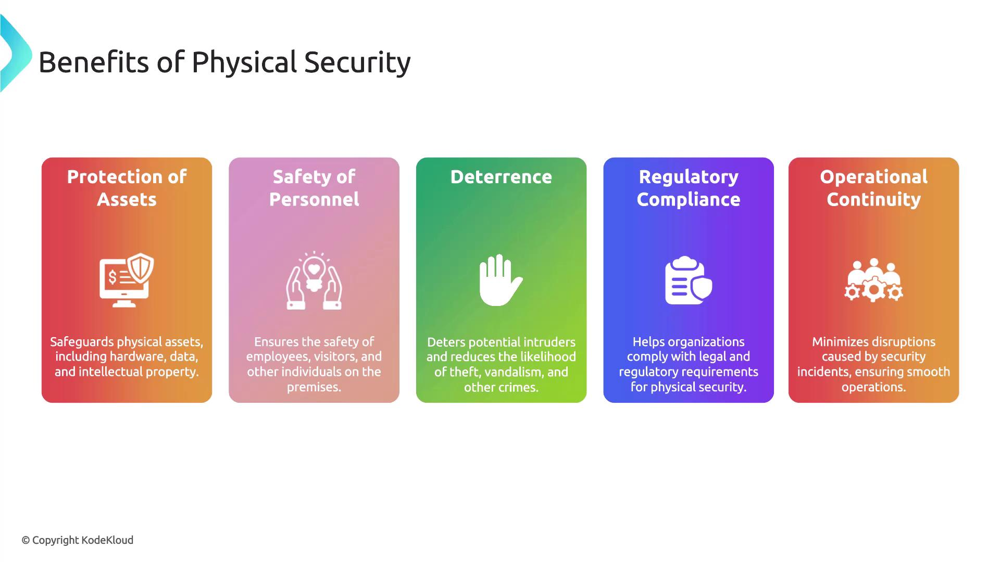

# Physical Security

Source: https://notes.kodekloud.com/docs/CompTIA-Security-Certification/Controls-and-Security-Concepts/Physical-Security/page

This article explains the importance of physical security measures to protect organizational assets, personnel, and infrastructure from various physical threats.

Welcome to this comprehensive lesson on physical security, a crucial facet of overall organizational security that is sometimes overlooked. While cybersecurity focuses on protecting digital assets, physical security ensures the safety of the tangible infrastructure that supports them. In this article, we explain how multiple security measures work together to secure your premises, assets, and personnel from potential physical threats.

Physical security is designed to protect people, hardware, software, networks, and data from physical actions and events that could cause significant damage or loss. These threats include fire, natural disasters, burglary, theft, vandalism, and terrorism. Effective physical security employs several layers of defense to deter, detect, delay, and respond to unauthorized access.

<Frame>
  
</Frame>

Some of the key components of physical security include bollards, access control vestibules, fencing, video surveillance, security guards, access badges, lighting, and sensors. Below is an overview of each component.

<Frame>
  
</Frame>

## Bollards

Bollards are robust vertical posts that prevent vehicles from ramming into buildings or restricted areas. These posts can be either fixed or retractable and are typically installed at building entry points and around sensitive zones.

<Frame>
  
</Frame>

For example, strategically placed bollards at a building's entrance can prevent vehicles from breaching the lobby area.

## Access Control Vestibule

An access control vestibule, sometimes called a mantrap, is a small room with two interlocking doors that ensure only one door can be opened at a time. This design ensures that individuals must pass through one at a time and have their identity verified before gaining access to secure areas.

<Frame>
  
</Frame>

For instance, many banks use access control vestibules to verify the identity of customers as they transition from the public area into more secure zones.

## Fencing

Fencing is employed to enclose a property's perimeter with a physical barrier that deters unauthorized entry. Depending on security requirements, fences may be made from chain link, barbed wire, or electrified wire. For example, a data center might utilize high-security fencing topped with barbed wire to thwart unauthorized access.

## Video Surveillance

Video surveillance uses cameras to continuously monitor and record activity around a facility. Modern surveillance systems feature motion detection, night vision, and remote monitoring. Although cameras alone may not prevent incidents, they are highly effective in monitoring customer activities and deterring theft.

<Frame>
  
</Frame>

## Security Guards

A human presence in the form of security guards plays a pivotal role in deterring, detecting, and responding to security events. Trained to patrol premises, monitor access points, and handle emergencies, security guards remain an integral component of any physical security framework.

<Frame>
  
</Frame>

## Access Badges

Access badges, often embedded with magnetic strips, barcodes, or RFID chips, enable organizations to control and monitor entry into secure areas. These identification cards are used to ensure only authorized individuals can access specific zones.

<Frame>
  
</Frame>

## Lighting

Proper lighting is an essential yet often overlooked security measure. Adequate illumination not only deters unauthorized access by exposing potential intruders but also enhances the effectiveness of surveillance systems. Areas with proper lighting make it more difficult for intruders to hide, and motion-activated lighting can further eliminate dark spots during periods of inactivity.

## Sensors

Sensors are critical in detecting and responding to physical activity within a defined area. They vary in type and functionality to monitor different kinds of intrusion or environmental changes. The main types include:

### Infrared Sensors

Infrared sensors detect heat signatures from people or animals. These sensors are often used in combination with other devices to detect unauthorized presence. For example, an infrared sensor may detect body heat near a restricted zone and trigger an alarm.

### Pressure Sensors

Pressure sensors monitor changes in pressure—such as the weight of someone stepping on a surface. They are useful in securing doors, windows, and sensitive areas. An example is a pressure sensor placed under a welcome mat that triggers an alert after business hours.

### Microwave Sensors

Microwave sensors emit pulses and measure the alterations in reflected signals caused by movement. They are effective in monitoring large areas and can penetrate non-metallic barriers. For instance, a warehouse may deploy microwave sensors to monitor for unauthorized movement.

### Ultrasonic Sensors

Ultrasonic sensors use sound waves to detect movement. They emit ultrasonic pulses and measure the time it takes for echoes to return. Any change in the echo pattern indicates movement. These sensors are commonly installed in hallways to trigger alarms when detecting motion after hours.

<Frame>
  
</Frame>

## Integrating Physical Security Measures

An effective physical security strategy is based on integrating multiple layers of security to create a robust defense system:

* Deter: Use physical barriers such as walls, fencing, and lighting to discourage intruders.
* Detect: Enhance visibility through video surveillance, sensors, and vigilant security personnel.
* Delay: Employ mechanisms like access control vestibules and pressure sensors to slow down unauthorized entry, giving security teams valuable time to respond.
* Respond: Rely on trained security guards and automated alerts to swiftly manage incidents.

<Frame>
  
</Frame>

## Benefits of Physical Security

Implementing comprehensive physical security measures provides numerous advantages:

| Benefit                | Description                                                                         |
| ---------------------- | ----------------------------------------------------------------------------------- |
| Asset Protection       | Safeguards physical assets such as hardware, data, and intellectual property.       |
| Personnel Safety       | Ensures the well-being of employees, visitors, and all individuals on the premises. |
| Deterrence             | Reduces the risk of theft, vandalism, and other criminal activities.                |
| Regulatory Compliance  | Assists in meeting legal and regulatory requirements.                               |
| Operational Continuity | Minimizes disruptions and maintains business operations during incidents.           |

<Frame>
  
</Frame>

## Challenges and Considerations

While robust physical security is essential, there are several challenges that need to be addressed:

* Cost: Implementing and maintaining physical security measures requires a significant investment.
* Maintenance: Continuous upkeep is necessary to ensure that security systems remain effective.
* Integration: Coordinating multiple security components to work harmoniously can be complex.
* Human Factor: Security personnel must receive ongoing training and maintain vigilance to respond effectively during emergencies.

<Callout icon="triangle-alert">
  Keep in mind that while the initial investment in physical security can be high, the long-term benefits—such as enhanced safety, regulatory compliance, and reduced risk of loss—make it a crucial component of any comprehensive security strategy.
</Callout>

By integrating elements such as bollards, access control vestibules, fencing, video surveillance, security guards, access badges, lighting, and sensors, organizations can build a layered defense system that protects both assets and personnel. Despite the challenges, the advantages of implementing a robust physical security plan far outweigh the associated costs and complexities.

For more information on securing your infrastructure, consider exploring additional resources such as [Kubernetes Documentation](https://kubernetes.io/docs/) for system protection and [Docker Hub](https://hub.docker.com/) for container security solutions.

<CardGroup>
  <Card title="Watch Video" icon="video" href="https://learn.kodekloud.com/user/courses/comptia-security-certification/module/1846e159-7ab4-46d3-be5d-95c1a0eb51b9/lesson/46db5742-4cc0-4806-8ac8-7d881b0be2ea" />
</CardGroup>
