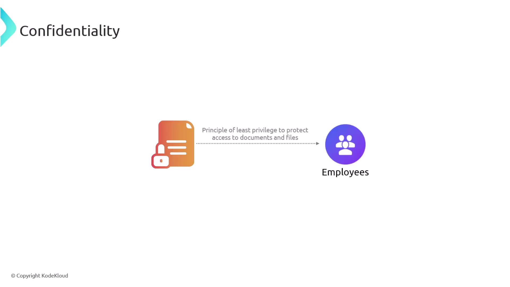
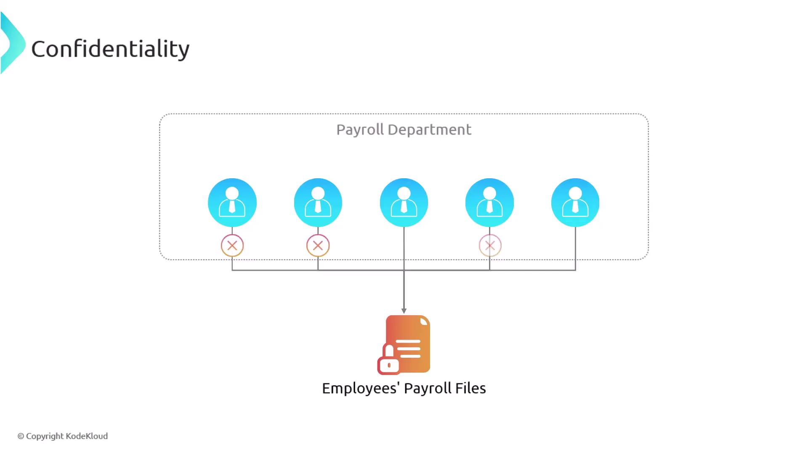
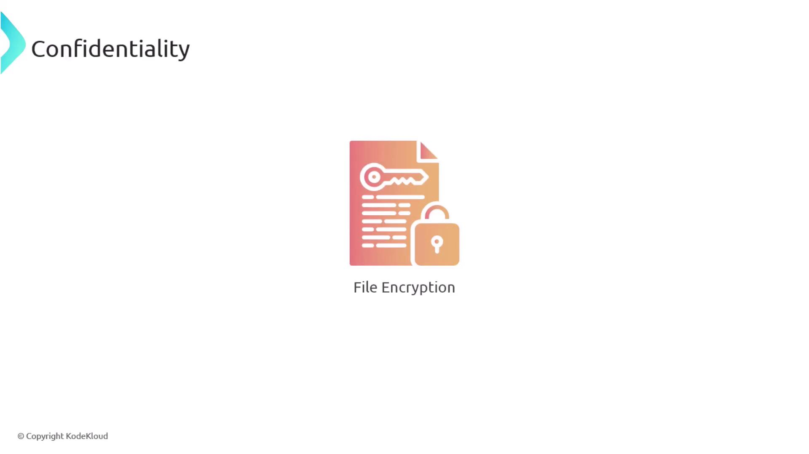
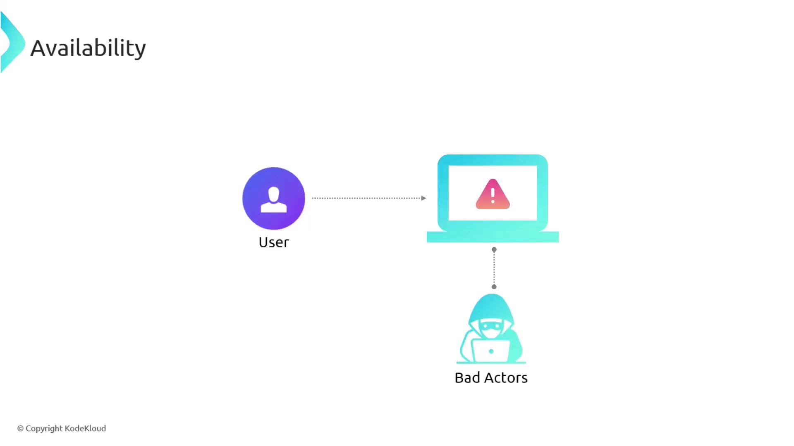
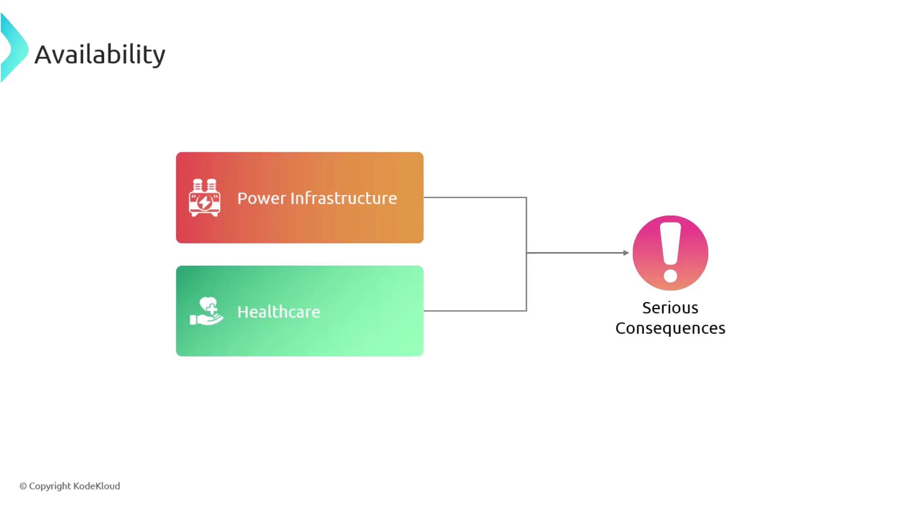
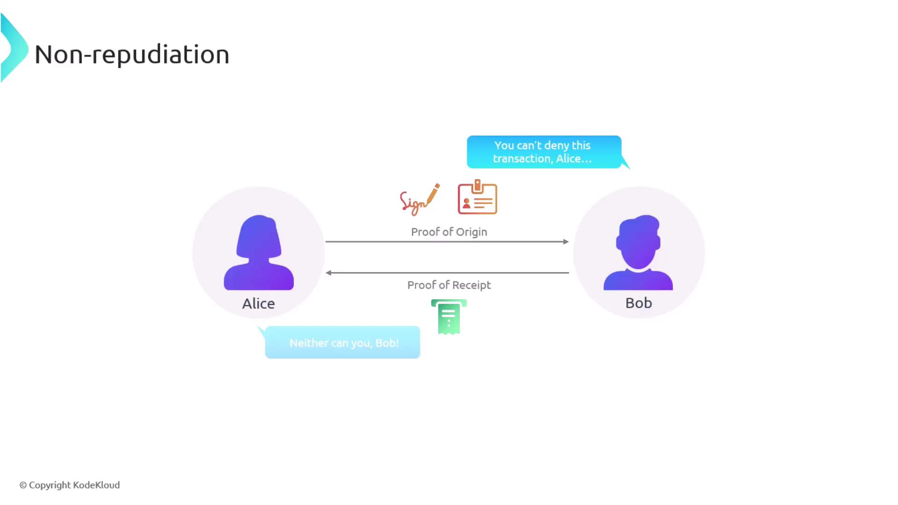

# The CIA triad

Source: https://notes.kodekloud.com/docs/CompTIA-Security-Certification/Controls-and-Security-Concepts/The-CIA-triad/page

This article explains the CIA triad, focusing on Confidentiality, Integrity, and Availability in information security to protect sensitive data and maintain secure systems.

In this article, we delve into one of the most fundamental concepts in information security: the CIA triad, which stands for Confidentiality, Integrity, and Availability. Understanding these principles is essential for protecting sensitive data and maintaining secure systems.

## Confidentiality

Confidentiality is about ensuring that sensitive information is accessible only to authorized individuals. One of the primary methods to achieve this is by implementing the principle of least privilege. This approach restricts users to the minimum level of access necessary for their roles. For example, within a large payroll department, not every employee should have full access to all payroll files. Limiting access decreases the risk of unauthorized viewing and minimizes potential targets for hackers.

<Frame>
  
</Frame>

Consider a payroll department where detailed access to payroll files is granted only to select individuals required for their role. This controlled access significantly reduces the chances of a security breach.

<Frame>
  
</Frame>

Another effective security measure is file encryption. Even if an unauthorized party manages to access encrypted files, they cannot decipher the content without the proper decryption keys.

<Frame>
  
</Frame>

<Callout icon="lightbulb">
  Implementing strict access controls and encryption practices is critical for safeguarding sensitive data.
</Callout>

## Integrity

Integrity ensures that data remains accurate and unaltered during storage or transmission. Although integrity measures may not completely prevent unauthorized modifications, they are designed to detect when a file or document has been tampered with. One common technique used to verify data integrity is employing hash functions. A hash function converts a file into a unique string of characters—a digital fingerprint. Even a minor change, such as an extra space, will result in a completely different hash.

For instance, when sending a document, the original hash is computed and sent alongside it. Upon receipt, the same hash function is applied to the document. If both hash values match, it confirms that the document remains unmodified and its integrity is intact.

## Availability

Availability is the assurance that information systems and data are accessible to authorized users when needed. Maintaining system availability is crucial because many malicious actors aim to disrupt services and render systems inaccessible. Such disruptions can lead to severe financial losses and critical failures in industries like power infrastructure and healthcare.

<Frame>
  
</Frame>

For example, systems that support emergency healthcare services must remain accessible at all times to avoid life-threatening situations.

<Frame>
  
</Frame>

<Callout icon="triangle-alert">
  Downtime in critical systems like healthcare and power infrastructure can lead to catastrophic outcomes. Ensure you have robust redundancy and failover strategies in place.
</Callout>

## Nonrepudiation

Beyond the fundamental pillars of the CIA triad, nonrepudiation is another important concept in information security. Nonrepudiation guarantees that the sender of a message cannot later deny sending it. This is achieved by ensuring that there is definitive proof of the message origin and transmission, typically through the use of digital signatures or transaction logs. When nonrepudiation measures are in place, any attempt to repudiate a message is met with irrefutable evidence that confirms the sender’s identity.

<Frame>
  
</Frame>

Understanding and implementing the principles of the CIA triad, along with nonrepudiation, is essential for building and maintaining secure systems that can reliably protect critical data and operations.

<CardGroup>
  <Card title="Watch Video" icon="video" href="https://learn.kodekloud.com/user/courses/comptia-security-certification/module/1846e159-7ab4-46d3-be5d-95c1a0eb51b9/lesson/b772f9df-a7b1-44c8-bc15-9b584fdccf48" />
</CardGroup>
