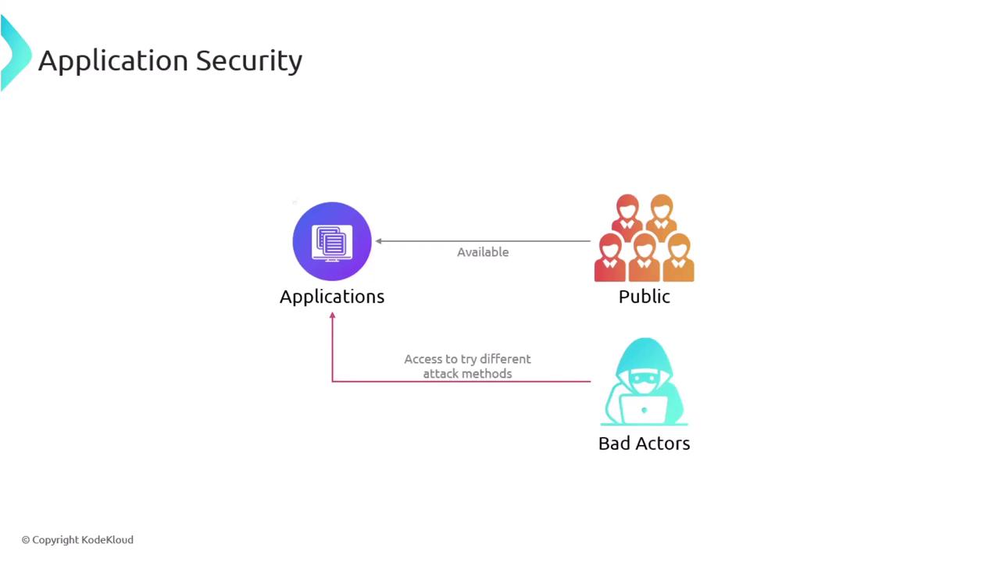
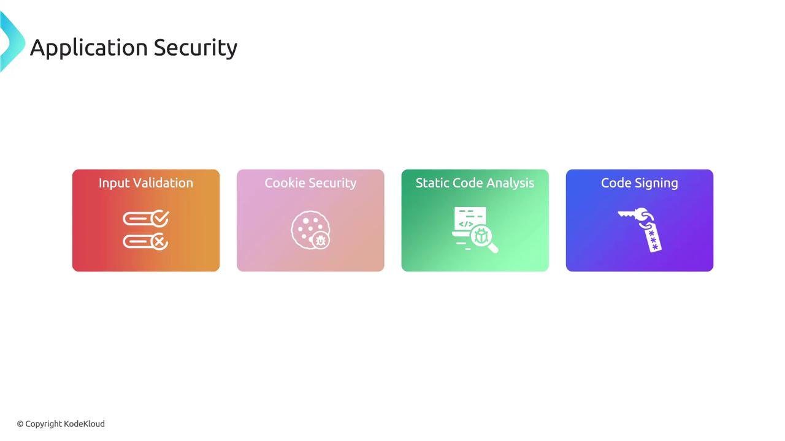
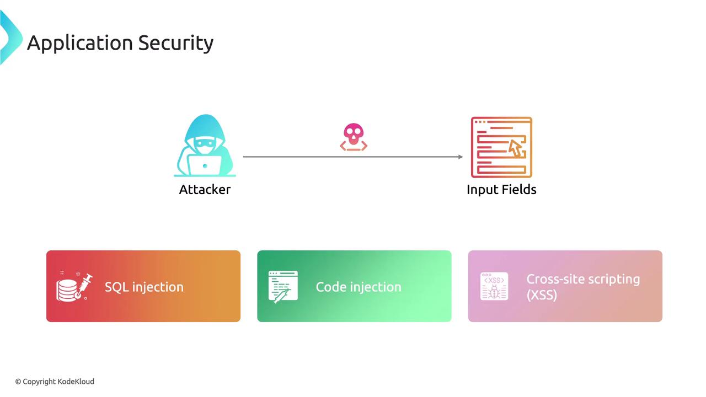
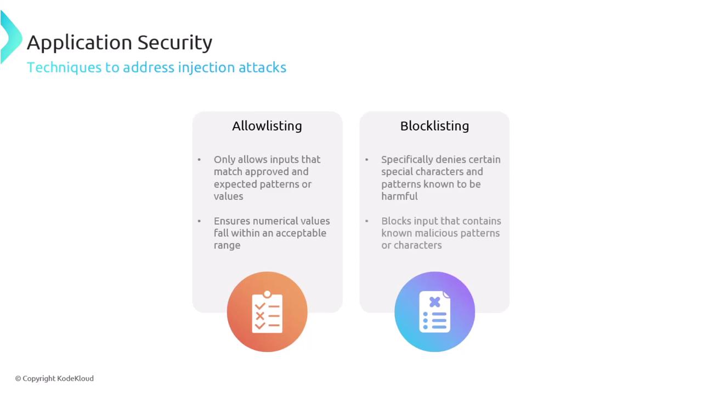
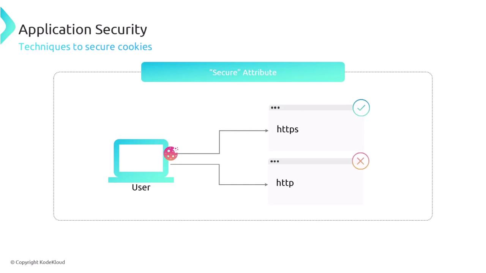
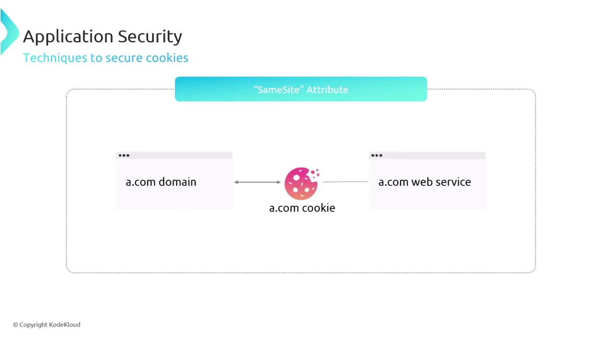

# Application Security

Source: https://notes.kodekloud.com/docs/CompTIA-Security-Certification/Security-Operations/Application-Security/page

This article discusses application security, focusing on vulnerabilities, mitigation strategies, and best practices to protect against malicious attacks.

Application vulnerabilities pose a significant risk in today’s digital landscape. When an application is made public, it becomes a target not only for legitimate users but also for malicious actors seeking to exploit vulnerabilities. Strengthening application security is critical to safeguarding network resources and maintaining user trust.

<Frame>
  
</Frame>

To mitigate these risks, it is essential to implement robust application security practices. Core measures include input validation, cookie security, static code analysis, and code signing.

<Frame>
  
</Frame>

<Callout icon="lightbulb">
  Implementing a comprehensive security strategy helps prevent unauthorized access and data breaches. Prioritize these measures early in the development lifecycle to reduce risk.
</Callout>

## Input Validation

Input validation plays a pivotal role in defending against injection attacks. By verifying and sanitizing user inputs, you limit the ability of threat actors to submit malicious data. Failure to validate inputs properly may enable attackers to exploit vulnerabilities through SQL injection, code injection, cross-site scripting (XSS), and other methods.

<Frame>
  
</Frame>

Effective strategies for mitigating these risks include:

* **Allow Listing:** Define approved patterns or values, ensuring that inputs match expected criteria.
* **Block Listing:** Identify and deny inputs containing harmful characters or patterns, such as ensuring numerical ranges are within acceptable limits.

<Frame>
  
</Frame>

## Static Code Analysis

Static code analysis is an integral part of the secure software development process. By examining source code without executing it, potential vulnerabilities and errors can be identified early. This proactive approach ensures that issues are addressed before software deployment, enhancing overall reliability and security.

## Code Signing

Code signing uses digital signatures to verify both the authenticity and integrity of software. This process confirms that the software originates from a trusted source and remains unaltered post-release. Code signing is crucial for maintaining user confidence and preventing distribution of tampered code.

## Cookie Security

Cookies are small data files stored by browsers to retain user settings, session states, and preferences. However, if not properly secured, cookies can be exploited through attacks such as cross-site scripting (XSS) or session hijacking. Implementing secure cookie practices is essential for protecting user data.

Key security techniques for cookies include:

* **Using the Secure Attribute:** This ensures cookies are transmitted only over HTTPS connections, providing strong encryption and data integrity protection.

<Frame>
  
</Frame>

* **Using the SameSite Attribute:** This attribute prevents cross-site request forgery (CSRF) attacks by limiting when cookies are sent, thereby protecting against unauthorized data exploitation.

<Frame>
  
</Frame>

<Callout icon="triangle-alert">
  Always ensure that all security practices are consistently applied across your application. Regular audits and updates are essential to adapt to evolving threats.
</Callout>

By integrating these security practices into your development and deployment processes, you can significantly enhance your application's defense against potential attack vectors and safeguard your digital assets.

For additional information and best practices on application security, consider exploring further resources from trusted industry documentation and security communities.

<CardGroup>
  <Card title="Watch Video" icon="video" href="https://learn.kodekloud.com/user/courses/comptia-security-certification/module/b13ce20f-66c3-4d31-b6df-23192480b4d4/lesson/7cdf63b5-383a-409a-92b0-d3620d87613c" />
</CardGroup>
