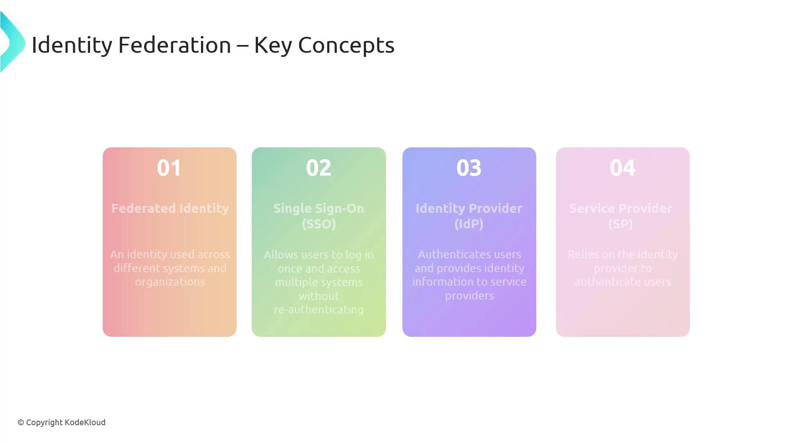
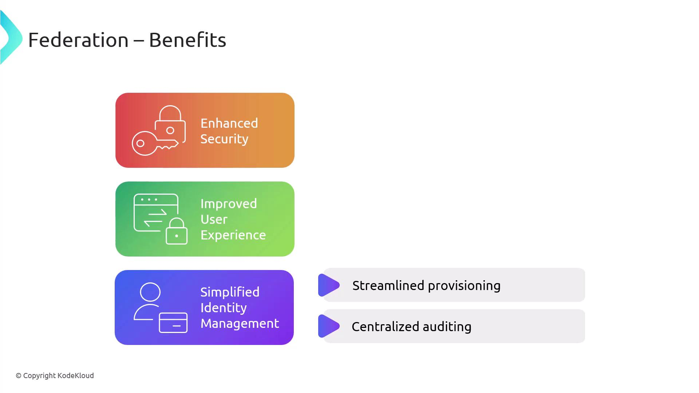
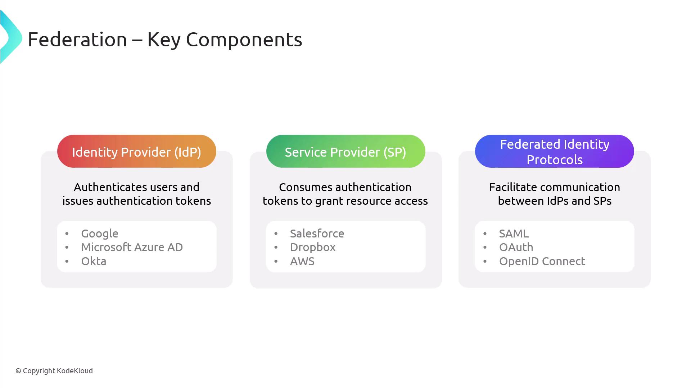
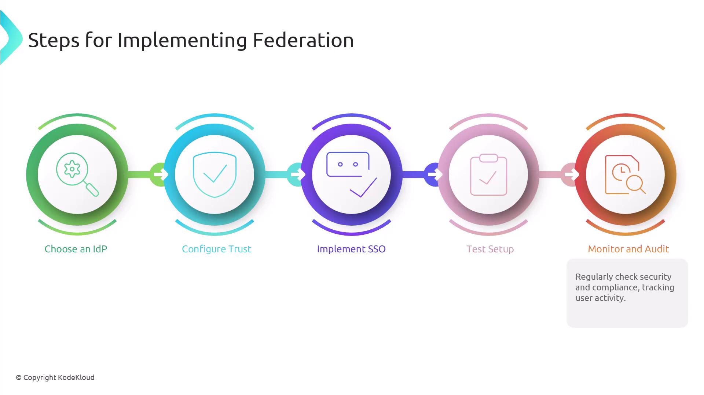
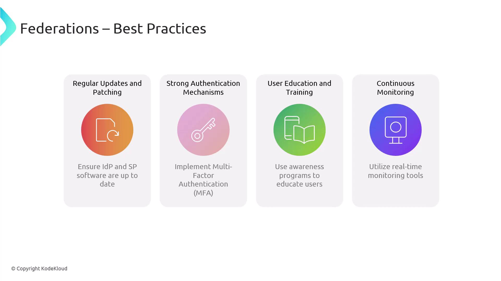
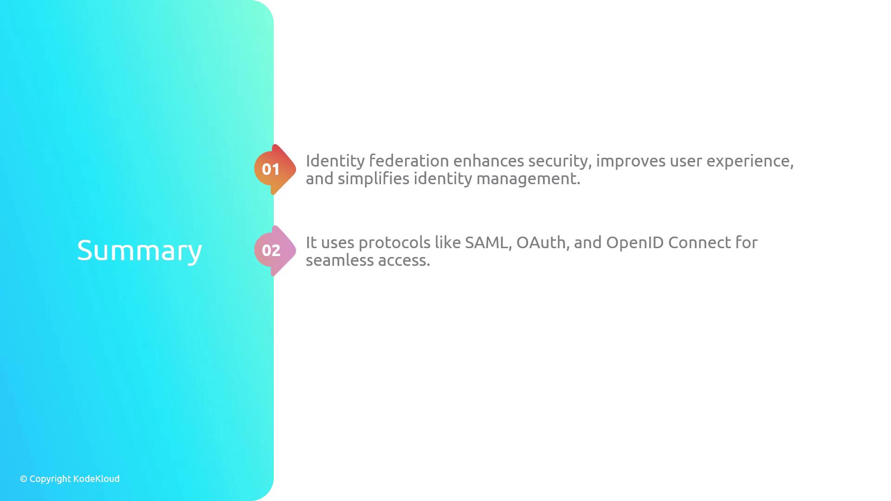

# Federation

Source: https://notes.kodekloud.com/docs/CompTIA-Security-Certification/Security-Operations/Federation/page

This article explores identity federation, linking user identities across systems for seamless access and improved security without managing multiple credentials.

In this article, we explore identity federation—an approach that links a user's identity across multiple systems and organizations. With identity federation, users can authenticate once and access a wide range of resources without the hassle of managing multiple credentials.

Identity federation connects a user's identity across different domains. By authenticating just once, users gain seamless access to resources from various systems.

<Frame>
  
</Frame>

Key concepts include:

* **Federated Identity:** An identity used consistently across multiple systems and organizations.
* **Single Sign-On (SSO):** A feature enabling users to log in once and access multiple systems without re-authentication.
* **Identity Provider (IdP):** The entity responsible for authenticating users and supplying identity data to service providers.
* **Service Provider (SP):** The system that relies on the identity provider's verification to grant user access to resources.

***

## Benefits of Federation

Employing federation brings several advantages:

* **Enhanced Security:** Centralized authentication enforces uniform security policies and reduces the number of passwords, thereby minimizing the attack surface.
* **Improved User Experience:** With fewer credentials to manage, users enjoy seamless access across multiple systems without repeated logins.
* **Simplified Identity Management:** Federation streamlines the processes of provisioning and deprovisioning users and offers a centralized perspective for auditing and compliance.
* **Streamlined Provisioning and Centralized Auditing:** These additional benefits help simplify user management and ensure secure operations across systems.

<Frame>
  
</Frame>

<Frame>
  
</Frame>

***

## Key Components of Federation

Federation consists of three core components:

1. **Identity Provider (IdP)**
   * Authenticates users and issues authentication tokens or assertions.
   * Examples include Google and Microsoft Azure AD.

2. **Service Provider (SP)**
   * Leverages the tokens or assertions from the IdP to grant access to resources.
   * Examples include Salesforce, Dropbox, and AWS.

3. **Federated Identity Protocols**
   * Establish standards for communication between identity providers and service providers.
   * Common protocols include:
     * **SAML:** An XML-based protocol for secure exchange of authentication and authorization data.
     * **OAuth:** An open standard for access delegation, widely used for token-based authentication and authorization.
     * **OpenID Connect:** An authentication layer built on OAuth 2.0 that facilitates user identity verification.

<Frame>
  
</Frame>

***

## Steps to Implement Federation

Implementing federation involves the following steps:

1. Select an IdP that supports required protocols and integrates with your exist...

<Callout icon="lightbulb">
  Select an IdP that supports required protocols and integrates with your existing systems. Popular choices include Microsoft Azure AD and Google Identity.
</Callout>

2. Establish trust relationships between your IdP and your service providers

<Callout icon="lightbulb">
  Establish trust relationships between your IdP and your service providers. This setup involves metadata exchange, certificate configuration, and trust settings.
</Callout>

3. Configure SSO to ensure that users can log in just once and access multiple s...

<Callout icon="lightbulb">
  Configure SSO to ensure that users can log in just once and access multiple services seamlessly. This typically involves protocols such as SAML, OAuth, or OpenID Connect.
</Callout>

4. **Test the Federation Setup:**
   * Conduct comprehensive testing to verify that the federation setup works as expected.
   * Ensure the solution allows users to log in a single time and access all integrated services without additional authentication.

5. **Monitor and Audit:**
   * Regularly monitor and audit your federation environment for security and compliance.
   * Use logging and monitoring tools to track user activities and quickly identify any anomalies.

<Frame>
  
</Frame>

***

## Best Practices for Federation

When setting up federation, keep these best practices in mind:

* **Regular Updates and Patching:** Ensure that both identity providers and service providers are always up-to-date to protect against vulnerabilities.
* **Strong Authentication Mechanisms:** Implement multi-factor authentication (MFA) to add an extra layer of security during the authentication process.
* **User Education and Training:** Launch awareness programs to educate users about the benefits of federation and the secure use of SSO.
* **Continuous Monitoring:** Use real-time monitoring tools to keep an eye on user activity and quickly identify any suspicious behavior.

<Frame>
  
</Frame>

***

## Conclusion

Identity federation is a robust approach that enhances security, improves user experience, and simplifies identity management across diverse systems and organizations. By leveraging federated identity protocols such as SAML, OAuth, and OpenID Connect, organizations can efficiently enable secure and seamless access for their users.

<Frame>
  
</Frame>

Implementing federation while following best practices and maintaining continuous monitoring helps ensure a secure and reliable identity management environment.

Thank you.

<CardGroup>
  <Card title="Watch Video" icon="video" href="https://learn.kodekloud.com/user/courses/comptia-security-certification/module/b13ce20f-66c3-4d31-b6df-23192480b4d4/lesson/1b508b8a-4a41-4b4d-b9ed-749f612320b6" />
</CardGroup>
