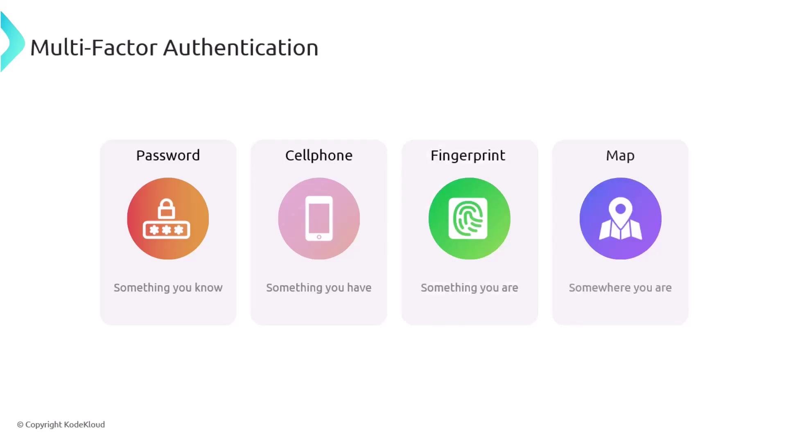

# Multi Factor Authentication MFA

Source: https://notes.kodekloud.com/docs/CompTIA-Security-Certification/Security-Operations/Multi-Factor-Authentication-MFA/page

This article explains how Multi-Factor Authentication enhances security by requiring additional verification factors beyond just passwords.

Traditional password security alone is no longer sufficient in today’s digital landscape. Passwords can be easily compromised through brute-force attacks and other techniques, making them a weak barrier against unauthorized access. This is where Multi-Factor Authentication (MFA) significantly enhances your security posture.

Multi-Factor Authentication supplements or even replaces password-only security by requiring additional verification factors. This layered approach ensures that even if one factor is compromised, a second layer of protection prevents unauthorized access. The primary MFA verification factors include:

* **Something you know:** Memorized information such as passwords or PINs.
* **Something you have:** Possession of physical devices like a hardware token or mobile phone.
* **Something you are:** Biometric data, including fingerprints or facial recognition.
* **Somewhere you are:** Location verification via services that detect your physical location.

<Frame>
  
</Frame>

<Callout icon="lightbulb">
  Enabling MFA means that even if an attacker manages to obtain your password, they still require an additional verification step to gain access. This significantly reduces the risk of unauthorized system access.
</Callout>

By implementing MFA, users are prompted to first enter their password and then complete an additional authentication step using another factor. This process greatly increases the difficulty for potential intruders and helps safeguard sensitive data and systems from exploitation.

<CardGroup>
  <Card title="Watch Video" icon="video" href="https://learn.kodekloud.com/user/courses/comptia-security-certification/module/b13ce20f-66c3-4d31-b6df-23192480b4d4/lesson/3feb8caf-0a43-47cf-ad4f-446e16bf1f74" />
</CardGroup>
