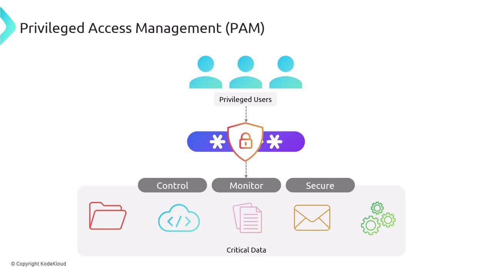
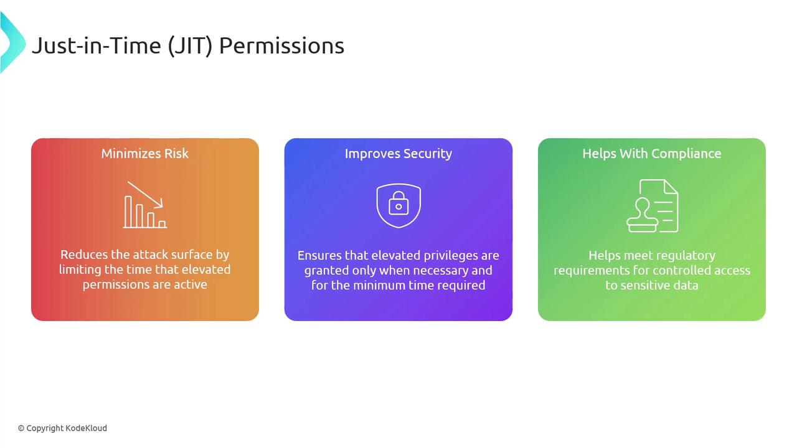
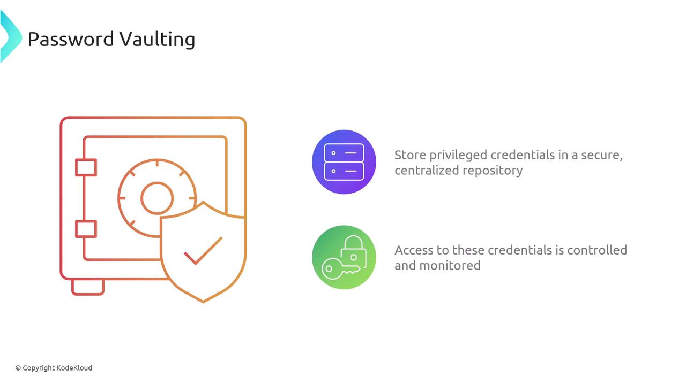
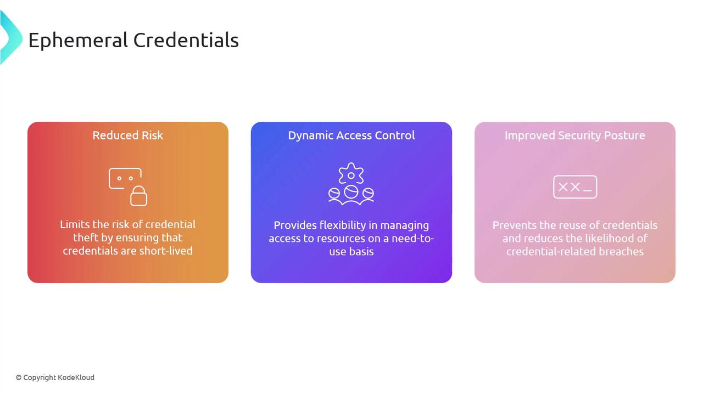
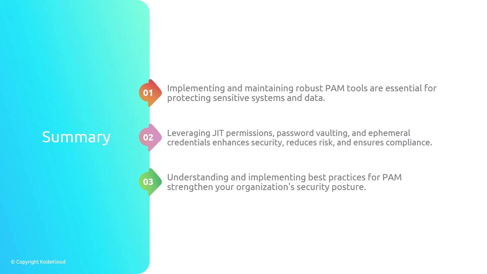

# Privilege Access Management Tools

Source: https://notes.kodekloud.com/docs/CompTIA-Security-Certification/Security-Operations/Privilege-Access-Management-Tools/page

This article explores Privilege Access Management tools, focusing on just-in-time permissions, password vaulting, and ephemeral credentials for enhancing security and compliance.

Welcome back. In this article, we explore the critical area of Privilege Access Management (PAM) Tools. Effective management of privileged access is vital for safeguarding an organization's sensitive information and systems. We'll delve into three key aspects of PAM: just-in-time permissions, password vaulting, and ephemeral credentials.

Before we dive into these topics, it's important to understand what Privilege Access Management entails. PAM refers to the security strategies and technologies that control, monitor, and protect access to crucial systems and data by privileged users. Its main objectives are to enhance security, ensure compliance with industry standards, and improve operational efficiency.

<Frame>
  
</Frame>

This diagram demonstrates how PAM protects sensitive systems and data from unauthorized access, streamlines the management of privileged accounts, and ensures adherence to regulatory requirements.

## Just-in-Time Permissions

Just-in-time (JIT) permissions provide temporary, time-limited access to critical systems and resources only when they are needed. By reducing the period during which elevated permissions are active, this approach minimizes the attack surface and helps meet compliance requirements, subsequently lowering overall risk and enhancing security.

<Frame>
  
</Frame>

<Callout icon="lightbulb">
  JIT permissions not only reduce risk but also ensure that access is granted strictly on an as-needed basis, aligning with best practices for security and compliance.
</Callout>

## Password Vaulting

Password vaulting is the practice of securely storing privileged account credentials within a centralized repository or vault. This method involves tight access controls and continuous monitoring, which help in enhancing overall security. The main benefits of password vaulting include improved centralized management, comprehensive auditing, and stronger compliance. By safeguarding privileged credentials from unauthorized access, password vaulting simplifies password management and minimizes the risk of security breaches.

<Frame>
  
</Frame>

## Ephemeral Credentials

Ephemeral credentials are temporary credentials generated for a specific task or session and automatically expire once their purpose is served. This approach offers multiple benefits, including reduced risk and dynamic access control. By limiting the lifespan of credentials, ephemeral credentials minimize the chances of credential theft, making it easier to manage resource access on a need-to-use basis with improved security.

<Frame>
  
</Frame>

## Comparing Just-in-Time Permissions and Ephemeral Credentials

While both just-in-time permissions and ephemeral credentials aim to provide temporary access and improve security, they differ in their implementation and intended use cases. Typically, JIT permissions focus on granting elevated access on demand for a limited time, often requiring an approval process. In contrast, ephemeral credentials are dynamically generated, session-based, and are widely used in cloud environments to address specific tasks.

<Frame>
  
</Frame>

<Callout icon="lightbulb">
  Understanding the differences between JIT permissions and ephemeral credentials is crucial for selecting the right access control strategy for your organization's specific needs.
</Callout>

## Conclusion

Implementing robust privilege access management tools is essential for protecting sensitive systems and data. Leveraging practices such as just-in-time permissions, password vaulting, and ephemeral credentials empowers organizations to enhance security, reduce risks, and maintain compliance with regulatory standards. Mastering these PAM techniques significantly strengthens overall security posture and operational efficiency.

<Frame>
  
</Frame>

<CardGroup>
  <Card title="Watch Video" icon="video" href="https://learn.kodekloud.com/user/courses/comptia-security-certification/module/b13ce20f-66c3-4d31-b6df-23192480b4d4/lesson/1691d829-62cc-4a5c-9e1c-da40ce30cccc" />
</CardGroup>
