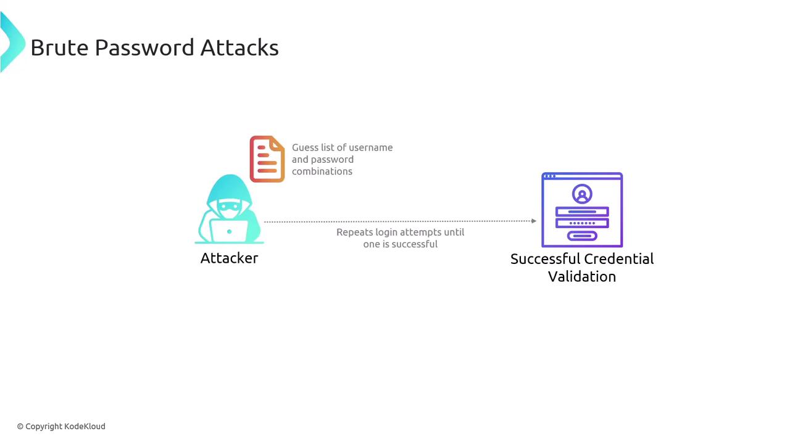
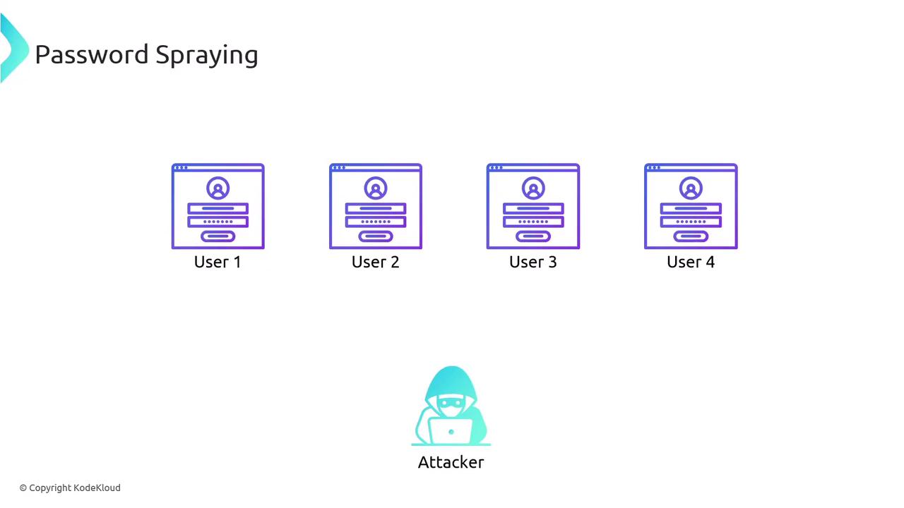

# Password Attacks

Source: https://notes.kodekloud.com/docs/CompTIA-Security-Certification/Threats-Vulnerabilities-and-Mitigations/Password-Attacks/page

This article explains password attacks, focusing on how attackers exploit hashed passwords rather than plaintext to gain unauthorized access.

Understanding password attacks starts with the knowledge that systems do not store actual passwords. Instead, when a user creates a password, the plaintext is processed by a hashing algorithm—commonly SHA-256—and only the resulting hash is saved on the server.

For example, when "KodeKloud" is combined with the SHA-256 algorithm, the process is as follows:

```bash theme={null}
KodeKloud + SHA-256 = [SECRET_REDACTED]
```

During a subsequent login attempt, the user’s input password is hashed using the same algorithm. The newly generated hash is then transmitted to the server, which compares it to the stored hash from the original password creation:

```bash theme={null}
KodeKloud + SHA-256 = [SECRET_REDACTED]
```

If the two hashes match, the authentication is successful.

<Callout icon="lightbulb">
  Hashing algorithms are designed to be non-reversible, meaning it is computationally impractical to retrieve the original plaintext password from its hash.
</Callout>

Password attacks typically focus on the hash rather than the plaintext password. Whether an attacker intercepts the hash during transmission or gains access to it from the server, they must resort to guessing the original password. Since reversing the hash directly is not feasible, attackers try different plaintext inputs, hash them, and compare the result to the target hash.

<Frame>
  
</Frame>

If the computed hash matches the stored hash, the attacker has effectively determined the user’s password.

One common method is the brute force password attack. In this approach, a program systematically tries every possible combination of characters until a match is found:

<Frame>
  
</Frame>

Another technique is known as password spraying. Instead of bombarding a single account with various guesses, an attacker tests a single common password across multiple user accounts:

<Frame>
  
</Frame>

<CardGroup>
  <Card title="Watch Video" icon="video" href="https://learn.kodekloud.com/user/courses/comptia-security-certification/module/208b2070-c737-43e9-b012-7f868f1621be/lesson/ec2f7d2e-63fc-4b9f-a4f0-0dcff760a62b" />
</CardGroup>
